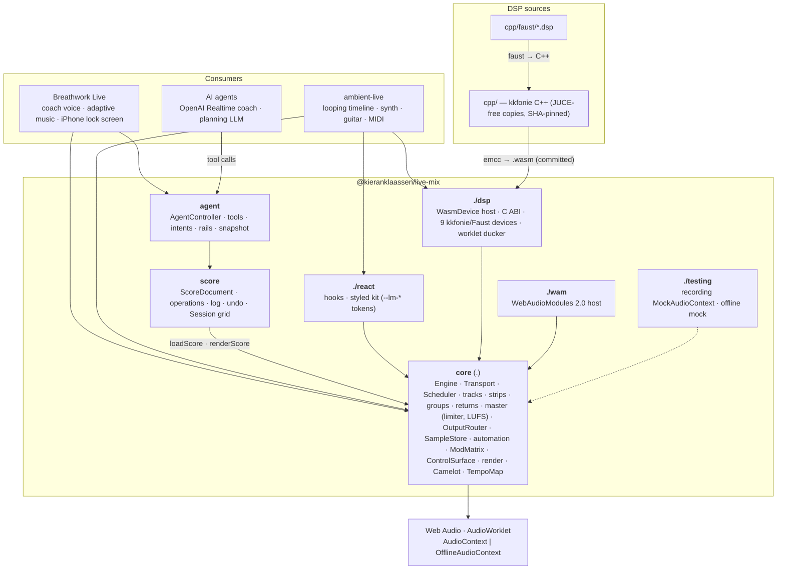

# live-mix

An Ableton-class mixer, arrangement and device host for the browser whose
every capability an AI agent can drive — as one TypeScript library on raw Web
Audio + AudioWorklet. Tracks → strips → groups → returns → master; a
transport with one audio-clock anchor and a lookahead scheduler; a
seconds-first score document as the source of truth; a session grid over the
same clips; automation and modulation; live-input tracks; WASM, Faust, native
and WAM devices behind one contract; a tool-callable agent API with safety
rails; offline renders identical to live playback; React hooks and a styled
kit. Zero runtime dependencies, import-safe under SSR, headless-testable in
Node.

`@kieranklaassen/live-mix` is the shared audio layer of
[Breathwork Live](https://github.com/kieranklaassen/breathwork-live) (a live
speech-to-speech breathwork coach that mixes music under an AI voice, on
iPhones with the screen locked) and
[ambient-live](https://github.com/kieranklaassen/ambient-live) (a personal
ambient instrument painting samples onto a looping timeline). Both apps had
grown their own half of a mixer; this is the one they share, and their old
engines are deleted.

> **Status:** `0.x`, pre-release, **public repository** (public again as of
> 2026-09-14: `github:kieranklaassen/live-mix#<sha>` installs need no token;
> registry publishing to GitHub Packages pending). The API changes in minor
> versions; both consumer apps pin exact versions. No support promise — a
> solo-maintainer library that contains exactly what its consumers use.

## Vision

- **One engine, many products.** The mixer, transport, arrangement, grid and
  device host live here. Domain logic (breathwork sections, paint gestures)
  stays in the apps.
- **Agent-operable by design.** Every capability is a tool with a schema, an
  intent-level counterpart, safety rails the agent cannot override, and an
  observable snapshot. The listener's protection outranks the agent's intent.
- **Seconds are the primary time unit; bars and beats are a view.** One
  transport anchor on the audio clock; a throttled tab catches up instead of
  skipping or replaying.
- **The score is the source of truth** for everything except live input:
  arrangement, grid, automation and device graphs are operations on one
  versioned document; the live mixer and the offline renderer are two
  renderers of it — so undo, history, bounce and attributed agent edits fall
  out of one mechanism.
- **One DSP source, two hosts.** kkfonie C++ and Faust compile to a flat C
  ABI for the browser and build natively in JUCE unchanged; WAM 2.0 plugins
  load as devices.
- **Browser-first, iPhone-honest.** One output terminus for the whole mix, so
  lock-screen playback through a media element is engine-wide; memory
  budgets and streaming beds for long sessions; no `crossOriginIsolated`
  requirement.
- **Visual = audio.** Any UI curve reads the same formula as the DSP.
- **Deterministic and testable.** Behaviour is asserted at the `AudioParam`
  boundary on recording mocks, in offline-vs-live goldens (mock and real
  audio), and in native C++ parity harnesses.

## Architecture



The engine core knows nothing about React, the agent or the score module;
each layer is additive and a `createEngine`-only consumer pays for none of
them. Every audible path ends at the `OutputRouter`; every parameter move is a
ramp; every scheduled start is idempotent by key.

## A first look

```ts
import {
  AgentController,
  ScoreDocument,
  Session,
  createEngine,
  loadScore,
  renderScore,
} from '@kieranklaassen/live-mix'
import { createDattorroReverb, createTruePeakLimiter } from '@kieranklaassen/live-mix/dsp'

// From a user gesture. iOS: output: { mode: 'element' } + engine.activateOutput() for lock-screen playback.
const engine = createEngine({ context: new AudioContext(), master: { meter: true } })
await engine.master.installLimiter((ctx) => createTruePeakLimiter(ctx)) // −1 dBTP wall, no bypass

// Direct: tracks, strips, sends, clips in seconds.
const music = engine.addAudioTrack('music', { lookaheadSec: 5, preloadSec: 12 })
const hall = engine.addReturnTrack('hall', { device: await createDattorroReverb(engine.context) })
music.strip.sends.add(hall, { level: 0.3 })
await engine.samples.load('intro', '/music/intro.mp3')
music.clips.add({
  id: 'a',
  sourceId: 'intro',
  startSec: 0,
  offsetSec: 0,
  durationSec: 180,
  fadeInSec: 2.5,
  fadeOutSec: 2.5,
  fadeCurve: 'equalPower',
  gainDb: -3,
})
engine.transport.start()

// Or declarative: a score the engine follows, an agent edits, a grid performs, a bounce renders.
const document = ScoreDocument.parse(json, { devices: engine.devices })
loadScore(engine, document)
const agent = new AgentController({ engine, document, roles: { music: 'music', voice: 'voice' } })
agent.call('set_music_volume', { level: 3 }) // → applied 1.0, rail note logged, undoable (AE2)
new Session({ document, engine }).launchScene('verse') // on the next bar, as arrangement clips
const bounce = await renderScore(document.score, { durationSec: 240 }) // identical to live, offline
```

The [getting started guide](./docs/getting-started.md) has the install for a
private consumer, the Vite config, worklet/`.wasm` asset resolution and the
iOS activation; [`docs/`](./docs/README.md) is the map.

## Entry map

| Import                                      | Contents                                                                                                                                                                                                                                                                                                                                                                                                                                                       |
| ------------------------------------------- | -------------------------------------------------------------------------------------------------------------------------------------------------------------------------------------------------------------------------------------------------------------------------------------------------------------------------------------------------------------------------------------------------------------------------------------------------------------- |
| `@kieranklaassen/live-mix`                  | `createEngine`, tracks and strips, groups, buses, returns, `Transport`, `Scheduler`, `Clip`, `SampleStore`, `ElementTrack`, `OutputRouter`, master limiter and LUFS meters, node devices and the registry, racks and delay compensation, automation and modulators, `ControlSurface` (MIDI/OSC), `TempoMap`, Camelot, `StretchSource`, render/stems/WAV/recorder, the score (`ScoreDocument`, `loadScore`, `renderScore`), `Session` (grid), `AgentController` |
| `@kieranklaassen/live-mix/dsp`              | `WasmDevice` host, the C ABI typings, asset resolution, factories and param tables for the nine WASM devices (Dattorro, Tides FDN, StereoWidener, Zita-Rev1, 1176, true-peak limiter, SpectralDrifter, Ether, Felt), the worklet ducker, `registerStockWasmDevices`                                                                                                                                                                                            |
| `@kieranklaassen/live-mix/react`            | Headless hooks (`LiveMixProvider`, `useTransport`, `useTrack`, `useMeter`, `useDevice`, `useSession`, `useControlSurface`, …) and the styled kit (`Knob`, `Fader`, `Meter`, `TransportBar`, `MixerView`, `DevicePanel`, `DeviceChainView`, `TimelineView`, …); `react` is an optional peer                                                                                                                                                                     |
| `@kieranklaassen/live-mix/react/styles.css` | The kit's default theme (JAXA-Zen, `data-lm-theme="dark"`) and component rules; optional — set the `--lm-*` tokens yourself instead                                                                                                                                                                                                                                                                                                                            |
| `@kieranklaassen/live-mix/testing`          | `MockAudioContext` with an `AudioParam` event recorder, `MockOfflineAudioContext`, `advance`; framework-free                                                                                                                                                                                                                                                                                                                                                   |
| `@kieranklaassen/live-mix/wam`              | `WamDevice`: WebAudioModules 2.0 plugins as devices (`@webaudiomodules/sdk` + `api` are optional peers)                                                                                                                                                                                                                                                                                                                                                        |
| `@kieranklaassen/live-mix/worklets/*`       | Raw worklet bundles (`wasm-device`, `ducker`, `meter`, `recorder`), for consumers that prefer explicit `?url` imports                                                                                                                                                                                                                                                                                                                                          |
| `@kieranklaassen/live-mix/wasm/*`           | Raw `.wasm` artefacts, same reason                                                                                                                                                                                                                                                                                                                                                                                                                             |

## Documentation

| Read                                                                           | For                                                                                                                                                                                                                                                                                                                                                                                                                                         |
| ------------------------------------------------------------------------------ | ------------------------------------------------------------------------------------------------------------------------------------------------------------------------------------------------------------------------------------------------------------------------------------------------------------------------------------------------------------------------------------------------------------------------------------------- |
| [Getting started](./docs/getting-started.md)                                   | Install (GitHub Packages / `github:`), Vite, asset resolution, a first engine, iOS activation, headless tests                                                                                                                                                                                                                                                                                                                               |
| [Concepts](./docs/README.md#concepts)                                          | Time · the mixer · devices and the registry · automation · the score · agent control and rails · the session grid · control surfaces · live input · memory · rendering                                                                                                                                                                                                                                                                      |
| [Recipes](./docs/README.md#recipes)                                            | An adaptive session, a live instrument with MIDI, an offline bounce, adding a C++/Faust device, adding a WAM                                                                                                                                                                                                                                                                                                                                |
| [Consumers](./docs/README.md#consumers)                                        | What Breathwork Live and ambient-live use today                                                                                                                                                                                                                                                                                                                                                                                             |
| [React](./docs/react.md)                                                       | Hooks, the kit, the playground                                                                                                                                                                                                                                                                                                                                                                                                              |
| Reference                                                                      | [score](./docs/score.md) · [agent API](./docs/agent-api.md) · [arbitration](./docs/arbitration.md) · [versions](./docs/versions.md) · [agent-authored scores](./docs/agent-authored-scores.md) · [session grid](./docs/session.md) · [control surface](./docs/control-surface.md) · [devices](./docs/devices.md) · [Faust](./docs/faust-devices.md) · [WAM](./docs/wam.md) · [iPhone checklist](./docs/iphone-memory-and-element-source.md) |
| API reference                                                                  | `pnpm docs:api` → `docs/api/` (TypeDoc over the five entries; the `api-reference` artefact of every CI run; not committed)                                                                                                                                                                                                                                                                                                                  |
| [Decisions log](./docs/decisions.md)                                           | KD/KTD distilled plus what each unit decided                                                                                                                                                                                                                                                                                                                                                                                                |
| [Contributing](./docs/contributing.md) · [CHANGELOG](./CHANGELOG.md)           | Commands, layout, conventions, CI, releasing                                                                                                                                                                                                                                                                                                                                                                                                |
| [Plan of record](./docs/plans/2026-09-14-001-feat-audio-mixing-engine-plan.md) | The Product Contract (R-IDs), decisions and the 40 units below                                                                                                                                                                                                                                                                                                                                                                              |

## Playground

```sh
pnpm install && pnpm build
pnpm playground          # http://localhost:5199/
pnpm playground:smoke    # the same page driven in headless Chrome: real audio, WASM devices, bounce, agent calls, a scene launch
```

A demo **score** the engine follows: mixer, device chain and timeline from
the kit; an **agent console** over every tool the `AgentController` lists;
a **session grid**; **Render offline** for the same document. It starts on
the recording mock context and switches to a real `AudioContext` on a click,
at which point the WASM devices join ([react.md § playground](./docs/react.md#the-playground)).

## Status

The plan's 40 units. Library PRs are on this repo; app units link to their
repos. GitHub Actions was billing-blocked while the repo was private, so PRs up
to [#48](https://github.com/kieranklaassen/live-mix/pull/48) carry their local
CI table (`scripts/ci-local.sh`) and were squash-merged on it; since the repo
went public (2026-09-14) the workflow runs on every PR and push to `main`.

| Unit | What                                                                               | Status                                                                                                                                                                                                                                                                                                                                        |
| ---- | ---------------------------------------------------------------------------------- | --------------------------------------------------------------------------------------------------------------------------------------------------------------------------------------------------------------------------------------------------------------------------------------------------------------------------------------------- |
| U1   | Scaffold, build, CI                                                                | done                                                                                                                                                                                                                                                                                                                                          |
| U2   | `./testing` recording harness                                                      | done ([#1](https://github.com/kieranklaassen/live-mix/pull/1))                                                                                                                                                                                                                                                                                |
| U3   | Clip primitives                                                                    | done ([#2](https://github.com/kieranklaassen/live-mix/pull/2))                                                                                                                                                                                                                                                                                |
| U4   | Transport and Scheduler                                                            | done ([#7](https://github.com/kieranklaassen/live-mix/pull/7))                                                                                                                                                                                                                                                                                |
| U5   | SampleStore and AudioTrack                                                         | done ([#10](https://github.com/kieranklaassen/live-mix/pull/10))                                                                                                                                                                                                                                                                              |
| U6   | Engine, buses, master, OutputRouter                                                | done ([#8](https://github.com/kieranklaassen/live-mix/pull/8))                                                                                                                                                                                                                                                                                |
| U7   | LiveInputTrack, sends, ConvolverReverb, Ducker                                     | done ([#11](https://github.com/kieranklaassen/live-mix/pull/11))                                                                                                                                                                                                                                                                              |
| U8   | WASM device ABI and worklet host                                                   | done ([#3](https://github.com/kieranklaassen/live-mix/pull/3))                                                                                                                                                                                                                                                                                |
| U9   | Dattorro device                                                                    | done (with U8)                                                                                                                                                                                                                                                                                                                                |
| U10  | Release pipeline (changesets, GitHub Packages)                                     | done ([#6](https://github.com/kieranklaassen/live-mix/pull/6)); first registry publish waits on Actions billing                                                                                                                                                                                                                               |
| U11  | ambient-live adoption                                                              | done ([ambient-live #25](https://github.com/kieranklaassen/ambient-live/pull/25))                                                                                                                                                                                                                                                             |
| U12  | Breathwork Live adoption behind a flag                                             | done ([breathwork-live #9](https://github.com/kieranklaassen/breathwork-live/pull/9))                                                                                                                                                                                                                                                         |
| U13  | Release 0.1.0 and pin both apps                                                    | done ([#22](https://github.com/kieranklaassen/live-mix/pull/22); tag `v0.1.0`, `github:#sha` pins)                                                                                                                                                                                                                                            |
| U14  | Breathwork Live flag removal, legacy engine deleted                                | done ([breathwork-live #11](https://github.com/kieranklaassen/breathwork-live/pull/11))                                                                                                                                                                                                                                                       |
| U15  | ChannelStrip, GroupTrack, solo-in-place                                            | done ([#18](https://github.com/kieranklaassen/live-mix/pull/18))                                                                                                                                                                                                                                                                              |
| U16  | Master true-peak limiter, LUFS/peak meters                                         | done ([#21](https://github.com/kieranklaassen/live-mix/pull/21))                                                                                                                                                                                                                                                                              |
| U17  | Worklet sidechain ducker                                                           | done ([#17](https://github.com/kieranklaassen/live-mix/pull/17), [#25](https://github.com/kieranklaassen/live-mix/pull/25))                                                                                                                                                                                                                   |
| U18  | Sample eviction, streaming ElementSource                                           | done ([#16](https://github.com/kieranklaassen/live-mix/pull/16))                                                                                                                                                                                                                                                                              |
| U19  | ParamLane automation and modulators                                                | done ([#14](https://github.com/kieranklaassen/live-mix/pull/14))                                                                                                                                                                                                                                                                              |
| U20  | StereoWidener                                                                      | done ([#5](https://github.com/kieranklaassen/live-mix/pull/5))                                                                                                                                                                                                                                                                                |
| U21  | FdnReverb (Tides)                                                                  | done ([#4](https://github.com/kieranklaassen/live-mix/pull/4))                                                                                                                                                                                                                                                                                |
| U22  | Faust toolchain, Zita-Rev1, 1176                                                   | done ([#9](https://github.com/kieranklaassen/live-mix/pull/9))                                                                                                                                                                                                                                                                                |
| U23  | Node devices, registry, presets                                                    | done ([#13](https://github.com/kieranklaassen/live-mix/pull/13))                                                                                                                                                                                                                                                                              |
| U24  | React headless hooks                                                               | done ([#26](https://github.com/kieranklaassen/live-mix/pull/26))                                                                                                                                                                                                                                                                              |
| U25  | React UI kit                                                                       | done ([#36](https://github.com/kieranklaassen/live-mix/pull/36)); ambient-live adopted it ([ambient-live #29](https://github.com/kieranklaassen/ambient-live/pull/29)); `GridView` added with the U31 follow-up                                                                                                                               |
| U26  | Breathwork Live: breath guide and ambience on engine tracks                        | done ([breathwork-live #12](https://github.com/kieranklaassen/breathwork-live/pull/12), lib follow-ups [#38](https://github.com/kieranklaassen/live-mix/pull/38))                                                                                                                                                                             |
| U27  | ambient-live: live input spike and MIDI pass-through                               | done ([ambient-live #27](https://github.com/kieranklaassen/ambient-live/pull/27))                                                                                                                                                                                                                                                             |
| U28  | Score document, operations, undo                                                   | done ([#32](https://github.com/kieranklaassen/live-mix/pull/32))                                                                                                                                                                                                                                                                              |
| U29  | Agent control API                                                                  | library done ([#39](https://github.com/kieranklaassen/live-mix/pull/39)); Breathwork Live's `toolHandlers` → `AgentController` PR next                                                                                                                                                                                                        |
| U30  | Controller arbitration, version history                                            | done ([#46](https://github.com/kieranklaassen/live-mix/pull/46))                                                                                                                                                                                                                                                                              |
| U31  | Session grid and follow actions                                                    | done ([#41](https://github.com/kieranklaassen/live-mix/pull/41)); the kit's `GridView` and the `StretchTrack` landed as its follow-up (see U32 / U25)                                                                                                                                                                                         |
| U32  | Warping: TempoMap, StretchSource, Camelot                                          | done ([#24](https://github.com/kieranklaassen/live-mix/pull/24)); `StretchTrack` — the scheduler-driven clip track over `StretchSource`, clip loop regions, score `stretch: true` — landed as the U31 follow-up                                                                                                                               |
| U33  | Offline render, stems, WAV, recorder; score `format: 2`; real-audio browser golden | done ([#33](https://github.com/kieranklaassen/live-mix/pull/33), [#35](https://github.com/kieranklaassen/live-mix/pull/35), [#40](https://github.com/kieranklaassen/live-mix/pull/40))                                                                                                                                                        |
| U34  | Racks, macros, plugin delay compensation                                           | done ([#27](https://github.com/kieranklaassen/live-mix/pull/27))                                                                                                                                                                                                                                                                              |
| U35  | WAM 2.0 host (`./wam`)                                                             | done ([#28](https://github.com/kieranklaassen/live-mix/pull/28))                                                                                                                                                                                                                                                                              |
| U36  | MIDI/OSC learn (`ControlSurface`)                                                  | done ([#34](https://github.com/kieranklaassen/live-mix/pull/34), [#42](https://github.com/kieranklaassen/live-mix/pull/42)); ambient-live migration in flight                                                                                                                                                                                 |
| U37  | kkfonie catalogue: SpectralDrifter, Ether, Felt                                    | done ([#29](https://github.com/kieranklaassen/live-mix/pull/29), [#31](https://github.com/kieranklaassen/live-mix/pull/31), [#37](https://github.com/kieranklaassen/live-mix/pull/37)); Felt `experimental` until an iPhone CPU figure                                                                                                        |
| U38  | Agent-authored scores (planner → score → render/live)                              | library done ([#44](https://github.com/kieranklaassen/live-mix/pull/44): `SessionScript` + `compileScript` with 90/90 selector parity against tuin's `music_selector.py`, `renderScriptToWav`, agent tools `author_script` / `preview_section` / `render_session`); Breathwork Live's planner script mode + offline render endpoint in flight |
| U39  | Native shell (optional per consumer)                                               | not started; only on Kieran's explicit pull                                                                                                                                                                                                                                                                                                   |
| U40  | Playground and documentation                                                       | done ([#43](https://github.com/kieranklaassen/live-mix/pull/43))                                                                                                                                                                                                                                                                              |

## Numbers

Measured on `main` at this commit (Node 22, `esbuild --bundle --minify --format=esm`,
React and optional peers external):

| What                                                                      | Size                                   |
| ------------------------------------------------------------------------- | -------------------------------------- |
| A consumer that imports only `createEngine` (tree-shaken)                 | 137 KB minified / 36.6 KB gzipped      |
| Breathwork Live's import shape (engine + ConvolverReverb + ElementSource) | 138 KB / 36.9 KB                       |
| ambient-live's import shape (engine + Dattorro from `./dsp`)              | 148 KB / 39.9 KB                       |
| Engine + score + `AgentController`                                        | 245 KB / 66 KB                         |
| The whole `.` entry, nothing shaken                                       | 327 KB / 92 KB                         |
| `./dsp` entry alone / `./react` entry alone                               | 44 KB / 84 KB                          |
| Worklets: `wasm-device`, `ducker`, `meter`, `recorder`                    | 4.6 / 10.9 / 13.2 / 3.2 KB             |
| The nine committed `.wasm` devices together                               | 132 KB (Felt 49 KB; the smallest 5 KB) |

The plan's budget for the `.` entry was < 60 KB minified (R38); the
`createEngine`-only figure is over it since the strips, automation, control
surface, render and score modules landed, and is recorded here rather than
hidden — re-baselining the budget or splitting entries is an open item.
Tests: 1,863 Vitest cases in 130 files, 9 native C++ harnesses, the
real-audio browser golden and the playground smoke under Playwright. Per
device CPU at 48 kHz/128 (native and wasm) is in [`docs/devices.md`](./docs/devices.md);
the analyser runs 60 s of stereo audio in 0.5 % of real time and the limiter's
`.wasm` in 0.16 %. The iPhone figures (meter + ducker under 5 % with two
devices; Felt) are recorded by hand when a consumer ships them.

## Development

```sh
pnpm install               # also builds dist/ (prepare)
pnpm test                  # Vitest, Node environment
pnpm typecheck && pnpm lint
pnpm build && pnpm pack:check
pnpm test:native           # C++ device harnesses with the system compiler
pnpm test:browser          # real-audio golden + playground smoke in headless Chrome
pnpm docs:api              # TypeDoc → docs/api
bash scripts/ci-local.sh   # the whole CI matrix locally; prints the Markdown table PR bodies carry
```

Layout, conventions, the real-time rules, releasing with changesets and the
never-list are in [`docs/contributing.md`](./docs/contributing.md).

## License

MIT
