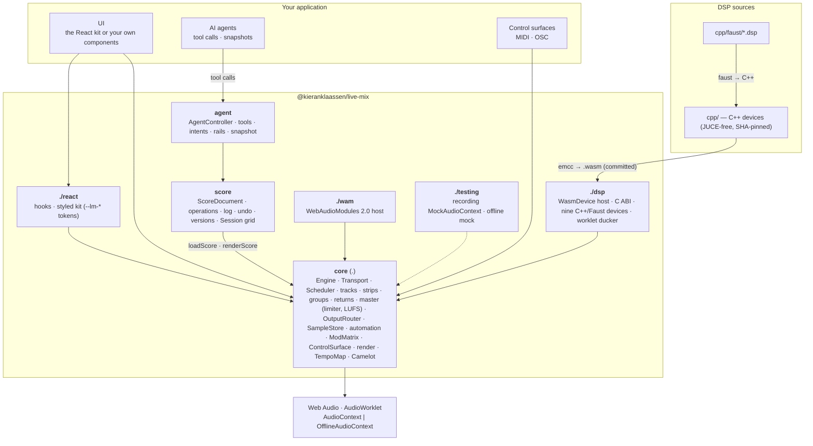

# live-mix

An Ableton-grade mixing engine for the browser, as one TypeScript library on
raw Web Audio and AudioWorklet. Tracks, channel strips, groups, sends and
returns feed one master with a limiter and LUFS meters; a transport with a
single audio-clock anchor schedules clips in **seconds** (bars and beats are a
view); C++, Faust, native Web Audio and WAM 2.0 devices sit behind one
contract; automation lanes and modulators move any parameter; a versioned
**score document** is the source of truth, so undo, history, a session grid
and an offline render that equals live playback all fall out of one
mechanism; and every capability is a tool an **AI agent** can call, behind
safety rails it cannot override. It exists because adaptive music apps, live
performance tools, games, voice and podcast apps, meditation apps and
DAW-like tools all end up building half a mixer — this is the whole one,
with zero runtime dependencies, import-safe under SSR and testable headless in
Node.

> **Status:** `0.x`, pre-release, public repository. Install a pinned commit
> with `github:kieranklaassen/live-mix#<sha>` today; the npm registry
> release (GitHub Packages, `@kieranklaassen` scope) is pending. The API
> changes in minor versions. Details in [docs/status.md](./docs/status.md).

## Features

**Mixer**

- Audio, element (streamed), instrument, live-input, return and stretch
  tracks; groups (summing strips); plain buses; one master with a fixed,
  unbypassable true-peak limiter and BS.1770-4 LUFS meters.
- Lazy channel strips: input gain → inserts → pan → fader → mute/solo →
  post-fader sends; solo-in-place; every change a ramp, never a step.
- One output terminus (`OutputRouter`): direct, or an `<audio>` element so
  the whole mix keeps playing through a locked iPhone screen with lock-screen
  metadata.
- A decoded-sample store with an LRU byte budget and scheduler-aware holds;
  streaming beds through media elements for hour-long sessions.

**Transport and clips**

- One transport anchor on the audio clock; numbered loop passes; pause at the
  end or run on; `stop({ fadeSec })`.
- Clips are plain records in seconds (`startSec`, `offsetSec`, `durationSec`,
  fades, `gainDb`); a lookahead scheduler on a timer hands each start to the
  graph exactly once, catches up after a throttled tab instead of skipping or
  replaying, and joins a clip mid-way after a seek.
- `replaceFrom(sec, clips)`: swap everything from a point on without
  truncating what is sounding.

**Devices**

- One contract (`params`, `setParam`, `getParam`, `bypass`, `latencySec`,
  `input`, `output`) for five kinds: native Web Audio node devices (filter,
  EQ, compressor, delay, utility, convolver reverb), **WASM** devices from C++
  or **Faust** behind a flat C ABI in an AudioWorklet, hand-written worklets
  (the sidechain ducker), racks, and **WAM 2.0** plugins.
- Nine stock WASM devices with byte-reproducible builds and native C++ parity
  tests: Dattorro plate, FDN reverb, StereoWidener, Zita-Rev1, an 1176-style
  limiter, a true-peak limiter, SpectralDrifter, Ether reverb and the Felt
  piano (an instrument; experimental).
- A registry with descriptors, presets and versioning; racks with eight
  macros and automatic delay compensation across parallel chains;
  `engine.alignLatency()` across the mix.

**Automation and modulation**

- `ParamLane` breakpoints in seconds (step, linear, exponential, smooth),
  written whole-segment ahead of the playhead; transport-anchored or
  clock-anchored writers.
- Modulators: LFO (free-running, never reset from audio), envelope follower,
  seeded random, macros, external phase; a `ModMatrix` with depth and
  polarity; `renderModulator` so a UI draws exactly what the DSP does.
- Arbitration: a hand, a controller or an agent takes a parameter with
  cancel-and-hold and automation stays out of the way until released.

**Score, undo, versions**

- `ScoreDocument`: arrangement, device graphs, strips, sends, lanes,
  modulators, routes, scenes and slots as one versioned JSON document
  (`format: 3`, with migrations).
- Sixty operation types with computed inverses; an attributed operation log;
  undo one step per gesture; version history with checkpoints, diffs and
  storage adapters.
- `loadScore` makes the live engine follow the document; `renderScore`
  renders the same document offline.

**Agent API with rails**

- `AgentController`: every score operation and a set of intents
  (`set_music_volume`, `steer_music`, `duck`, `match_key`, `extend_section`,
  `fade_out`, …) as tools with JSON Schemas; `toOpenAiTools()` /
  `toAnthropicTools()`.
- Rails applied, not advisory: fader ranges, LUFS and true-peak ceilings,
  gain slew, voice protection while speaking, no-silence guards, consent
  scopes, per-tool rate limits, dry runs. The listener's protection outranks
  the agent's intent.
- A ≤ 2 KB `snapshot()` and `diffSince(cursor)` instead of polling; an audit
  log; every call undoable.
- `SessionScript`: a schema a planning model fills, compiled to a score and
  rendered to WAV or played live.

**Session grid** — scenes × slots over the same clips as the arrangement;
quantised launches on the tempo map; trigger, gate and toggle modes; legato;
follow actions; every launch an undoable operation.

**Warping** — a `TempoMap` as a view over seconds; `StretchSource` and
`StretchTrack` over `signalsmith-stretch` (optional peer) with warp markers
and pitch in semitones; Camelot key matching.

**Offline render and export** — `renderOffline`, `renderStems`,
`renderScore`; identical to live playback down to every source start and
`AudioParam` event; WAV encoding at 16/24/32 bit; recorders as taps.

**Control surfaces** — `ControlSurface` with MIDI (Web MIDI, 14-bit, relative
encoders) and OSC (over WebSocket) learn, soft takeover, curves, persistence;
mapped controls never reach an instrument.

**React** — headless hooks over `useSyncExternalStore` (`useTransport`,
`useTrack`, `useMeter`, `useDevice`, `useSession`, …) and a styled kit
(`Knob`, `Fader`, `Meter`, `TransportBar`, `MixerView`, `DevicePanel`,
`DeviceChainView`, `TimelineView`, `GridView`) themed through `--lm-*` CSS
variables; renders on the server.

**Testing harness** — a recording `MockAudioContext` that captures every
`AudioParam` event, connect, start and stop; a mock offline context; tests
run in Node with no DOM shim.

## Quick start

### Install

```sh
# Today: a pinned commit from the public repository. No token; the prepare
# script builds dist/ with Node alone (the .wasm artefacts are committed).
npm install github:kieranklaassen/live-mix#<sha>
```

```json
"@kieranklaassen/live-mix": "github:kieranklaassen/live-mix#<sha>"
```

Once published, the same package comes from GitHub Packages
(`@kieranklaassen:registry=https://npm.pkg.github.com` in `.npmrc`, then
`npm install @kieranklaassen/live-mix`). Node ≥ 22 for the build. `react`,
`@webaudiomodules/sdk` + `api` and `signalsmith-stretch` are optional peers,
used only by `./react`, `./wam` and warping.

### Vite

```ts
// vite.config.ts
import { defineConfig } from 'vite'

export default defineConfig({
  // Pure ESM with zero dependencies: pre-bundling it would break the
  // `new URL(..., import.meta.url)` resolution of the worklets and .wasm in dev.
  optimizeDeps: { exclude: ['@kieranklaassen/live-mix'] },
})
```

The worklet processors and `.wasm` devices ship in the package and resolve
lazily inside the factories, so Vite serves them in dev and hashes them in
production. No COOP/COEP headers or `crossOriginIsolated` are needed. Bundlers
that cannot follow `import.meta.url` pass explicit `{ processorUrl, wasm }`
overrides to every factory — see
[getting started §3](./docs/getting-started.md#3-worklet-and-wasm-asset-resolution).

### Hello mix

An audio track with a clip, a send into a reverb return, and a live input that
ducks the music while it sounds:

<!-- example: examples/readme/hello-mix.ts -->

```ts
import { createEngine } from '@kieranklaassen/live-mix'
import { createDattorroReverb } from '@kieranklaassen/live-mix/dsp'

// Browsers start audio after a user gesture: run this from a click handler.
const engine = createEngine({ context: new AudioContext(), master: { meter: true } })

// A bus for everything that should duck under the voice, and a track on it.
// Clips are plain records in seconds; the scheduler hands them to the graph
// ahead of time and never plays one twice.
const music = engine.addBus('music')
const track = engine.addAudioTrack('track', { destination: music, lookaheadSec: 5 })
await engine.samples.load('intro', '/music/intro.mp3')
track.clips.add({
  id: 'intro-1',
  sourceId: 'intro',
  startSec: 0,
  offsetSec: 0,
  durationSec: 180,
  fadeInSec: 2,
  fadeOutSec: 2,
  fadeCurve: 'equalPower',
  gainDb: -3,
})

// A send into a reverb return. The plate is C++ compiled to WASM, running in an AudioWorklet.
const hall = engine.addReturnTrack('hall', { device: await createDattorroReverb(engine.context) })
track.strip.sends.add(hall, { level: 0.3 })

// A live input — microphone, WebRTC voice, guitar — that ducks the music bus while it sounds.
const ducker = engine.addDucker(music)
const voice = engine.addLiveInputTrack('voice')
voice.onAttach((source) => ducker.key(source))
voice.attach(await navigator.mediaDevices.getUserMedia({ audio: true }))

engine.transport.start()
```

[Getting started](./docs/getting-started.md) continues from here: the iOS
output mode, memory budgets, and testing the same graph headless.

## Examples

Every snippet below is a file under [`examples/readme/`](./examples/readme),
type-checked against the source on every CI run and compared verbatim with
this README, so it cannot drift from the real API.

### An adaptive loop that crossfades two layers and ducks under a microphone

<!-- example: examples/readme/adaptive-loop.ts -->

```ts
import { createEngine, type Clip } from '@kieranklaassen/live-mix'
import { loadDuckerProcessor } from '@kieranklaassen/live-mix/dsp'

// A 32-second loop with two layers: the transport re-pins on every pass, and
// a clip that starts at 0 restarts with it.
const engine = createEngine({ context: new AudioContext(), loop: { enabled: true, lengthSec: 32 } })
const music = engine.addBus('music')
const calm = engine.addAudioTrack('calm', { destination: music })
const tense = engine.addAudioTrack('tense', { destination: music })

await engine.samples.load('calm', '/loops/calm.mp3')
await engine.samples.load('tense', '/loops/tense.mp3')
const layer = (sourceId: string): Clip => ({
  id: sourceId,
  sourceId,
  startSec: 0,
  offsetSec: 0,
  durationSec: 32,
  fadeInSec: 0.02,
  fadeOutSec: 0.02,
  fadeCurve: 'equalPower',
  gainDb: 0,
})
calm.clips.add(layer('calm'))
tense.clips.add(layer('tense'))
tense.strip.setLevel(0)

// Crossfade the layers from game state, a sensor, a model. Every level change is a ramp.
export function setTension(amount: number): void {
  const angle = (Math.min(1, Math.max(0, amount)) * Math.PI) / 2
  calm.strip.setLevel(Math.cos(angle), { timeConstant: 1.5 })
  tense.strip.setLevel(Math.sin(angle), { timeConstant: 1.5 })
}

// Duck the whole music bus under a microphone, on the audio thread.
await loadDuckerProcessor(engine.context)
const ducker = engine.addDucker(music, { mode: 'worklet', holdMs: 150 })
const mic = engine.addLiveInputTrack('mic')
mic.strip.setMute(true) // the microphone keys the ducker; it is not played back
mic.onAttach((source) => ducker.key(source))
mic.attach(await navigator.mediaDevices.getUserMedia({ audio: true }))

engine.transport.start()
```

### A Faust device on an insert, modulated by an LFO

<!-- example: examples/readme/faust-device-lfo.ts -->

```ts
import { Lfo, createEngine, deviceParamTarget } from '@kieranklaassen/live-mix'
import { createZitaReverb } from '@kieranklaassen/live-mix/dsp'

const engine = createEngine({ context: new AudioContext() })
const keys = engine.addAudioTrack('keys')

// Faust's zita-rev1, compiled to WASM and hosted in an AudioWorklet. Every
// device kind shares one contract: typed params, setParam, bypass, latency.
const hall = await createZitaReverb(engine.context, { params: { mix: 0.25, midDecay: 3 } })
keys.strip.addInsert(hall)
hall.setParam('damping', 4000) // clamped to the ParamSpec range, smoothed inside the DSP

// A free-running LFO on the audio clock swings the mix by ±20 % of its range
// around the current value. The UI can draw the same curve with renderModulator.
const drift = new Lfo({ rateHz: 0.08, shape: 'sine' })
engine.modulation.map(drift, deviceParamTarget(hall, 'mix'), { depth: 0.2, polarity: 'bipolar' })
```

### A score: load it, edit it, undo, bounce

<!-- example: examples/readme/score-undo.ts -->

```ts
import {
  ScoreDocument,
  createEngine,
  loadScore,
  renderScore,
  wavBlob,
} from '@kieranklaassen/live-mix'

const engine = createEngine({ context: new AudioContext() })

// A score is JSON: tracks, clips, sends, devices, lanes, scenes — everything
// except live input. The live graph follows the document from here on.
const json = await (await fetch('/scores/night-drive.json')).text()
const doc = ScoreDocument.parse(json, { devices: engine.devices })
loadScore(engine, doc)
engine.transport.start()

// Every edit is an operation: validated, logged with its author, undoable.
doc.apply(
  { type: 'strip.set', owner: 'pads', param: 'level', value: 0.6 },
  { author: { id: 'ui', kind: 'human' }, label: 'pads fader' },
)
doc.apply({
  type: 'clip.add',
  track: 'drums',
  clip: {
    id: 'fill-1',
    sourceId: 'fill',
    startSec: 30,
    offsetSec: 0,
    durationSec: 2,
    fadeInSec: 0.01,
    fadeOutSec: 0.05,
    fadeCurve: 'linear',
    gainDb: 0,
  },
})
doc.undo() // one step per gesture; the graph follows
doc.redo()

// The same document renders offline, identical to live playback, in a browser or in Node.
const bounce = await renderScore(doc.score, { durationSec: 120 })
Object.assign(document.createElement('a'), {
  href: URL.createObjectURL(wavBlob(bounce.audio, { bitDepth: 24 })),
  download: 'night-drive.wav',
}).click()
```

### An AI narrator steering the mix through the agent API

<!-- example: examples/readme/agent-narrator.ts -->

```ts
import { AgentController, ScoreDocument, createEngine, loadScore } from '@kieranklaassen/live-mix'

const engine = createEngine({ context: new AudioContext() })
const json = await (await fetch('/scores/night-drive.json')).text()
const doc = ScoreDocument.parse(json, { devices: engine.devices })
loadScore(engine, doc)
await engine.master.installLufsMeter() // arms the loudness rails

// Tracks the intensity ladder may pick from (1 grounding … 3 active, keys on
// the Camelot wheel); ids double as score source ids.
const library = [
  { id: 'dusk', title: 'Dusk', intensity: 1, camelot: '8A', durationSec: 214, url: 'dusk.mp3' },
  { id: 'ember', title: 'Ember', intensity: 2, camelot: '9A', durationSec: 198, url: 'ember.mp3' },
  { id: 'surge', title: 'Surge', intensity: 3, camelot: '8B', durationSec: 240, url: 'surge.mp3' },
]

const agent = new AgentController({
  engine,
  document: doc,
  // Score ids the intents act on and the rails protect: the music track the
  // narrator steers, the live-input track that carries its voice.
  roles: { music: 'music', voice: 'narrator' },
  library,
  author: { kind: 'agent', id: 'narrator' }, // every call is logged and undoable under this author
  // Rails the model cannot override. Defaults already keep faders in 0..1,
  // refuse muting the music or the voice while it speaks, and slew gain.
  rails: { maxShortTermLufs: -16, maxFadeSec: 20 },
})

// One JSON Schema per tool, listed only when a backend for it is present.
const tools = agent.toOpenAiTools() // or agent.toAnthropicTools()
console.log(tools.map((tool) => tool.name))

// Route the model's calls through the controller; the result is JSON for the model.
const steer = agent.call('steer_music', { direction: 'calmer' })
if (steer.ok) console.log(steer.result.nowPlaying, steer.operations.length, 'operations')

// Requested 3.0, applied 1.0: the clamp is reported to the model and logged.
const loud = agent.call('set_music_volume', { level: 3 })
console.log(loud.rails) // [{ rail: 'range', action: 'clamped', requested: 3, applied: 1, … }]
agent.undo(loud.callId)

// Instead of polling, the model reads a ≤ 2 KB snapshot, or only what changed since it last looked.
const snapshot = agent.snapshot()
console.log(snapshot.transport, agent.diffSince(snapshot.cursor))
```

### React

<!-- example: examples/readme/react-mixer.tsx -->

```tsx
import '@kieranklaassen/live-mix/react/styles.css'
import { type Engine } from '@kieranklaassen/live-mix'
import { LiveMixProvider, MixerView, TransportBar } from '@kieranklaassen/live-mix/react'

// The hooks subscribe to the engine's change events; the kit is themed
// through --lm-* CSS variables. Pass `engine={null}` until the start gesture.
export function Studio({ engine }: { engine: Engine | null }) {
  return (
    <LiveMixProvider engine={engine}>
      <TransportBar />
      <MixerView returns={engine?.returnTracks} inputs={engine?.liveInputs} />
    </LiveMixProvider>
  )
}
```

Hooks and the kit are documented in [docs/react.md](./docs/react.md); the
[playground](#playground) is the kit mounted on a demo score.

## Architecture



The engine core knows nothing about React, the agent or the score module;
each layer is additive, and a `createEngine`-only consumer pays for none of
them. Every audible path ends at the `OutputRouter`; every parameter move is
a ramp; every scheduled start is idempotent by key. The same C++ compiles to
the browser's C ABI and builds natively (JUCE) unchanged, and the offline
renderer issues exactly the source starts and `AudioParam` events the live
engine does.

## Entry map

| Import                                      | Contents                                                                                                                                                                                                                                                                                                                                                                                                                                                       |
| ------------------------------------------- | -------------------------------------------------------------------------------------------------------------------------------------------------------------------------------------------------------------------------------------------------------------------------------------------------------------------------------------------------------------------------------------------------------------------------------------------------------------- |
| `@kieranklaassen/live-mix`                  | `createEngine`, tracks and strips, groups, buses, returns, `Transport`, `Scheduler`, `Clip`, `SampleStore`, `ElementTrack`, `OutputRouter`, master limiter and LUFS meters, node devices and the registry, racks and delay compensation, automation and modulators, `ControlSurface` (MIDI/OSC), `TempoMap`, Camelot, `StretchSource`, render/stems/WAV/recorder, the score (`ScoreDocument`, `loadScore`, `renderScore`), `Session` (grid), `AgentController` |
| `@kieranklaassen/live-mix/dsp`              | `WasmDevice` host, the C ABI typings, asset resolution, factories and param tables for the nine WASM devices (Dattorro, FDN reverb, StereoWidener, Zita-Rev1, 1176, true-peak limiter, SpectralDrifter, Ether, Felt), the worklet ducker, `registerStockWasmDevices`                                                                                                                                                                                           |
| `@kieranklaassen/live-mix/react`            | Headless hooks (`LiveMixProvider`, `useTransport`, `useTrack`, `useMeter`, `useDevice`, `useSession`, `useControlSurface`, …) and the styled kit (`Knob`, `Fader`, `Meter`, `TransportBar`, `MixerView`, `DevicePanel`, `DeviceChainView`, `TimelineView`, `GridView`, …); `react` is an optional peer                                                                                                                                                         |
| `@kieranklaassen/live-mix/react/styles.css` | The kit's default theme (JAXA-Zen, `data-lm-theme="dark"`) and component rules; optional — set the `--lm-*` tokens yourself instead                                                                                                                                                                                                                                                                                                                            |
| `@kieranklaassen/live-mix/testing`          | `MockAudioContext` with an `AudioParam` event recorder, `MockOfflineAudioContext`, `advance`; framework-free                                                                                                                                                                                                                                                                                                                                                   |
| `@kieranklaassen/live-mix/wam`              | `WamDevice`: WebAudioModules 2.0 plugins as devices (`@webaudiomodules/sdk` + `api` are optional peers)                                                                                                                                                                                                                                                                                                                                                        |
| `@kieranklaassen/live-mix/worklets/*`       | Raw worklet bundles (`wasm-device`, `ducker`, `meter`, `recorder`), for consumers that prefer explicit `?url` imports                                                                                                                                                                                                                                                                                                                                          |
| `@kieranklaassen/live-mix/wasm/*`           | Raw `.wasm` artefacts, same reason                                                                                                                                                                                                                                                                                                                                                                                                                             |

## Browser support and iOS

The engine needs `AudioContext`, `AudioWorklet` and WebAssembly — current
Chrome, Edge, Firefox and Safari, desktop and mobile. It never needs
`SharedArrayBuffer`, so no COOP/COEP headers. Where a browser lacks
`cancelAndHoldAtTime` (Firefox) the lane writers fall back to cancel + set.
WASM devices and worklets also run inside an `OfflineAudioContext` in
Chromium and Firefox, which is what the offline render uses.

On iPhone, Safari stops a plain `AudioContext` when the screen locks. Create
the engine with `output: { mode: 'element' }` and call
`engine.activateOutput()` on the start gesture: the master then feeds a
`MediaStreamAudioDestinationNode` behind an unmuted `<audio>` element, the
mix keeps playing through the lock screen, and `MediaSession` metadata names
it there. Streamed beds (`ElementTrack`) need `track.unlockAll()` on the same
gesture; long sessions set `samples: { budgetBytes }`; a phone call suspends
the context and `context.resume()` on the next gesture continues from the
transport's anchor. The checklist is in
[getting started §5](./docs/getting-started.md#5-ios-element-output-mode-and-activation)
and
[docs/iphone-memory-and-element-source.md](./docs/iphone-memory-and-element-source.md).

## Performance and bundle size

Measured on `main` at this commit (Node 22,
`esbuild --bundle --minify --format=esm` over `dist/`, React and the optional
peers external):

| What                                                                       | Size                                   |
| -------------------------------------------------------------------------- | -------------------------------------- |
| A consumer that imports only `createEngine` (tree-shaken)                  | 149 KB minified / 39.6 KB gzipped      |
| Engine + `ConvolverReverb` + `ElementSource` (a voice over streamed music) | 150 KB / 39.9 KB                       |
| Engine + one WASM reverb from `./dsp`                                      | 160 KB / 42.8 KB                       |
| Engine + score + `AgentController`                                         | 258 KB / 69.1 KB                       |
| The whole `.` entry, nothing shaken                                        | 389 KB / 111.8 KB                      |
| `./dsp` entry alone / `./react` entry alone                                | 43 KB / 93 KB                          |
| Worklets: `wasm-device`, `ducker`, `meter`, `recorder`                     | 4.5 / 10.6 / 12.9 / 3.1 KB             |
| The nine committed `.wasm` devices together                                | 121 KB (Felt 48 KB; the smallest 3 KB) |

The original budget for the `.` entry was under 60 KB minified; the
`createEngine`-only figure passed it once strips, automation, the control
surface, render and the score landed, and is recorded here rather than
hidden. Re-baselining or splitting entries is an open item
([status](./docs/status.md#known-gaps)).

Tests: 2,295 Vitest cases in 147 files, nine native C++ harnesses, a
real-audio render-equals-live golden and the playground smoke under
Playwright. Per-device CPU at 48 kHz / 128 frames (native and WASM) is in
[docs/devices.md](./docs/devices.md); the loudness analyser processes 60 s of
stereo audio in 0.5 % of real time and the true-peak limiter's `.wasm` in
0.16 %. iPhone figures (meter + ducker under 5 % with two devices; Felt) are
recorded by hand when a consumer ships them.

## Documentation

| Read                                                                 | For                                                                                                                                                                                                                                                                                                                                                                                                                                         |
| -------------------------------------------------------------------- | ------------------------------------------------------------------------------------------------------------------------------------------------------------------------------------------------------------------------------------------------------------------------------------------------------------------------------------------------------------------------------------------------------------------------------------------- |
| [Getting started](./docs/getting-started.md)                         | Install, Vite, asset resolution, a first engine, iOS activation, headless tests                                                                                                                                                                                                                                                                                                                                                             |
| [Concepts](./docs/README.md#concepts)                                | Time · the mixer · devices and the registry · automation · the score · agent control and rails · the session grid · control surfaces · live input · memory · rendering                                                                                                                                                                                                                                                                      |
| [Recipes](./docs/README.md#recipes)                                  | An adaptive music session, a live instrument with MIDI, an offline bounce, adding a C++/Faust device, adding a WAM                                                                                                                                                                                                                                                                                                                          |
| [React](./docs/react.md)                                             | Hooks, the kit, the playground                                                                                                                                                                                                                                                                                                                                                                                                              |
| Reference                                                            | [score](./docs/score.md) · [agent API](./docs/agent-api.md) · [arbitration](./docs/arbitration.md) · [versions](./docs/versions.md) · [agent-authored scores](./docs/agent-authored-scores.md) · [session grid](./docs/session.md) · [control surface](./docs/control-surface.md) · [devices](./docs/devices.md) · [Faust](./docs/faust-devices.md) · [WAM](./docs/wam.md) · [iPhone checklist](./docs/iphone-memory-and-element-source.md) |
| API reference                                                        | `pnpm docs:api` → `docs/api/` (TypeDoc over the five entries; the `api-reference` artefact of every CI run; not committed)                                                                                                                                                                                                                                                                                                                  |
| [Consumers](./docs/README.md#consumers)                              | What the apps that ship on the library use today                                                                                                                                                                                                                                                                                                                                                                                            |
| [Status](./docs/status.md) · [Decisions log](./docs/decisions.md)    | What is stable and what is experimental; the product and technical decisions behind the design                                                                                                                                                                                                                                                                                                                                              |
| [Contributing](./docs/contributing.md) · [CHANGELOG](./CHANGELOG.md) | Commands, layout, conventions, CI, releasing                                                                                                                                                                                                                                                                                                                                                                                                |

## Playground

```sh
pnpm install && pnpm build
pnpm playground          # http://localhost:5199/
pnpm playground:smoke    # the same page in headless Chrome: real audio, WASM devices, bounce, agent calls, a scene launch
```

A demo score the engine follows: mixer, device chain and timeline from the
kit; an agent console over every tool the `AgentController` lists; a session
grid; **Render offline** for the same document. It starts on the recording
mock context and switches to a real `AudioContext` on a click, at which point
the WASM devices join ([react.md § playground](./docs/react.md#the-playground)).

## Development

```sh
pnpm install               # also builds dist/ (prepare)
pnpm test                  # Vitest, Node environment
pnpm typecheck && pnpm lint
pnpm build && pnpm pack:check
pnpm test:native           # C++ device harnesses with the system compiler
pnpm test:browser          # real-audio golden + playground smoke in headless Chrome
pnpm docs:api              # TypeDoc → docs/api
bash scripts/ci-local.sh   # the whole CI matrix locally
```

Layout, conventions, the real-time rules, releasing with changesets and the
never-list are in [docs/contributing.md](./docs/contributing.md).

## Status

Stable core (engine, mixer, transport, clips, devices, score, agent API,
render); the Felt piano is `experimental` until its CPU cost is measured on
an iPhone; the WAM host is lightly used; the npm registry release is
pending. The area-by-area table and the build history are in
[docs/status.md](./docs/status.md).

## Used by

[Breathwork Live](https://github.com/kieranklaassen/breathwork-live) and
[ambient-live](https://github.com/kieranklaassen/ambient-live) — what each
uses is in [docs/consumers/](./docs/consumers/).

## Contributing

Issues and PRs are welcome. Run `pnpm typecheck && pnpm lint && pnpm test`
before pushing, add a changeset when `src/` changes, and read
[docs/contributing.md](./docs/contributing.md) for the conventions (entries
are boundaries, ramps never steps, nothing allocates in `process()`, exports
are pinned).

## License

[MIT](./LICENSE)
