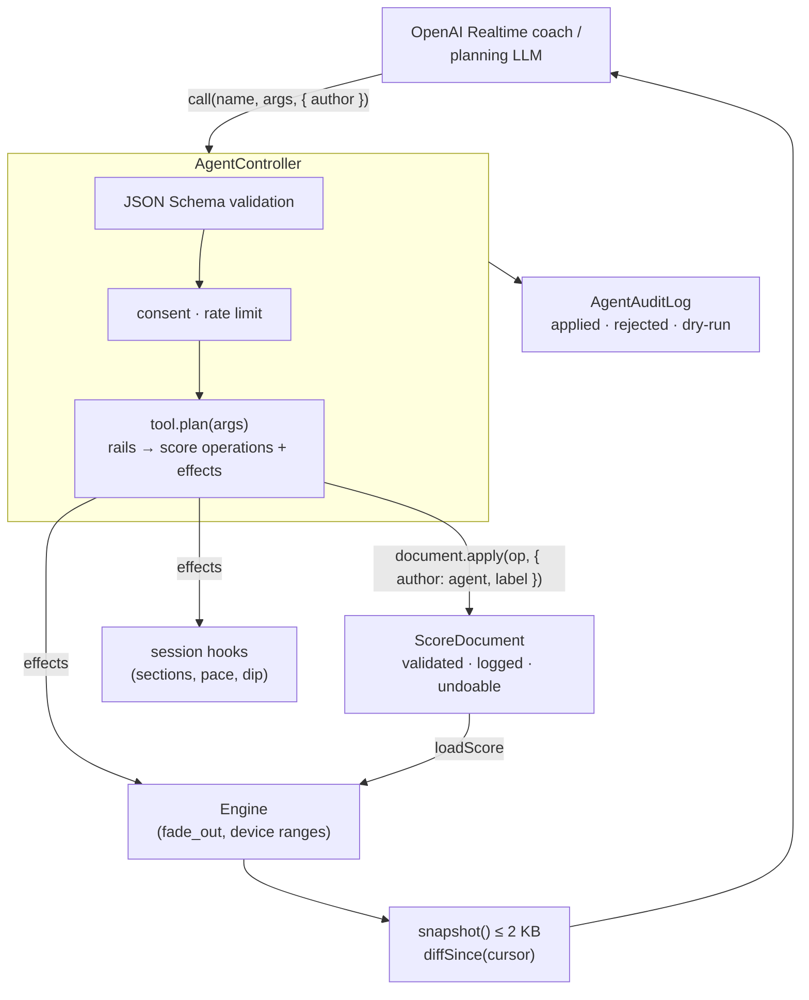

# Agent control and rails

**Agent control is a first-class actor, not an add-on** (KD4): every mixer
capability is a tool a model can call — with a JSON Schema, safety rails, an
intent-level counterpart and an observable state snapshot — mirroring the
coach tools Breathwork Live already gives its OpenAI Realtime agent
(`set_music_volume`, `set_music(calmer|stronger|change)`, `set_pace`,
`extend_current_section`, `advance_to_next_section`). And **the listener's
protection outranks the agent's intent** (KD10): loudness ceilings,
voice-priority ducking, no-silence and no-startle guards and consent flags
cannot be overridden by a tool call.

`AgentController` (U29, core entry) is the one object. The full tool table,
the intent compilation table, the rails table, the result and snapshot shapes
and the consumer wiring notes are in [agent-api.md](../agent-api.md); this
page is the shape of the idea.



## One path for every call

```ts
import { AgentController, ScoreDocument, createEngine, loadScore } from '@kieranklaassen/live-mix'

const engine = createEngine({ context })
const document = ScoreDocument.parse(json, { devices: engine.devices })
loadScore(engine, document)

const agent = new AgentController({
  engine,
  document,
  roles: { voice: 'voice', music: 'music', ambience: 'ambience', ducker: 'voice-duck' },
  library: tracks, // { id, title, intensity, camelot, durationSec, url }
  session: { extendSection, advanceSection, setBreathPace, isSpeaking, describe }, // what the score does not know
  rails: { maxShortTermLufs: -16 },
})

realtimeSession.update({ tools: agent.toOpenAiTools() }) // or toAnthropicTools()
const result = agent.call(
  'set_music_volume',
  { level: 3 },
  { author: { kind: 'agent', id: 'coach' } },
)
// → { ok: true, tool, result: { level: 1 }, operations: [{ seq, type: 'strip.set' }],
//     rails: [{ rail: 'range', action: 'clamped', requested: 3, applied: 1, message }], dryRun: false }
agent.snapshot() // { cursor, atSec, transport, music, levels, meters, voice, devices, recent }
agent.diffSince(cursor) // only what changed since the model last looked
agent.undo(result.callId)
```

`call` is synchronous and returns JSON: validate against the tool's schema →
consent → per-tool rate limit → the tool **plans** (rails, then compile to
score operations and effects) → the controller applies through
`ScoreDocument.apply(op, { author, label: 'agent:<tool>#<callId> …' })` and
runs the effects, rolling the operations back if a later step fails → an
`AuditEntry`. `dryRun: true` stops before applying and returns
`result.compiled`.

## Vocabulary = score operations, plus intents

- **60 operation tools** (one per score operation type, `OPERATION_TYPES`) are the [score](./score.md) vocabulary with legal
  tool names (`clip.replaceFrom` → `clip_replace_from`), each with a
  self-contained JSON Schema generated from the operation types. Structural
  operations need the `structure` consent scope, arrangement edits `arrange`;
  parameter-level operations need none (`grantConsent`/`revokeConsent`).
- **Intents** act on **roles** — the strip-host ids that are the voice, the
  music, the ambience, the breath guide and the ducker device — or on the
  consumer's **session hooks** when it owns the concept: `set_music_volume`,
  `set_ambience`, `duck` (R26 "softer under voice"), `more_space`,
  `steer_music { calmer | stronger | more-intense | change | brighter | darker }`,
  `set_intensity`, `match_key`, `extend_section`, `advance_section`,
  `set_breath_pace`, `fade_out`; plus `get_state` and `undo`. A tool is
  listed only when a backend for it is present (`listTools()`).
- **The ladder** (`src/core/music/intensity.ts`) is Breathwork Live's
  `musicResolver` moved into the library: intensities 1 grounding / 2 settled
  / 3 active; `calmer` steps down, `stronger` up; candidates are target
  intensity + Camelot-compatible → any at the target → adjacent; each pick
  anchors the next one's key. AE1 holds: playing `8A` at intensity 2,
  `calmer` yields intensity 1 with a wheel number in {7, 8, 9} when the
  library has one, and the result reports `boundaryShiftSec`. On a score the
  steer compiles to one `batch`: the sounding clip fades over
  `STEER_CROSSFADE_SECONDS`, then `clip.replaceFrom { fromSec: now }` with
  full library tracks chained to the arrangement's end, which moves rather
  than truncating (R6).

## Rails are applied, not advisory (R27, KD10)

Defaults are for a breathwork listener wearing earphones, every field
overridable per consumer: faders clamp to `[0, 1]`; a gain increase is
predicted against the master's short-term LUFS (ceiling −14) and true peak
(−1 dBTP) when a LUFS meter is installed, and clamped or refused; gain slew
is a token bucket (1.0/s per parameter); while the voice is speaking no mute,
no level below 0.25, no solo of others, no removal; no mute or removal of the
music or ambience roles (no-silence — fade instead), and an empty steer is
refused; per-tool rate limits with `retryAfterMs`; `extend_section` ≤ 300 s
per call and ≤ the session headroom (900 s growth budget when the session
gives none); `fade_out` 2..30 s. AE2 is the acceptance: volume 3.0 is applied
as 1.0, the clamp is a `RailNote` in the result and the audit entry with the
requested value, and the call is undoable.

## The snapshot replaces polling (R28)

`snapshot()` is ≤ 2 KB with a full session and a busy log: transport, the
session's own description, now playing and ≤ 3 upcoming, levels, meters
(peak, short-term LUFS, true peak when installed), voice state, ≤ 12 devices,
the last 6 calls. `setCadence(ms)` / `onSnapshot` push it on the engine's
timers; `diffSince(cursor)` returns only the fields that changed.

## Arbitration (R29)

Multiple controllers share parameters under one rule: a human touch takes a
lane-driven parameter with cancel-and-hold and is remembered, not timed out
([automation § the override](./automation.md#the-override)); the
`ControlSurface` does this for MIDI/OSC; an agent write goes through the
score, so the `ScoreRenderer`'s ownership rule (route > lane > static value)
decides what the graph hears. The explicit priority table and structural
score history are **U30**.

## Try it

`pnpm playground` → the **Agent console**: every tool the demo's controller
lists, JSON arguments, call or dry-run, and the result, snapshot and
operation log side by side — the mixer above follows each call.
The playground smoke spec drives `set_music_volume 0.4`, checks the pad strip
followed, checks the AE2 clamp on `level: 3`, and undoes.

## Beyond the live coach

The same operation set is what a **planning LLM** emits when it authors a
whole session offline (U38): a score, rendered with `renderScore` to audio and
analysis, then loaded live and edited by the coach through the same tools —
identical up to the live edits (F4 in the plan). Breathwork Live's wiring
(`toolHandlers.ts` → `agent.call`, the conductor as session hooks) is the
second half of U29 ([consumer guide](../consumers/breathwork-live.md)).
