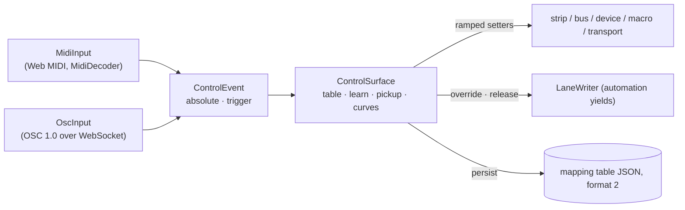

# Control surfaces: MIDI and OSC learn

Hardware maps onto the engine through a **mapping table** (R15): a
`ControlSource` — a MIDI note, CC, 14-bit CC pair, pitch bend or channel
pressure on a channel (0 = omni), or one argument of an OSC address pattern —
bound to a `ControlTarget`: a strip control (`level`, `pan`, `mute`, `solo`,
`inputGain`) by track name, a send level, the master fader, one parameter of a
registered device instance (taper-aware), a rack macro, or a transport action.



```ts
import {
  ControlSurface,
  MidiInput,
  OscInput,
  controlEventsFromMidi,
  isMapped,
} from '@kieranklaassen/live-mix'

const surface = new ControlSurface({ engine })
surface.registerDevice('pad-filter', filter) // → { kind: 'device', device: 'pad-filter', param: 'frequency' }
surface.attachWriter({ kind: 'strip', track: 'pad', control: 'level' }, laneWriter) // automation yields (R29)

const midi = new MidiInput() // navigator.requestMIDIAccess, injectable
await midi.open()
surface.connect(midi) // every event → surface.handle
midi.onMessage((message) => {
  // Unmapped notes still play the instrument; a mapped pad never does.
  if (message.type !== 'note-on') return
  const [event] = controlEventsFromMidi(message)
  if (!isMapped(surface.table, event)) instrument.noteOn(message.note, midiToHz(message.note))
})

const osc = new OscInput({ url: 'ws://localhost:8080' }) // OSC 1.0 over a WebSocket bridge, bundles included
await osc.open()
surface.connect(osc)

surface.beginLearn({ kind: 'strip', track: 'pad', control: 'level' }) // next CC/note/OSC arg binds
surface.persist(localStorage) // versioned JSON, malformed entries dropped, migrations supported
```

## The rules that matter

- **Every write is a ramp.** Dispatch goes through `ChannelStrip.setLevel` /
  `setPan` / `setMute` / `setSolo`, `Bus.setLevel`, `Device.setParam`,
  `Macro.set` — never a step.
- **Automation yields, and stays yielded.** A target with an attached
  `LaneWriter` is overridden with cancel-and-hold on the first controller
  write and handed back only by `surface.release(target)`.
- **Modes**: `set` (the knob's position becomes the value), `toggle`, and
  `relative` for endless encoders (two's-complement, binary-offset or
  signed-bit). Every mapping has an input range, an output span (a reversed
  span inverts), a curve (`linear`, `exp`, `log`, `s`) and optional **soft
  takeover** (`pickup`): an absolute controller only takes a target once it
  crosses the target's current position, and lets go again when automation or
  the UI moves the target away.
- **`handle(event).consumed` is exactly `isMapped`**, so a mapped pad never
  reaches an instrument — even on release or while pickup blocks the write.
- **Learn** binds the next position or press (a release keeps waiting); a
  14-bit knob learned from its MSB upgrades to the `cc14` pair when the LSB
  follows; a re-learn keeps the mapping's options and mode unless
  `beginLearn(target, { inferMode: true })` asks for the mode of the new
  source (a pad → a CC switch becomes `set`).
- **Persistence and hot-plugging.** `persist(storage)` saves the table the
  surface holds after every change (a listener that normalises the table from
  inside an emission is what gets stored); `MidiInput` follows device
  hot-plugging through `statechange`, and `fromMidiAccess(access)` adapts a
  `MIDIAccess` the app already requested.

The pure layer (`createMapping`, `mapTarget`, `resolveControlEvent`,
`learnFromEvent`, `serializeMappingTable` / `parseMappingTable`,
`loadMappingTable` / `saveMappingTable`) is ambient-live's U27 `midi-map`
generalised; `ambientLiveMidiMapMigration(targetFor, { outputFor })` converts
its stored format-1 tables, carrying knob ranges as `output` spans. `./react` adds `useControlSurface(surface)` and
`useLearn(surface, target)`. The model, the decoders (running status,
interleaved real-time, sysex across buffers, 14-bit pairing), persistence and
the ambient-live migration path are in [control-surface.md](../control-surface.md);
the [live instrument recipe](../recipes/live-instrument.md) puts it together
with a live input and a synth.
