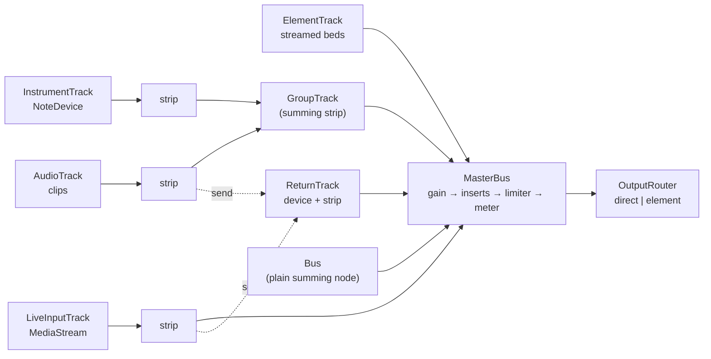

# The mixer: tracks, strips, groups, buses, master

One graph shape for every product (R1): tracks of kind audio, element,
instrument, live-input and return, optionally summed by groups, feeding buses
and one master with a single output terminus. Every routing or parameter
change while playing is a ramp or a crossfade, never a hard switch (R2).



## Track kinds

| Kind              | Made by                                                    | What it plays                                                                                                |
| ----------------- | ---------------------------------------------------------- | ------------------------------------------------------------------------------------------------------------ |
| `AudioTrack`      | `engine.addAudioTrack(name, { lookaheadSec, preloadSec })` | Clips over decoded samples from the `SampleStore`, scheduled inside the lookahead window, equal-power voices |
| `ElementTrack`    | `engine.addElementTrack(name)`                             | Clips over `ElementSource`s — an `<audio>` element per bed, streamed, envelope on the audio clock            |
| `InstrumentTrack` | `engine.addInstrumentTrack(name, { device })`              | A `NoteDevice` (`noteOn(id, hz, gain)` / `noteOff`) — Felt, a WAM synth, an app's own generator              |
| `LiveInputTrack`  | `engine.addLiveInputTrack(name)`                           | Any `AudioNode` or `MediaStream` attached later; nothing is buffered ([live-input](./live-input.md))         |
| `ReturnTrack`     | `engine.addReturnTrack(name, { device })`                  | The sum of every send pointed at it, through one device, then its strip                                      |
| `GroupTrack`      | `engine.addGroup(name, { members })`                       | A summing strip its members feed; hosts inserts, sends and automation of its own (R4)                        |
| `Bus`             | `engine.addBus(name)`                                      | A plain summing node with a fader and inserts, outside the solo tree — Breathwork Live's duck bus            |

Every kind has a `name`, a `destination` (the master by default, or a group,
bus or node) and `dispose()`. `engine.tracks`, `groups`, `buses`,
`liveInputs`, `instruments`, `returnTracks`, `elementTracks` list them;
`engine.track(name)` resolves an audio track; `engine.onChange` announces
additions and removals.

## Channel strips

Every track except `ElementTrack` has a `strip` (`ChannelStrip`): input gain →
inserts → pan → fader → mute/solo gate → destination, plus post-fader `sends`.

```ts
const kick = engine.addAudioTrack('kick')
const snare = engine.addAudioTrack('snare')
const drums = engine.addGroup('drums', { members: [kick, snare] }) // summing strip → master

kick.strip.setPan(-0.3) // −1 … 1
drums.strip.setLevel(0.8) // linear gain; dbToGain/gainToDb for dB
kick.strip.setInputGain(1.2)
snare.strip.setMute(true)
kick.strip.setSolo(true) // solo-in-place: pad/voice ramp to silence, drums and returns stay open
engine.solo.clear()
drums.strip.addInsert(plate) // any Device; removeInsert(plate) later
drums.strip.sends.add(hall, { level: 0.2 }) // post-fader
kick.strip.onChange((change) => …) // level | pan | mute | solo | inserts | routing | members …
```

All changes are `setTargetAtTime` approaches (5 ms constant by default,
`RampOptions` to change), never steps.

**Lazy nodes.** A track's strip creates **no nodes until first used** (pan,
level, mute, solo, an insert or a send), so the Phase 0 graph is unchanged:
voices and dry gains connect straight to the destination and are re-pointed
into the strip on first use, at unity, on one render quantum. That is how
Breathwork Live's recorded-node-order harness stayed green when strips
arrived. Groups are explicit and build their four nodes on creation;
`group.input` is the summing node.

**Solo-in-place.** A soloed strip is heard through its normal routing at the
main output; every other strip is muted by a ramp on its gate unless it is
soloed, an ancestor group is soloed, a descendant is soloed, or it is
`soloSafe` (returns default to `soloSafe: true`). An explicit `mute` always
wins. Plain `Bus`es sit outside the solo tree.

## Master

`engine.master` is a `MasterBus`: fader → inserts → _limiter_ → _meter_ → the
`OutputRouter`. Nothing below is in the default graph — the engine creates
exactly the nodes it did in Phase 0 (router → master gain → optional analyser
meter → buses) — so each stage is installed once, after the engine exists,
because it loads a worklet.

**Limiter (R3).** `engine.master.installLimiter((ctx) => createTruePeakLimiter(ctx, options))`
places the device the factory returns as a fixed stage after the fader and
every insert, ahead of the meter and the terminus. It is not an insert:
`removeInsert` cannot reach it, the returned `MasterLimiter` exposes
`setParam`/`getParam`/`params`/`latencySec` and **no bypass**, and the bus
disposes it. `createTruePeakLimiter` (`./dsp`, `cpp/devices/true-peak-limiter/`)
is a stereo-linked lookahead brickwall whose detector is the ITU-R BS.1770-4
Annex 2 four-phase true-peak FIR — the same table the meter uses — so the
meter's true-peak reading of the limited output never exceeds `ceilingDb`
(−20..0 dBTP, default −1). Attack is a linear ramp over the 1.5 ms lookahead
ending exactly when the peak arrives; `releaseMs` (10..2000, default 100) is
the exponential recovery; `inputGainDb` (±24) drives the detector. Latency 77
samples at 48 kHz (`truePeakLimiterLatencySamples(sampleRate)`). Any other
`Device` can be installed the same way (`createLimiter1176` for character
before the wall — as an insert — or a custom device as the wall).

**Meters.** `LufsMeter.create(ctx, { intervalMs, processorUrl, createNode })`
hosts `worklets/meter.js`, an AudioWorklet sink (one stereo input, no output)
that computes BS.1770-4 momentary (400 ms), short-term (3 s) and gated
integrated loudness (−70 LUFS absolute, −10 LU relative, 0.01 LU histogram so
memory is fixed for any session length), sample peak and true peak (4× to
48 kHz, 2× to 96 kHz), and posts a `MeterReading` at ≤ 30 Hz (default 20 Hz).
Read it synchronously (`lufsShortTerm`, `truePeakDb`, `maxTruePeakDb`, …) or
`subscribe`. Feed it from any bus with `bus.addTap(meter.input)` — taps are
re-fed after every insert change — or use
`engine.master.installLufsMeter(options)`, which taps the limited output.
`Meter` (an analyser) is the cheap peak/RMS reader every strip and the master
can have (`master: { meter: true }`, `engine.master.level()`);
`LoudnessAnalyzer` is the BS.1770 DSP as a plain class for offline analysis of
decoded buffers, tested against the EBU Tech 3341 references (997 Hz at
−23 dBFS stereo → −23.0 LUFS ±0.1, gating cases).

**Output.** `engine.output` is the `OutputRouter`, the one node every audible
path ends at: `ctx.destination` in `direct` mode, a
`MediaStreamAudioDestinationNode` behind an `<audio>` element in `element`
mode for iOS lock-screen playback ([getting started §5](../getting-started.md#5-ios-element-output-mode-and-activation)).
Nothing in the engine — or in a well-behaved consumer — connects to
`ctx.destination` itself.

**Stats.** `engine.stats` counts glitches from `AudioContext.renderCapacity`
where a browser exposes it (`supported`), converting each update's
`underrunRatio` into render quanta; hosts add their own with
`stats.recordGlitch()` and read `snapshot()` / `subscribe`.

## Latency

`engine.ioLatency()` reports the context's base and output latency;
`engine.latencyReport()` walks every path and reports each device's latency
and each path's arrival; `engine.alignLatency()` inserts alignment delays so
clip and instrument tracks arrive together with the longest path (live inputs
excluded unless asked). Details in [devices](./devices.md#latency-and-delay-compensation).

## Stopping and disposing

`engine.stop({ fadeSec })` fades the sounding audio and stops the transport;
`engine.dispose()` disposes every track, device and stage it created and
tears down timers (it never closes the `AudioContext` — the host owns that;
`engine.onDispose` lets renderers and UIs let go). Removal is by name:
`engine.removeTrack('kick')`, `removeGroup`, `removeBus`, `removeReturnTrack`,
`removeLiveInputTrack`, `removeInstrumentTrack`, `removeElementTrack`.
