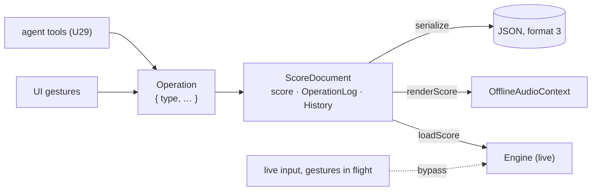

# The score as the source of truth

**A declarative score document is the source of truth for everything except
live input** (KD6). Arrangement, device graphs, strip settings, sends,
automation lanes, modulators and routes are fields of one versioned JSON
document; every edit — by a hand, by the agent, by automation writing back —
is an `Operation` applied to that document; and the realtime mixer and the
offline renderer are two renderers of it. One mechanism then gives undo,
versioning, offline bounce, goldens and attributed agent edits for free.



## What is in it

`Score` (`format: 3`): transport loop, launch quantisation and tempo map;
`master` (level, inserts); `sources` (sample ids → URLs); `tracks` (`audio`
with clips, `live` declared only, `instrument` with a `NoteDevice`);
`elementTracks`; `groups` (a forest); `returns` (device + strip); one `strip`
per host (level, pan, inputGain, mute, solo, soloSafe, inserts, sends);
`lanes` (a `ParamTarget` — strip param or device param — and breakpoints);
`modulators` (`lfo | random | macro | external-phase`); `routes`; `scenes`
and `slots` for the [session grid](./session-grid.md). Ids are strings the
author chooses and double as engine names; `'master'` is reserved. Every
device reference is `{ kind, id, params, … }` through the registry — a WAM by
URL through its persisted descriptor.

Seconds are the only time unit ([time](./time.md)). The format is bumped with
a migration whenever a field lands (`1 → 2` added element tracks and the tempo
map; `2 → 3` scenes, slots and `transport.quantize`); `parseScore` migrates,
`validateScore` checks against a registry.

## What is not in it

Live-input **audio** (the track is declared; the app attaches the stream),
the phase of an `external-phase` modulator (the app drives it), and a
**gesture in flight**: while a knob is held the value is written straight to
the graph through the `LaneWriter` override, and the operation lands in the
document when the gesture ends (KTD8). Meter readings and transport position
are observations, not state.

## Operations, log, history

Sixty operation types with a stable `type` string — `strip.set`,
`clip.replaceFrom`, `device.setParam`, `lane.addBreakpoint`, `scene.add`,
`slot.update`, `batch`, … —
each a pure `apply(score, op)` with a computed inverse. `ScoreDocument.apply`
appends to the `OperationLog` with `author: { id, kind: 'human' | 'agent' | 'system' }`
and a timestamp; undo appends the inverse rather than rewinding, so the log is
a complete transcript for a session's feedback loop; `History` undoes **one
step per gesture** (a fader drag coalesces by target and author within a
gesture id or a 500 ms idle window; discrete edits never coalesce). The full
table, the granularity decision and the rendering rules are in
[score.md](../score.md).

```ts
import { ScoreDocument, loadScore, renderScore } from '@kieranklaassen/live-mix'

const document = ScoreDocument.parse(json, { devices: engine.devices })
const renderer = loadScore(engine, document) // the live graph follows the document
document.apply({ type: 'strip.set', owner: 'kick', param: 'level', value: 0.6 }, { author })
document.undo()
const bounce = await renderScore(document.score, { durationSec: 240 }) // the same document, offline
```

## Rendering rules

`loadScore` (a free function, so `createEngine`-only consumers pay nothing
for the score module) creates and updates engine objects through the same
public API an app would call — the graph is identical either way. Parameter
ownership in the renderer: a modulation route wins over a lane, a lane over
the static value; a bound param's static value is never written; when the
binding goes the param is handed back at the static value. Clip edits move
boundaries rather than truncating sounding audio, and `clip.replaceFrom` is
Breathwork Live's steer.

## Where the agent comes in

The operation vocabulary is the agent API's vocabulary ([agent-api](./agent-api.md)):
a tool call becomes `document.apply(op, { author: { id: 'coach', kind: 'agent' } })`,
so it is validated, logged, attributed and undoable before a single node is
touched.
