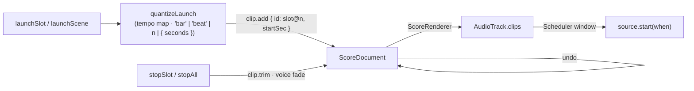

# The session grid

Scenes × clip slots over **the same clip model as the arrangement** (R8,
KD5): a slot holds a clip and its launch settings, launching places that clip
on its track at the next grid line of the tempo map, a scene launches a row
at once, follow actions chain slots into generative structure. Everything the
grid does is an operation on the score document, so the arrangement view
shows what the grid played and undo takes a launch back. The full model,
the operations, quantisation, launch modes, follow actions and the runtime
API are in [session.md](../session.md).



## The decision: launches are arrangement clips

A launch is `clip.add` at the quantised time (`{ id: '<slot>@<n>', …slotClip, startSec }`;
a looping slot clip is placed open-ended, a one-shot with its own duration);
a stop is `clip.trim` to the stop boundary. Because the `ScoreRenderer` hands
the placed clip to the track's `AudioTrack`, whose `Scheduler` window turns
the start into `source.start(when)`, the grid plays through exactly the path
the arrangement plays through — same voices, fades, trim and sample
retention — and what you performed is what the arrangement now contains.
Consequences: undo removes the clip and silences its voice; a transport stop
or seek trims every open launch to where the playhead was; a scene launch or
stop-all is one `batch`, one undo step.

## In the score (format 3)

```
transport.quantize: 'none' | 'bar' | 'beat' | n (bars) | { seconds }   default 'bar'
scenes[]  { id, name }
slots[]   { id, track, scene, clip: SlotClip | null, quantize?, launchMode: 'trigger' | 'gate' | 'toggle', legato, follow? }
```

One slot per audio track × scene; a cell without a slot is empty and a scene
launch leaves that track alone; a slot with `clip: null` is a **stop
button**. `SlotClip` is a `Clip` without `id` and `startSec`. Format 2
documents migrate (`2 → 3` adds empty `scenes`/`slots` and the default
quantise). Operations: `transport.quantize`, `scene.add/remove/move/rename`,
`slot.add/remove/update` — namespaced so the agent registry exposes them as
`scene_add`, `slot_update`, ….

## Runtime

```ts
import { Session, ScoreDocument, createEngine, loadScore } from '@kieranklaassen/live-mix'

const engine = createEngine({ context })
const document = ScoreDocument.parse(json, { devices: engine.devices })
loadScore(engine, document)

const session = new Session({ document, engine }) // quantises on the document's tempo map
session.launchScene('verse') // every slot in the row, on the next bar
session.launchSlot('kick-chorus', { quantize: 'beat' }) // one slot; the track's playing slot ends on the same line
session.status('kick-chorus') // { state: 'queued' | 'playing' | 'stopped' | 'empty', clipId, startSec, endSec, stopping, followAtSec }
session.stopAll()
document.undo() // the launch never happened
```

Launch modes: `trigger` (press launches, a playing slot retriggers), `gate`
(press launches, `releaseSlot` stops), `toggle`. **One clip per track**: a
launch closes the track's queued and playing launches. **Legato** enters the
incoming clip where the outgoing one had reached. Follow actions (`stop`,
`again`, `previous`, `next`, `first`, `last`, `any`, `other`, with a chance
between A and B and a time in bars or seconds) are evaluated on the scheduler
tick ahead of the follow time, so chains are gapless. AE3 holds: a launch
300 ms before the bar starts on the bar. Without an `engine` the session is a
pure editor.

## In React and the playground

`useSession(session)` → scenes, tracks, `cells[scene][track]` with each
slot's state, `quantize`, and the launch controls; `useSlot(session, id)` for
one cell. The playground mounts a minimal grid over `useSession` (scene
launch buttons, a cell per slot with its state, quantise picker, stop all) —
the kit's styled `GridView` is the integrator's follow-up
([react](../react.md#the-playground)). The smoke spec launches the "Groove"
scene and checks the drums slot goes `queued → playing` and a
`groove-drums@…` clip appears on the drums lane.

## Not yet

Warped (tempo-synced) slot clips play unwarped until a scheduler-driven
`StretchTrack` exists (U32 follow-up); recording into slots is the recorder's
(U33); scene tempo, launch offsets, velocity and MIDI mapping of the grid are
listed in [session.md § Not in this unit](../session.md#not-in-this-unit).
