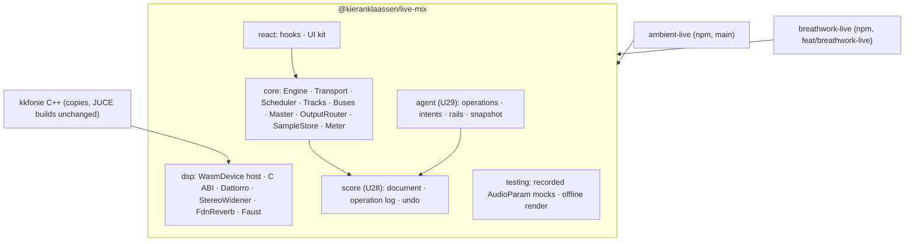

# Audio Mixing Engine - Plan

> **Distribution addendum (2026-09-14, after U1):** Kieran made `kieranklaassen/live-mix` **private**. Wherever this document says the repo or package is public, or that consumers install from public npm / trusted publishing, read: the package is published to **GitHub Packages** (`npm.pkg.github.com`, scope `@kieranklaassen`) by the release workflow's own `GITHUB_TOKEN`; consumers authenticate with a read-only PAT in CI and a Docker build secret under Kamal; the `github:#sha` fallback needs git auth. Details and the Kieran checklist: [README § Install](../../README.md#install). KTD2/U10 are superseded to that extent; the MIT licence stands.

Plan of record for the shared JS/TS mixing engine (working name `live-mix`): the north-star Product Contract plus the implementation units that build it, from Phase 0 through the Dream tier. It supersedes the phased section of [mixing-engine-plan.md](./mixing-engine-plan-of-record.md), whose §1–§3 (ambient-live map, requirement union, library location) remain the grounding this plan cites. Repo paths are prefixed with the repo name (`live-mix/…`, `breathwork-live/…`, `ambient-live/…`, `kkfonie/…`) and pinned to `breathwork-live@ebdd457` (branch `feat/breathwork-live`), `ambient-live@1d3b31b` (`main`), and the kkfonie workspace checkout.

---

## Goal Capsule

- **Objective:** Build `live-mix` — an Ableton-class mixer, arrangement, and device host for the browser whose every capability an AI agent can drive — as one public npm package, adopt it in ambient-live and then Breathwork Live with no audible change, delete both apps' private engines, then grow strips, automation, devices, a React kit, and the Dream tier (grid, agent API, warping, export, optional native shell) unit by unit.
- **Product authority:** Kieran Klaassen — sole builder and user. Authority order when texts disagree: Kieran's recorded decisions (KD1, KD7 session-settled) → this Product Contract (R-IDs) → Planning Contract (KTDs) → unit text → implementer judgment → repo conventions of the touched repo.
- **Execution profile:** One LFG flow per unit: plan-check → implement → review → PR. One PR per unit into the named base branch. The implementer never deploys, never pushes to `feat/breathwork-live` or `main` directly, never edits `tuin`, and never commits a secret (see Hand-off).
- **Stop conditions:** Stop and report — do not substitute an architecture — when: a settled decision is invalidated by evidence (`settled-decision-invalidated`); the Breathwork Live parity harness cannot pass without changing recorded `AudioParam` behaviour; Vite cannot resolve the worklet or `.wasm` from the dependency in either app after the explicit-URL escape hatch (KTD3); or element output mode regresses on an iPhone.
- **Tail ownership:** Kieran owns: the first `npm publish` and trusted-publisher setup (U10), Kamal deploys of Breathwork Live, the real-session go/no-go before U14, the ambient-live reverb A/B, and every version pin bump PR merge.
- **Open blockers:** None launch-blocking. Three former Resolve-Before-Planning questions are resolved by KTD9, KTD16, and KTD2 below; remaining questions are deferred to the units that own them.

---

## Product Contract

Product Contract preservation: unchanged in scope and IDs from the requirements-only draft; KD7 carries Kieran's session-settled runtime decision; the three Resolve-Before-Planning questions were resolved in place into KTD2, KTD9, and KTD16 and removed from Outstanding Questions.

### Summary

Build `live-mix`: a UI-agnostic mixing engine (tracks, groups, returns, master, transport, arrangement, session grid, devices, automation, live inputs) on raw Web Audio + AudioWorklet, with a declarative score document as its source of truth, a tool-callable agent API as a first-class control surface, a WASM device ecosystem fed by Faust and Kieran's kkfonie C++, an optional React UI kit, and offline rendering that is sample-identical to live playback. Ship it as one public npm package that both apps consume.

### Problem Frame

Kieran has three mixing engines and none of them is a mixer. Breathwork Live's [`musicEngine.ts`](https://github.com/kieranklaassen/breathwork-live/blob/feat/breathwork-live/app/frontend/lib/breathwork/musicEngine.ts) sums everything into one duck bus, polls its sidechain on the main thread every 60 ms (`breathwork-live/app/frontend/lib/breathwork/musicEngine.ts:22`), has no pause or seek, and caches decoded audio forever. ambient-live plays clips through a global reverb with no tracks or sends (`ambient-live/engine/src/engine.cpp:83-108`). The BB plugin carries a third sample player (`ambient-live/bb-plugin-ambient-live/audio/sample-player.ts:1-10`). Every new musical idea — a limiter, a second reverb, a breath-synced filter, agent-steered stems — must be built twice or not at all.

The AI coach is already a mixing operator. It calls `set_music_volume`, `set_music(calmer|stronger|change)`, `set_pace`, `extend_current_section`, and `advance_to_next_section` mid-session (`breathwork-live/app/services/breathwork/agent_tools.rb:65-131`), yet those tools reach the audio only through a domain-specific conductor, and the whole musical vocabulary the coach can use is five verbs. The listener feedback loop (`record_feedback`, session webhooks) already drives code changes within hours; the audio layer is the slowest part to respond.

Why now: the shared-library decision has been taken, both apps are on the same Rails 8.1 + Inertia + Vite 8 chassis, ambient-live is dormant and un-deployed (a safe first consumer), and kkfonie's C++ (`StereoWidener`, the Tides FDN, `SpectralDrifter`, Ether, Felt) is a device catalogue waiting for a host.

### Actors

- A1. **Kieran the builder** — writes the engine, its devices, and both apps; solo; deploys Breathwork Live with Kamal from the Mac mini and runs ambient-live on the MacBook.
- A2. **The AI coach** — an OpenAI Realtime agent that speaks to the listener and calls tools during a session; later also a planning LLM that authors a whole session score before playback. Treats the mix as something it operates, not something it hears.
- A3. **The listener** — Kieran (and later others) in a breathwork session, often on an iPhone with the screen locked, speaking to the coach; consents before the session starts and expects the music never to startle or drown the voice.
- A4. **The ambient performer** — Kieran at the MacBook painting clips onto a looping timeline, playing keys or Web MIDI, later plugging in a guitar or mic; latency-sensitive.
- A5. **Consumer applications** — Breathwork Live and ambient-live today (and the BB plugin, other products later): host the engine, own their domain logic, and pin a version.

### Goals

- One engine, many products: the mixer, arrangement, and device host live in the library; only domain logic (breathwork sections, paint gestures) stays in apps.
- Agent-operable by design: every capability has a tool schema, an intent-level counterpart, safety rails, and an observable state snapshot.
- Ableton-grade musical vocabulary: tracks, groups, returns, sends, racks, macros, sidechains, automation, modulation, session and arrangement views, warping, bounce.
- One DSP source, two hosts: kkfonie C++ and Faust devices run in the browser as WASM and natively in JUCE without a rewrite.
- Deterministic and testable: the same score renders identically live and offline; behaviour is asserted at the AudioParam boundary and in rendered goldens.
- Browser-first, iPhone-honest: lock-screen playback, memory discipline, no COOP/COEP requirement, graceful degradation on Safari.
- Open-sourceable: MIT, zero runtime dependencies, no AGPL or commercial DSP in the core.

### Key Decisions

- KD1. **The engine is a shared library consumed by both apps, not an in-repo carve-out.** (session-settled: user-directed — chosen over carving `app/frontend/lib/mix/` out inside breathwork-live: Kieran requires the ambient-live workstation to use it too.) Governs R1, R36, R37.
- KD2. **Raw Web Audio + AudioWorklet is the core; Tone.js is not the foundation.** Carried from the project context and the assessment, not yet confirmed by Kieran in dialogue: Tone.js owns the clock and offers no sidechain or worklet DSP; it may appear only as isolated, wrapped inserts. Governs R1, R5, R9.
- KD3. **DSP comes from Faust, Emscripten-compiled kkfonie C++, `signalsmith-stretch` for warping, and WAM 2.0 as the optional browser plugin format; VST3/AU stay native-only under "one DSP source, two hosts".** Carried from the project context; openDAW (AGPL), Superpowered (commercial), and essentia (AGPL) are excluded from the core. Governs R11, R20, R30, R35.
- KD4. **Agent control is a first-class actor, not an add-on.** Working assumption from the coordinator: every mixer capability is exposed as a tool-callable operation with schema, rails, and observability, mirroring the coach tools that already exist (`breathwork-live/app/services/breathwork/agent_tools.rb:65-131`). Governs R25, R26, R27, R28, R29.
- KD5. **Seconds are the primary time unit; bars and beats are a view.** Breathwork Live is clock-driven; ambient-live loops in seconds; a tempo map layers on top for the grid and warping. Governs R5, R8, R20.
- KD6. **A declarative score document is the source of truth for everything except live input.** Arrangement, grid, automation, device graphs, and agent edits are operations on the score; the realtime mixer and the offline renderer are two renderers of it. Adopted from the challenger approach (Appendix B) because it makes undo, versioning, offline bounce, goldens, and attributed agent edits fall out of one mechanism. Governs R22, R24, R27.
- KD7. **Browser-first including iOS Safari/PWA; a native shell tier (Tauri/Electron + JUCE host for real VST3/AU) is optional per consumer and never a requirement for every app.** (session-settled: user-directed — chosen over browser-only forever and over a native shell for all consumers: Breathwork Live stays browser/PWA-only; ambient-live or a future workstation may opt into the shell, which implements the same device and score contracts.) No Core requirement depends on the shell; every native-shell item stays Dream tier. Governs R34, R35.
- KD8. **Every catalogue item carries a tier — Core, Dream, or Maybe-never — and YAGNI applies to carrying cost, not ambition.** Core = the north star is not credible without it and a consumer or the agent needs it now; Dream = build when a consumer pulls; Maybe-never = named so it is consciously not built.
- KD9. **Visual = audio: any UI representation reads the same formula or state as the DSP.** kkfonie rule (`kkfonie/CLAUDE.md` "Visual = Audio"), already followed by ambient-live's clip fades (`ambient-live/app/frontend/audio/fade.ts:1-3`). Governs R33.
- KD10. **The listener's protection outranks the agent's intent.** Loudness ceilings, voice-priority ducking, no-silence and no-startle guards, and consent flags cannot be overridden by a tool call. Governs R3, R17, R27.

### Requirements

**Mixer core**

- R1. The engine provides tracks of kind audio, instrument, live-input, return, and group, each with input gain, inserts, pan, fader, mute, solo, and sends, feeding buses and one master with a single output terminus.
- R2. Every routing or parameter change while playing is click-free: ramps or crossfades, never a hard switch.
- R3. The master carries a true-peak limiter and peak/RMS/short-term-LUFS metering that no operation can bypass.
- R4. Groups sum member tracks and host their own inserts, sends, and automation.

**Transport and arrangement**

- R5. The transport offers play, pause, stop with fade, seek, loop with numbered passes, and position derived from the audio-clock anchor, with an optional tempo map.
- R6. Arrangement clips carry source offset, duration, fades with selectable curve, gain in dB, and loop, and edits under playback move boundaries rather than truncating sounding audio (`breathwork-live/docs/solutions/realtime-voice-session-architecture.md` decision 4).
- R7. Scheduling is idempotent and catches up from the anchor after timer throttling, joining late clips mid-way rather than replaying them (`ambient-live/app/frontend/audio/clip-player.ts:38-43`).

**Session grid**

- R8. Scenes × track slots with quantised launch, one playing clip per slot, stop/launch per scene, and follow actions, as a view over the same clip model as the arrangement.

**Devices and chains**

- R9. A device is any processor exposing typed parameters with range, taper, unit, and default, plus bypass, reported latency, state save/load, and a lifecycle; Web Audio node, WASM, Faust, WAM, and later native-shell implementations satisfy one contract.
- R10. Racks host parallel chains with per-chain gain and pan, macros that map to many parameters with curves, per-device dry/wet, and sidechain key inputs.
- R11. Stock devices cover EQ, compressor, ducker, delay, convolution and algorithmic reverbs, stereo widener, spectral drifter, limiter, filter, utility, and instruments including a breath/noise synth, sine, sampler, granular, and later a modal piano.
- R12. Plugin delay compensation aligns tracks and sends when devices report latency.

**Automation and modulation**

- R13. Parameter lanes hold breakpoints with curves, are written ahead inside the scheduler window, and yield to a live override with cancel-and-hold.
- R14. Modulators — free-running LFO, envelope follower, random/sample-and-hold, macro, and external phase sources such as breath phase — can target any parameter with depth and polarity.
- R15. MIDI, Web MIDI, and OSC map to parameters and transport through learn mode.

**Live input and monitoring**

- R16. Live-input tracks wrap any `MediaStream` (microphone, WebRTC remote voice) with inserts, sends, monitoring toggle, and a stated latency budget, and never add buffering in the monitoring path.
- R17. Voice-keyed ducking runs in the audio thread on any bus with configurable attack, release, depth, and key, with the current constants as defaults (`breathwork-live/app/frontend/lib/breathwork/musicEngine.ts:13-24`).

**Analysis and awareness**

- R18. Realtime analysis exposes peak, RMS, short-term LUFS, and spectrum per bus; offline analysis provides integrated LUFS, key with Camelot code, BPM, energy curve, and lyric/vocal windows, whether imported from a server or computed in the browser.
- R19. Musical events (drop, swell, breakdown, vocal window, section boundary) are available on a time-addressed feed to agents, automation, and UI (`breathwork-live/app/frontend/lib/breathwork/conductor.ts:164-174`).

**Warping and key matching**

- R20. A stretch clip source provides tempo-synced time-stretch and pitch-shift with reported latency.
- R21. Harmonic compatibility follows the Camelot rule already shared by the server and client selectors — same number ±1 wrapping 1–12, letter-agnostic, unparseable codes compatible with everything (`breathwork-live/app/frontend/lib/breathwork/musicResolver.ts:49-64`, `breathwork-live/app/services/music/selection.rb:124-131`) — and is available as a pure helper for selection, crossfade choice, and key-matching.

**Recording, bounce, export**

- R22. Any score renders offline to WAV, MP3, or stems, sample-identical to live playback of the same score when no live inputs are involved.
- R23. Live inputs and the master can be recorded to clips or files during playback.

**Persistence and history**

- R24. The score document serialises to JSON with schema versioning, supports undo/redo, and records every operation with its author (human, agent, automation) and time.

**Agent control**

- R25. Every mixer capability is available as a named operation with a JSON schema, validated ranges, and a prompt result payload, in the same shape as the coach tools (`breathwork-live/app/frontend/lib/breathwork/toolHandlers.ts:95-193`).
- R26. Intent-level operations (calmer, stronger, change, more space, softer under voice, extend, advance) sit beside parameter-level ones, and the engine resolves intents using analysis data such as intensity labels, Camelot, LUFS, and vocal windows (`breathwork-live/app/frontend/lib/breathwork/musicResolver.ts:79-125`).
- R27. Safety rails clamp values, rate-limit changes, enforce loudness and no-silence guards, quantise musically sensitive edits, honour consent flags, and make every agent operation undoable and logged.
- R28. An observable state snapshot (now playing, upcoming, levels, active vocal windows, section position) is available at a settable cadence and on demand so an LLM can react without polling the graph.
- R29. Multiple controllers (UI, agent, automation) act on the same parameters under a stated arbitration rule with override memory, so a human touch is not silently undone by automation.

**Plugin ecosystem**

- R30. A stable WASM device ABI lets kkfonie C++ compile for the browser with Emscripten and for the existing JUCE plugin builds from one source (`kkfonie/Felt/Source/StereoWidener.h:21-28`), independent of any native shell; Faust devices precompile to the same ABI; a WAM 2.0 host adapter accepts third-party browser plugins.
- R31. Devices ship with metadata, presets, version, and lazy loading, and appear in every consumer's device list without app changes.

**UI kit**

- R32. A React kit offers headless hooks and separately styled components for mixer strips, device view, arrangement lane, session grid, waveform, meters, transport, and automation editing, themed through CSS variables.
- R33. Every visual derived from audio state uses the same formula as the DSP (per KD9).

**Platform**

- R34. The engine runs in current Chrome, Firefox, and Safari including iOS PWA: lock-screen playback through element output mode and `MediaSession`, memory eviction for long sessions, sample-rate and interruption recovery, no `crossOriginIsolated` requirement, and SharedArrayBuffer used only when available.
- R35. An optional native shell tier hosts the same score and device contracts with real VST3/AU plugins and low-latency I/O, adopted per consumer (per KD7); a consumer that stays browser-only loses no Core capability.
- R36. The library is ESM-only, has zero runtime dependencies, imports safely under server-side rendering, and ships compiled JS with type declarations.

**Developer experience**

- R37. The engine runs headless in Node for tests with a recording mock context and offline golden renders, ships typed docs and runnable examples for both consumer shapes, and follows semver with a changelog.
- R38. Performance budgets are stated and measured: allocation-free processing, CPU headroom on a current iPhone with a stated device count, and glitch counters exposed to the host.

### Key Flows

- F1. **The coach steers the mix mid-session**
  - **Trigger:** The listener says the music is too present, or asks for different music.
  - **Actors:** A2, A3, A5 (Breathwork Live)
  - **Steps:** The coach calls a parameter operation (music volume) or an intent operation (calmer); the engine resolves calmer to the next lower intensity and a Camelot-compatible replacement, swaps at a musical boundary, moves the section boundary rather than truncating, and returns now-playing plus seconds added; the ducker keeps the voice on top throughout; the operation is logged for the transcript and feedback loop.
  - **Covered by:** R2, R6, R17, R21, R25, R26, R27, R28

- F2. **The performer paints and plays**
  - **Trigger:** A sample is dropped on the looping timeline; a stroke is painted over a device parameter; a guitar is plugged in.
  - **Actors:** A4, A5 (ambient-live)
  - **Steps:** The drop becomes a clip; the stroke becomes an automation lane on the granular device; the guitar becomes a live-input track monitored through a chain; the loop iterates with quantised launches of held clips; the result bounces to a file.
  - **Covered by:** R5, R6, R8, R13, R16, R22

- F3. **The builder adds a device from kkfonie**
  - **Trigger:** Kieran wants Tides' breathing reverb in a session.
  - **Actors:** A1, A5
  - **Steps:** The C++ is compiled against the device ABI; the WASM artefact and parameter table land in the library; both apps list the device with a generated device view; the JUCE build is unchanged.
  - **Covered by:** R9, R11, R30, R31, R32

- F4. **An agent authors a session offline and it plays live unchanged**
  - **Trigger:** The planner LLM composes a 20-minute session.
  - **Actors:** A2, A1
  - **Steps:** The planner emits a score (tracks, LUFS trims, Camelot-ordered clips, cue-timed automation); the offline renderer produces an MP3 and analysis; the same score is loaded live and the coach edits it by operations during playback; the two renders are identical up to the live edits.
  - **Covered by:** R21, R22, R24, R25

- F5. **The listener locks the phone**
  - **Trigger:** The iPhone screen locks or a phone call interrupts mid-session.
  - **Actors:** A3
  - **Steps:** Playback continues through the element output with lock-screen metadata; an interruption suspends and resumes on the next gesture without losing position; memory stays bounded for a 45-minute session.
  - **Covered by:** R5, R7, R34

### Acceptance Examples

- AE1. **Covers R21, R26.** Given the playing track is `8A` at intensity 2 and the coach requests `calmer`, then the replacement has intensity 1 and a Camelot number in {7, 8, 9} when any such track exists, and the result reports the seconds the section grew.
- AE2. **Covers R27.** Given an agent operation requests music volume 3.0, then the applied value is 1.0, the clamp is logged with the requested value, and the operation is undoable.
- AE3. **Covers R8.** Given launch quantisation is one bar and a clip is launched 300 ms before the bar, then it starts on the bar, not immediately.
- AE4. **Covers R7.** Given the tab is backgrounded and the scheduler timer is throttled for 4 s, then no due clip is skipped and none plays twice.
- AE5. **Covers R34.** Given an iPhone in element output mode and the screen locks, then playback continues and the lock screen shows the session title.
- AE6. **Covers R22.** Given a score without live inputs, then the offline render and a live render of the same score are sample-identical at the same sample rate.
- AE7. **Covers R24, R29.** Given the coach lowers the music and the listener then drags the fader, then the fader wins, the agent's later automation does not undo it, and undo restores the coach's value.
- AE8. **Covers R14, R33.** Given breath phase is mapped to a filter cutoff, then the on-screen indicator and the audible cutoff follow the same inhale/exhale curve with no visible or audible lag between them.
- AE9. **Covers R10, R17.** Given the coach's voice is the sidechain key of the music group's ducker, then music dips within the configured attack when the coach speaks and recovers within the release when the coach stops, while the breath guide on a separate bus is unaffected when so configured.
- AE10. **Covers R30.** Given `StereoWidener` compiled to the device ABI, then processing a stereo test signal in the browser and in the JUCE build produces the same output within float tolerance.

### Success Criteria

- Both apps run on the library with their existing behaviour tests green and no audible regression judged by Kieran (Phase 0).
- The coach's musical vocabulary grows from five verbs to intent and parameter operations on any track, with a per-session log Kieran can read.
- A kkfonie device reaches both apps from a C++ source in one build step and one release, with no app code change.
- A session score renders offline and plays live identically, retiring the need for a second rendering path when Kieran chooses to.
- The ambient-live live-guitar monitoring path feels playable to Kieran (ambient-live's own success criterion: round-trip at or under ~50 ms judged by feel, `ambient-live/docs/plans/2026-07-21-001-feat-ambient-live-plan.md:143`).

### Scope Boundaries

**Deferred for later (Dream or pulled by a consumer)**

- Session grid, follow actions, and the arrangement UI — no current consumer asks for a grid; ambient-live rejects grid UI for its product (`ambient-live/docs/plans/2026-08-07-001-feat-ableton-workstation-shell-plan.md:39`).
- Native shell with VST3/AU hosting — optional per consumer (KD7); the browser engine designs for it only through the device and score contracts, and Breathwork Live never adopts it.
- In-browser lyric transcription and key detection — server analysis exists and is correct; browser analysis is a convenience tier.
- Collaborative multi-user editing.

**Outside this product's identity**

- A general-purpose DAW competing with Ableton or openDAW; the engine is a foundation for Kieran's products.
- Piano roll and full MIDI sequencing (ambient-live decided against a piano roll; Lilt and Thesis cover MIDI generation natively).
- Hosting third-party native plugins in the browser — not possible in any browser.
- Video, notation, surround and Ambisonics delivery.

### Feature tiers at a glance

| Tier | Meaning | Examples |
|---|---|---|
| Core | Not credible without it; a consumer or the agent needs it now | Mixer, transport, clips, live input, ducker, LUFS trims, agent operations with rails, WASM device ABI, iOS output mode, headless tests |
| Dream | The full vision; build when a consumer pulls | Session grid, racks and macros, modulation matrix, stretch and key-matching, offline bounce, undo/versioning, React kit, WAM host, kkfonie device catalogue, native shell |
| Maybe-never | Named so it is consciously not built | Piano roll, collaborative editing, surround, in-browser transcription, plugin marketplace |

The full mechanism-level catalogue with per-item tiers is Appendix A.

### Dependencies / Assumptions

- Assumption (coordinator, unconfirmed): the library is a solo-developer foundation that may be open-sourced later.
- Assumption (coordinator, unconfirmed): consumers are Breathwork Live and ambient-live; others later.
- Assumption (coordinator, unconfirmed): agent/AI control of the mix is core, not an add-on.
- Settled by Kieran (KD7): browser-first including iOS/PWA; the native shell is an optional per-consumer Dream tier — Breathwork Live stays browser/PWA-only.
- Assumption: the OpenAI Realtime tool channel remains the primary live agent surface; a planning LLM authoring scores offline is an extension of the same operation set, not a second API.
- Assumption (unverified): kkfonie `SpectralDrifter` and the Tides FDN need a small de-JUCE pass before compiling with Emscripten — `SpectralDrifter.h` includes `juce_dsp` and uses `juce::jlimit`/`MathConstants` (`kkfonie/Bloom/Source/SpectralDrifter.h:2,73,118`); `StereoWidener` includes only `<array>` and `<cmath>` and compiles as-is (`kkfonie/Felt/Source/StereoWidener.h:2-3`).
- Assumption (unverified): Felt's modal piano can be hosted as a WASM instrument within an iPhone CPU budget; its architecture is documented (`kkfonie/Felt/README.md:3-7`) but its cost in a worklet was not measured.
- Assumption: Kieran controls the `@kieranklaassen` npm scope or will create it; otherwise `@kkfonie`.
- Dependency: Emscripten on the MacBook and in the library's CI; never in the consumers' installs.

### Outstanding Questions

**Deferred to the owning unit**

- Tempo-map representation and how bars overlay seconds for the grid and warping (U32).
- Undo granularity for continuous gestures and the arbitration rule between agent and human controllers (U28, U30).
- Which analyses move into the browser and which stay server-side (U29, U33).
- Stretch algorithm choice and licence at the time the grid needs it (U32).
- WAM host depth — parameters and automation only vs. GUI embedding (U35).
- Whether kkfonie eventually vendors the library's `cpp/` sources instead of keeping copies (U20, U21).

<!-- ce-section: work-relationships -->
### How This Work Fits Together

This plan owns the shared engine end to end. The breakdown below is the current understanding, not a committed roadmap.

- [mixing-engine-plan.md](./mixing-engine-plan-of-record.md) — the former execution plan; its §1–§3 are grounding, its §4–§5 are superseded by the Implementation Units here.
- [audio-mixing-engine-assessment.md](./audio-mixing-engine-assessment.md) — library evaluation and architecture sketch; §1–§3 remain the technical grounding.
- Breathwork Live's own plan (in `tuin`, per the [survey](https://github.com/kieranklaassen/breathwork-live)) — can proceed independently; adopts engine capabilities as they land (U12, U14, U26, U29). The coach's tool set is the seed of R25–R26.
- ambient-live's plans — can proceed independently; its deferred live-input latency spike becomes the acceptance test for R16 in U27.
- kkfonie JUCE workspace — shares DSP sources under KD3 and KTD10; the library holds the JUCE-free canonical copies from U20 onward.
- tuin pre-rendered pipeline — still to decide whether the offline renderer (U33, U38) replaces it; nothing in this plan edits `tuin`.

### Sources / Research

- Coach tools and rails: `breathwork-live/app/services/breathwork/agent_tools.rb:65-74` (`set_pace`), `:81-87` (`extend_current_section`, 1–300 s), `:101-107` (`set_music_volume` 0–1), `:114-126` (`set_music` calmer/stronger/change, explicit-consent wording), `:32-51` (`begin_session_generation`, 5–45 min); client handling `breathwork-live/app/frontend/lib/breathwork/toolHandlers.ts:10` (300 s cap), `:17-37` (conductor API), `:135-161` (result carries `practice_extended_seconds`).
- Conductor steering: `breathwork-live/app/frontend/lib/breathwork/conductor.ts:65-72` (pace factors 1.15/0.85, bounds 0.7–1.6, 55-minute session cap), `:543-562` (`setPace`), `:568-593` (`extendSection` with headroom), `:628-650` (`setMusic` → replacement resolver, boundary moves), `:1665-1677` (user-speech dip multiplies master volume).
- Camelot and intensity logic: `breathwork-live/app/frontend/lib/breathwork/musicResolver.ts:38-46` (target intensity), `:49-64` (wheel number, ±1 wrap), `:79-125` (greedy ladder: target+harmonic → target → adjacent); server parity `breathwork-live/app/services/music/selection.rb:16-24`, `:99-102`, `:124-131`; tuin origin per the [survey](https://github.com/kieranklaassen/breathwork-live) (`music_selector.py`: S1 intensity 1 then 2, S2 always 3, S3 2-after-3 else 1, Camelot ±1 letter-agnostic, no repeats; `audio_composer.py`: −6 dB duck, hard cuts).
- Loudness: `breathwork-live/app/services/music/loudness.rb:15,26-29` (−16 LUFS target, ±12 dB cap); ducking constants `breathwork-live/app/frontend/lib/breathwork/musicEngine.ts:13-24`; main-thread poll `:840-854`; element output mode `:55-84`.
- Breath-synced modulation precedent: `breathwork-live/app/frontend/lib/breathwork/breathGuide.ts:26-43` (per-section cycles, 400–1100 Hz bandpass, 2 s automation lookahead).
- ambient-live primitives: anchor transport `ambient-live/app/frontend/pages/live/use-clip-transport.ts:47-67`; late-join clip playback `ambient-live/app/frontend/audio/clip-player.ts:35-73`; WASM worklet host `ambient-live/app/frontend/audio/engine-processor.ts:18-36`; Dattorro plate `ambient-live/engine/src/dattorro_reverb.h:13-30`; product rules `ambient-live/docs/plans/2026-07-21-001-feat-ambient-live-plan.md:69-71` (no VST in v1, live input day-one, iPad native later).
- kkfonie DSP inventory: `kkfonie/Felt/Source/StereoWidener.h:5-15` (three-stage S1-style widening, bass kept narrow), `:21-28` (API); Tides FDN `kkfonie/Tides/Source/PluginProcessor.cpp:107-110` (eight coprime delays), `:199-202` (Hadamard 8×8), `:332-333` (breathing LFO law `1 − depth·(1 − breathMod)`); Ether reverb parameters `kkfonie/Ether/Source/PluginProcessor.cpp:24-54` (decay, size, damping, mix, pre-delay, freeze); `kkfonie/Bloom/Source/SpectralDrifter.h:24-81` (direction, season, seed, tonality; granular pitch drift); Felt modal piano `kkfonie/Felt/README.md:3-7`; MIDI-only tools Lilt (`kkfonie/Lilt/README.md:3`) and Thesis.
- Library landscape and licences: [assessment §2](./audio-mixing-engine-assessment.md); library location and consumption options: [mixing-engine-plan.md §3](./mixing-engine-plan-of-record.md).

---

## Planning Contract

### Key Technical Decisions

- KTD1. **One npm package `@kieranklaassen/live-mix` with subpath exports (`.`, `./dsp`, `./react`, `./testing`, `./worklets/*`, `./wasm/*`), built with `tsup` to ESM + `.d.ts`, zero runtime dependencies, React as an optional peer, `engines.node >= 22`.** Instantiates KD1. Both apps install with npm, npm git dependencies cannot target a sub-directory, and one version number avoids a core/dsp/react matrix. The repo may use pnpm internally. Governs R36, R37.
- KTD2. **Distribution is public npm with exact pins; `github:kieranklaassen/live-mix#<sha>` with a `prepare` script is the fallback until trusted publishing exists; `.wasm` artefacts are committed so the fallback never needs Emscripten; the repo is public and MIT from the first commit.** GitHub Packages, private registries, and build secrets in the Kamal Docker build are rejected (`breathwork-live/Dockerfile:91-93` runs `npm ci` with `git` present and no credentials). Resolves the former "public from the first release?" question. Governs R36, R37.
- KTD3. **The `dsp` entry resolves its worklet and `.wasm` with `new URL(..., import.meta.url)` inside factories (never at import time) and every factory accepts `{ processorUrl?, wasm?: URL | WebAssembly.Module }` overrides; consumers add `optimizeDeps.exclude: ['@kieranklaassen/live-mix']` and, when linked, `server.fs.allow: ['..']`.** Base64-inlined WASM and blob-URL worklets are rejected (SIMD growth; WebKit `addModule(blob:)` history on iOS). Governs R34, R36.
- KTD4. **ambient-live adopts first, Breathwork Live second behind a runtime flag; Phase 0 is behaviour-preserving in both: same recorded `AudioParam` event stream in Breathwork Live, same mono-sum reverb feed and `dry·(1−mix) + wet·mix` law in ambient-live.** ambient-live is un-deployed and already boundary-clean (`ambient-live/app/frontend/audio/audio-engine.ts:3-6`), so it proves packaging with zero exposure; Breathwork Live's 979-line harness is the strongest gate and runs second. Governs R6, R17, R34.
- KTD5. **The WASM device C ABI is `device_init(sample_rate, max_block)`, `device_set_param(id, value)`, `device_in_left/right()`, `device_out_left/right()`, `device_max_block_frames()`, `device_process(frames)`, built with `emcc -O3 -fno-exceptions -fno-rtti --no-entry -s ALLOW_MEMORY_GROWTH=0`; one static instance per module, one `WebAssembly.Instance` per `AudioWorkletNode`, the `Module` compiled once per page and passed through `processorOptions`; parameters travel over the `MessagePort` in v1 and are smoothed inside C++.** Lifted from ambient-live KTD-3/KTD-8 (`ambient-live/app/frontend/audio/engine-processor.ts:1-36`). Governs R9, R30.
- KTD6. **One `Transport` (anchor `contextTime ↔ positionSec`, numbered loop passes, pause-at-end) and one `Scheduler` loop (timer, not rAF; per-track `lookaheadSec` and `preloadSec`; idempotent keys `clipId:iteration:startSec`; catch-up from the anchor).** Instantiates KD5 from `ambient-live/app/frontend/pages/live/use-clip-transport.ts:14-67,190-238`. Governs R5, R7.
- KTD7. **The Phase 0 `Ducker` is the existing main-thread envelope follower moved into a device with identical constants and `setTargetAtTime` calls; the audio-thread worklet replaces it in U17 with the same defaults.** Preserves the parity harness (`breathwork-live/app/frontend/lib/breathwork/__tests__/musicEngine.test.ts`). Governs R17.
- KTD8. **The score document (U28) is versioned JSON holding tracks, clips, device graphs, parameter values, automation lanes, and an operation log with author and time; the realtime engine applies operations to both the score and the graph; live input and direct gesture parameter writes bypass the score until the gesture ends.** Instantiates KD6. Governs R24.
- KTD9. **The agent API (U29) is a registry of operations `{ name, schema, apply, undo, rails }` plus intent operations that resolve through analysis data and a `snapshot()` at a settable cadence; it is a library capability, Breathwork Live is its first consumer, and ambient-live may adopt it later.** Instantiates KD4; resolves the former "does agent control extend to ambient-live?" question without coupling the API to either app. Governs R25, R26, R27, R28, R29.
- KTD10. **The library's `cpp/` directory is the canonical home for JUCE-free DSP (`dsp_util`, Dattorro, `StereoWidener`, `FdnReverb`, later `SpectralDrifter`); kkfonie plugins keep their copies with a recorded source SHA until a vendoring mechanism is chosen; JUCE builds are never touched by this plan.** Governs R30.
- KTD11. **The `./react` entry ships headless hooks over `useSyncExternalStore` on engine snapshots and, separately, styled components whose colours are CSS variables; ambient-live's `components/daw` move only after `al-*` tokens become variables.** Governs R32, R33.
- KTD12. **The native shell is a separate later package that implements the device and score contracts; only ambient-live or a future workstation opts in.** (session-settled: user-directed — chosen over a shell for all consumers: Breathwork Live stays browser/PWA-only per KD7.) Governs R35.
- KTD13. **Local iteration uses `npm link ../live-mix` in each app with `pnpm build --watch` in the library; `file:` dependencies never land in a committed `package.json`; a `pnpm pack` tarball install precedes every release.** Governs R37.
- KTD14. **Versioning is `0.x` semver with minor = breaking; changesets produce the changelog and version PRs; one app migrates per breaking bump; consumers pin exact versions.** Governs R37.
- KTD15. **Test strategy by layer: recorded-`AudioParam` harness (`./testing`) for graph behaviour; pure-function tests for scheduling and clip math; native C++ harness with system clang for DSP; WASM reproducibility diff in CI; `OfflineAudioContext` goldens from U33; Playwright only for iOS-specific manual checks.** Governs R37.
- KTD16. **Product shape: Approach B (adaptive-music runtime with an agent API) is the spine; Approach C's score-as-source-of-truth is adopted for arrangement, automation, and device graphs; Approach A's full UI kit and grid stay Dream tier (Appendix B).** Accepted on the coordinator's directive after Kieran's GO; the offline renderer's Core scope is tests and bounce, and replacing the tuin pipeline stays Dream (U38). Governs R22, R32.
- KTD17. **Branching: `live-mix` lands units as PRs into `main` from `feat/<unit-slug>`; ambient-live units are PRs into `main`; Breathwork Live units are PRs into `feat/breathwork-live` (there is no `main`); nothing is pushed to a base branch directly.** Governs the Hand-off.

### High-Level Technical Design

- Phase 0 delivers `core`, `dsp` (Dattorro only), and `testing`, then both adoptions.
- Phase 1 adds strips, limiter and meters, the worklet ducker, automation and modulators, kkfonie and Faust devices, the React kit, and the score document.
- The Dream tier adds the agent API, arbitration and history, the session grid, warping, recording and export, racks, WAM, MIDI/OSC learn, the remaining kkfonie devices, agent-authored scores, the optional native shell, and a playground.

### Sequencing

Groups marked `∥` can run in parallel; everything inside a group depends only on earlier groups.

| Group | Units | Notes |
|---|---|---|
| P0-A | U1 → U2 | Scaffold, then the harness every later unit tests with |
| P0-B ∥ | U3, U4, U8 | Clip math, transport, and the WASM host share no files |
| P0-C ∥ | U5 (after U3, U4), U6, U9 (after U8) | Track playback, engine/master/output, Dattorro device |
| P0-D | U7 (after U5, U6) → U10 | Live input, sends, ducker; then release plumbing and `0.0.1` |
| P0-E | U11 (ambient-live) → U12 (Breathwork Live, flagged) | ambient-live first per KTD4 |
| P0-F | U13 → Kieran session gate → U14 | Release `0.1.0`, pin, then delete the old engines |
| P1-A ∥ | U15, U16, U17, U18 | Strips and groups, master limiter/meters, worklet ducker, sample eviction |
| P1-B ∥ | U19, U20, U21, U22, U23 | Automation/modulators, StereoWidener, FdnReverb, Faust, native devices + registry |
| P1-C | U24 → U25 | Hooks, then the styled kit |
| P1-D ∥ | U26 (Breathwork Live), U27 (ambient-live) | Consumers pick up Phase 1 |
| P1-E | U28 | Score document, undo, operation log |
| D-A | U29 → U30 | Agent API, then arbitration and history |
| D-B ∥ | U31, U32, U33, U34 | Grid, warping, recording/export, racks/PDC |
| D-C ∥ | U35, U36, U37 | WAM host, MIDI/OSC learn, kkfonie catalogue completion |
| D-D ∥ | U38, U39 (opt-in only), U40 | Agent-authored scores, native shell, playground/docs |

### Risks & Dependencies

| Risk | Mitigation |
|---|---|
| API churn with two consumers | KTD14; minimal Phase 0 surface; the Breathwork Live adapter is the only place that app touches the API |
| Vite resolution of worklet/`.wasm` from a dependency (dev, build, `--mode test`, SSR) | KTD3; U11 verifies all four modes before U12 starts; explicit-URL escape hatch |
| WASM toolchain drift | Pinned `emsdk` in CI; committed artefacts; reproducibility diff gate (U8) |
| Behaviour drift in Breathwork Live steer/extend math | Verbatim move into `SectionPlaylist`; re-targeted 979-line harness; flag; Kieran's sessions before U14 |
| iOS element-mode regression | `OutputRouter` is the only terminus; flag covers `startFresh` and `takeOver`; U12 acceptance includes an iPhone check by Kieran |
| Two Reacts through `npm link` | KTD13 `resolve.dedupe`; `./react` is a separate entry with a peer dependency |
| Trusted publishing not set up in time | KTD2 fallback (`github:#sha` + `prepare`) is the default until Kieran completes U10's action |
| Solo-maintainer load | "0.x, no support promise" README; changesets automation; only what two apps use is built |

---

## Implementation Units

### Unit Index

| U-ID | Title | Key files | Depends on |
|---|---|---|---|
| U1 | Scaffold `live-mix` repo, build, CI | `live-mix/package.json`, `tsup.config.ts`, `.github/workflows/ci.yml` | — |
| U2 | `testing` subpath: recorded-AudioParam harness | `live-mix/src/testing/*` | U1 |
| U3 | Clip primitives: fades, curves, peaks, window | `live-mix/src/core/clips/*` | U1 |
| U4 | Transport and Scheduler | `live-mix/src/core/transport/*` | U2 |
| U5 | SampleStore and AudioTrack clip playback | `live-mix/src/core/tracks/AudioTrack.ts`, `SampleStore.ts` | U3, U4 |
| U6 | Engine, buses, master, OutputRouter, Meter | `live-mix/src/core/Engine.ts`, `buses/*`, `output/*` | U2 |
| U7 | LiveInputTrack, sends/returns, ConvolverReverb, Ducker | `live-mix/src/core/tracks/LiveInputTrack.ts`, `devices/native/*` | U5, U6 |
| U8 | WASM device ABI, worklet host, Emscripten CI | `live-mix/src/dsp/*`, `cpp/`, `scripts/build-wasm.sh` | U1 |
| U9 | Dattorro device port and native tests | `live-mix/cpp/devices/dattorro/*`, `src/dsp/devices/dattorro.ts` | U8 |
| U10 | Release pipeline: changesets, git-dep fallback, trusted publishing | `live-mix/.changeset/*`, `.github/workflows/release.yml` | U1 |
| U11 | ambient-live adoption | `ambient-live/app/frontend/audio/*`, `pages/live/*`, `engine/*` | U7, U9, U10 |
| U12 | Breathwork Live adoption behind a flag | `breathwork-live/app/frontend/lib/breathwork/sectionPlaylist.ts` | U7, U10, U11 |
| U13 | Release `0.1.0` and pin both apps | `live-mix/.changeset/*`, both `package.json` | U11, U12 |
| U14 | Breathwork Live flag removal and dead-code deletion | `breathwork-live/app/frontend/lib/breathwork/musicEngine.ts` (delete) | U13 + Kieran gate |
| U15 | ChannelStrip pan/mute/solo and Group tracks | `live-mix/src/core/tracks/ChannelStrip.ts`, `GroupTrack.ts` | U14 |
| U16 | Master limiter and LUFS/peak meter worklets | `live-mix/src/dsp/worklets/limiter.ts`, `meter.ts` | U14 |
| U17 | Worklet SidechainDucker | `live-mix/src/dsp/worklets/ducker.ts` | U14 |
| U18 | SampleStore eviction and streaming ElementSource | `live-mix/src/core/tracks/SampleStore.ts`, `sources/ElementSource.ts` | U14 |
| U19 | ParamLane automation and modulators | `live-mix/src/core/automation/*` | U14 |
| U20 | dsp: StereoWidener port | `live-mix/cpp/devices/stereo-widener/*` | U14 |
| U21 | dsp: FdnReverb extraction from Tides | `live-mix/cpp/devices/fdn-reverb/*` | U14 |
| U22 | dsp: Faust toolchain and two stock devices | `live-mix/scripts/build-faust.sh`, `cpp/faust/*` | U14 |
| U23 | Native-node devices and device registry | `live-mix/src/core/devices/native/*`, `registry.ts` | U14 |
| U24 | react: headless hooks | `live-mix/src/react/hooks/*` | U15, U16 |
| U25 | react: UI kit primitives | `live-mix/src/react/components/*` | U24 |
| U26 | Breathwork Live: breath guide and ambience on engine tracks | `breathwork-live/app/frontend/lib/breathwork/breathGuide.ts`, `ambience.ts` | U15, U17 |
| U27 | ambient-live: live input spike and MIDI pass-through | `ambient-live/app/frontend/pages/live/*` | U15, U23 |
| U28 | Score document, undo/redo, operation log | `live-mix/src/score/*` | U15, U19, U23 |
| U29 | Agent control API | `live-mix/src/agent/*`; `breathwork-live/…/toolHandlers.ts` | U28 |
| U30 | Controller arbitration and version history | `live-mix/src/score/history.ts`, `core/params/arbitration.ts` | U29 |
| U31 | Session grid and follow actions | `live-mix/src/core/session/*`, `react/components/Grid.tsx` | U28, U25 |
| U32 | Warping: stretch source, tempo map, key matching | `live-mix/src/core/sources/StretchSource.ts`, `time/TempoMap.ts` | U28 |
| U33 | Recording, offline render, export, stems | `live-mix/src/core/render/*`, `devices/native/Recorder.ts` | U28 |
| U34 | Racks, macros, plugin delay compensation | `live-mix/src/core/devices/Rack.ts`, `pdc.ts` | U23 |
| U35 | WAM 2.0 host adapter | `live-mix/src/dsp/wam/*` | U23 |
| U36 | MIDI/OSC learn mapping | `live-mix/src/core/control/*` | U19 |
| U37 | kkfonie catalogue completion: SpectralDrifter, Ether, Felt piano | `live-mix/cpp/devices/*` | U21 |
| U38 | Agent-authored scores and pipeline unification option | `live-mix/src/agent/score-authoring.ts`; Breathwork Live planner | U29, U33 |
| U39 | Native shell (optional per consumer) | new repo `live-mix-shell` | U28, U35 |
| U40 | Playground app and docs site | `live-mix/playground/*`, `docs/*` | U25 |

### Phase 0 — a package both apps consume

### U1. Scaffold `live-mix` repo, build, CI

- **Goal:** A public MIT repo `kieranklaassen/live-mix` that builds an empty package with the final exports map and passes CI.
- **Requirements:** R36, R37; KTD1, KTD2, KTD17.
- **Repo / branch:** `live-mix`, first commit on `main`, then PRs into `main`.
- **Dependencies:** none.
- **Files:** create `package.json` (name `@kieranklaassen/live-mix`, `type: module`, `sideEffects: false`, `files: [dist, cpp, README.md]`, `exports` for `.`, `./dsp`, `./react`, `./testing`, `./worklets/*`, `./wasm/*`, `peerDependencies.react` optional, `engines.node >= 22`, `scripts`: `build`, `dev` (watch), `test`, `typecheck`, `test:native`, `build:wasm`, `pack:check`, `prepare` = `pnpm build`), `pnpm-workspace.yaml` (single package), `tsup.config.ts` (entries per subpath, ESM, `dts: true`, `clean`), `tsconfig.json` (strict, `lib: [ES2022, DOM]`, TS 5.7-compatible output), `vitest.config.ts` (node env), `src/index.ts`, `src/dsp/index.ts`, `src/react/index.ts`, `src/testing/index.ts` (empty exports), `.github/workflows/ci.yml` (typecheck, test, build, `pnpm pack` + a script that imports every export from the tarball), `LICENSE` (MIT), `README.md` ("0.x, no support promise", consumer setup per KTD3 and KTD13), `.gitignore` (`dist/`, `node_modules/`, never `src/dsp/wasm/*.wasm`).
- **API surface:** none yet.
- **Tests:** CI green on an empty package; `pnpm pack:check` resolves all subpaths.
- **Acceptance:** `pnpm install && pnpm build && pnpm test && pnpm pack:check` pass locally and in CI; `npm i <tarball>` into a scratch Vite app compiles an import of each subpath.
- **Size:** S.
- **Risks / rollback:** exports map mistakes hide behind links — the pack check catches them; rollback is deleting the repo.

### U2. `testing` subpath: recorded-AudioParam harness

- **Goal:** Framework-free mocks that record every `AudioParam` automation call, usable by the library and by both apps' tests.
- **Requirements:** R37; KTD15.
- **Repo / branch:** `live-mix` → `main`.
- **Dependencies:** U1.
- **Files:** move (copy, then generalise) from `breathwork-live/app/frontend/lib/breathwork/__tests__/musicEngine.test.ts:21-49` (`MockAudioParam` event recorder), `:50-55` (`MockGainNode`), `:56-62` (`MockBufferSource`), `:63-74` (`MockAnalyserNode`), `:75-80` (`MockConvolverNode`), `:81-86` (`MockMediaStreamDestination`), `:87-134` (`MockAudioContext`), and the clock/timer helper `:191-199` (`advance`) into `live-mix/src/testing/mock-audio-context.ts`, `mock-audio-param.ts`, `advance.ts`; create `MockAudioWorkletNode` (port with `postMessage` capture), `MockMediaStreamSource`, `MockStereoPanner`, `MockDynamicsCompressor`, `MockBiquadFilter`; create `live-mix/src/testing/index.ts`; tests `src/testing/__tests__/mock-audio-context.test.ts`.
- **API surface:** `createMockContext()`, `MockAudioContext`, `MockAudioParam` (`events: AutomationEvent[]`), `advance(ctx, seconds, stepMs?)`, `AutomationEvent` type.
- **Tests:** each mock records the same event shapes the Breathwork Live harness asserts on (`setValueAtTime`, `setValueCurveAtTime`, `setTargetAtTime`, `linearRampToValueAtTime`, `cancelScheduledValues`).
- **Acceptance:** a copied `musicEngine.test.ts` case (`buildEngine` shape at `:172-189`) runs unchanged against the library mocks with only import changes.
- **Size:** S–M.
- **Risks / rollback:** mock drift from real Web Audio — keep mocks minimal and typed against `lib.dom`; rollback is trivial (isolated subpath).

### U3. Clip primitives: fades, curves, peaks, window

- **Goal:** Pure clip math in the library with its tests.
- **Requirements:** R6, R7.
- **Repo / branch:** `live-mix` → `main`.
- **Dependencies:** U1.
- **Files:** move `ambient-live/app/frontend/audio/fade.ts:1-16` → `live-mix/src/core/clips/fade.ts` with `fade.test.ts:1-31`; `ambient-live/app/frontend/audio/waveform.ts:1-76` → `src/core/clips/peaks.ts` with `waveform.test.ts:1-62`; `ambient-live/app/frontend/pages/live/clip-schedule.ts:1-64` → `src/core/clips/window.ts` with `clip-schedule.test.ts:1-74` (drop the `LOOP_LENGTH_SEC` default; require `loopLengthSec`); move equal-power curves `breathwork-live/app/frontend/lib/breathwork/musicEngine.ts:37-53` → `src/core/clips/curves.ts` (`equalPowerFadeIn/Out(length = 64)`); create `src/core/clips/Clip.ts` (`Clip` type: `id, sourceId, startSec, offsetSec, durationSec, fadeInSec, fadeOutSec, fadeCurve: 'linear' | 'equalPower', gainDb, loop?`), `src/core/clips/index.ts`.
- **API surface:** `fadeGain`, `computePeaks`, `slicePeaks`, `clipsInWindow`, `equalPowerFadeIn`, `equalPowerFadeOut`, `Clip`, `WaveformPeaks`.
- **Tests:** the three moved test files pass unchanged; curve tests assert endpoints 0/1 and `sin²+cos² ≈ 1`.
- **Acceptance:** `pnpm test` green; no `pages/`-specific imports remain.
- **Size:** S.
- **Risks / rollback:** none material.

### U4. Transport and Scheduler

- **Goal:** A framework-free transport and a single lookahead scheduler.
- **Requirements:** R5, R7; KTD6.
- **Repo / branch:** `live-mix` → `main`.
- **Dependencies:** U2.
- **Files:** move `ambient-live/app/frontend/pages/live/use-clip-transport.ts:14-38` (`TransportAnchor`, `ScheduledStart`, `scheduleKey`), `:47-67` (`positionFromAnchor`) → `live-mix/src/core/transport/anchor.ts`; lift `:113-130` (`anchorAt`, `resetSchedule`), `:191-238` (`schedule` loop), `:241-246` (timer), `:253-266` (re-derive on edit), `:268-290` (`changeTransport`, `seek`) into `src/core/transport/Transport.ts` (state `stopped|playing|paused`, `start(at?)`, `pause()`, `stop({ fadeSec })`, `seek(sec)`, `loop: { enabled, lengthSec }`, `position(): { positionSec, iteration, finished }`, `onChange`) and `src/core/transport/Scheduler.ts` (`register(schedulable)`, `tickMs` default 40, per-schedulable `lookaheadSec`, `cancelPending()`, catch-up from anchor); create tests `Transport.test.ts` (anchor math, iteration numbering across re-pins, pause-at-end, seek re-pin), `Scheduler.test.ts` (window handoff, dedupe keys, throttled-timer catch-up per AE4).
- **API surface:** `Transport`, `Scheduler`, `Schedulable` interface, `positionFromAnchor`.
- **Tests:** pure tests with fake timers and the mock clock; AE4 encoded.
- **Acceptance:** ambient-live's hook can be rewritten as a subscription (done in U11) without any transport logic left in React.
- **Size:** M.
- **Risks / rollback:** lookahead differences (0.2 s vs 5 s) — configurable per schedulable; rollback isolated.

### U5. SampleStore and AudioTrack clip playback

- **Goal:** Clip playback with both fade curves, late join, cancel-pending, gain trim, and decode/preload management.
- **Requirements:** R6, R7; KTD6.
- **Repo / branch:** `live-mix` → `main`.
- **Dependencies:** U3, U4.
- **Files:** move `ambient-live/app/frontend/audio/clip-player.ts:35-73` (`play`: late join, linear ramps), `:79-88` (`stopPending`), `:91-102` (`stop`, `stopAll`), `:104-114` (`silence`) → `live-mix/src/core/tracks/AudioTrack.ts` as clip voices; lift `breathwork-live/app/frontend/lib/breathwork/musicEngine.ts:762-809` (`scheduleEntry`: `setValueCurveAtTime` equal-power fades, `10^(gainDb/20)` trim with `MAX_TRACK_GAIN_DB = 12`, `:31`) and `:811-838` (`fadeOutSounding`) into the same file behind `fadeCurve`; lift `:858-872` (`ensureLoaded`) and `ambient-live/app/frontend/audio/audio-engine.ts:81-105` (`loadSample`, `sample`, `forgetSample` with peaks) → `src/core/tracks/SampleStore.ts` (`load(id, url | ArrayBuffer)`, `get`, `forget`, `peaks`, `preload(id, atSec)`); create `AudioTrack.test.ts` (recorded events for linear and equal-power fades, late join per `clip-player.ts:38-43`, cancel-pending, `gainDb` clamp), `SampleStore.test.ts`.
- **API surface:** `AudioTrack` (`clips.add/update/remove/replaceFrom(sec, clips)`, `lookaheadSec`, `preloadSec`, `strip`), `SampleStore`, `ClipSource`.
- **Tests:** as listed; constants `CROSSFADE_SECONDS`, `STEER_CROSSFADE_SECONDS`, `STOP_FADE_SECONDS` re-exported for the Breathwork Live adapter.
- **Acceptance:** recorded events for an equal-power crossfade match `musicEngine.test.ts` expectations byte-for-byte on curve arrays.
- **Size:** M.
- **Risks / rollback:** the "never truncate; move the boundary" invariant is the adapter's (U12), not this unit's; document that split.

### U6. Engine, buses, master, OutputRouter, Meter

- **Goal:** The graph spine: an engine that adopts a context, buses, a master, one output terminus with iOS element mode, and a peak meter.
- **Requirements:** R1, R2, R34, R36.
- **Repo / branch:** `live-mix` → `main`.
- **Dependencies:** U2.
- **Files:** move `breathwork-live/app/frontend/lib/breathwork/musicEngine.ts:55-84` (`MusicOutputMode`, `isIOSWebKit`), `:214-228` (element mode construction), `:258-289` (`setupMediaSession`) → `live-mix/src/core/output/OutputRouter.ts`; lift `:230-233` (`masterGain`, `duckGain` wiring) into `src/core/buses/Bus.ts` and `MasterBus.ts` (gain, `connect(node)`, `insert` slot list, `output`); lift `ambient-live/app/frontend/audio/audio-engine.ts:57-60,164-172` (analyser peak meter) → `src/core/analysis/Meter.ts`; create `src/core/Engine.ts` (`createEngine({ context, output: { mode, mediaTitle, createAudioElement?, mediaSession? } })`, `addTrack(kind, opts)`, `bus(name)`, `master`, `transport`, `scheduler`, `samples`, `now()`, `dispose()`), `src/index.ts` exports; tests `Engine.test.ts`, `OutputRouter.test.ts` (element mode wires an unmuted element and `MediaSession`, direct mode connects to destination), `Meter.test.ts`.
- **API surface:** `createEngine`, `Engine`, `Bus`, `MasterBus`, `OutputRouter`, `isIOSWebKit`, `Meter`.
- **Tests:** SSR safety test (`import` in Node without `window` does not throw).
- **Acceptance:** every audible path in later units connects only through `MasterBus → OutputRouter`.
- **Size:** M.
- **Risks / rollback:** none material; the router is a verbatim lift.

### U7. LiveInputTrack, sends/returns, ConvolverReverb, Ducker

- **Goal:** The remaining Phase 0 topology Breathwork Live needs: a live-input track, a send to a return with the hall reverb, and a behaviour-identical ducker.
- **Requirements:** R1, R16, R17; KTD7.
- **Repo / branch:** `live-mix` → `main`.
- **Dependencies:** U5, U6.
- **Files:** lift `breathwork-live/app/frontend/lib/breathwork/musicEngine.ts:310-347` (`attachVoiceSource`: voiceGain, analyser, hall) → `live-mix/src/core/tracks/LiveInputTrack.ts` (`attach(node | MediaStream)`, `strip`, `keyOutput`), `src/core/tracks/ReturnTrack.ts`, `src/core/tracks/Send.ts` (post-fader v1, level); move `breathwork-live/app/frontend/lib/breathwork/voiceReverb.ts:1-55` (`createHallReverb`, `REVERB_DECAY_SECONDS`, `REVERB_WET_LEVEL`) → `src/core/devices/native/ConvolverReverb.ts` (generated-IR preset `hall`); lift `:840-854` (`pollEnvelope`) and constants `:13-24` → `src/core/devices/native/Ducker.ts` (`attackMs 80`, `releaseMs 800`, `depth 0.68`, `timeConstant 0.08`, `gainScale 4`, `pollMs 60`; `key(node)`; identical `setTargetAtTime` writes); create `src/core/devices/Device.ts` (interface: `node`, `params`, `bypass`, `latencySec`, `dispose`); tests `Ducker.test.ts` (event sequence equals the Breathwork Live harness expectations for `pollEnvelope`), `LiveInputTrack.test.ts`, `Send.test.ts`, `ConvolverReverb.test.ts`.
- **API surface:** `LiveInputTrack`, `ReturnTrack`, `Send`, `Device`, `createConvolverReverb`, `createDucker`.
- **Tests:** as listed.
- **Acceptance:** a graph `music → Ducker(key: voice) → master`, `voice → master + send → ReturnTrack(hall)` reproduces every recorded event of today's `MusicEngine` for the same inputs.
- **Size:** M.
- **Risks / rollback:** Chrome muted-`<audio>` workaround stays in `realtimeClient.ts` (app side); document.

### U8. WASM device ABI, worklet host, Emscripten CI

- **Goal:** A generic WASM device host and the C ABI every device targets, with Emscripten only in CI and committed artefacts.
- **Requirements:** R9, R30; KTD5.
- **Repo / branch:** `live-mix` → `main`.
- **Dependencies:** U1.
- **Files:** move `ambient-live/app/frontend/audio/engine-processor.ts:1-105` → `live-mix/src/dsp/worklets/wasm-device.processor.ts` (rename processor `live-mix-wasm-device`; generic `device_*` exports; `processorOptions: { module, deviceId }`; message switch `set-param | bypass` with exhaustive `never`); move `ambient-live/app/frontend/audio/messages.ts:1-43` → `src/dsp/abi.ts` (`DeviceExports`, `DeviceMessage`); create `src/dsp/WasmDevice.ts` (compile once per page via `WebAssembly.compileStreaming`, `addModule` once per context, one node per device, `params` table `{ id, name, min, max, default, taper, unit }`, `setParam`, implements `Device`), `src/dsp/assets.ts` (KTD3 URL resolution + overrides); create `cpp/common/device_api.h` (the ABI), move `ambient-live/engine/src/dsp_util.h:1-23` → `cpp/common/dsp_util.h`; create `scripts/build-wasm.sh` (from `ambient-live/script/build-engine:1-39`; loops over `cpp/devices/*/device.json`; flags per KTD5; output `src/dsp/wasm/<device>.wasm`), `scripts/test-native.sh` (from `ambient-live/script/test-engine:1-15`); CI job `wasm` with `mymindstorm/setup-emsdk` pinned, runs `build-wasm.sh` then `git diff --exit-code src/dsp/wasm`; `tsup` entry for the worklet as a single-file IIFE; tests `WasmDevice.test.ts` (instantiates a tiny test module in Node via `WebAssembly.instantiate`, exercises `device_process`).
- **API surface:** `WasmDevice`, `defineWasmDevice({ id, wasm, params })`, `DeviceExports`, `resolveAsset`.
- **Tests:** as listed plus a processor unit test with `MockAudioWorkletNode`.
- **Acceptance:** CI reproduces committed `.wasm` bytes; a consumer can pass `{ processorUrl, wasm }` overrides.
- **Size:** M.
- **Risks / rollback:** emsdk version drift changes bytes — pin the version in CI and README; rollback is isolated to `dsp`.

### U9. Dattorro device port and native tests

- **Goal:** The first stock WASM device, extracted from ambient-live's monolithic engine, with its native tests.
- **Requirements:** R11; KTD5, KTD10.
- **Repo / branch:** `live-mix` → `main`.
- **Dependencies:** U8.
- **Files:** move `ambient-live/engine/src/dattorro_reverb.h:1-128`, `dattorro_reverb.cpp:1-230` → `live-mix/cpp/devices/dattorro/dattorro_reverb.{h,cpp}` (namespace `livemix`); create `cpp/devices/dattorro/device.cpp` (ABI: stereo in → mono sum → plate → `dry·(1−mix) + wet·mix` per `ambient-live/engine/src/engine.cpp:83-108`; params `mix 0..1`, `decay 0..1`, `damping 0..1`, `predelayMs`; one-pole smoothing), `device.json`; move tests `ambient-live/engine/test/engine_test.cpp:102-186` (tail exists/decays, decay lengthens tail, stability under load, denormals flush) → `cpp/test/dattorro_test.cpp` against the device ABI; create `src/dsp/devices/dattorro.ts` (`createDattorroReverb(ctx, opts?)`), commit `src/dsp/wasm/dattorro.wasm`.
- **API surface:** `createDattorroReverb`, `DATTORRO_PARAMS`.
- **Tests:** `pnpm test:native` passes; Vitest instantiates `dattorro.wasm` in Node and checks a tail decays.
- **Acceptance:** identical params produce the same output as ambient-live's engine for a mono impulse within float tolerance (compare against a WAV captured from `ambient-live/engine/test`).
- **Size:** M.
- **Risks / rollback:** the mono-sum feed must be preserved for the A/B; rollback isolated.

### U10. Release pipeline: changesets, git-dep fallback, trusted publishing

- **Goal:** Versioned releases with a Kieran-owned first publish and a working fallback before it.
- **Requirements:** R37; KTD2, KTD14.
- **Repo / branch:** `live-mix` → `main`.
- **Dependencies:** U1.
- **Files:** create `.changeset/config.json`, `.github/workflows/release.yml` (`changesets/action` opens the version PR; on merge runs `npm publish --provenance --access public` using npm trusted publishing — `id-token: write`, no `NPM_TOKEN`), `CHANGELOG.md`, README sections "Install (npm)" and "Install (git fallback)": `"@kieranklaassen/live-mix": "github:kieranklaassen/live-mix#<sha>"` works because `prepare` builds and `.wasm` is committed; verify the `prepare` path in CI by `npm i github:kieranklaassen/live-mix#${GITHUB_SHA}` into a scratch dir.
- **Kieran action (recorded in README as a checklist, not automated):** `npm login`; `npm publish --access public` of `0.0.1` from the MacBook to create the package; on npmjs.com configure the trusted publisher (repo `kieranklaassen/live-mix`, workflow `release.yml`); until done, consumers use the git fallback.
- **API surface:** none.
- **Tests:** CI job proves the git-fallback install compiles a consumer import.
- **Acceptance:** `0.0.1` tag exists; both install paths documented and one proven in CI.
- **Size:** S.
- **Risks / rollback:** first publish requires Kieran; the fallback removes the dependency on his timing.

### U11. ambient-live adoption

- **Goal:** ambient-live runs on the library with unchanged sound; its private clip player, transport logic, and reverb move out.
- **Requirements:** R5, R6, R7, R11, R34; KTD3, KTD4.
- **Repo / branch:** `ambient-live`, branch `feat/live-mix-adoption` → PR into `main`.
- **Dependencies:** U7, U9, U10.
- **Files:** modify `package.json` (add `@kieranklaassen/live-mix` via npm exact pin or git fallback), `vite.config.ts` (`optimizeDeps.exclude`, `server.fs.allow`), `app/frontend/audio/audio-engine.ts` (replace `AudioEngine.start()` `:36-63` with `createEngine`; keep `noteOn/noteOff/setParam` as an `InstrumentTrack` over an app-local `WasmDevice` for `engine.wasm`; remove `loadSample/sample/forgetSample` `:81-105` in favour of `engine.samples`; remove analyser `:57-60,164-172` in favour of `engine.master.meter`); modify `engine/src/engine.{h,cpp}`, `api.cpp` (drop the reverb: remove `reverb_` and `reverb_mix_`, keep sine and sample voices and the input bus; ABI renamed to `device_*` so the app synth is a `WasmDevice`), delete `engine/src/dattorro_reverb.{h,cpp}`, `dsp_util.h` (now in the library) — keep `engine/README.md` updated; rebuild and commit `app/frontend/audio/engine.wasm`; modify `script/build-engine` (new exports list), `engine/test/engine_test.cpp` (remove reverb tests moved in U9); modify `app/frontend/pages/live/use-clip-transport.ts` → thin hook subscribing to `engine.transport` and mapping `regions` to `track.clips`; modify `app/frontend/pages/live/index.tsx` (`startAudio` `:73-87`, meter poll `:89-102`, `ensureSampleLoaded` `:164-193`, `playSample` `:195-208`, `loadRegionSource` `:216-224`; master insert `createDattorroReverb`, `changeSetting` maps to device params and `engine.master.gain`); delete `app/frontend/audio/clip-player.ts`, `fade.ts`, `fade.test.ts`, `waveform.ts`, `waveform.test.ts`, `pages/live/clip-schedule.ts`, `clip-schedule.test.ts` (imports point at the library).
- **API surface (consumed):** `createEngine`, `AudioTrack`, `InstrumentTrack` (add to library in this unit if missing: a track hosting one `Device` with `noteOn/noteOff` pass-through over the port), `createDattorroReverb`, `SampleStore`, `Meter`.
- **Tests:** `npm run check`, `npm test`, `bin/rails test`, `bin/rails test:system` green; `bin/vite dev` and `bin/vite build` load the worklet and `.wasm` from `node_modules`; `crossOriginIsolated === true` still; `timeline-clips.test.ts`, `use-clip-drag.test.ts`, `keymap.test.ts` untouched and green.
- **Acceptance:** Kieran's A/B: same reverb params sound identical; a painted loop with overlapping clips plays and crossfades as before; net LOC negative.
- **Size:** M–L.
- **Risks / rollback:** Vite asset resolution (KTD3 escape hatch); rollback = revert the PR (app un-deployed).

### U12. Breathwork Live adoption behind a flag

- **Goal:** A `SectionPlaylist` adapter on the library, selectable by flag, passing the existing engine harness unchanged.
- **Requirements:** R6, R16, R17, R34; KTD4, KTD7.
- **Repo / branch:** `breathwork-live`, branch `feat/live-mix-engine` → PR into `feat/breathwork-live`.
- **Dependencies:** U7, U10, U11.
- **Files:** modify `package.json` (exact pin or git fallback), `vite.config.ts` and `vitest.config.ts` (`optimizeDeps.exclude`); create `app/frontend/lib/breathwork/sectionPlaylist.ts` — `SectionPlaylist implements MusicEngineLike` (`conductor.ts:179-216`) with the same constructor `(ctx, selection, options)` and options `musicEngine.ts:89-102`, re-exporting the constants `:8-35`; move verbatim the section logic `:106-118` (`TimelineEntry`), `:239-257` (`start`), `:290-309` (`onSectionEnd`, `setMasterVolume`), `:355-471` (`advanceToSection`, `extendCurrentSection`, `currentTrackInfo`), `:472-541` (`duckBus`, `currentTrackTimeline`, `upcomingTrackEntries`), `:542-671` (`replaceUpcoming`, `stop`), `:672-761` (`buildTimelineFrom`, `nextExtensionTrack`, `tick`, `tickAsync`, `fireDueSectionEnds`) — graph calls now go to one `AudioTrack` (`fadeCurve: 'equalPower'`, `lookaheadSec 5`, `preloadSec 12`), a `LiveInputTrack` + `Send` → `ReturnTrack(hall)`, a `Ducker` keyed by the voice on the music bus, and `OutputRouter`; `duckBus()` returns the music bus node for `BreathGuide`; create `app/frontend/lib/breathwork/engineFlag.ts` (reads `sessionPrefs` key `engine: 'legacy' | 'live-mix'` added to `sessionPrefs.ts:10-21`, or `?engine=live-mix`); modify `components/breathwork/SessionExperience.tsx:458-531` (`startFresh`) and `:521-564` (`takeOver`) to construct either engine through one factory and pass `outputMode` in both paths; modify `__tests__/musicEngine.test.ts` imports (mocks from `@kieranklaassen/live-mix/testing`, engine = `SectionPlaylist`) with no assertion changes; add `sectionPlaylist.flag.test.ts`; `conductor.test.ts`, `breathGuide.test.ts` untouched.
- **API surface (consumed):** everything from U5–U7.
- **Tests:** `npm run check` (tsc + all 347 Vitest cases), `bin/vite build --mode test`, `npm run build:ssr`, `npm audit --omit=dev --audit-level=moderate`, `bin/rails db:test:prepare test`.
- **Acceptance:** harness green against `SectionPlaylist` with zero expectation edits; flag off = byte-identical old behaviour; flag on = same recorded events in the harness; Kieran runs at least one session on desktop and one on an iPhone with the screen locked, plus one coach takeover, before U14.
- **Size:** L.
- **Risks / rollback:** boundary math drift — verbatim move plus harness; rollback = flag off (default) or revert.

### U13. Release `0.1.0` and pin both apps

- **Goal:** First real version consumed by both apps from npm (or the git fallback if U10's Kieran action is pending).
- **Requirements:** R37; KTD2, KTD14.
- **Repo / branch:** `live-mix` → `main`; then `ambient-live` PR into `main` and `breathwork-live` PR into `feat/breathwork-live` bumping the pin.
- **Dependencies:** U11, U12.
- **Files:** `live-mix/.changeset/*.md` (minor), `CHANGELOG.md`; both apps' `package.json` + lockfiles.
- **Tests:** each app's CI green on the pin bump; in Breathwork Live, Kieran runs `bin/kamal build` from the Mac mini to prove `npm ci` resolves in Docker (implementer never runs it).
- **Acceptance:** both apps on the same version; no `npm link` residue; lockfiles clean.
- **Size:** S.
- **Risks / rollback:** revert the pin PR.

### U14. Breathwork Live flag removal and dead-code deletion

- **Goal:** The old engine is gone; the library is the only music path.
- **Requirements:** R6, R34.
- **Repo / branch:** `breathwork-live`, branch `chore/remove-legacy-music-engine` → PR into `feat/breathwork-live`. Gate: Kieran's explicit go after U12's sessions.
- **Dependencies:** U13 + Kieran gate.
- **Files:** delete `app/frontend/lib/breathwork/musicEngine.ts`, `voiceReverb.ts` (hall now `createConvolverReverb`), `engineFlag.ts`; rename `__tests__/musicEngine.test.ts` → `sectionPlaylist.test.ts`; modify `SessionExperience.tsx` (single factory), `pages/practice_sessions/New.tsx:398-413` (`routeIntakeVoice` uses a `LiveInputTrack` + hall return on the same engine so the intake path goes through the router), `sessionPrefs.ts` (drop the `engine` key), any `isIOSWebKit` import to the library export; update `docs/solutions/realtime-voice-session-architecture.md` with the engine boundary.
- **Tests:** all Vitest and Minitest green; grep proves no import of the deleted files.
- **Acceptance:** `musicEngine.ts` no longer exists; the intake and takeover paths both terminate in `OutputRouter`.
- **Size:** S–M.
- **Risks / rollback:** revert the PR restores the flag.

### Phase 1 — strips, automation, devices, UI kit

### U15. ChannelStrip pan/mute/solo and Group tracks

- **Goal:** Full strips and group summing on every track kind.
- **Requirements:** R1, R2, R4.
- **Repo / branch:** `live-mix` → `main`.
- **Dependencies:** U14.
- **Files:** create `src/core/tracks/ChannelStrip.ts` (`inputGain`, `inserts[]`, `pan` via `StereoPannerNode`, `fader`, `mute`, `solo`, `sends[]`; all changes ramped ≥ 5 ms), `src/core/tracks/GroupTrack.ts` (members, summing bus with strip); modify `AudioTrack`, `LiveInputTrack`, `ReturnTrack`, `InstrumentTrack` to compose `ChannelStrip`; solo logic in `Engine` (solo-in-place); tests `ChannelStrip.test.ts`, `GroupTrack.test.ts` (ramps recorded, solo isolation).
- **API surface:** `ChannelStrip`, `GroupTrack`, `engine.addGroup()`.
- **Tests / acceptance:** no `setValueAtTime` step without a preceding ramp for gain/pan changes (R2).
- **Size:** M. **Risks / rollback:** none material.

### U16. Master limiter and LUFS/peak meter worklets

- **Goal:** An unbypassable true-peak limiter and K-weighted short-term LUFS on any bus.
- **Requirements:** R3, R18, R38.
- **Repo / branch:** `live-mix` → `main`.
- **Dependencies:** U14.
- **Files:** create `cpp/devices/limiter/` (lookahead true-peak limiter, ABI per KTD5) or a worklet in TS if simpler; `src/dsp/worklets/meter.processor.ts` (peak, RMS, K-weighting + 3 s window, `MessagePort` at ≤ 30 Hz), `src/core/analysis/LufsMeter.ts`; modify `MasterBus` to place the limiter after the fader and expose `meter`; glitch counter via `AudioContext` `underrun` hints where available; tests: native limiter test (no sample exceeds −0.1 dBTP), meter test on a −23 LUFS reference tone in an offline render.
- **API surface:** `master.limiter`, `master.meter.lufsShortTerm`, `engine.stats.glitches`.
- **Size:** M. **Risks / rollback:** CPU on iPhone — measure and record in README budgets (R38).

### U17. Worklet SidechainDucker

- **Goal:** Replace the main-thread envelope poll with an audio-thread ducker using the same defaults.
- **Requirements:** R17; KTD7.
- **Repo / branch:** `live-mix` → `main`; then Breathwork Live pin bump.
- **Dependencies:** U14.
- **Files:** create `src/dsp/worklets/ducker.processor.ts` (two inputs: signal, key; attack/release/depth/scale params; gain applied in-thread), modify `Ducker.ts` to prefer the worklet and keep the main-thread mode as `mode: 'legacy'` for one release; tests: offline render golden of music + burst key shows −10 dB dip within 80 ms and recovery within 800 ms (AE9).
- **API surface:** `createDucker(ctx, { mode })`.
- **Size:** M. **Risks / rollback:** subtle level differences vs. legacy — Kieran listens; legacy mode is the rollback.

### U18. SampleStore eviction and streaming ElementSource

- **Goal:** Bounded memory for 45-minute sessions on iPhone.
- **Requirements:** R34.
- **Repo / branch:** `live-mix` → `main`.
- **Dependencies:** U14.
- **Files:** modify `SampleStore.ts` (evict after a clip's last use unless pinned; byte budget option), create `src/core/sources/ElementSource.ts` (`MediaElementAudioSourceNode` streaming for clips longer than a threshold), tests with fake buffers (eviction order, budget), a manual note for iPhone verification.
- **API surface:** `samples.budgetBytes`, `samples.pin(id)`, `ClipSource.kind: 'buffer' | 'element'`.
- **Size:** S–M. **Risks / rollback:** element sources cannot be scheduled sample-accurately — use only for long beds (ambience).

### U19. ParamLane automation and modulators

- **Goal:** Breakpoint automation written ahead in the scheduler window plus a modulation matrix.
- **Requirements:** R13, R14, R33.
- **Repo / branch:** `live-mix` → `main`.
- **Dependencies:** U14.
- **Files:** create `src/core/automation/ParamLane.ts` (breakpoints, curves, lookahead write, cancel-and-hold on override — the `breathGuide.ts:313-347` pattern generalised), `src/core/automation/Modulator.ts` (`Lfo` with the Tides law `1 − depth·(1 − breathMod)` from `kkfonie/Tides/Source/PluginProcessor.cpp:332-333`, `EnvelopeFollower`, `Random`, `Macro`, `ExternalPhase`), `ModMatrix.ts` (target any `AudioParam` or device param with depth and polarity), tests with recorded events and a formula-parity test for R33 (`Lfo.valueAt(phase)` equals the DSP law).
- **API surface:** `ParamLane`, `Lfo`, `EnvelopeFollower`, `ExternalPhase`, `engine.modulation.map(source, target, depth)`.
- **Size:** M–L. **Risks / rollback:** none material.

### U20. dsp: StereoWidener port

- **Goal:** kkfonie's `StereoWidener` as a WASM device with one shared source.
- **Requirements:** R11, R30; KTD10.
- **Repo / branch:** `live-mix` → `main`.
- **Dependencies:** U14.
- **Files:** copy `kkfonie/Felt/Source/StereoWidener.h:1-77`, `StereoWidener.cpp:1-155` → `live-mix/cpp/devices/stereo-widener/` (record source SHA in `device.json`; unchanged code), create `device.cpp` (param `width 0..1`, default 0.5), `src/dsp/devices/stereo-widener.ts`, native test (mono in stays mono at width 0; side energy grows with width), commit `.wasm`.
- **API surface:** `createStereoWidener`.
- **Acceptance:** AE10 — browser and JUCE outputs match within float tolerance on a test signal (JUCE side run by Kieran from kkfonie, results recorded in the PR).
- **Size:** S. **Risks / rollback:** none.

### U21. dsp: FdnReverb extraction from Tides

- **Goal:** A header-only FDN reverb (8 coprime delays, Hadamard mixing, allpass interpolation, DC blocker, damping) usable by the library and later by Tides/Bloom.
- **Requirements:** R11, R30; KTD10.
- **Repo / branch:** `live-mix` → `main`.
- **Dependencies:** U14.
- **Files:** extract from `kkfonie/Tides/Source/PluginProcessor.cpp:74-140` (`prepareToPlay`: delays `:107-110`, damping `:131`, DC coefficient `:135`), `:162-176` (`processAllpass`), `:178-200` (`readDelayInterpolated`), `:202-232` (`applyHadamard8`), `:244-247` (`computeFeedbackGain`), `:303-400` (per-sample loop: input diffusion `:340-349`, Hadamard `:377`, DC block and tanh `:390-395`) into `live-mix/cpp/devices/fdn-reverb/fdn_reverb.h` (`prepare(sr)`, `setDecay/Damping/Mix`, `process(l, r)`; `juce::SmoothedValue` replaced by a one-pole smoother; no JUCE includes), `device.cpp` (params `decay`, `damping`, `mix`, `breathRate`, `breathDepth` for the Tides law), native tests (tail decays, RT60 tracks `decay`, denormal guard), `src/dsp/devices/fdn-reverb.ts`, commit `.wasm`.
- **API surface:** `createFdnReverb`.
- **Size:** M. **Risks / rollback:** behavioural parity with Tides is by ear (Kieran); the JUCE plugin is not modified in this plan.

### U22. dsp: Faust toolchain and two stock devices

- **Goal:** Precompiled Faust effects on the same ABI.
- **Requirements:** R11, R30; KD3.
- **Repo / branch:** `live-mix` → `main`.
- **Dependencies:** U14.
- **Files:** create `scripts/build-faust.sh` (`faust2wasm` or `@grame/faustwasm` CLI at build time, pinned; output wrapped into the `device_*` ABI via a small C shim), `cpp/faust/zita-rev1.dsp` (`re.zita_rev1`), `cpp/faust/limiter-1176.dsp` (`co.limiter_1176_R4`), `src/dsp/devices/faust/*.ts`, CI job, licence note (Faust library exception; generated code is ours); tests: instantiate in Node, impulse produces a tail; limiter caps peaks.
- **API surface:** `createZitaReverb`, `createLimiter1176`.
- **Size:** M. **Risks / rollback:** toolchain install in CI — pin; skip the unit if it blocks, nothing depends on it.

### U23. Native-node devices and device registry

- **Goal:** Stock native devices and a registry with metadata, presets, lazy loading.
- **Requirements:** R9, R11, R31.
- **Repo / branch:** `live-mix` → `main`.
- **Dependencies:** U14.
- **Files:** create `src/core/devices/native/{Eq3,ParametricEq,Delay,Compressor,Filter,Utility}.ts` (Biquad/Delay/DynamicsCompressor nodes behind `Device`), `src/core/devices/registry.ts` (`register(descriptor)`, `list()`, `create(id, ctx)`, presets as param maps, lazy `import()` for WASM devices), `src/core/devices/presets.ts`; tests per device (params map to node params; bypass ramps), registry tests.
- **API surface:** `devices.register/list/create`, `DeviceDescriptor`, `Preset`.
- **Size:** M. **Risks / rollback:** none.

### U24. react: headless hooks

- **Goal:** React bindings without styles.
- **Requirements:** R32; KTD11.
- **Repo / branch:** `live-mix` → `main`.
- **Dependencies:** U15, U16.
- **Files:** create `src/react/hooks/{useEngine,useTransport,useTrack,useParam,useMeter,useClips}.ts` (`useSyncExternalStore` over engine snapshots; `useMeter` at rAF), `src/react/index.ts`; `peerDependencies.react >= 19` optional; tests with `@testing-library/react` in the library (dev dep) and the mock context.
- **API surface:** the hooks.
- **Size:** S–M. **Risks / rollback:** two Reacts when linked — KTD13.

### U25. react: UI kit primitives

- **Goal:** Tokenised knob/fader/device panel and first composite views.
- **Requirements:** R32, R33; KTD11.
- **Repo / branch:** `live-mix` → `main`; then ambient-live PR consuming them.
- **Dependencies:** U24.
- **Files:** move `ambient-live/app/frontend/components/daw/control-math.ts:1-182` (+ `control-math.test.ts:1-105`), `use-param-control.ts:1-197`, `knob.tsx:1-144`, `fader.tsx:1-131`, `device-panel.tsx:1-53`, `device-toggle.tsx:1-38` → `live-mix/src/react/components/*` replacing `al-*` Tailwind classes with CSS variables (`--lm-accent`, `--lm-text`, …) and a default theme file `src/react/theme.css`; create `MixerStrip.tsx`, `DeviceView.tsx` (generated from a device's param table), `Transport.tsx`, `Waveform.tsx` (from `computePeaks`); ambient-live then imports them and deletes its `components/daw/` (`ambient-live/app/frontend/components/daw/index.ts:1-12`) with its `al-*` tokens mapped to `--lm-*`.
- **API surface:** `Knob`, `Fader`, `DevicePanel`, `DeviceToggle`, `MixerStrip`, `DeviceView`, `TransportBar`, `Waveform`.
- **Size:** M–L. **Risks / rollback:** styling drift in ambient-live — screenshot compare by Kieran.

### U26. Breathwork Live: breath guide and ambience on engine tracks

- **Goal:** One output path for everything in Breathwork Live.
- **Requirements:** R1, R34; R13 (pattern).
- **Repo / branch:** `breathwork-live`, `feat/engine-tracks-for-guide-and-ambience` → PR into `feat/breathwork-live`.
- **Dependencies:** U15, U17.
- **Files:** modify `app/frontend/lib/breathwork/breathGuide.ts:88-348` to run as an `InstrumentTrack` device (noise → bandpass → gain) whose cycle writer becomes a `ParamLane` producer; `ambience.ts:28-139` becomes a looping clip on its own `AudioTrack` with `ElementSource`; `pages/practice_sessions/New.tsx:476-477` and `SessionExperience.tsx:410-424` wire through the engine; `breathGuide.test.ts`, `ambience.test.ts` re-targeted with the library mocks, assertions unchanged where the graph is equivalent.
- **Acceptance:** no `ctx.destination` connection remains outside `OutputRouter`; iPhone element mode covers intake ambience.
- **Size:** M. **Risks / rollback:** revert PR.

### U27. ambient-live: live input spike and MIDI pass-through

- **Goal:** Guitar/mic monitoring through a chain and Web MIDI notes into the instrument track.
- **Requirements:** R15 (partial), R16.
- **Repo / branch:** `ambient-live`, `feat/live-input-track` → PR into `main`.
- **Dependencies:** U15, U23.
- **Files:** add a `LiveInputTrack` from `getUserMedia` (`echoCancellation: false`, `latencyHint: 'interactive'`) with a device chain UI in `pages/live/device-strip.tsx`; route `audio/midi.ts:1-43` note events to `InstrumentTrack.noteOn/noteOff`; add a latency readout (`baseLatency + outputLatency`).
- **Acceptance:** Kieran judges monitoring playable (~50 ms or better); a recorded number lands in the PR.
- **Size:** M. **Risks / rollback:** Safari latency is demo-grade by ambient-live's own assumptions.

### U28. Score document, undo/redo, operation log

- **Goal:** The score becomes the source of truth for arrangement, automation, and device graphs.
- **Requirements:** R24; KTD8.
- **Repo / branch:** `live-mix` → `main`.
- **Dependencies:** U15, U19, U23.
- **Files:** create `src/score/schema.ts` (versioned JSON: tracks, clips, devices with params and presets, sends, automation lanes, tempo map placeholder), `src/score/Score.ts` (`apply(op)`, `undo()`, `redo()`, `serialize()`, `load()`), `src/score/operations.ts` (typed ops with inverse), `src/score/log.ts` (author, time), engine binding (`engine.loadScore`, graph follows the score; live input and in-flight gestures write through after the gesture ends); migrations stub; tests: round-trip, undo/redo of every op, log attribution.
- **API surface:** `Score`, `Operation`, `engine.score`.
- **Size:** L. **Risks / rollback:** double source of truth — U31–U33 must only edit through operations.

### Dream tier

### U29. Agent control API

- **Goal:** Tool-callable operations with schemas, intents, rails, and a state snapshot; Breathwork Live's coach tools route through it.
- **Requirements:** R25, R26, R27, R28; KTD9, KD10.
- **Repo / branch:** `live-mix` → `main`; then `breathwork-live` PR into `feat/breathwork-live`.
- **Dependencies:** U28.
- **Files:** create `src/agent/registry.ts` (`{ name, schema (JSON Schema), apply, undo, rails }`), `src/agent/operations/*.ts` (track gain/pan/mute, device param, clip add/move/replace-from, send level, transport), `src/agent/intents.ts` (`calmer|stronger|change` via the Camelot/intensity ladder moved from `breathwork-live/app/frontend/lib/breathwork/musicResolver.ts:38-125` into `src/core/music/camelot.ts` + `intensity.ts`; `moreSpace`, `softerUnderVoice`, `extend`, `advance`), `src/agent/rails.ts` (clamp, rate limit, loudness ceiling, no-silence guard, consent flags, boundary quantisation), `src/agent/snapshot.ts` (cadence, now/upcoming/levels/vocal windows), `src/agent/toolSchemas.ts` (export the catalogue as OpenAI tool definitions); Breathwork Live: `toolHandlers.ts:95-193` delegates `set_music_volume`/`set_music` to the engine registry, `agent_tools.rb` unchanged in schema; tests: AE1, AE2, snapshot cadence, every op undoable.
- **API surface:** `engine.agent.operations`, `engine.agent.call(name, args, author)`, `engine.agent.snapshot()`, `toOpenAiTools()`.
- **Size:** L. **Risks / rollback:** rails too strict for the coach — configurable per consumer; rollback keeps the conductor path.

### U30. Controller arbitration and version history

- **Goal:** Human, agent, and automation share parameters predictably; scores have history.
- **Requirements:** R24, R29.
- **Dependencies:** U29.
- **Files:** create `src/core/params/arbitration.ts` (priority table, override memory, latest-writer-wins within a class), `src/score/history.ts` (versions, structural diff); tests: AE7.
- **Size:** M. **Risks / rollback:** none material.

### U31. Session grid and follow actions

- **Goal:** Scenes × slots over the same clip model, with a React grid.
- **Requirements:** R8, R32; KD5.
- **Dependencies:** U28, U25.
- **Files:** create `src/core/session/{Session,Scene,Slot,launch,followActions}.ts` (quantised launch in seconds or bars via the tempo map from U32 when present), `src/react/components/Grid.tsx`; tests: AE3, one-playing-clip-per-slot, follow-action probabilities with a seeded RNG.
- **Size:** L. **Risks / rollback:** none of either app pulls it yet — build only when a consumer asks (KD8).

### U32. Warping: stretch source, tempo map, key matching

- **Goal:** Tempo-synced stretch/pitch and Camelot-aware key matching.
- **Requirements:** R20, R21; KD3.
- **Dependencies:** U28.
- **Files:** create `src/core/time/TempoMap.ts` (seconds ↔ bars), `src/core/sources/StretchSource.ts` (`signalsmith-stretch` worklet as an optional peer, reported latency), `src/core/music/keyMatch.ts` (Camelot distance → semitone shift within a budget), warp markers on `Clip`; tests: pure tempo-map math, key-match table.
- **Size:** L. **Risks / rollback:** licence/algorithm choice at the time (deferred question).

### U33. Recording, offline render, export, stems

- **Goal:** Render any score offline, record inputs and master, export stems.
- **Requirements:** R22, R23, R37; KD6.
- **Dependencies:** U28.
- **Files:** create `src/core/render/OfflineRenderer.ts` (same graph on `OfflineAudioContext`; deterministic scheduling from the score), `src/core/render/encode.ts` (WAV; MP3 via an optional encoder peer), `src/core/devices/native/Recorder.ts` (worklet → clips/files), stems per bus; golden tests: AE6 (live mock render vs offline render of the same score compared sample-wise), plus CI goldens for a two-track crossfade + duck.
- **Size:** L. **Risks / rollback:** iOS `OfflineAudioContext` limits — render on desktop first.

### U34. Racks, macros, plugin delay compensation

- **Goal:** Parallel chains, macros, dry/wet, key routing, and PDC.
- **Requirements:** R10, R12.
- **Dependencies:** U23.
- **Files:** create `src/core/devices/Rack.ts`, `Macro.ts`, `pdc.ts` (delay lines from reported `latencySec`); tests: chain sum, macro curves, PDC alignment of an impulse across two chains.
- **Size:** M–L.

### U35. WAM 2.0 host adapter

- **Goal:** Third-party browser plugins as devices.
- **Requirements:** R30; KD3.
- **Dependencies:** U23.
- **Files:** create `src/dsp/wam/WamDevice.ts` (`@webaudiomodules/api` optional peer; params, automation events, state; GUI embedding deferred); a recipe doc "Faust effect → WAM"; test with one open-source WAM.
- **Size:** M.

### U36. MIDI/OSC learn mapping

- **Goal:** Map controllers to parameters and transport.
- **Requirements:** R15.
- **Dependencies:** U19.
- **Files:** create `src/core/control/{MidiMap,OscMap,learn}.ts` (Web MIDI; OSC over WebSocket as an optional peer), persisted in the score; tests: learn state machine.
- **Size:** M.

### U37. kkfonie catalogue completion: SpectralDrifter, Ether, Felt piano

- **Goal:** The remaining kkfonie devices.
- **Requirements:** R11, R30; KTD10.
- **Dependencies:** U21.
- **Files:** de-JUCE `kkfonie/Bloom/Source/SpectralDrifter.{h,cpp}` (`juce::jlimit` `:73`, `MathConstants` `:118`, `.cpp:15,31`) into `cpp/devices/spectral-drifter/`; Ether as an `FdnReverb` preset set with `size` and `freeze` (`kkfonie/Ether/Source/PluginProcessor.cpp:24-54`); Felt's `ModalBank`, `HammerExciter`, `SympatheticBank`, `FeltReverb` (`kkfonie/Felt/Source/*`) as a WASM instrument only after a CPU measurement on iPhone is recorded (assumption in Dependencies).
- **Size:** L. **Risks / rollback:** Felt CPU — gate on measurement.

### U38. Agent-authored scores and pipeline unification option

- **Goal:** The planner LLM emits a full score; the same score renders offline or plays live.
- **Requirements:** R22, R25; KTD16.
- **Dependencies:** U29, U33.
- **Files:** create `src/agent/score-authoring.ts` (schema for LLM output, validation through rails), Breathwork Live: planner emits a score alongside the plan (`app/services/breathwork/session_planner.rb`, unverified path — locate during the unit), an offline render endpoint; nothing in `tuin` changes; Kieran decides separately whether the tuin pipeline retires.
- **Size:** L.

### U39. Native shell (optional per consumer)

- **Goal:** A Tauri (or Electron) + JUCE host implementing the device and score contracts for ambient-live or a future workstation only.
- **Requirements:** R35; KD7, KTD12.
- **Dependencies:** U28, U35.
- **Files:** new repo `kieranklaassen/live-mix-shell`; the browser engine drives native devices over IPC through the same `Device` contract; VST3/AU hosting via `plugbridge-electron` or a JUCE `AudioProcessorGraph`; Breathwork Live never depends on it.
- **Size:** XL. **Risks / rollback:** a second engine to maintain — start only on Kieran's explicit pull.

### U40. Playground app and docs site

- **Goal:** A standalone Vite playground for devices and a docs site with the real-time rules.
- **Requirements:** R37.
- **Dependencies:** U25.
- **Files:** `live-mix/playground/*` (Vite app importing the package via workspace), `docs/*` (API, consumer setup, device authoring, agent API).
- **Size:** M.

---

## Verification Contract

| Repo | Command | Gate | Applies to |
|---|---|---|---|
| live-mix | `pnpm install && pnpm typecheck && pnpm test` | Unit tests and types green | every unit |
| live-mix | `pnpm build && pnpm pack:check` | Every subpath export resolves from the packed tarball | U1, U10, U13 and any exports change |
| live-mix | `pnpm test:native` | C++ harness (system clang) green | U8, U9, U16, U20, U21, U37 |
| live-mix | CI job `wasm`: `scripts/build-wasm.sh && git diff --exit-code src/dsp/wasm` | Committed artefacts reproducible with the pinned emsdk | U8, U9, U20, U21, U22, U37 |
| live-mix | CI job `git-fallback`: `npm i github:kieranklaassen/live-mix#$GITHUB_SHA` in a scratch dir | Fallback install compiles | U10 onward |
| live-mix | `pnpm changeset` present in the PR | Changelog entry per user-visible change | every unit that changes `src/` |
| ambient-live | `npm ci && npm run check && npm test` | tsc + Vitest green | U11, U25, U27 |
| ambient-live | `bin/rails db:test:prepare test && bin/rails test:system` | Rails and system tests green | U11 |
| ambient-live | `bin/vite build`; manual `bin/dev` | Worklet and `.wasm` load in build and dev; `crossOriginIsolated === true` | U11 |
| breathwork-live | `npm ci && npm run check` | tsc + all Vitest cases (harness re-targeted, zero assertion edits) | U12, U14, U26, U29 |
| breathwork-live | `bin/vite build --mode test && npm run build:ssr` | Production and SSR builds import the library safely | U12, U14 |
| breathwork-live | `npm audit --omit=dev --audit-level=moderate` | No new advisories (library has zero runtime deps) | U12, U13 |
| breathwork-live | `bin/rails db:test:prepare test` | Minitest green | U12, U14 |
| breathwork-live (Kieran only) | `bin/kamal build` from the Mac mini | `npm ci` resolves the dependency in Docker on the remote builder | U13 |
| Manual (Kieran) | Desktop session, iPhone locked-screen session, coach takeover with flag on | No audible regression; lock-screen playback continues | gate before U14 |
| Manual (Kieran) | ambient-live reverb A/B and overlapping-clip loop | Identical by ear | U11 |
| Goldens | `OfflineAudioContext` renders compared to committed WAVs | Sample-identical within tolerance | U17, U33 onward |

Optimisation thresholds: `Meter`/`Ducker` worklets add < 5 % CPU on a current iPhone at 48 kHz with two devices (recorded in the U16/U17 PRs); library `dist/` for the `.` entry < 60 KB minified.

---

## Definition of Done

**Global**

- Both apps consume `@kieranklaassen/live-mix` at the same exact version; `musicEngine.ts`, `voiceReverb.ts`, `clip-player.ts`, `clip-schedule.ts`, and ambient-live's in-engine reverb no longer exist.
- Every Core-tier catalogue item (Appendix A) has a shipped unit; every Dream item has a unit with a stated pull condition.
- CI is green in `live-mix`, `ambient-live`, and `breathwork-live`; the WASM reproducibility gate passes; no secret, token, or `.npmrc` credential is committed anywhere.
- No `npm link`, `file:` dependency, or experimental branch code remains in any committed tree; abandoned attempts are removed, not left behind flags.
- Each library release has a changeset entry; both apps' pin bumps are merged PRs, never direct pushes.

**Per unit**

- The unit's Files list is fully realised (created, moved with source lines honoured, deleted) and nothing outside it changed without a note in the PR.
- The unit's Tests run green through the Verification Contract commands for its repo.
- The unit's Acceptance line is demonstrated in the PR (test output, recorded events, or Kieran's sign-off where the unit says so).
- A changeset exists when `src/` changed; the PR targets the named base branch; the PR description cites the U-ID and its R-IDs.
- Dead code introduced while iterating is deleted before merge.

---

## Hand-off to implementer

**Unit order** (groups `∥` may run in parallel): U1 → U2 → ∥{U3, U4, U8} → ∥{U5, U6, U9} → U7 → U10 → U11 → U12 → U13 → *Kieran session gate* → U14 → ∥{U15, U16, U17, U18} → ∥{U19, U20, U21, U22, U23} → U24 → U25 → ∥{U26, U27} → U28 → U29 → U30 → ∥{U31, U32, U33, U34} → ∥{U35, U36, U37} → ∥{U38, U39 (only on Kieran's explicit pull), U40}.

**Definition of done per unit:** the Per-unit list above, plus the unit's own Acceptance line. Do not start U12 before U11's four Vite modes are proven. Do not start U14 before Kieran records his go in the U12 PR.

**What must never happen**

- No deploys: never run `bin/kamal deploy`, `bin/kamal build`, or touch `.kamal/`; Kieran deploys from the Mac mini.
- No direct pushes to `feat/breathwork-live` (Breathwork Live's only mainline) or to `main` in `ambient-live` or `live-mix`; every change is a PR into the named base.
- No edits to `tuin` or its breathwork skill; nothing in this plan changes the pre-rendered pipeline.
- No secrets in the library: no `NPM_TOKEN`, no `.npmrc` with credentials, no GitHub token in workflows beyond the default `GITHUB_TOKEN`; trusted publishing uses OIDC only after Kieran's U10 action.
- No behaviour change in Phase 0: recorded `AudioParam` events in Breathwork Live and the reverb law in ambient-live stay identical; structure changes, sound does not.
- No Core requirement acquires a dependency on the native shell (KD7); the shell is U39 and opt-in.
- No `file:` dependency or `npm link` residue committed; no `.wasm` built inside a consumer's install or Docker image.
- No renumbering of R-, KD-, KTD-, or U-IDs; gaps are fine.

---

## Appendix

### A. Feature Catalogue

Mechanism-level, by area. Tier per KD8. `Covers` links the owning requirement; `Unit` the implementing unit.

#### Transport and arrangement timeline

| Feature | Tier | Mechanism | Covers | Unit |
|---|---|---|---|---|
| Play/pause/stop-with-fade/seek/loop | Core | Anchor-based position; numbered loop passes | R5 | U4 |
| Arrangement clips with offset, duration, fades, gain, curve | Core | Equal-power and linear curves; per-clip dB trim | R6 | U3, U5 |
| Live boundary edits (extend, advance, replace upcoming) | Core | Move boundaries; never cut sounding audio | R6 | U5, U12 |
| Timer-throttle catch-up and late join | Core | Idempotent keys; join mid-clip | R7 | U4, U5 |
| Tempo map, bars/beats view, metronome | Dream | Seconds ↔ bars mapping layered over the clock | R5 | U32 |
| Markers, locators, punch range | Dream | Named positions on the score | R5, R24 | U28 |
| Clip looping and slicing | Dream | Loop region per clip; slice to new clips | R6 | U28 |
| Comping/takes lanes | Maybe-never | Multiple takes per clip slot | — | — |

#### Session grid

| Feature | Tier | Mechanism | Covers | Unit |
|---|---|---|---|---|
| Scenes × slots, one clip per slot, quantised launch | Dream | Launch at next quantum on the tempo map or in seconds | R8 | U31 |
| Follow actions (next, previous, random, stop, with probability) | Dream | Rule evaluated at clip end | R8 | U31 |
| Scene launch, stop-all, legato launch modes | Dream | Scene-level operations | R8 | U31 |
| Grid ↔ arrangement capture | Dream | Launch events become arrangement clips | R8, R23 | U31, U33 |
| Follow-action chains as generative structure for ambient | Dream | Weighted graph of slots | R8 | U31 |

#### Mixer

| Feature | Tier | Mechanism | Covers | Unit |
|---|---|---|---|---|
| Audio, instrument, live-input, return, group tracks | Core | Uniform channel strip | R1 | U5, U7, U11, U15 |
| Inserts, pre/post sends, pan, fader, mute, solo | Core | Click-free ramps | R1, R2 | U7, U15 |
| Master with true-peak limiter and meters | Core | Limiter after the final fader; unbypassable | R3 | U6, U16 |
| Groups with inserts and automation | Dream | Summing bus per group | R4 | U15 |
| Pan laws, width, stereo/mono utilities | Dream | Utility device | R1, R11 | U23 |
| Cue/pre-listen bus, solo-in-place vs. solo-safe | Dream | Second output terminus | R1 | U15 |
| Track freeze/flatten | Dream | Offline render of a track into a clip | R22 | U33 |
| Surround/Ambisonics | Maybe-never | — | — | — |

#### Devices and effect chains

| Feature | Tier | Mechanism | Covers | Unit |
|---|---|---|---|---|
| Device contract: typed params, bypass, latency, state | Core | One interface for Web Audio nodes, WASM, Faust, WAM | R9 | U7, U8 |
| WASM device ABI (init, set-param, stereo in/out, process) | Core | One instance per node; module compiled once | R30 | U8 |
| Ducker with sidechain key input | Core | Audio-thread envelope follower | R17 | U7, U17 |
| Convolution reverb (generated IR and files) | Core | Convolver device with IR presets | R11 | U7 |
| Dattorro plate (from ambient-live) | Core | First WASM device | R11 | U9 |
| EQ, filter, delay, compressor, utility | Dream | Native nodes or Faust | R11 | U23 |
| kkfonie catalogue: StereoWidener, Tides FDN breathing reverb, Ether reverb with freeze, SpectralDrifter | Dream | Emscripten builds of shared C++ | R11, R30 | U20, U21, U37 |
| Instruments: breath/noise synth, sine, sampler, granular | Dream | Instrument tracks; note events | R11 | U11, U26, U27 |
| Felt modal piano as a WASM instrument | Dream | Modal bank in a worklet; CPU-budgeted | R11 | U37 |
| Racks: parallel chains, macros, dry/wet, key routing | Dream | Chain summing; macro → param curves | R10 | U34 |
| Plugin delay compensation | Dream | Latency reported per device; delay lines on other paths | R12 | U34 |
| Faust build recipe for stock effects | Dream | Precompiled at library build time | R30 | U22 |
| WAM 2.0 host adapter | Dream | WAM node satisfies the device contract | R30 | U35 |
| Native VST3/AU inside the browser | Maybe-never | Not possible | — | — |

#### Automation and modulation

| Feature | Tier | Mechanism | Covers | Unit |
|---|---|---|---|---|
| Parameter lanes with breakpoints and curves | Dream | Lookahead writes; cancel-and-hold on override | R13 | U19 |
| Breath-phase modulation source | Dream | External phase → any param; the breath guide pattern generalised | R14 | U19, U26 |
| LFO (free-running; Tides law), envelope follower, random, macro | Dream | Modulation matrix with depth and polarity | R14 | U19 |
| MIDI/Web MIDI/OSC learn | Dream | Mapping table persisted in the score | R15 | U36 |
| Paint strokes as automation (ambient-live) | Dream | Stroke → lane on a device param | R13 | U19, U27 |
| Automation recording from live gestures | Dream | Touch → breakpoints | R13, R23 | U33 |

#### Live inputs and monitoring

| Feature | Tier | Mechanism | Covers | Unit |
|---|---|---|---|---|
| Live-input track from any MediaStream | Core | Pass-through track with inserts and sends | R16 | U7 |
| WebRTC coach voice as a track and duck key | Core | Remote stream → track; key to ducker | R16, R17 | U7, U12 |
| Mic/guitar monitoring with latency budget | Dream | Interactive latency hint; no added buffering | R16 | U27 |
| Input metering and clip indicators | Dream | Meter on input | R18 | U16 |
| Echo-safe routing (AEC reference) | Core | Music and voice in one context | R16 | U12 |
| Latency compensation for recorded input | Dream | Measured round-trip offset applied to clips | R12, R23 | U33 |

#### Analysis

| Feature | Tier | Mechanism | Covers | Unit |
|---|---|---|---|---|
| Peak/RMS meters | Core | Analyser or worklet | R18 | U6, U16 |
| Short-term LUFS on any bus | Dream | K-weighted worklet | R18 | U16 |
| Import of server analysis (LUFS, Camelot, BPM, energy, lyrics) | Core | Score carries analysis per clip source | R18 | U12, U28 |
| Musical event feed (drop, swell, breakdown, vocal windows) | Core | Time-addressed events on the timeline | R19 | U28, U29 |
| Spectrum display data | Dream | FFT frames at UI rate | R18 | U16 |
| In-browser key/BPM detection | Dream | Offline analysis on decode | R18 | U32 |
| In-browser lyric transcription | Maybe-never | — | — | — |

#### Warping, time-stretch, key matching

| Feature | Tier | Mechanism | Covers | Unit |
|---|---|---|---|---|
| Camelot compatibility helper shared by selection, crossfade, steering | Core | Pure function; parity with server | R21 | U29 |
| Time-stretch clip source with tempo sync | Dream | Stretch node; reported latency | R20 | U32 |
| Key-matching by pitch shift within a semitone budget | Dream | Camelot distance → shift | R20, R21 | U32 |
| Warp markers per clip | Dream | Piecewise tempo map per clip | R20 | U32 |
| Beat-matched crossfades between tracks | Dream | Align downbeats using BPM and energy | R19, R20 | U32 |

#### Recording, bounce, export, stems

| Feature | Tier | Mechanism | Covers | Unit |
|---|---|---|---|---|
| Offline render of a score to WAV/MP3 | Dream | Same graph on an offline context | R22 | U33 |
| Stems per track/group | Dream | One render per bus | R22 | U33 |
| Record live inputs and master to clips/files | Dream | Recorder device; clips land on the score | R23 | U33 |
| Render-equals-live guarantee | Dream | Deterministic scheduling from the score | R22 | U33 |
| Session audio recording for Breathwork Live | Dream | Master recorder; consent-gated | R23, R27 | U33 |

#### Persistence, undo/redo, versioning

| Feature | Tier | Mechanism | Covers | Unit |
|---|---|---|---|---|
| Score document as JSON with schema version | Dream | Source of truth for everything but live input | R24 | U28 |
| Undo/redo with attributed operations | Dream | Operation log; author and time per op | R24 | U28 |
| Diff and version history of scores | Dream | Structural diff of two scores | R24 | U30 |
| Presets for devices, chains, tracks | Dream | Partial score fragments | R24, R31 | U23, U28 |
| Cloud sync of scores | Maybe-never | Consumer apps own persistence | — | — |

#### AI and agent control

| Feature | Tier | Mechanism | Covers | Unit |
|---|---|---|---|---|
| Operation catalogue with JSON schemas | Core | Named operations, ranges, result payloads | R25 | U29 |
| Intent operations (calmer, stronger, change, more space, softer under voice, extend, advance) | Core | Intent → resolver using analysis | R26 | U29 |
| Safety rails: clamps, rate limits, loudness ceiling, no-silence, consent flags | Core | Applied before any op reaches the graph | R27 | U29 |
| State snapshot for LLM context | Core | Now/upcoming/levels/vocal windows at a cadence | R28 | U29 |
| Operation log feeding transcripts and feedback loops | Core | Every op recorded with author | R24, R27 | U28, U29 |
| Controller arbitration (human, agent, automation) | Dream | Priority and override memory per parameter | R29 | U30 |
| Musically quantised agent edits | Dream | Apply at next boundary or bar | R27 | U29, U32 |
| Generative steering: agent proposes, listener confirms | Dream | Two-step ops with explicit consent | R27 | U29 |
| Agent-authored scores (planner writes the whole session) | Dream | Score emitted by an LLM, validated by rails | R22, R25 | U38 |
| Agent as co-performer in ambient-live | Dream | Same operations on the paint timeline | R25 | U29 + ambient-live pull |
| Biometric inputs (HRV, breath sensor) as modulation and rails | Maybe-never | — | — | — |

#### Plugin ecosystem

| Feature | Tier | Mechanism | Covers | Unit |
|---|---|---|---|---|
| One-source-two-hosts for kkfonie C++ | Core | Device ABI compiled by Emscripten and the existing JUCE builds | R30 | U8, U20 |
| Device metadata, presets, versioning, lazy load | Dream | Registry in the library | R31 | U23 |
| Faust toolchain at build time | Dream | Precompiled WASM per effect | R30 | U22 |
| WAM 2.0 host and "make my Faust effect a WAM" | Dream | Adapter | R30 | U35 |
| Native VST3/AU via shell (opt-in per consumer) | Dream | Shell implements the device contract | R35 | U39 |
| Plugin marketplace | Maybe-never | — | — | — |

#### UI kit (React)

| Feature | Tier | Mechanism | Covers | Unit |
|---|---|---|---|---|
| Headless hooks (engine, transport, track, param, meter) | Dream | `useSyncExternalStore` over engine snapshots | R32 | U24 |
| Knob, fader, device panel from ambient-live, tokenised | Dream | CSS variables replace `al-*` tokens | R32 | U25 |
| Mixer strips, device view, arrangement lane, session grid | Dream | Components over the hooks | R32 | U25, U31 |
| Waveform and peaks drawing | Dream | Peaks computed at decode | R32 | U25 |
| Automation editing | Dream | Breakpoint editor on lanes | R13, R32 | U25 |
| Visual = audio parity | Core | Shared formulas | R33 | U19, U25 |
| Theming (JAXA-Zen, ambient water/grass) | Dream | Token sets | R32 | U25 |

#### Platform targets

| Feature | Tier | Mechanism | Covers | Unit |
|---|---|---|---|---|
| Chrome, Firefox, Safari desktop | Core | Web Audio + worklets | R34 | U6 |
| iOS Safari/PWA with lock-screen playback | Core | Element output mode, MediaSession | R34 | U6, U12 |
| Memory eviction and streaming sources for long sessions | Core | Evict after clip end; element sources | R34 | U18 |
| Interruption and sample-rate recovery | Core | Resume on gesture; worklets read global rate | R34 | U6 |
| SharedArrayBuffer fast path when isolated | Dream | Ring buffers for meters | R34 | U16 |
| Native shell (Tauri/Electron + JUCE host), opt-in per consumer | Dream | Same score and device contracts; Breathwork Live never adopts it | R35 | U39 |
| Native iPad/AUv3 shell | Dream | ambient-live's stated hatch | R35 | U39 |

#### Developer experience

| Feature | Tier | Mechanism | Covers | Unit |
|---|---|---|---|---|
| Headless Node runtime with recording mock context | Core | Mock records AudioParam events | R37 | U2 |
| Offline golden renders in CI | Dream | Offline context render compared to WAV | R37 | U33 |
| Typed API, docs, examples for both consumer shapes | Core | Published with the package | R37 | U1, U40 |
| Semver, changelog, exact pins | Core | Changesets | R37 | U10 |
| Performance budgets and glitch counters | Core | Exposed to hosts | R38 | U16 |
| Playground app for devices | Dream | Standalone Vite app in the library | R37 | U40 |

### B. Approaches considered

Product-shape approaches: what is built, not how. KTD16 records the outcome.

**Approach A — Ableton-in-a-library.** Build the full DAW-grade engine and UI kit up front: mixer, arrangement, session grid, racks, automation, warping, bounce, React components; apps become thin shells. Pros: maximum reuse; every future product starts from a finished instrument. Cons: the largest surface a solo developer could choose; most of it has no consumer today; carrying cost lands before value. Risks: never finishing; API churn across a huge surface with two live consumers; ambient-live's product identity pulls against the grid. Best when a third product — a real web DAW — is coming soon.

**Approach B — Adaptive-music runtime with an agent API (baseline).** A mixing engine whose headline is agent-operable mixing: mixer core, transport, clips, live input, ducking, analysis, every capability exposed as tool operations with rails and a snapshot; timeline, grid, racks, and UI grow only when a consumer pulls. Pros: differentiated; fits both consumers today; bounded surface; Phase 0 already is this. Cons: less "DAW" on day one; the agent API becomes the design centre. Risks: over-fitting to the breathwork coach; under-serving ambient-live's performance needs. Best for a solo developer with two consumers and AI-first products — the current situation.

**Approach C — Score, not mixer (challenger).** The product is a declarative, time-addressed score document; the mixer and the offline renderer are two renderers of it; every input — coach steering, paint strokes, Camelot selection, planner output — is an edit to the score. Analogy: a game engine's scene graph, or the tuin pipeline that already renders a session offline. Pros: undo, versioning, diffs, bounce, goldens, and attributed agent edits fall out of one mechanism; live and pre-rendered breathwork unify. Cons: abstraction cost; live input and gestures must bypass the edit-then-render loop. Risks: a second source of truth if apps keep their own models; schema churn under two consumers. Best when determinism, offline rendering, and agent authorship matter as much as live performance.

**Outcome (KTD16):** B is the spine; C's score-as-source-of-truth is adopted for arrangement, automation, and device graphs (U28) while live input and direct gestures stay immediate; A's full UI kit and grid remain Dream tier, pulled by ambient-live when it wants them.
