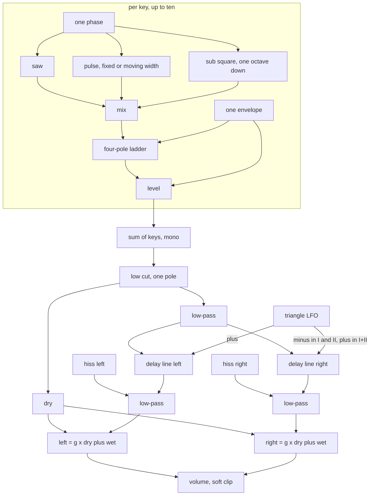

# Dusk Chorus Polysynth - Plan

## Goal Capsule

- **Objective:** A musician using Ambient Town can load an instrument called Dusk and get the eighties chorus-polysynth pad: one plain, perfectly tuned oscillator per key under a wide, slightly dark, slightly noisy two-line chorus, with ten knobs and five ambient presets that sound right the moment they load.
- **Means:** One new spec device `dusk` on `cpp/kit`, built by `docs/recipes/adding-a-spec-device.md`, with a native harness that measures each trait (KTD1 to KTD11).
- **Authority order:** the builder's brief and task file (the owner's request and the integrator's decisions) → this Product Contract (R-IDs) → Planning Contract (KTDs) → unit text → repo conventions.
- **Execution profile:** One pipeline run with no human present. Work only inside this clone on branch `device/dusk`. The clone has no remote: commits are local, nothing is pushed, no pull request is opened.
- **Stop conditions:** Stop and report when a session-settled decision cannot work (`settled-decision-invalidated`), when the device cannot be brought under 5 % of real time with eight notes without `experimental: true`, or when the kit, the test support or the scripts would have to change.
- **Tail ownership:** The integrator collects the branch, regenerates the shared lists, adds the factory categories, re-measures cost on a quiet machine and plays the instrument in the app.

---

## Product Contract

### Summary

Add the instrument `dusk` ("Dusk") to live-mix: an eighties chorus polysynth in the style of the Juno-60, voiced for ambient pads.
It ships with its `.wasm`, a harness that measures the traits a listener knows the instrument by, at least five device presets, a description on every parameter and five factory presets.

### Problem Frame

The library has a detuned two-oscillator pad synth (`ember`) and a three-line string ensemble (`string-machine`), but not the single-oscillator chorus poly that much bedroom ambient is made on.
The owner asked for it by name.
Its sound is the chorus: a generic sine-LFO chorus over a detuned synth does not produce the steady detune-then-swap of two triangle-modulated lines over a crystal-locked oscillator.
Nobody can listen in this environment, so every claim about the sound has to be a measurement.

### Key Decisions

- **Ten-knob surface.** The parameter list is the ten-knob cut of the research brief. (session-settled: user-directed — chosen over the "Weight + Decay" swap for plucks: pads matter more than plucks for ambient.) Governs R2, R3.
- **Ten voices.** (session-settled: user-directed — chosen over six voices like the original: long ambient releases steal audibly at six.) Governs R9.
- **Factory presets are pads without a second chorus.** Category `pad`, existing effects only, never a chorus effect. (session-settled: user-directed — chosen over stacking the Chorus effect: the built-in chorus is the sound.) Governs R15.

### Requirements

**Sound**

- R1. Each key plays one oscillator whose sawtooth, pulse and sub-octave square all read the same phase, with no drift and no detune between keys.
- R2. The parameters are `wave`, `sub`, `lowCut`, `cutoff`, `resonance`, `envelope`, `attack`, `release`, `chorus`, `volume`, in that order, with the choices, ranges and defaults of `/home/claude/research/synths.md` section 1.5 unless a KTD records a change.
- R3. Every parameter changes the sound audibly across its whole range, and its `description` says in one or two plain sentences what turning it does.
- R4. The low-pass has four poles, follows the keyboard fully, and sings a clean sine at the cutoff when `resonance` is at its top.
- R5. One envelope per key shapes both level and filter.
- R6. `lowCut` is one non-resonant 6 dB per octave high-pass on the sum of the keys, with four positions.
- R7. The chorus has modes Off, I, II and I+II built from exactly two delay lines and one triangle LFO, with the rates and sweeps of the research table, an equal dry and wet sum, a darker wet path, and hiss that stops when the instrument goes idle.
- R8. With the chorus Off the output is mono: left equals right sample for sample.

**Playing**

- R9. Up to ten keys sound at once. Stealing a voice, re-striking a held key, releasing a key and moving `cutoff` or `chorus` while sounding do not click.
- R10. Tuning is within ±3 cents from C2 to C6 at 44.1, 48 and 96 kHz.
- R11. One note at gain 0.7 peaks between −24 and −10 dBFS at the default volume, one note at gain 0.8 between about −22 and −16 dBFS, and ten held notes stay under the soft-clip knee region.
- R12. A sawtooth at C6 with the filter open has inharmonic energy at least 50 dB below its fundamental.

**Library fit**

- R13. The device keeps every rule of `docs/recipes/adding-a-spec-device.md`: no allocation, bit-identical re-init, smoothing, block-size independence, sleep to exact zero, bounded under 96 stacked notes, bad input survivable.
- R14. Eight held notes cost under 5 % of real time in the wasm smoke without `experimental: true`.
- R15. The device has at least five presets in plain words with no brand or artist names, the first being the default patch, and the bank has exactly five factory presets for it in `src/dsp/factory/presets/dusk.ts`.
- R16. The harness measures at least eight traits beyond conformance, each with a tolerance that fails when the trait is missing.
- R17. `origin.note` names the modelled instrument and the research, says what is simplified, which figures are choices rather than measurements, and that this is not a circuit or sample emulation.

### Scope Boundaries

Not built, on purpose:

- LFO vibrato with delay, noise source, range switch, VCA gate mode, envelope to pulse width, hold, arpeggiator, portamento. The research brief leaves them out of the ten-knob cut.
- Separate decay and sustain controls. Decay follows `release` and sustain is fixed (KTD5), so short plucks are not available.
- Saturation on the chorus wet path. The research marks it optional; left out to keep the wet path free of intermodulation and the cost low. Evidence that would change the call: a listening test that finds the chorus too clean.
- A compander or a bucket-brigade clock model. The chorus is a fractional delay with band-limiting filters (KTD6).
- Edits to `cpp/kit`, `cpp/test/support`, `scripts`, other devices, `docs/devices.md`, `docs/factory.md`, `CHANGELOG.md`, `.changeset`, `package.json`.

---

## Planning Contract

### Key Technical Decisions

- KTD1. **A local oscillator produces all three waves from one phase.** `kit::BlepOsc` advances its phase on every call, so three calls would give three phases. A small class in the device directory holds one phase and returns saw, pulse and sub, each corrected with PolyBLEP at its edges, with the pulse's DC removed. Start phase is random per note from a seeded generator.
- KTD2. **A local four-pole ladder, not `kit::Ladder` as it stands.** `kit::Ladder` clamps resonance to a loop gain of exactly 4, where a saturating loop cannot hold an oscillation, and it applies its `tanh` to the input as well as the feedback. The device needs loop gain a little above 4 at the top of `resonance`, a low drive so the pass band stays clean, input make-up for about half of the resonance loss in decibels, and a cutoff that glides between control ticks. The local filter keeps the kit's structure (four TPT one-poles, feedback solved without a unit delay, saturation in the loop). The kit is not edited.
- KTD3. **Key follow is fixed at 100 % around middle C.** `cutoff` is the corner at C4 and scales with the played frequency, so brightness is even from C2 to C6 and the singing filter plays in tune. The "Singing filter" preset sets the cutoff to an exact octave of middle C.
- KTD4. **Envelope amount spans ±6 octaves.** `envelope` moves the cutoff by up to six octaves at the envelope's peak, upward to the right and downward to the left. Six octaves is a choice.
- KTD5. **Decay follows release and sustain is 70 %.** `kit::Adsr` with decay time equal to `release` and sustain 0.7. Both are choices from the research brief.
- KTD6. **The chorus is two Hermite-read delay lines moved by one triangle LFO.** (session-settled: user-directed — chosen over reusing a generic sine-LFO chorus or the three-phase ensemble: the chorus is the instrument's identity.) Governs R7, R8.
  - Mode I: 0.513 Hz, 1.66 to 5.35 ms, right line in opposite polarity to the left.
  - Mode II: 0.863 Hz, same sweep, opposite polarity.
  - Mode I+II: 9.75 Hz, 3.3 to 3.7 ms, same polarity on both sides, so the wet signal is mono.
  - The mono input passes a two-pole low-pass before the lines and each wet side passes another after, both near 8 kHz (a choice).
  - Output is `g × (dry + wet)` per side with `g` near 0.7; with the chorus Off the wet gain lands exactly on zero.
  - A mode change glides rate, centre, depth and polarity and crossfades the wet gain. The delay time never jumps.
- KTD7. **Hiss is tied to sounding voices.** Independent white noise per side enters the wet path before its low-pass, near −72 dBFS RMS at the default volume (a choice). Its gain follows "any voice sounding" with a short fade and lands exactly on zero, so `kit::IdleGate` can put the device to sleep.
- KTD8. **Waking from sleep restarts the LFOs and the hiss generator.** The exact sample at which the device falls asleep depends on the host's block size. Resetting both LFO phases and reseeding the noise on wake makes everything after a silence identical at every block size.
- KTD9. **A stolen voice fades out before the new note starts.** The stolen voice ramps to zero over about 3 ms, then restarts with the new note. A held key struck again releases its old voice over 20 ms and takes a new one, as `string-machine` does.
- KTD10. **Moving pulse uses one shared triangle LFO.** About 0.6 Hz, sweeping the width one-sidedly from 50 % to 88 %. Rate and range are choices.
- KTD11. **Low cut corners are 120, 350 and 800 Hz.** Position 0 is flat apart from a 10 Hz corner that blocks DC. The research has no confident figures for the original, so these are choices.

### High-Level Technical Design

Mode changes: `chorus` sets targets for rate, centre delay, depth, right-side polarity and wet gain. Each glides over a few tens of milliseconds. Wet gain 0 is exact, which is what makes Off mono.

### Assumptions

- No human answers questions in this run, so every unsettled figure below is decided here and named as a choice in `origin.note`.
- The chorus rates and sweeps are the research brief's recollection of a public measurement, marked "likely" there. They are design targets, not measurements made for this work.
- The I+II mode is modelled mono in its wet path, as the research table states. That leaves only uncorrelated hiss in the side signal in that mode.
- `cutoff` runs 40 Hz to 18 kHz at middle C, `attack` 1 ms to 8 s, `release` 2 ms to 12 s. The attack range is extended past the original's 3 s for ambient use, as the research suggests.
- Note gain maps to level only: half of the level is fixed and half follows gain.
- The factory category stays `pad` for all five factory presets.
- External research was not run. The request supplies the research brief and bars opening web pages, and the repository has a strong local pattern for spec devices.
- Pulse-width, low-cut and filter figures the research marks "unsure" stay choices.

### Sources

- `docs/recipes/adding-a-spec-device.md`: the device contract and the harness contract.
- `cpp/devices/string-machine/string_machine.h`, `cpp/test/string_machine_test.cpp`: the reference instrument and harness.
- `cpp/kit/filters.h` (`Ladder`, `Biquad`, `OnePole`), `cpp/kit/osc.h` (`BlepOsc`), `cpp/kit/delay.h`, `cpp/kit/env.h`, `cpp/kit/voices.h`, `cpp/kit/idle.h`, `cpp/kit/smooth.h`: the blocks used or mirrored.
- `cpp/test/support/test_kit.h`: `check_instrument` has no block-size check, so the harness adds its own.
- `docs/factory.md`, `src/dsp/factory/presets/string-machine.ts`: factory preset shape, limits and the bench.
- Research brief: `/home/claude/research/synths.md` section 1 (outside this repository), and the builder's brief `/home/claude/research/BUILD-BRIEF.md`.

---

## Implementation Units

### U1. Manifest and generated files

- **Goal:** `cpp/devices/dusk/device.json` describes the instrument, and the generator produces its parameter table and bindings.
- **Requirements:** R2, R3, R15, R17
- **Dependencies:** none
- **Files:** `cpp/devices/dusk/device.json`, generated `cpp/devices/dusk/params.gen.h`, `cpp/devices/dusk/device_api.gen.cpp`, `src/dsp/devices/dusk.gen.ts`
- **Approach:** Category `instrument`, class `Dusk`, header `dusk.h`. Ten parameters per R2 with descriptions. `wave` choices: Saw, Square, Saw + Square, Moving pulse, Saw + Moving pulse. `lowCut` and `chorus` are `choices` parameters. Presets: Soft strings (default), Wide pulse, Sub floor, Singing filter, Slow bloom, Shimmer organ. `origin.note` per R17.
- **Patterns to follow:** `cpp/devices/string-machine/device.json`.
- **Test scenarios:**
  - Every parameter has a description: `src/react/__tests__/param-descriptions.test.ts` passes.
  - The first preset equals the parameter defaults.
- **Verification:** The generator writes the three generated files without error.

### U2. Voice: oscillator, ladder, envelope

- **Goal:** One key sounds as R1, R4 and R5 describe, in tune and without audible aliasing.
- **Requirements:** R1, R4, R5, R9, R10, R12
- **Dependencies:** U1
- **Files:** `cpp/devices/dusk/dusk_osc.h`, `cpp/devices/dusk/dusk_ladder.h`, `cpp/devices/dusk/dusk.h`, `cpp/test/dusk_test.cpp`
- **Approach:** KTD1 for the oscillator, KTD2 to KTD4 for the filter, KTD5 for the envelope, KTD9 for stealing and re-striking, KTD10 for the moving pulse. Wave changes crossfade the saw and pulse gains. Control-rate work runs on `kit::ControlClock`.
- **Execution note:** Write each measurement next to the trait it proves, and check that the measurement fails when the trait is removed (for example a free-running sub, or a loop gain of exactly 4).
- **Patterns to follow:** `kit::BlepOsc` residuals, `kit::Ladder` structure, `StringMachine::note_on`.
- **Test scenarios:**
  - Pitch: notes from C2 to C6 at 44.1, 48 and 96 kHz measure within ±3 cents, chorus Off.
  - No drift: two keys on one pitch for 5 s, chorus Off: windowed level varies by under 0.5 dB.
  - Saw spectrum: filter open, harmonic n sits at −20·log10(n) dB within ±1.5 dB for n up to 10.
  - Square: even harmonics at least 30 dB below the neighbouring odd ones.
  - Sub lock: with `sub` up there is a component at exactly half the note frequency whose level and phase against the fundamental stay constant over 5 s.
  - Moving pulse: harmonic 2 falls to a null once per LFO period and rises between.
  - Filter slope: cutoff 500 Hz at middle C, resonance 0: the response falls 24 dB per octave (±3) between two and four octaves above the corner.
  - Self-oscillation: resonance at the top with the oscillator filtered away gives one tone within ±20 cents of the expected pitch, harmonics 2 and 3 at least 30 dB down, at a low and a high key.
  - Envelope: minimum attack reaches 90 % in under 5 ms with no click; maximum release measures an RT60 over 8 s; `envelope` right opens the filter with the envelope and left closes it.
  - Aliasing: a C6 saw with the filter open has every predicted fold-back component at least 50 dB below the fundamental.
  - Clicks: stealing with eleven keys, re-striking a held key, and note off produce no step larger than the signal's own slope allows.
- **Verification:** The native harness passes these checks.

### U3. Shared path: low cut, chorus, hiss, output, sleep

- **Goal:** The sum of the keys passes the low cut and the chorus and leaves at the right level, and the device sleeps to exact zero.
- **Requirements:** R6, R7, R8, R9, R11, R13
- **Dependencies:** U2
- **Files:** `cpp/devices/dusk/dusk_chorus.h`, `cpp/devices/dusk/dusk.h`, `cpp/test/dusk_test.cpp`
- **Approach:** KTD11 for the low cut, KTD6 for the chorus, KTD7 for the hiss, KTD8 for wake. Storage is sized for 96 kHz. The output ends in `kit::soft_clip`.
- **Patterns to follow:** `StringMachine::process` for the idle gate and the output stage.
- **Test scenarios:**
  - Low cut: the level of a 55 Hz fundamental falls step by step from position 0 to 3, and at position 3 the loss between 55 and 110 Hz differs by 6 dB (±1.5).
  - Off is mono: left equals right sample for sample.
  - Rate: the side signal's pattern repeats every 1.95 s in mode I, 1.16 s in mode II, and at 9.75 Hz in mode I+II (measured on one channel, where the wet copy moves against the dry), each within ±5 %.
  - Detune: with the singing filter near 1 kHz, the wet copies sit about ±6.5 cents from the dry tone in mode I and ±11 cents in mode II, within a half cycle of the LFO.
  - Opposition: in a half cycle where the left wet copy is flat the right is sharp, and they swap in the next. In mode I+II the side signal holds only hiss.
  - Width without cancellation: on a held chord in modes I and II the left-right correlation is under 0.9 and the mid level is at least 6 dB above the side level.
  - Darker wet path: a harmonic near 12 kHz is at least 12 dB lower in the side signal, relative to 1 kHz, than in the dry signal.
  - Hiss: in mode I+II, where the wet signal is mono, the side signal of a held note is noise near the chosen level, and the two sides' noise is uncorrelated. With the chorus Off there is none. After release the output is exactly zero.
  - Mode change and cutoff sweep while sounding produce no step.
  - Block size: the same phrase, including a silence long enough to sleep, renders identically at 128 frames, 1 frame and ragged blocks.
  - Levels: R11's three figures.
- **Verification:** The native harness passes, including `check_instrument` conformance.

### U4. WebAssembly build and cost

- **Goal:** `src/dsp/wasm/dusk.wasm` exists, passes the smoke and meets the cost budget.
- **Requirements:** R13, R14
- **Dependencies:** U3
- **Files:** `src/dsp/wasm/dusk.wasm`
- **Approach:** Build with the repository's inner loop for one device. If cost is near the limit, re-run the smoke and keep the best figure; cut work in the voice loop before considering anything else.
- **Test scenarios:**
  - The wasm smoke passes: exports, silence when idle, sound when played, parameter extremes finite.
  - Eight held notes cost under 5 % of real time, aiming under 3 %.
- **Verification:** The smoke prints its cost line under the budget.

### U5. Factory presets and shared lists

- **Goal:** Five factory presets for Dusk sit inside the bank's limits.
- **Requirements:** R15
- **Dependencies:** U4
- **Files:** `src/dsp/factory/presets/dusk.ts`, `src/dsp/factory/presets/index.ts`, generated shared lists (`src/dsp/devices/index.gen.ts`, `scripts/devices.gen.sh`, `docs/devices-generated.md`)
- **Approach:** Export `DUSK_PRESETS`, register it in the index, and refresh the shared lists with the generator. Each preset is the instrument plus one to four existing effects (reverbs, tape, tape echo), category `pad`, with `preview` chosen to suit the sound. Ids and names are unique across the bank. Levels are tuned with the bench in `docs/factory.md` using the instrument's volume or an effect's mix.
- **Patterns to follow:** `src/dsp/factory/presets/string-machine.ts`.
- **Test scenarios:**
  - `src/dsp/factory/__tests__/factory.test.ts` passes with the five presets registered.
  - No factory preset for Dusk uses the `chorus` effect.
- **Verification:** The factory test and the parameter-description test pass; typecheck, prettier and eslint are clean on the written files.

---

## Verification Contract

| Gate | Command | Proves |
|---|---|---|
| Native harness, wasm build, smoke | `source /home/claude/emsdk/emsdk_env.sh >/dev/null 2>&1; CXX=g++ bash scripts/dev-device.sh dusk` | U1 to U4 |
| Shared lists | `node scripts/gen-devices.mjs` | U5 |
| Descriptions and bank limits | `pnpm vitest run src/react/__tests__/param-descriptions.test.ts src/dsp/factory/__tests__/factory.test.ts` | U1, U5 |
| Bench for level tuning | `FACTORY_REPORT=presets FACTORY_DEVICE=dusk pnpm vitest run src/dsp/factory/__tests__/report.test.ts` | U5 |
| Types | `pnpm typecheck` | U5 |
| Format and lint | `npx prettier --check` and `npx eslint` on the written files | U1, U5 |

Do not run `scripts/test-native.sh` or the whole `pnpm test`.
There are no ears in this environment: every claim about the sound rests on the measurements above.

---

## Definition of Done

- Every requirement R1 to R17 is met and the gates in the Verification Contract pass in this clone.
- The harness holds at least eight behaviour measurements beyond conformance, each shown to fail when its trait is removed or stated why that was not checked.
- The wasm smoke cost line with eight notes is under 5 % of real time.
- No file outside the allowed set is edited by hand, and no experiment or abandoned attempt is left in the diff.
- The work is committed on `device/dusk`. Nothing is pushed.
- Deviations from the research brief, and review findings not applied, are listed in the final report.
