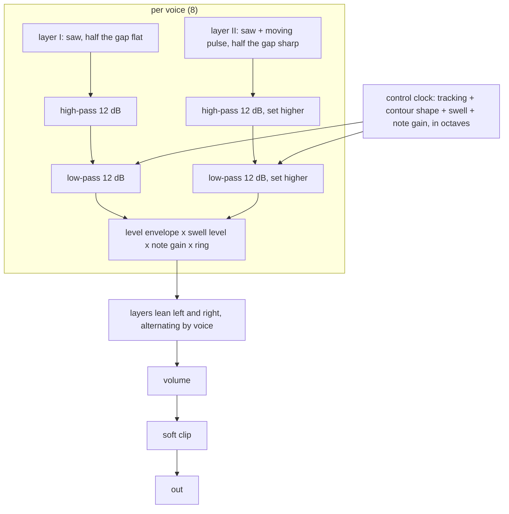

# Aurora Dual-Layer Brass and String Pad - Plan

## Goal Capsule

- **Objective:** An ambient musician can load one new instrument, Aurora, and play the slow film-score brass swell and the wide beating string pad: notes that start dark, speak with a "bwaah", and keep opening while a key is held.
- **Means:** A spec device `aurora` on `cpp/kit` with two filtered layers per voice, a three-point filter contour and a held-note swell (KTD1, KTD2, KTD3).
- **Authority:** `/home/claude/research/BUILD-BRIEF.md` (the quality bar) over `/home/claude/research/tasks/aurora.md` (the instrument's decisions) over `/home/claude/research/synths.md` section 2 (the grounding) over this plan. `docs/recipes/adding-a-spec-device.md` governs how a device is built.
- **Execution profile:** One device in one clone on branch `device/aurora`. No remote: commits are local, nothing is pushed, no pull request is opened.
- **Stop conditions:** Stop and report if the device cannot hold eight notes under 5 % of real time in the WASM smoke without `experimental: true`, or if a settled decision below proves infeasible.
- **Who finishes:** The integrator collects the branch, regenerates the shared lists, adds the changelog entry and plays the instrument in the app.

---

## Product Contract

### Summary

Add the instrument `aurora` ("Aurora") to live-mix: a dual-layer brass and string pad in the style of the late-seventies two-channel polysynths.
Each of eight voices plays two layers, and each layer runs through its own 12 dB high-pass and 12 dB low-pass in series.
A contour starts the low-pass below its resting point and overshoots it, a swell keeps raising level and brightness while a key is held, the layers beat against each other by the Detune amount, and a ring modulator sweep can colour the start of a note.
It ships with a native harness that measures those traits, its `.wasm`, six device presets, a description on every parameter, and five factory presets.

### Problem Frame

The app has one subtractive pad synth (Ember) with a single state-variable filter and plain ADSRs.
It cannot make the brass swell that defines cinematic ambient: two gentle resonant filters in series forming a movable band, a filter that starts low and overshoots, and a note that keeps growing as if the player leaned into the key.
The research (`synths.md` 2.4) names what makes an imitation sound fake: one filter with a plain ADSR, and perfect tuning.
Nobody can listen in this environment, so every claim about the sound has to be a measurement in the harness.

### Key Decisions

- **Ten-knob cut of research section 2.5** (session-settled: user-directed — chosen over a generic two-oscillator panel with wave selectors and separate envelopes: the app already has Ember, and the filters, contour and swell are the identity). Governs R1, R2, R3, R4, R5, R6, R12.
- **Eight voices** (session-settled: user-directed — chosen over 12 or 16 voices: it matches the original and the CPU budget). Governs R8, R17.
- **Factory presets under `pad`, five of them** (session-settled: user-directed — chosen over `string` or a new category: the integrator decided the bank layout). Governs R15.
- **Foundation files stay untouched** (session-settled: user-directed — chosen over extending the kit: fourteen builders work in parallel and an integrator merges). Governs R18.
- **No filter-bypassing sine.** The research lists a post-filter sine as part of the model, but the ten-knob cut has no control for it and a fixed sine refills exactly what Low cut removes, which contradicts the research's own band-shape check (2.7 item 5). Governs R2.

### Requirements

**Sound**

- R1. Each voice plays two layers: layer I a sawtooth, layer II a sawtooth plus a slowly moving pulse, both band-limited.
- R2. Each layer passes through its own 12 dB per octave high-pass (Low cut) and then its own 12 dB per octave low-pass (Brilliance), both with the Resonance amount.
- R3. Contour makes the low-pass start below its resting point at note-on, reach a peak above it at the Attack time, and settle back to the resting point. At zero the low-pass does not move.
- R4. Swell makes a held note keep rising in level and brightness after the attack. At zero a held note is steady.
- R5. Detune sets the tuning gap between the layers, symmetric about the played pitch, and scales how far each voice sits and wanders from the others. At zero every layer of every voice is exactly in tune.
- R6. Ring adds a ring modulator whose frequency sweeps down and whose depth fades after each note starts. At zero there is no ring modulation.
- R7. Note gain raises both level and brightness.
- R8. Eight voices. A stolen voice fades out over about 3 ms before the new note starts; a re-struck key lets the old voice go quickly.
- R9. The output is stereo with the layers leaning to opposite sides, and it stays mono-compatible.

**Conformance**

- R10. The device keeps every rule of `docs/recipes/adding-a-spec-device.md` and the quality bar of the build brief: no allocation, bit-identical re-init, smoothing, block-size independence, sleep to exact zero, bounded output through `kit::soft_clip`, survivable bad input.
- R11. Pitch is within ±3 cents from C2 to C6 at 44.1, 48 and 96 kHz with Detune at zero, and the centre of the two layers is within ±3 cents at the default Detune.
- R12. At most ten parameters including `volume`, each with a one- or two-sentence description, and no brand or model name outside `origin.note`.
- R13. One note at gain 0.7 peaks between -24 and -10 dBFS at the default volume, one note at gain 0.8 between -22 and -16 dBFS, and ten held notes stay under the clip knee.
- R14. Inharmonic energy at C6 is at least 50 dB down with Ring at zero.
- R17. Eight held notes cost under 5 % of real time in the WASM smoke, with 3 % as the aim.

**Deliverables**

- R15. Five factory presets in `src/dsp/factory/presets/aurora.ts`, exported as `AURORA_PRESETS`, each the instrument plus one to four existing effects, inside the bank's level limits.
- R16. At least five device presets with plain names, the first being the default patch.
- R18. Nothing under `cpp/kit`, `cpp/test/support`, `scripts`, another device, `docs/devices.md`, `docs/factory.md`, `CHANGELOG.md`, `.changeset` or `package.json` is edited by hand. The shared generated lists that `node scripts/gen-devices.mjs` rewrites are the one exception; the integrator regenerates them.

### Scope Boundaries

- No chorus, ensemble or reverb inside the device: the app has those as effects, and the factory presets add them.
- No wave selector, no noise source, no sub oscillator (the vibrato LFO), no pitch ribbon.
- Considered and not built: a filter-bypassing sine (see Key Decisions). A request for a body control with a free knob slot would change the call.
- Considered and not built: keyboard-follow and layer-balance controls. The fixed values in KTD2 stand in for them.

#### Deferred to Follow-Up Work

- Regenerating the shared device lists across all fifteen instruments, the changelog entry and `docs/devices.md` belong to the integrator.
- Playing the instrument in the app in a browser belongs to the integrator.

---

## Planning Contract

### Key Technical Decisions

- KTD1. **Two filter pairs per voice, voiced apart.** Layer II's low-pass sits a fixed interval above layer I's and its high-pass a fixed interval above layer I's, and layer II is a little quieter. Two identical linear filter pairs would equal one pair on the sum; voicing them apart is what makes the second pair audible, and it gives a darker brass body under a brighter string layer. Far above both corners the sum still falls 12 dB per octave, so R2 stays measurable. The intervals are choices recorded in `origin.note`.
- KTD2. **Fixed half keyboard tracking on both corners**, pivoting at middle C. Without it C2 is buzzy and C6 is dull at one Brilliance setting; full tracking would stop Low cut from thinning low notes more than high ones. The amount is a choice.
- KTD3. **Contour and swell are computed in octaves on the control clock.** The low-pass offset is the sum of four terms: keyboard tracking, Contour times a per-voice shape, Swell times a per-voice swell state, and a note-gain term. The shape rises linearly in octaves from its start value to its peak over the Attack time, then decays exponentially to zero; on release it glides toward the start value. The swell state rises toward one with a fixed time constant once the level attack is done and holds on release. Depths and time constants are choices recorded in `origin.note`.
- KTD4. **Swell lowers where the note starts instead of raising where it ends.** The plateau level is the same at every Swell setting, so R13 and the factory level limits do not move with the knob.
- KTD5. **Detune is symmetric and scatter is a fixed per-voice table.** Layer I sits half the gap below the note and layer II half above, so the centre is in tune (R11). Each voice adds a fixed offset from a zero-sum table and each layer a slow `kit::Drift`, both scaled by Detune so that zero means exactly in tune (R5). Layer II's start phase offset also scales in over the first few cents, so zero Detune gives a plain doubling and not a random comb.
- KTD6. **Ring modulation is per voice.** Each voice multiplies its output by a table sine whose frequency sweeps down a fixed range while its depth fades, with a decay time tied to Attack so a slow patch does not hide it. Per voice, a new note rings without disturbing notes already held. The products of a band-limited voice and a sine below about 1.4 kHz can only fold back into the top 1.4 kHz of the band, which is above hearing at every supported rate.
- KTD7. **Steals use a pending note.** A stolen voice keeps its old note, fades with a 3 ms fast release, and starts the new note when the fade ends. While pending it reports itself as held so `note_off` can find and cancel it.
- KTD8. **Control period of 16 samples** for filter coefficients, pitch ratios and envelopes of the modulation; per-sample smoothing for voice gain, ring depth, pulse width and volume. On waking from sleep the control clock restarts and control-rate smoothers snap, as `cpp/devices/choir/choir.h` does, so the output does not depend on block size.
- KTD9. **Kit blocks only.** `kit::BlepOsc`, `kit::Svf`, `kit::Adsr`, `kit::Drift`, `kit::Smoother`, `kit::VoicePool`, `kit::ControlClock`, `kit::IdleGate`, `kit::SineTable`, `kit::soft_clip`. No new kit block is needed; the contour, swell and ring envelopes are a few lines of device code.

### High-Level Technical Design

A voice's life: idle, attack (level rises, contour rises from start to peak), held (contour decays to rest, swell rises), release (level falls, contour glides back toward its start, swell holds), idle. A steal inserts a 3 ms fade before attack.

### Assumptions

- The Attack knob times both the level attack and the contour rise, as research 2.5 states; the contour decay time follows Attack with a floor.
- The contour moves the low-pass only. The research's model (2.4 item 2) describes one cutoff; whether the original's envelope also moved the high-pass is not established.
- Per-voice scatter stays near ±2 cents at the default Detune so a single note is still within ±3 cents of pitch.
- The swell time constant, contour depths, ring sweep range, layer voicing intervals, pulse-width rates and tracking amount are choices, not measurements of the original, and `origin.note` says so.
- The app's level window (-22 to -16 dBFS at gain 0.8) is read as the peak of a held note over its first seconds, so the swell's start and plateau both have to sit inside it at the default patch.
- Nobody can listen here: everything is verified by measurement.

### Risks

- **Cost.** Three band-limited oscillators and four filters per voice with coefficient updates every 16 samples. If the smoke reads near 5 %, lengthen the control period to 32 before touching the voice structure.
- **Level spread across settings.** Resonance and Brilliance change peak level. A resonance trim on the voice gain and per-preset `volume` values keep presets inside the limits; the harness checks the default patch and the bench checks the factory presets.
- **Zipper at the shortest attack.** A five-octave contour over 5 ms is a large step per control tick. The click test moves Brilliance in jumps; if it fails, smooth the coefficient targets per sample.

### Sources

- `/home/claude/research/synths.md` section 2 (model 2.4, knobs 2.5, presets 2.6, acceptance checks 2.7) and section 3 (why not another generic two-oscillator synth).
- `docs/recipes/adding-a-spec-device.md`.
- `cpp/devices/string-machine/string_machine.h` and `cpp/test/string_machine_test.cpp` for the instrument idiom.
- `cpp/devices/choir/choir.h` for the wake-from-sleep pattern and control-rate smoothers.
- `cpp/test/organ_test.cpp` for the spectrum helpers (power spectrum, off-grid share, beat rate) and `cpp/test/fm_glass_test.cpp` for the click-test idiom.
- `src/dsp/factory/presets/string-machine.ts` and `docs/factory.md` for factory presets and the bench.

---

## Implementation Units

### U1. Manifest

- **Goal:** `cpp/devices/aurora/device.json` with the ten parameters, six device presets and the origin note.
- **Requirements:** R12, R16; Key Decisions (ten-knob cut).
- **Dependencies:** none.
- **Files:** `cpp/devices/aurora/device.json`; generated: `cpp/devices/aurora/params.gen.h`, `cpp/devices/aurora/device_api.gen.cpp`, `src/dsp/devices/aurora.gen.ts`.
- **Approach:** Parameters in order: `brilliance` (Hz, log), `lowCut` (Hz, log), `resonance`, `contour`, `attack` (s, log), `swell`, `release` (s, log), `detune` (ct), `ring`, `volume` (dB). Presets: Slow brass (the default patch), Soft horns, Wide strings, Night choir, Metal dawn, Slow bloom. `origin.kind` is `new`; the note names the instrument family and the research, lists the simplifications and the choices of KTD1 to KTD6, and says it is not a circuit or sample emulation.
- **Patterns to follow:** `cpp/devices/string-machine/device.json`.
- **Test scenarios:** Test expectation: none -- the manifest is data; `src/react/__tests__/param-descriptions.test.ts` covers the descriptions once U4 registers the device.
- **Verification:** The generator accepts the manifest and writes the three generated files.

### U2. The device

- **Goal:** `cpp/devices/aurora/aurora.h`: class `Aurora` with the voice of KTD1 to KTD8.
- **Requirements:** R1 to R11, R13, R14, R17.
- **Dependencies:** U1.
- **Files:** `cpp/devices/aurora/aurora.h`.
- **Approach:**
  1. `init` resets the pool, every voice, the seeds of drift, pulse-width phase and start phases, the smoothers, the control clock and the idle gate.
  2. `note_on` validates the frequency and gain, fast-releases a re-struck key, takes a voice from the pool and either starts it (fresh) or marks it pending (stolen), per KTD7.
  3. The control tick updates envelope times, pitch ratios, pulse width target, contour shape, swell state, ring envelope, voice gain target and the four filter coefficients of each sounding voice (KTD3, KTD5, KTD6).
  4. The sample loop renders both layers through their filters, applies the smoothed gain and ring factor, pans the layers and sums; volume and `kit::soft_clip` follow.
  5. The voice gain constant and the default `volume` are calibrated by measurement to R13.
- **Patterns to follow:** `cpp/devices/string-machine/string_machine.h` (structure), `cpp/devices/choir/choir.h` (wake, control-rate smoothers).
- **Test scenarios:** covered by U3, which is written alongside this unit.
- **Verification:** The native harness of U3 passes and the WASM smoke prints a cost under the budget.

### U3. The native harness

- **Goal:** `cpp/test/aurora_test.cpp` measuring the traits that make this instrument.
- **Requirements:** R1 to R11, R13, R14.
- **Dependencies:** U1, U2.
- **Files:** `cpp/test/aurora_test.cpp`.
- **Approach:** `check_instrument` first, then the behaviour checks below, then `report_cost` with eight notes held. Measurements that need a clean harmonic grid set Detune and Ring to zero; ratios against a second render of the same note cancel the level envelope and the moving pulse.
- **Patterns to follow:** `cpp/test/string_machine_test.cpp`, the spectrum helpers of `cpp/test/organ_test.cpp`.
- **Test scenarios:**
  - Pitch: C2, A4 and C6 at 44.1, 48 and 96 kHz with Detune 0 are within ±3 cents; at the default Detune the mean of the two layer peaks at a high harmonic is within ±3 cents.
  - Layer beat: A3 with Detune 10 shows a level fluctuation on the fundamental at 1.27 Hz ± 0.1 (which places layer II within ±1 cent of its gap); Detune 20 doubles the rate; Detune 0 holds the level steady within 0.5 dB.
  - Voice scatter: the same pitch on two different voices differs by 1 to 6 cents at Detune 12 and by under 0.1 cent at Detune 0.
  - Low-pass slope: with Contour and Swell at 0, the response relative to an open filter falls 12 dB per octave ± 2 between two and three octaves above the corners.
  - High-pass slope: the response relative to Low cut at its minimum rises 12 dB per octave ± 2 between three and two octaves below the corners.
  - Band shape: Low cut 400 Hz and Brilliance 1.5 kHz at C2 put the fundamental at least 18 dB below the strongest harmonic.
  - Resonance: raising it lifts the harmonic nearest the low-pass corner by at least 6 dB against Resonance 0.
  - Contour: the effective cutoff, in octaves against the same note with Contour 0, starts below zero by the predicted amount ± 0.3, peaks above zero by the predicted amount ± 0.3 at the Attack time ± 20 %, and is back within 0.15 of zero later; with Contour 0 it stays within 0.1 throughout.
  - Swell: with Swell 0.7 the level at 4 s is at least 1.5 dB above the level at 1 s and the effective cutoff is higher; with Swell 0 the two levels agree within 1 dB.
  - Ring: with Ring up and a short attack, the share of power off the harmonic grid is large in the first 300 ms and at least 50 dB down after the ring envelope has passed; with Ring 0 it is at least 50 dB down from the start.
  - Velocity: a note at gain 1 is louder and brighter than the same note at gain 0.3.
  - Aliasing: C6 with Brilliance at its maximum, Detune 0 and Ring 0 has off-grid power at least 50 dB down at 44.1 and 48 kHz.
  - Envelope times: a 1 s attack is still quiet at 100 ms and has arrived shortly after 1 s; a 1 s release is 60 dB down after its time and exactly silent soon after.
  - Stereo: on a held chord the left-right correlation is below 0.995 and the mid level is at least 6 dB above the side level.
  - Clicks: a ninth note stealing a voice, a re-struck held key, a note-off and Brilliance jumping between two values each keep `max_step` under 1.5 times the steady signal's.
  - Levels: one note at gain 0.7 peaks between -24 and -10 dBFS, one at gain 0.8 between -22 and -16 dBFS at both 1 s and 6 s, and ten held notes stay under 0.5.
  - Block size: a held chord with a parameter change renders the same in blocks of 128, 1 and ragged sizes (difference under 1e-4), including after the device has slept.
  - Note-off during a pending steal: the stolen note never sounds and the device returns to exact silence.
- **Verification:** `aurora device tests: all passed` and a cost line.

### U4. Factory presets and registration

- **Goal:** Five factory presets and the device registered for the vitest suites.
- **Requirements:** R15, R12.
- **Dependencies:** U1, U2 (the `.wasm`).
- **Files:** `src/dsp/factory/presets/aurora.ts`, `src/dsp/factory/presets/index.ts`, `src/dsp/wasm/aurora.wasm`, and the shared generated lists `node scripts/gen-devices.mjs` rewrites.
- **Approach:** Slow brass and wide strings as film-score and ambient players use them, each with existing effects (a hall or plate, a chorus or tape, a shimmer or echo). Category `pad`; ids and names checked against the whole bank; levels tuned with the bench by the instrument's `volume` or an effect's mix.
- **Patterns to follow:** `src/dsp/factory/presets/string-machine.ts`.
- **Test scenarios:**
  - `src/dsp/factory/__tests__/factory.test.ts` passes: each preset validates, peaks at or below -3 dBFS, has its loudest 400 ms between -36 and -12 dBFS and no DC.
  - `src/react/__tests__/param-descriptions.test.ts` passes: every Aurora parameter has a description that fits the info view.
- **Verification:** Both vitest files pass; the bench lines for the five presets sit near the bank's usual range.

---

## Verification Contract

| Gate | Command | Proves |
|---|---|---|
| Native harness, WASM build, smoke | `source /home/claude/emsdk/emsdk_env.sh >/dev/null 2>&1; CXX=g++ bash scripts/dev-device.sh aurora` | R1 to R11, R13, R14, R17 |
| Descriptions and factory limits | `pnpm vitest run src/react/__tests__/param-descriptions.test.ts src/dsp/factory/__tests__/factory.test.ts` | R12, R15 |
| Factory bench | `FACTORY_REPORT=presets FACTORY_DEVICE=aurora pnpm vitest run src/dsp/factory/__tests__/report.test.ts` | R15 levels |
| Types | `pnpm typecheck` | generated and hand-written TypeScript |
| Format and lint | `npx prettier --check` and `npx eslint` on the files written | repository style |

The whole native suite (`scripts/test-native.sh`) and the whole `pnpm test` are not run: the brief forbids them here.

---

## Definition of Done

- Every gate in the Verification Contract passes in the clone.
- `cpp/devices/aurora/` holds the manifest, the header and the generated files; `cpp/test/aurora_test.cpp`, `src/dsp/devices/aurora.gen.ts`, `src/dsp/wasm/aurora.wasm` and `src/dsp/factory/presets/aurora.ts` exist.
- The harness holds at least eight behaviour checks beyond conformance, each a measurement with a tolerance.
- The WASM smoke cost with eight notes is under 5 % of real time.
- No file named in R18 is changed.
- No experimental or abandoned code is left in the diff.
- The work is committed on `device/aurora`.
