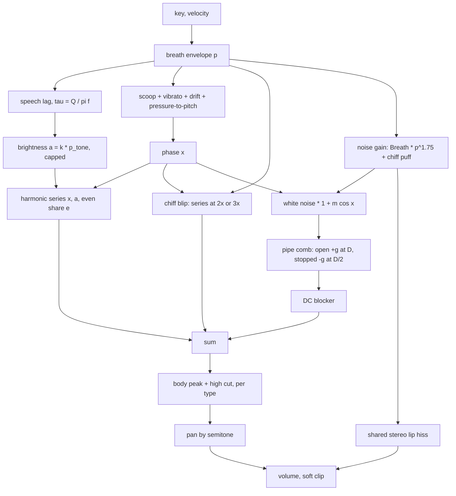
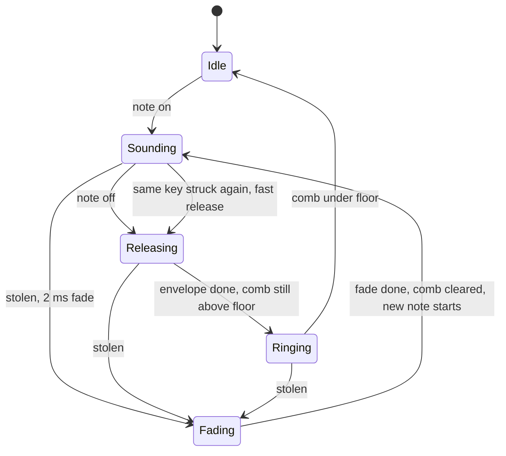

# Flute Device - Plan

## Goal Capsule

- **Objective:** Someone opening the device browser finds a Flute they can play from C2 to C6 that is recognisably blown: breath in the tone, brighter when played harder, slower to speak low down, with a chiff, a small scoop and a vibrato that arrives late, and five ambient factory presets that use it.
- **Means:** an open-loop driven pipe, one kernel header plus one voicing header, on `cpp/kit` (KTD1, KTD2).
- **Authority:** the build brief and the flute task file given with the request, then `docs/recipes/adding-a-spec-device.md`, then this plan. The research brief (`acoustic.md`, "Shared kernel" and section 1; it lives outside this repository) grounds the voicing.
- **Execution profile:** one branch, `device/flute`, no remote. Shipping is local commits only.
- **Stop conditions:** the driven pipe cannot hold tuning or the cost budget (5 % of real time, eight notes, wasm); a rule in the recipe cannot be met without editing `cpp/kit`, `cpp/test/support` or `scripts`.
- **Who finishes:** an integrator collects this branch with fourteen others, regenerates the shared lists, adds the `wind` preset category and auditions every instrument in the app.

---

## Product Contract

### Summary

Add one spec device, `flute` ("Flute"), to live-mix: five flute family members from one model, nine knobs, at least five device presets, a native harness that measures the traits a listener knows a flute by, its `.wasm`, and five factory presets.

### Problem Frame

Nothing in the library is blown. Reed Organ's flute ranks are steady pipes with no breath gesture, Choir's breath is a voice, Atmosphere's wind has no pitch. The flute is the most common acoustic lead in new age and fourth-world ambient music, so the gap is felt first by anyone trying to make that music with the stock instruments.

Nobody can listen in the environment this is built in. Every claim about the sound is therefore a measurement in the harness, and the plan says which measurement proves which trait.

### Requirements

**The instrument**

- R1. A spec device `flute`, name `Flute`, class `Flute`, category `instrument`, eight voices, built by the recipe with no edits to the kit, the test support, the scripts or any other device.
- R2. Five types that differ audibly and measurably: Concert, Low flute, Shakuhachi, Pan pipes, Wood flute.
- R3. At most ten parameters including `volume`; every one has a one or two sentence description, and a knob that waits for the next note says so.
- R4. Names are neutral: no brand, model or artist in ids, names, parameters or presets. `origin.note` names what is modelled, what is simplified and which numbers are choices.
- R5. At least five device presets in plain words; the first is the default patch.

**The traits (each measured in the harness)**

- R6. Tuning within ±3 cents of the key from C2 to C6 at 44.1, 48 and 96 kHz at a mezzo-forte touch.
- R7. Pitch follows breath: a hard note is sharper than a soft one by a few cents, and a released note sags flat as it dies.
- R8. Loud is brighter, inside one note: as breath rises, harmonic h grows faster than the fundamental.
- R9. Breath noise is shaped by the pipe (peaks at the pipe's resonances, valleys between), leads the tone at the attack, and its amount follows the Breath knob from none to mostly air.
- R10. Low notes speak more slowly than high ones.
- R11. Chiff: a puff of air and a flick of the octave (the twelfth on Pan pipes) at the start of a note, scaled by its knob.
- R12. Scoop: a note starts flat by the knob's amount and arrives within a quarter of a second.
- R13. Vibrato fades in after the note has settled, at the type's rate, and moves the upper harmonics more than the fundamental.
- R14. Pan pipes are a stopped pipe: even harmonics far under their odd neighbours, in the tone and in the noise.

**Hygiene**

- R15. The recipe's rules hold: no allocation, bit-identical re-init, block-size independence, sleep to exact zero, bounded under 96 stacked notes, bad input survivable, soft clip last, storage sized for 96 kHz.
- R16. Levels: one note at gain 0.7 peaks between -24 and -10 dBFS at the default volume, at gain 0.8 between -22 and -16 dBFS, and ten held notes stay under the clip knee.
- R17. No audible aliasing: fold-back partials of a high, hard-blown note are at least 50 dB under the fundamental.
- R18. No clicks on voice stealing, re-striking a held key, note off, or moving Breath or Blow while sounding.
- R19. Mono-compatible stereo: the side signal sits under the mid.
- R20. Eight held notes cost under 5 % of real time in wasm; the aim is under 3 %.

**The bank**

- R21. Five factory presets in `src/dsp/factory/presets/flute.ts` (export `FLUTE_PRESETS`), each the instrument plus one to four stock effects, inside the bank's level limits, with ids and names unique across the bank.

### Scope Boundaries

- Not a self-oscillating jet model, and not a sample or circuit emulation (KTD1).
- No finger-hole slides between notes, no overblown register jumps, no key noise.
- No changes to `docs/devices.md`, `docs/factory.md`, `CHANGELOG.md`, `.changeset` or `package.json`; the integrator owns them.
- Considered and not built: a vibrato rate knob (KTD4), per-knob drift amount (drift is fixed and small), a stereo width knob. Evidence that would change the call: the owner asking for them after listening.

#### Deferred to Follow-Up Work

- Lifting `driven_pipe.h` into `cpp/kit` once Horns and Clarinet land (integrator).
- Moving the five factory presets to the `wind` category once it exists (integrator).

---

## Planning Contract

### Key Technical Decisions

- KTD1. **Open-loop driven pipe.** One phase accumulator per voice drives a closed-form harmonic series whose brightness is proportional to breath pressure; breath noise goes through a passive feedback comb tuned to the note. Nothing closes a nonlinear loop, so pitch, harmonic levels, noise shape and attack order are set directly and can be asserted. (session-settled: user-directed — chosen over a self-oscillating jet waveguide: Bow's header records that such loops fell into wrong regimes and random pitches, and their pitch can only be discovered, not set.)
- KTD2. **Kernel in `cpp/devices/flute/driven_pipe.h`, namespace `livemix::flute`, with no flute-only voicing.** It holds the harmonic series (all, odd, mixed), the brightness cap, and the pipe comb. The types' voicing tables and the voice live in `flute.h`. (session-settled: user-directed — chosen over inlining the kernel or adding it to `cpp/kit`: the kit must not be edited, and two sibling instruments build on the same idea and may share it later.)
- KTD3. **Eight voices, at most ten knobs including `volume`, a `type` choice, a line-like default.** (session-settled: user-directed — chosen over a monophonic instrument or a larger panel: chords of flutes are an ambient use, and the owner asked for simple.) The panel this plan ships has nine; KTD4 owns that choice.
- KTD4. **Vibrato rate belongs to the type, not to a knob.** The research panel has ten knobs including rate; this plan ships nine. Rate is a trait of the instrument family (a slow wide shakuhachi, a quicker concert flute), a rate knob does nothing while Vibrato is at zero, and fewer knobs is the brief's direction. This is a deviation from the research panel and is reported as one.
- KTD5. **Blow changes brightness, not steady pitch.** The research table says Blow is "slightly sharper". Making it so would put every non-default Blow setting out of tune, which the tuning requirement (R6) forbids. Pitch follows breath through velocity and the envelope instead (R7).
- KTD6. **The pipe comb is tuned once per note to the key, not to the moving pitch.** The fingered pipe does not change length with breath; vibrato and scoop move the tone a few cents around fixed resonances whose half-width (about 30 cents at the fundamental for g = 0.9) covers that. It also removes a per-sample delay retune.
- KTD7. **Tone bypasses the comb; only noise goes through it.** Tone level then cannot depend on comb tuning, and the comb's phase-delay correction only has to be right for noise peaks. The correction still follows Bow: the loop low-pass's phase delay at the fundamental comes off the delay length.
- KTD8. **Speech is a one-pole lag on the tone's pressure with time constant Q / (π·f).** Noise follows breath directly, so it leads, and the lag scales as 1/f, so low notes speak slowly. Q here is a voicing choice per type (about 9 to 22, giving 20 to 50 ms rise in the middle register), not the passive pipe's Q.
- KTD9. **Voice modulation runs on a 16-sample `kit::ControlClock` with per-sample linear ramps.** Envelope, drift, vibrato, scoop, chiff decay, the 1.75 power on noise and the cents-to-ratio conversion happen 3000 times a second per voice; the sample loop only ramps and renders. This keeps block-size independence and the cost budget.
- KTD10. **Type, Chiff and Scoop are latched at note-on.** They are gestures of a note's start, and a type switch on a sounding voice would step the comb's sign and the body filter. The type's description says it applies from the next note.
- KTD11. **Chiff is additive and tied to breath.** The octave (or twelfth) blip is the same closed form at 2x (3x), phase-locked to the note and scaled by unlagged breath, so it decays away with no crossfade and cannot click. The noise puff is a separate term so it exists at Breath 0. Both ride the envelope, so a slow attack has little chiff, and the description says so.
- KTD12. **Lip hiss is one stereo pair for the whole device.** Each voice adds its noise gain to a shared level that scales two independent band-passed noise sources. It is the only decorrelated signal, so the image has air without anything that cancels in mono.
- KTD13. **Factory category.** The five factory presets use the closest existing categories now and name `wind` as the wanted one in the hand-off. (session-settled: user-directed — chosen over inventing the category here: the integrator adds `wind` for all wind instruments at once.)

### High-Level Technical Design

Per voice, per sample (values on the left are ramped from the control clock):

The voice's life:

The types (voicing choices, recorded as such in `origin.note`):

| | Concert | Low flute | Shakuhachi | Pan pipes | Wood flute |
|---|---|---|---|---|---|
| Pipe | open | open | open | stopped | open |
| Even harmonics | full | full | full | about a tenth | full |
| Brightness | reference | darker | brighter | reference | rounder |
| Air | reference | more | most | more | least |
| Chiff blip | octave | octave | octave | twelfth | octave (a chirp) |
| Speech | reference | slowest | quick | quickest | steady |
| Vibrato | about 5.4 Hz | about 4.6 Hz | about 3.8 Hz, wide | about 5.8 Hz, shallow | about 5 Hz, shallow |
| Body | mid peak, 5 kHz cut | low peak, 2.6 kHz cut | upper peak, 6.5 kHz cut | upper peak, 4 kHz cut | low-mid peak, 3.2 kHz cut |

### Assumptions

- The parameter list: `type`, `breath`, `blow`, `chiff`, `attack`, `release`, `vibrato`, `scoop`, `volume`. Exact ranges and defaults are tuned by measurement during implementation.
- Velocity maps to pressure as about 0.3 + 0.7·gain; the pitch reference is the pressure at gain 0.75, so mezzo-forte notes are in tune and soft ones a few cents flat. That flatness is the modelled trait, not a tuning error.
- Fixed drift: about ±1 dB of pressure and ±3 cents of pitch per voice. Tuning is therefore measured over a window of seconds.
- Factory presets take `voice`, `pad` and `drone` as stand-in categories with `preview` set per preset; all five want `wind`.
- `ce-test-browser` has nothing to test: the library has no page for a device.
- Nobody has heard this. Names and descriptions are claims the integrator checks by ear.

### Risks & Dependencies

| Risk | Mitigation |
|---|---|
| Comb noise peaks drift off the harmonics at high notes (short delays, interpolation loss) | Phase-delay correction as in Bow; the harness checks peak-over-valley at a low and a high note |
| DC peak of the open comb (k = 0) leaks rumble | DC blocker on the comb output at half the fundamental; harness checks the mean and sub-fundamental energy |
| Comb ring keeps a voice alive after a short release, so the device never sleeps or steals badly | A Ringing state that ends when the comb's own peak is under the floor; conformance checks exact silence |
| Measuring noise under a tone is unreliable | Render twice (Breath on, Breath 0) with identical seeds and subtract: the tone cancels exactly while the output is under the soft clip's knee |
| Drift blurs single-window pitch measurements | Zero-crossing period averaged over seconds, noise off |
| Cost near the limit when other builders compile | Control-rate modulation (KTD9); re-run the smoke and report the best |

### Sources & Research

- `docs/recipes/adding-a-spec-device.md`: the rules and the loop.
- `cpp/devices/string-machine/string_machine.h`, `cpp/test/string_machine_test.cpp`: the instrument scaffold, harness shape and level checks.
- `cpp/devices/organ/organ.h`: the closed-form rank `sin x / (1 - 2a·cos x + a²)`, its brightness cap and pressure-coupled pitch.
- `cpp/devices/bowed-string/bowed_string.h`: why open loop, phase-delay tuning of a delay loop, the 2 ms steal fade, "Applies from the next note".
- `cpp/kit/*.h`, `cpp/test/support/test_kit.h`: blocks and measurements available.
- `src/dsp/factory/presets/string-machine.ts`, `src/dsp/factory/phrases.ts`, `docs/factory.md`: preset shape, phrases, level limits and the bench.
- The research brief `acoustic.md` (outside this repository), "Shared kernel for the three wind devices" and section 1: mechanism, voicing figures with their confidence marks, and the acceptance checks of section 1.7, which this plan's harness follows.

---

## Implementation Units

### U1. The driven-pipe kernel

- **Goal:** the shared, voicing-free blocks in one header.
- **Requirements:** R1, R8, R9, R14, R17; KTD1, KTD2, KTD7.
- **Dependencies:** none.
- **Files:** `cpp/devices/flute/driven_pipe.h` (create); exercised through `cpp/test/flute_test.cpp`.
- **Approach:**
  1. The harmonic series from the sine and cosine of the phase: all harmonics, odd only (scaled so odd harmonics keep the levels they have in the full series), and a mix by even share.
  2. The brightness cap for a fundamental and sample rate: the ratio at which the first harmonic above Nyquist is 60 dB down.
  3. The pipe comb on `kit::DelayLine<4096>`: open (positive feedback at one period) or stopped (negative feedback at half a period), a one-pole low-pass in the loop, the delay shortened by that low-pass's phase delay at the fundamental, a Hermite read, denormals flushed, input scaled so noise power does not depend on the feedback gain.
- **Patterns to follow:** `Organ::rank`, Bow's bridge low-pass correction.
- **Test scenarios:** covered by U3 (the kernel has no entry point of its own): harmonic law, stopped pipe, noise peaks at low and high notes, fold-back.
- **Verification:** the header includes only `cpp/kit` and has no type table, parameter or preset in it.

### U2. The Flute device and its manifest

- **Goal:** the playable instrument: manifest, voice, types, presets.
- **Requirements:** R1 to R5, R6 to R16, R18 to R20; KTD3 to KTD12.
- **Dependencies:** U1.
- **Files:** `cpp/devices/flute/device.json`, `cpp/devices/flute/flute.h` (create); `cpp/devices/flute/params.gen.h`, `cpp/devices/flute/device_api.gen.cpp`, `src/dsp/devices/flute.gen.ts`, `src/dsp/wasm/flute.wasm` (generated by `scripts/dev-device.sh`).
- **Approach:**
  1. Manifest: nine params with descriptions, at least five presets (Concert flute first, then Shakuhachi, Pan pipes, Breath pad, Low flute drone, and one or two more), `origin.note` naming the driven pipe, the research and every figure that is a choice.
  2. Voice per the design above; the type table as constants in `flute.h`.
  3. Note handling as String Machine and Bow do it: NaN ignored, gain clamped, frequency clamped to what the comb's storage holds at 96 kHz (about 24 Hz to 4.2 kHz), a re-struck key releases its old voice quickly, a stolen voice fades over 2 ms before the new note starts.
  4. Control tick per KTD9; Breath, Blow and Vibrato smoothed; Volume smoothed per sample; `kit::soft_clip` last; `kit::IdleGate` with a hold longer than the longest comb period.
  5. Level constants set so R16 holds.
- **Execution note:** grow the harness alongside the device; each trait gets its measurement before its voicing is tuned.
- **Patterns to follow:** `cpp/devices/string-machine/`, `cpp/devices/organ/organ.h`.
- **Test scenarios:** in U3.
- **Verification:** `scripts/dev-device.sh flute` generates, passes the native harness, builds the `.wasm` and passes the smoke under budget.

### U3. The native harness

- **Goal:** conformance plus the measurements that make it a flute.
- **Requirements:** R6 to R20.
- **Dependencies:** U1, U2.
- **Files:** `cpp/test/flute_test.cpp` (create).
- **Approach:** `check_instrument` first, then one block per trait. Helpers local to the file: averaged zero-crossing pitch in cents, a noise-only signal by subtracting a Breath 0 render, a segment-averaged band power, a short-window harmonic envelope.
- **Test scenarios:**
  - Tuning: C2, C3, C4, C5, C6 at 44.1, 48 and 96 kHz, gain 0.75, vibrato 0: each within ±3 cents; one note cross-checked with a Goertzel peak search.
  - Pressure to pitch: gain 1.0 minus gain 0.2 is between +3 and +25 cents; during a long release the pitch is 5 to 40 cents flat by the time the level is 20 dB down.
  - Brightness within one note: over a slow attack, harmonic 2 rises at least 1.6 times as many dB as harmonic 1 and harmonic 3 at least 2.3 times.
  - Harmonic law across touch: level(H3) minus level(H1) at gain 1.0 exceeds that at gain 0.3 by at least 8 dB; at the softest touch H2 is at least 15 dB under H1; at forte in the low octave Concert's H2 is within 12 dB of H1.
  - Blow: more Blow raises the upper harmonics and leaves the pitch within a cent.
  - Noise amount: Breath 0 leaves the gaps between harmonics at least 60 dB under the fundamental; Breath 1 gives a harmonic-to-noise ratio between 0 and 15 dB; the default sits between.
  - Noise is pipe-shaped: in the noise-only signal, power at k·f0 exceeds power at (k + 0.5)·f0 by at least 6 dB for k = 1..4, at a low and a high note.
  - Attack order: the noise-only signal reaches half its steady level at least 5 ms before the tone does.
  - Speech time: the fundamental's 10 to 90 % rise at C3 is at least 1.5 times that at C6.
  - Chiff: with Chiff 1 the octave-to-fundamental ratio in the first 40 ms exceeds the steady ratio by at least 6 dB and the first 60 ms of noise is at least 6 dB up; with Chiff 0 neither happens.
  - Scoop: the first cycles are flat by the knob's value ±20 %, and within 5 cents after 250 ms.
  - Vibrato: rate within 3 % of the type's; depth in the first 200 ms under a quarter of the settled depth; harmonics 2 and 3 move more dB than harmonic 1; pitch depth near the type's figure.
  - Types: Pan pipes' H2 and H4 at least 15 dB under the mean of their odd neighbours, and its noise peaks at odd harmonics only; Low flute has less energy above 2 kHz than Concert; Shakuhachi has a lower harmonic-to-noise ratio than Concert, Wood flute a higher one.
  - Attack and Release times follow their knobs.
  - Levels: gain 0.7 and 0.8 inside R16's windows; ten held notes under the knee; soft notes quieter than loud ones by a small margin.
  - Aliasing: C6 and C7 at full Blow and velocity, every fold-back frequency at least 50 dB under the fundamental.
  - Clicks: a ninth note stealing a voice, a re-struck held key, note off at a short release, and Breath and Blow swept end to end while sounding: no step larger than a small multiple of the steady signal's own.
  - Stereo: for a chord, side at least 6 dB under mid and the mono sum not smaller than a channel.
  - Block size: the same notes in ragged blocks match 128-frame blocks to 1e-4.
  - DC: the mean of a held chord is negligible, and with Breath at 1 the noise below half the fundamental stays under the noise at the fundamental (the open comb's peak at zero frequency is blocked).
  - Cost: `report_cost` with eight notes held.
- **Verification:** the harness prints "flute device tests: all passed", and each trait check fails when its trait is switched off (spot-checked while writing: Breath 0, Chiff 0, Vibrato 0, a non-stopped Pan pipe).

### U4. Factory presets and shared lists

- **Goal:** five patches in the bank.
- **Requirements:** R21; KTD13.
- **Dependencies:** U2.
- **Files:** `src/dsp/factory/presets/flute.ts` (create); `src/dsp/factory/presets/index.ts` (register); shared generated lists refreshed by `scripts/gen-devices.mjs` (`src/dsp/devices/index.gen.ts`, `scripts/devices.gen.sh`, `docs/devices-generated.md`).
- **Approach:** five patches an ambient musician would reach for (a concert flute in a hall, a shakuhachi in a large space, pan pipes with tape echo, a breath pad, a low flute drone), each the instrument plus one to four stock effects, `preview` set per preset, levels brought inside the limits with the bench.
- **Test scenarios:**
  - `factory.test.ts` passes with the five added: ids and names unique, every device, preset and value valid, levels inside the limits.
  - `param-descriptions.test.ts` passes: every Flute param has a description.
  - The bench line for each preset shows a loudest 400 ms inside the bank's usual band and width under 0 dB.
- **Verification:** both vitest files pass, `pnpm typecheck` passes, prettier and eslint are clean on the files written.

---

## Verification Contract

| Gate | Command | Proves |
|---|---|---|
| Native harness, wasm build, smoke | `CXX=g++ bash scripts/dev-device.sh flute`, with the Emscripten 4.0.15 environment sourced in the same shell | R1, R6 to R20 |
| Shared lists fresh | `node scripts/gen-devices.mjs` then a clean `git status` on generated lists | R1 |
| Descriptions and bank limits | `pnpm vitest run src/react/__tests__/param-descriptions.test.ts src/dsp/factory/__tests__/factory.test.ts` | R3, R21 |
| Bench | `FACTORY_REPORT=presets FACTORY_DEVICE=flute pnpm vitest run src/dsp/factory/__tests__/report.test.ts` | R21 levels |
| Types | `pnpm typecheck` | R21 |
| Format and lint | `npx prettier --check` and `npx eslint` on the files written | house style |

Not run, by instruction: `scripts/test-native.sh` and the whole `pnpm test`.

---

## Definition of Done

- Every gate in the Verification Contract passes in the clone.
- The wasm smoke's cost line is under 5 % with eight notes held.
- `device.json` has nine params with descriptions, at least five presets, and an `origin.note` that separates what is modelled from what is chosen.
- The harness has at least eight behaviour checks beyond conformance, each a measurement with a tolerance.
- No file outside the allowed set is edited; no experiment or dead code is left in the diff.
- The work is committed on `device/flute`; nothing is pushed.
- Deviations from the research brief (KTD4, KTD5, the stand-in categories) are stated in the hand-off.
