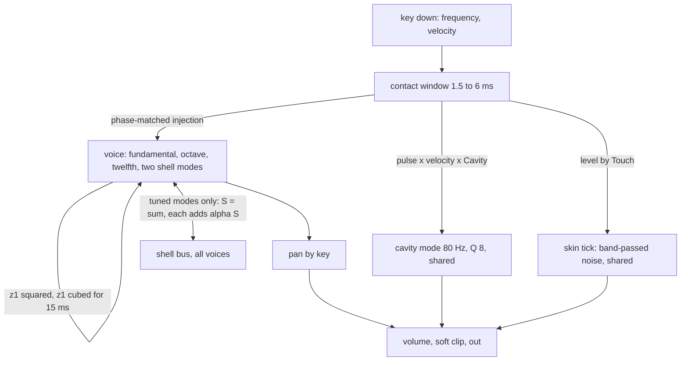

# Handpan Device - Plan

## Goal Capsule

- **Objective:** Someone browsing live-mix instruments finds a Handpan that, from its first note, is recognisably a hand-played steel pan: a soft tap, a tone whose octave and twelfth turn slowly against the fundamental, a short low thump of air under it, and other ringing notes that answer. It is simple enough to understand from nine knobs.
- **Means:** One new spec device `handpan` on `cpp/kit`, built by modal synthesis with a conservative shell coupling between ringing notes (KTD1, KTD2).
- **Authority:** `/home/claude/research/BUILD-BRIEF.md` and `/home/claude/research/tasks/handpan.md` (the integrator's direction) → this Product Contract → the Planning Contract → `docs/recipes/adding-a-spec-device.md` → implementer judgment.
- **Execution profile:** One pipeline run with no human present. Commits land on the local branch `device/handpan`; there is no remote, so nothing is pushed and no pull request is opened.
- **Stop conditions:** Stop and report if the 1 : 2 : 3 tuning, the cavity thump or the cross-ring cannot be built and measured (a settled decision would be invalidated), or if the wasm smoke cannot be brought under 5 % of real time with eight notes held.
- **Tail ownership:** The integrator collects this branch with fourteen others, regenerates the shared lists, adds the `plucked` and `wind` preset categories and plays every instrument in a browser.
- **Open blockers:** None.

---

## Product Contract

### Summary

Add `handpan` ("Handpan"), an instrument in the style of a handpan and a steel tongue drum. Each note is three tuned modes at fundamental, octave and twelfth plus two weak shell modes. Every tap also drives one shared air-cavity resonator, and all ringing notes exchange energy through one shell bus. It ships with a native harness that measures those traits, its `.wasm`, six device presets and five factory presets.

### Problem Frame

live-mix has no struck instrument with harmonic partials: every material in `modal-bells` is inharmonic or the 1 : 4 : 10 vibraphone bar, and none has an air cavity or lets notes ring each other. The handpan is the default instrument of meditation and "calm" music since about 2010, and the owner asked for fifteen ambient instruments the app does not have yet. The research for this one is `/home/claude/research/acoustic.md` section 5.

Nobody can listen in the environment where this is built. Every claim about the sound is a measurement in the harness; whether it is beautiful is for the owner's ears.

### Key Decisions

- **Three identity traits are built and measured: 1 : 2 : 3 tuning, cavity thump, cross-ring.** (session-settled: user-directed — chosen over adding two harmonic materials to `modal-bells`: Bells has no air cavity and no cross-ring, and the owner asked for separate instruments.) Governs R1, R5, R6.
- **Any key plays, C2 to C6.** (session-settled: user-directed — chosen over a fixed scale layout mapped to keys: the app plays arbitrary MIDI notes.) Governs R9.
- **At most nine knobs including volume.** (session-settled: user-directed — chosen over the twelve-knob norm of other devices: the owner asked for "super simple".) Governs R10.
- **Factory presets use category `bell`.** (session-settled: user-directed — chosen over a new category: the integrator owns categories.) Governs R13.
- **The name is neutral.** The device, its knobs and its presets carry no brand or maker name; the cavity knob is "Cavity", not the maker's word for it. Governs R10, R11.

### Requirements

**The note**

- R1. A handpan note has its three strongest partials at 1 : 2 : 3. With Shimmer at zero each is within ±1 cent; at any Shimmer each is within ±10 cents.
- R2. The fundamental is within ±3 cents of the played pitch from C2 to C6 at 44.1, 48 and 96 kHz.
- R3. Shimmer moves the octave and the twelfth a few cents off perfect, by an amount and direction fixed per key, so the waveform turns slowly: a period between 0.2 and 5 s at full Shimmer, and no turn at zero.
- R4. Position moves the strike from the centre of the note to its edge. At the centre the octave and twelfth are at least 12 dB under the fundamental; at the edge both are within 6 dB of it; the two do not rise by the same amount (they differ by at least 2 dB somewhere along the knob).
- R5. Every tap excites one shared cavity resonance between 70 and 90 Hz whose level follows the Cavity knob and velocity, and which is 40 dB down within 0.8 s.
- R6. Sympathy lets a struck note ring the partials of other ringing notes that sit at the same frequency, and no others. With D3 ringing, a D4 tap raises what D3 carries at D4 by at least 3 dB at full Sympathy; an E4 tap changes it by less than 1 dB; at zero Sympathy nothing changes.
- R7. The tap is soft. At Touch zero, energy above 3 kHz in the first 30 ms is at least 30 dB under the total and the 10 to 90 % rise takes 1 to 8 ms. Raising Touch shortens the rise and adds highs. A hard tap brightens just after the hit: the octave rises over the first tens of milliseconds, more with velocity.
- R8. Decay is the fundamental's ring time to -60 dB within ±15 %. The octave rings no longer than the fundamental and the twelfth shorter than the octave. Notes ring on after the key is released; Damp shortens the ring after release, down to 40 dB in 150 ms at full Damp, and at zero release changes nothing.
- R9. The Tongue drum type plays the same engine with a near-sine tone: an octave at least 15 dB down and a weak inharmonic partial near 6.27 times the fundamental at least 20 dB down.

**The device**

- R10. Nine parameters: Type, Decay, Touch, Position, Shimmer, Cavity, Sympathy, Damp, Volume. Each has a one or two sentence description of what it does to the sound, and each makes an audible difference across its range.
- R11. At least five device presets named in plain words, the first being the default patch. `origin.note` names the real instruments and the research, says what is simplified and which figures are choices, and says it is not a sample or circuit emulation.
- R12. The device keeps every rule of `docs/recipes/adding-a-spec-device.md` and the quality bar of the build brief: level, bounded output, bit-identical `init`, block-size independence, exact silence when idle, no clicks on stealing, re-striking, release or knob moves, mono compatibility, no audible aliasing, and under 5 % of real time in wasm with eight notes held.
- R13. Five factory presets in `src/dsp/factory/presets/handpan.ts`, category `bell`, each the instrument plus one to four existing effects, inside the bank's level limits, with ids and names unique in the bank.

### Scope Boundaries

- Not a fixed scale: no D Kurd layout, no scale lock. The description says the instrument sounds most like the real thing between about D3 and C5.
- No always-present set of note fields: only notes that are ringing can answer a tap. The research describes the same structure ("free from the structure; no extra resonators").
- Not modelled: the downward pitch settle after a hard strike (research marks its size "unsure"), closing the port with the knees, hand slaps on the shell between notes.
- No edits to `cpp/kit`, `cpp/test/support`, `scripts`, other devices, `docs/devices.md`, `docs/factory.md`, `CHANGELOG.md`, `.changeset` or `package.json`.

### Sources

- `/home/claude/research/acoustic.md` section 5 (lines 525 to 626): construction, tuning, cavity, cross-ring, shimmer, the model outline, knobs, presets and acceptance checks. Its confidence marks decide what `origin.note` calls a choice.
- `docs/recipes/adding-a-spec-device.md`: the manifest, the class, the rules and the harness.
- `cpp/devices/modal-bells/modal_bells.h` and `cpp/test/modal_bells_test.cpp`: the complex-rotation mode, re-striking a ringing voice, the 2 ms steal fade, and the `bin_level`, `fine_pitch` and `ring_time` measurement helpers.
- `cpp/devices/string-machine/` and `cpp/test/string_machine_test.cpp`: the smallest complete instrument and harness.
- `src/dsp/factory/presets/string-machine.ts`, `src/dsp/factory/presets/modal-bells.ts`, `docs/factory.md`: preset shape, the bench, the level limits.

---

## Planning Contract

### Key Technical Decisions

- KTD1. **A mode is one complex number turned and shrunk each sample**, as in `modal-bells` (`z' = r·e^{jw}·z`, output is the imaginary part). Frequency and decay can change under a ringing note without a click, the amplitude is there to read, and it stays in tune at low pitches in single precision. Five modes a voice, twelve voices.
- KTD2. **Cross-ring is a conservative rank-one coupling of all tuned modes, applied every sample.** After the turn, `S = Σ z_k` over the three tuned modes of every sounding voice, and each of those modes adds `α·S`, with `α = (e^{jφ} − 1) / 36`. The map `I + α·u·uᴴ` has eigenvalues on the chord between 1 and `e^{jφ}`, so it never adds energy whatever the knob or the number of notes. Modes at different frequencies average out; modes at the same frequency trade energy at `Γ = φ·sr/36` radians a second, in quadrature, so the sum of two matched partials does not cancel in mono. Each mode's own share of the bus is a known phase advance of `sin φ / 36` radians a sample and is taken out of its turn angle, so pitch does not move with the knob. Governs R6. (session-settled: user-directed — chosen over adding two harmonic materials to `modal-bells`: Bells has no air cavity and no cross-ring, and the owner asked for separate instruments.)
  - Rejected: the research's literal "strike pulse on a bus into every other voice's modes". A pulse is broadband, so every ringing mode would answer every tap and the E4 half of R6 would fail.
  - Rejected: feeding each voice's output into the others' inputs. Solved for two equal modes, that loop grows once the coupling passes about `1 − r²` (1e-4), far below an audible amount.
  - Rejected: a shared resistive element. It is passive, but it drives the answering mode in antiphase, so matched partials cancel in the mid signal and the "glow" becomes a faster decay.
- KTD3. **A tap is a phase-matched injection, not a pulse through the resonators.** Over the contact window (a raised cosine, 6 ms soft to 1.5 ms hard, shorter with velocity) each mode receives `A_k·w[n]·e^{j·w_k·n}`, so it arrives at exactly `A_k` with an S-shaped rise as long as the contact. A raised-cosine pulse through the modes would put spectral nulls on the keyboard (a 6 ms pulse has one at 333 Hz), and scaling the pulse with pitch is what the research rules out ("a hand is a hand"). Touch then sets what a harder hand changes: contact time, the level of octave, twelfth and shell modes through a second-order tilt, the skin-noise tick and the depth of the bloom. Governs R7.
- KTD4. **Bloom is the fundamental's own square and cube.** For a short window after the tap (a 15 ms exponential), the octave mode adds `k₂·z₁²` and the twelfth `k₃·z₁³`. A complex phasor squared is a phasor at twice the frequency and nothing else, so the drive is resonant, band-limited and in phase with what the tap put there; its size relative to the fundamental grows with amplitude, which is the velocity dependence the research describes. Skipped for a mode above the top of the band. Governs R7.
- KTD5. **Shimmer is cents, capped in hertz.** The octave and twelfth move by up to ±8 cents times the knob, sign and size from a hash of the nearest MIDI note, but never by more than 1.6 Hz and 2.2 Hz, so the turn stays slow at the top of the keyboard. Governs R1, R3.
- KTD6. **The cavity is one more complex mode at 80 Hz, Q 8, shared by all voices and fed by each tap's contact pulse** scaled by velocity and the Cavity knob. 80 Hz and Q 8 are choices inside the research's "about 85 Hz" and "Q about 8 to 12"; a fixed pitch is what the instrument has. Governs R5.
- KTD7. **Stereo is by key, fixed.** Notes alternate sides going up, as the note fields do around the shell: odd MIDI notes lean right and even ones left by a fixed equal-power pan of ±0.3. Both sides keep the same polarity, so the mid signal never cancels. The cavity and the tick sit in the middle. There is no width knob: the nine-knob Key Decision leaves no room for one.
- KTD8. **Damp limits every mode's ring time after release** to a time interpolated in log between the note's own decay (Damp 0) and 0.18 s (Damp 1). It is a change of radius, so it cannot click. Governs R8.
- KTD9. **Voice lifecycle follows `modal-bells`:** the same key again strikes the modes that are still ringing; a stolen voice fades over 2 ms and then starts the new note; a voice retires when its modes fall under -120 dB; the control clock restarts when the device wakes so output does not depend on block size.
- KTD10. **Tuned modes above 0.45 of the sample rate do not exist** (radius zero, no injection), so nothing folds back.

### High-Level Technical Design

Per sample: tick the control clock; for each sounding voice turn its modes, add the tap and bloom, and sum the tuned modes into `S`; add `α·S` to every tuned mode; take outputs. Every 32 samples: retune from the knobs, apply Damp to released voices, measure each voice's level, retire the silent ones.

### Assumptions

- No one answers questions in this run. Each choice the research marks "unsure" or "voicing" is made here and named as a choice in `origin.note`: contact times, the decay ratios 1 : 0.8 : 0.6 : 0.15, shell-mode ratios 4.2 and 5.6, cavity 80 Hz and Q 8, the bloom time, the Shimmer range.
- Defaults: Handpan, Decay 3.5 s, Touch 0.3, Position 0.35, Shimmer 0.4, Cavity 0.5, Sympathy 0.5, Damp 0. Volume is set from the measured level so one note at gain 0.8 peaks near -18 dBFS.
- The research's check 7 reads "the level of D3's second partial steps up at the moment of the second strike". In a mixed signal that partial and D4's fundamental share a frequency, so the harness damps D4 after the tap (Damp 1, D3 still held) and measures what D3 keeps, against the same sequence at Sympathy 0.
- Sympathy only has something to ring when another note is sounding; the knob's description says so.
- The compound-engineering sub-agent dispatches (research, document review, code review personas) run inline in this session because no sub-agent tool is available.

### Risks

| Risk | Mitigation |
|---|---|
| Per-sample bus coupling costs more than the chunked loops of `modal-bells` | 60 modes at most, 36 coupled; measure in the wasm smoke. If over 3 %, skip voices under the retire threshold earlier and drop the second pass when Sympathy is zero |
| Coupling changes a note's measured decay or pitch | Single notes have no degenerate partner, and the self term is compensated; R2 and R8 are measured with Sympathy at its default and at 1 |
| Soft clip reached by ten simultaneous taps | Voice gain set from the ten-note measurement, not from one note |
| The preset bank's level window (loudest 400 ms between -36 and -12 dBFS) with a percussive instrument | Tune instrument volume per preset on the bench |

---

## Implementation Units

### U1. Manifest and DSP

- **Goal:** `handpan` exists, generates, compiles and sounds with every trait of R1 to R9.
- **Requirements:** R1 to R12.
- **Dependencies:** none.
- **Files:** `cpp/devices/handpan/device.json`, `cpp/devices/handpan/handpan.h`; generated `cpp/devices/handpan/params.gen.h`, `cpp/devices/handpan/device_api.gen.cpp`, `src/dsp/devices/handpan.gen.ts`.
- **Approach:**
  1. Manifest: category `instrument`, class `Handpan`, header `handpan.h`, the nine parameters of R10 in that order with descriptions under 170 characters and no dashes, six presets (Soft hands, Low ding, Halo, Tongue drum, Rain taps, Knuckles), `origin` per R11.
  2. Class on `kit::DeviceBase`, `kit::VoicePool<Voice, 12>`, `kit::Smoother` for volume, `kit::ControlClock` (32), `kit::IdleGate`, `kit::Svf` and `kit::Rng` for the tick. Modes, bus, tap, bloom, shimmer, cavity, pan, damp and lifecycle per KTD1 to KTD10.
  3. Bad input: NaN frequency ignored, frequency clamped to 20 to 8000 Hz, gain clamped to 0 to 1.
- **Patterns to follow:** `cpp/devices/modal-bells/modal_bells.h` (mode update, `start`/`strike`/`tune`/`retire`, steal fade), `cpp/devices/string-machine/string_machine.h` (layout, `apply`, idle).
- **Test scenarios:** covered by U2; this unit is done when U2's conformance pass is green.
- **Verification:** `scripts/dev-device.sh handpan --native-only` compiles with no warnings.

### U2. Native harness

- **Goal:** The harness measures each trait and fails if it is missing.
- **Requirements:** R1 to R9, R12.
- **Dependencies:** U1.
- **Files:** `cpp/test/handpan_test.cpp`.
- **Approach:** `check_instrument` first, then one block per trait, each printing the number it measured. Local copies of `bin_level`, `fine_pitch` and `ring_time` (the test kit may not be edited).
- **Execution note:** Write each measurement, see the number it prints, then set the tolerance; a tolerance is never widened to make a check pass without recording why.
- **Test scenarios:**
  - Pitch: fundamental within ±3 cents at C2, C3, A4 and C6, at 44.1, 48 and 96 kHz, with Sympathy at default and at 1.
  - Ratios: D3 at Shimmer 0 has partials 2 and 3 within ±1 cent of 2f and 3f; at Shimmer 1 within ±10 cents and at least 1.5 cents away; two different keys get different offsets.
  - Shimmer turn: the ratio of positive to negative peak in 30 ms windows oscillates with a period between 0.2 and 5 s at Shimmer 1 and stays within a few percent at Shimmer 0.
  - Position: centre, edge and the 2 dB difference of R4.
  - Touch: at Touch 0 the 3 kHz energy share and the rise time of R7; Touch 1 rises faster and has more energy above 1.5 kHz.
  - Bloom: a hard, loud tap's octave level is at least 2 dB higher 60 ms in than 8 ms in; a quiet tap's changes by less than 1 dB.
  - Decay: fundamental T60 within ±15 % at 1 s and 6 s; octave ≤ fundamental; twelfth < octave.
  - Cavity: a peak between 70 and 90 Hz on a high note; level rises with the knob and with velocity; absent at 0; 40 dB down inside 0.8 s.
  - Sympathy: the D3, D4, E4 sequence of R6 as stated in Assumptions, at Sympathy 0 and 1, with Shimmer at 0 so D3's octave and D4's fundamental sit on one frequency; a second run at the default Shimmer shows the answer is still there when they are a few cents apart.
  - Tongue drum: octave at least 15 dB down; a partial within 1 % of 6.27 f present and at least 20 dB down.
  - Damp: at 0 a released note is bit-identical to a held one; at 1 it is 40 dB down within 150 ms and the release does not click.
  - Aliasing: a 6 kHz note at 44.1 kHz has nothing above -50 dB re the fundamental where 4.2 f and 5.6 f would fold.
  - Stereo: adjacent semitones lean to opposite sides; mid at least 6 dB over side on a chord; correlation positive.
  - Levels: one note at gain 0.7 between -24 and -10 dBFS, at 0.8 between -22 and -16 dBFS, 12 to 36 dB of velocity range, ten notes under 0.9.
  - Clicks: stealing, re-striking a held key, and sweeping Decay, Shimmer, Sympathy and Damp under a chord leave `max_step` within a small factor of the undisturbed render.
  - Rules: 1-frame and 2048-frame blocks match 128; 96 stacked notes at Sympathy 1 and Volume +6 stay bounded and come to exact silence; a chord's energy never grows at Sympathy 1.
  - `report_cost` with twelve notes ringing.
- **Verification:** `CXX=g++ bash scripts/dev-device.sh handpan --native-only` prints `handpan device tests: all passed`.

### U3. WebAssembly module and registration

- **Goal:** The committed `.wasm` passes the smoke under budget and the device is in the stock registry.
- **Requirements:** R12.
- **Dependencies:** U1, U2.
- **Files:** `src/dsp/wasm/handpan.wasm`; regenerated shared lists from `node scripts/gen-devices.mjs` (`src/dsp/devices/index.gen.ts`, `scripts/devices.gen.sh`, `docs/devices-generated.md`).
- **Test scenarios:** Test expectation: none beyond the smoke script, which checks exports, memory, silence, bounded sound, parameter extremes and cost.
- **Verification:** the smoke prints its cost line under 5 % (target under 3 %) and `handpan wasm smoke: ok`.

### U4. Factory presets

- **Goal:** Five presets an ambient musician would reach for, inside the bank's limits.
- **Requirements:** R13.
- **Dependencies:** U3.
- **Files:** `src/dsp/factory/presets/handpan.ts`, `src/dsp/factory/presets/index.ts`.
- **Approach:** Export `HANDPAN_PRESETS`; register after `MODAL_BELLS_PRESETS`. Tune each on the bench (`FACTORY_REPORT=presets FACTORY_DEVICE=handpan`) with the instrument's volume or an effect's mix.
- **Patterns to follow:** `src/dsp/factory/presets/modal-bells.ts`.
- **Test scenarios:**
  - Each preset validates, renders, peaks at or under -3 dBFS and has its loudest 400 ms between -36 and -12 dBFS.
  - Ids and names are unique across the bank and names are at most 24 characters.
- **Verification:** the two vitest files of the Verification Contract pass.

---

## Verification Contract

| Gate | Command | Proves |
|---|---|---|
| Native harness, wasm build, smoke | `source /home/claude/emsdk/emsdk_env.sh >/dev/null 2>&1; CXX=g++ bash scripts/dev-device.sh handpan` | R1 to R9, R12 |
| Descriptions and bank limits | `pnpm vitest run src/react/__tests__/param-descriptions.test.ts src/dsp/factory/__tests__/factory.test.ts` | R10, R13 |
| Preset bench | `FACTORY_REPORT=presets FACTORY_DEVICE=handpan pnpm vitest run src/dsp/factory/__tests__/report.test.ts` | R13 levels |
| Types | `pnpm typecheck` | generated and written TypeScript |
| Format and lint | `npx prettier --check` and `npx eslint` on the written files | house style |

Not run: `scripts/test-native.sh` and the whole `pnpm test` (the brief forbids them here; the integrator runs them).

## Definition of Done

- Every gate in the Verification Contract passes in the clone.
- The harness holds at least eight behaviour measurements beyond conformance, each of which fails if its trait is removed.
- The wasm smoke cost line is under 5 % with eight notes held.
- No file outside the lists in U1 to U4 and this plan is changed, apart from a learning under `docs/solutions/` if one is earned.
- No abandoned experiment is left in the diff.
- The work is committed on `device/handpan`; nothing is pushed.
