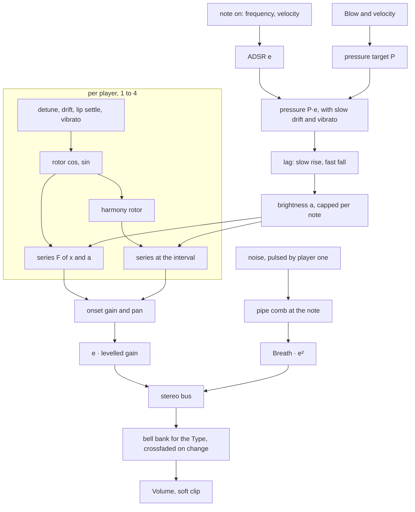

# Horns Device - Plan

## Goal Capsule

- **Objective:** A musician can load one instrument called Horns and play soft brass that swells, warms and recedes: a French horn section, a flugelhorn, a trumpet open or muted, or low brass, with an optional parallel harmony voice.
- **Means:** One new spec device built by `docs/recipes/adding-a-spec-device.md` on an open-loop driven pipe (KTD1), with its harness, `.wasm`, device presets and factory presets.
- **Authority:** the build brief and task file named under Sources win over this plan; this plan wins over the research file where they differ, and each difference is listed under Assumptions.
- **Execution profile:** one branch, `device/horns`, no remote. Shipping is local commits only: no push, no pull request, no CI watch.
- **Stop conditions:** a settled decision (KTD1 to KTD4) proves infeasible; the wasm smoke cannot be brought under 5 % of real time with eight notes; a file outside the allowed set would have to change.
- **Who finishes:** the implementer commits on `device/horns`; an integrator collects the branch afterwards, re-measures cost and adds the `wind` preset category.

---

## Product Contract

### Summary

Add the spec device `horns` ("Horns", class `Horns`) to live-mix. Each note is a breath envelope driving a closed-form harmonic series whose brightness is proportional to the pressure, played by one to four slightly different players, through a bell filter fixed in hertz for the chosen instrument type. A Harmony knob adds a parallel copy a fourth below or a fifth above. Nine parameters, eight notes of polyphony.

### Problem Frame

The library has pads, keys, bells, strings, voices and organs but nothing that sounds like breath through metal. Modern classical ambient and fourth-world music lean on soft brass, and a synth brass patch does not give the one cue a listener knows brass by: the tone gets brighter as it gets louder, inside every note. Nobody can listen in this environment, so every claim about the sound has to be a measurement in the native harness.

### Requirements

**The sound**

- R1. Brightness follows pressure inside every note: the ratio between neighbouring harmonics rises with the breath pressure, so a note gets brighter as it gets louder, the highs arrive after the lows on an attack and leave first on a release.
- R2. Type chooses French horn, Flugelhorn, Trumpet, Muted trumpet or Low brass. Each has a spectral hump that stays at the same frequency whatever note is played, and the muted trumpet is thin and nasal with almost nothing below 600 Hz.
- R3. Section goes from one player to four on every key. Players differ in pitch by a few cents, drift on their own, enter a few milliseconds apart and sit at different places in the stereo image; one player is mono and steady.
- R4. Each player's pitch starts 10 to 40 cents flat and settles within ±3 cents inside 100 ms.
- R5. Breath adds air: noise that follows the note's pressure, pulses at the pitch period and is shaped by a comb tuned to the note, plus a quieter unpitched hiss.
- R6. Harmony adds a parallel voice an equal-tempered fourth below (left of centre) or fifth above (right of centre) at the level the knob shows; at centre it is absent.
- R7. Vibrato is delayed: none in the first quarter second, then in gradually, at about 5.3 Hz.

**The instrument**

- R8. At most ten parameters including `volume`, each with a one or two sentence description; eight notes of polyphony; the default patch is the slow horn swell and is playable from C2 to C6.
- R9. Pitch is within ±3 cents from C2 to C6 at 44.1, 48 and 96 kHz with one player, and a full section centres on the note within ±3 cents.
- R10. Energy that does not belong to the harmonic series is at least 50 dB under the strongest partial at the highest notes and hardest blow.
- R11. Levels: one note at gain 0.7 peaks between -24 and -10 dBFS at the default volume, one at gain 0.8 between -22 and -16 dBFS, and held chords stay under the soft clip's knee. Notes across C2 to C6 and across the five types stay within a few dB of each other, and on every type a note's loudness follows its envelope, so Attack and Release take the time they show.
- R12. No clicks: stealing a voice, striking a held key again, releasing, moving Blow, switching Type and flipping Harmony while a note sounds make no step larger than the sound itself makes.
- R13. Left plus right does not cancel: the side signal stays under the mid signal with a full section.
- R14. Every rule of `docs/recipes/adding-a-spec-device.md` holds: no allocation, `init` bit-identical, block-size independence, sleep to exact zero, bounded under 96 stacked notes, bad input survivable, `kit::soft_clip` last, storage for 96 kHz.
- R15. Eight held notes cost under 5 % of real time in the wasm smoke, aiming for under 3 %, without `experimental: true`.

**What ships with it**

- R16. At least five device presets in plain words, the first being the default patch, and five factory presets in `src/dsp/factory/presets/horns.ts` exported as `HORNS_PRESETS`, each the instrument plus one to four existing effects, inside the bank's level limits.
- R17. Neutral naming: no brand, model or artist name in the id, name, parameters or presets. `origin.note` names the real instruments and the research, says what is simplified, says which figures are choices, and says it is not a circuit or sample emulation.
- R18. The native harness measures R1 to R7 and R9 to R13 with tolerances that fail when the trait is missing: at least eight behaviour checks beyond conformance.

### Scope Boundaries

- Not built: a lip-reed waveguide, FM brass, a pitch-shifting harmoniser, per-note key range limits per type, sampled attacks.
- Not built, considered: pressure-to-pitch coupling from the research's kernel sketch. The lip settle and vibrato already move pitch with the note, and a steady offset would work against R9. Evidence that would change the call: a listener finding sustained notes too steady in pitch.
- Not built, considered: the odd-harmonic series and octave blip of the shared kernel. Horns uses neither; the sibling Flute and Clarinet devices carry their own copies.
- Not touched: `cpp/kit/**`, `cpp/test/support/**`, `scripts/**`, other devices, `docs/devices.md`, `docs/factory.md`, `CHANGELOG.md`, `.changeset/**`, `package.json`. The one exception is the shared lists `scripts/gen-devices.mjs` rewrites (U5), which the build brief allows and the integrator regenerates.

#### Deferred to Follow-Up Work

- The integrator adds the `wind` factory category and moves the five presets into it.
- The integrator may lift `driven_pipe.h` into the kit once Flute and Clarinet land.
- Listening. Every number here is a measurement; names and descriptions are claims to check by ear.

### Sources

- Build brief: `/home/claude/research/BUILD-BRIEF.md` (outside the repo; the quality bar and the files not to touch).
- Task: `/home/claude/research/tasks/horns.md` (outside the repo; the integrator's decisions).
- Research: `/home/claude/research/acoustic.md`, "Shared kernel for the three wind devices" and section 3 (outside the repo).
- Recipe: `docs/recipes/adding-a-spec-device.md`. Factory bank: `docs/factory.md`.
- Closest code: `cpp/devices/organ/organ.h` (the closed-form series and its band-limit cap), `cpp/devices/choir/choir.h` (a section of singers per note, levelling against a shared formant bank, wake from sleep), `cpp/devices/modal-bells/modal_bells.h` (the 2 ms steal fade with a pending start), `cpp/test/choir_test.cpp` (pitch tracking and per-harmonic measurement helpers).

---

## Planning Contract

### Key Technical Decisions

- KTD1. **Open-loop driven pipe.** A breath envelope drives phase accumulators and a closed-form series; nothing closes a nonlinear loop, so it cannot squeal, jump register or fail to speak. (session-settled: user-directed — chosen over a self-oscillating lip-reed waveguide: the hardest waveguide to keep in tune and speaking, and Bow already dropped a closed-loop junction for that reason)
- KTD2. **The kernel lives in `cpp/devices/horns/driven_pipe.h`, namespace `livemix::horns`, with no horn voicing in it.** It holds the series, its band-limit cap, the oscillator and the pipe comb. All brass numbers live in `horns.h` and `bell.h`. (session-settled: user-directed — chosen over adding it to `cpp/kit/**`: the kit is off-limits to builders and the integrator may lift the common part later)
- KTD3. **Nine knobs, eight voices, default patch the slow horn swell.** Type, Blow, Breath, Section, Attack, Release, Vibrato, Harmony, Volume. (session-settled: user-directed — chosen over a larger surface or more voices: the owner asked for "super simple")
- KTD4. **The harness measures the traits.** Brightness lagging and following level inside one swell, the fixed formant, section scatter, the mute's spectrum, the harmony interval and tuning are each an assertion with a tolerance. (session-settled: user-directed — chosen over conformance-only tests: nobody can listen here)
- KTD5. **One Section knob replaces the research's Players and Spread.** It brings in players two, three and four in turn and widens their pitch, timing and position together, at the power of one player. A Spread knob would do nothing with one player; one knob has no dead range and fewer is better (R8). This follows Choir's Ensemble.
- KTD6. **Tone is `gain(t) · F(x, a)` with `a = a_soft + (a_hard - a_soft) · lag(p)` and `p = P · e(t)`.** `F(x, a) = sin x / (1 - 2a·cos x + a²)` is the series with ratio `a` between neighbours, `e` is the ADSR, `P` is the pressure target from Blow and velocity, and `lag` is a one-pole with a slow rise (25 to 60 ms by type) and a 5 ms fall. `a_soft` and `a_hard` are per type: about 0.03 to 0.9 for the open instruments (the research's "0.1 at the softest to 0.88 at full blow"), and a much higher `a_soft` (0.6) for the muted trumpet, whose band at 1.5 to 3 kHz is only reached by a bright source. `a` is capped per note so the series is 50 dB down at Nyquist; every bell ends in a low-pass that takes what folds back further down (set during implementation: the first figure was 70 dB, which measurement showed left the top octave duller than it had to be). A slow drift of a few percent on `p`, per note, keeps a held note from standing still.
- KTD7. **Loudness follows the envelope; colour follows the pressure.** `gain(t)` is `e(t)` times a level set by velocity alone (a harder blow is brighter at the same level), divided by the level the series has through the bell at its present brightness. Each note holds a small table of the logarithm of that level against `a` (thirteen points; the logarithm stays near a straight line between them), built from the bell's response at its harmonics when the note starts and when the Type or the Harmony interval changes; the control clock reads it and the result is smoothed per sample. The boost is bounded. Without this a pure power law through a bell that removes the fundamental makes a trumpet's or a mute's level fall five times faster than its envelope, so Release and Attack would lie (R11), and Blow would span about 33 dB of peak level.
- KTD8. **Rotating phasors, not phase accumulators with table reads.** Each player keeps `(cos, sin)` and turns it by the note's angle each sample; pitch (detune, drift, settle, vibrato) updates the rotation on the control clock by a small-angle correction, and the pair is renormalised there. One player then costs six multiplies and one division, which is what lets four players plus four harmony copies on eight notes fit R15.
- KTD9. **The bell is one stereo filter bank after the sum, per type, with a levelling query.** Three biquads per channel: a rise to the type's cutoff, a mild peak at the formant, a low-pass above; the mute is a high-pass near 1 kHz, a second high-pass whose resonant corner near 1.8 kHz is the nasal peak, and a low-pass (one high-pass and a peak left the low end only 5 dB under the band on low notes). Because the bell is linear and the same for every note it runs once per channel. `bell.h` also gives its gain at a frequency, from which KTD7's table is built, in the manner of `choir_dsp::FormantBank::harmonic_power`. A Type change crossfades to a second bank over 30 ms.
- KTD10. **Formant figures.** French horn 340 Hz, trumpet 1300 Hz and low brass 480 Hz follow the research's recollection of Meyer (marked "likely" there); flugelhorn 800 Hz and the whole muted voicing are choices. `origin.note` says so.
- KTD11. **Harmony is a second rotor per player.** Each player's copy runs at 2^(7/12) or 2^(-5/12) times its own frequency, shares its detune, timing and position, has its own brightness cap, and is mixed at the knob's level with both scaled by 1/sqrt(1 + level²). The interval changes only when the smoothed knob crosses zero, where the copy is silent. A real harmoniser also shifts the formant and adds splice artefacts; this does not.
- KTD12. **Breath is post-enveloped.** Noise, pulsed by `1 + m·cos x` of the first player, runs through the comb `y = in + g·LP(y[n - D])` at constant drive and is scaled by Breath and `e²` after the comb. The comb's delay is corrected for the low-pass's phase delay at the fundamental. Scaling after the comb means the release is exact and a voice can stop the moment its envelope does. The unpitched hiss is one shared band-pass fed by every note's noise.
- KTD13. **A stolen voice fades over 2 ms and then starts fresh**, with the new note pending, as `modal-bells` does. Every note then gets the same attack, settle and scatter. A key struck again while held lets its old voice go in 30 ms.
- KTD14. **Speech time is added to Attack.** A note's envelope attack is the knob plus a per-type number of periods, clamped to 5..150 ms, so low notes speak more slowly than high ones.

### High-Level Technical Design

Control clock, every 32 samples: envelope times, each player's pitch and rotation, section weights, vibrato onset, pressure targets, each note's gain from its level table, and one note's table rebuilt per tick after a Type or Harmony interval change.

### Assumptions

- No human is present. Product forks were resolved by the task file, then by the build brief, then by the research; none was asked.
- Blow maps to pressure as `0.2 + 0.8·blow` and velocity as `0.15 + 0.85·velocity`; `a` then runs from just above the type's softest value to its hardest (KTD6). The research's "centroid at velocity 1.0 at least 2.5 times that at 0.2" is asserted at Blow 1, where velocity has that much room.
- The formant-is-fixed check plays each type inside its own range and at a hard blow, because a soft low note is nearly a sine and has no hump to find.
- Defaults: French horn, Blow 0.6, Breath 0.12, Section 0.6 (three players), Attack 2.5 s, Release 4 s, Vibrato 0, Harmony 0. Blow 0.6 is where the default swell's centroid at its peak measures 1.8 times that at a tenth of its level; at 0.45 it was 1.6. Volume is set by measurement to meet R11 (-6 dB).
- The research preset "Fourth world" is named "Parallel fifths" and "Miners' band" is named "Brass band", so no name points at an artist's record.
- Factory presets use the existing category `pad` until `wind` exists; the report says so.

### Risks

- **Cost.** Four players with harmony on eight notes is 64 series a sample. KTD8 is the mitigation; if the worst case still passes 5 %, harmony copies are limited to the first two players and the report says so.
- **Peak level with a beating section.** Players drifting into phase raise the peak by up to the square root of their number. Volume is set against the worst peak over several seconds, not the mean.
- **A voicing nobody has heard.** The per-type brightness range and bell numbers are set by measurement against the bands in U3's scenarios. The harness proves the traits are there; it cannot prove they are pleasant.
- **Formant measurement against a tilted source.** The series falls with harmonic number, so the strongest partial sits a little under the bell's peak. Bands in the harness are set from the measured response, inside the research's bands.

---

## Implementation Units

### U1. The driven-pipe kernel

- **Goal:** the reusable blocks, free of brass numbers.
- **Requirements:** R1, R9, R10, R5; KTD1, KTD2, KTD6, KTD8, KTD12.
- **Dependencies:** none.
- **Files:** `cpp/devices/horns/driven_pipe.h`, `cpp/test/horns_test.cpp`.
- **Approach:** the series from a sine and cosine; the brightness cap for a frequency and sample rate; the rotor (start at a phase, set its angle from a base rotation and a small ratio offset, tick, renormalise); the pipe comb (clear, tune to a frequency with a loss and a damping corner, process one sample).
- **Patterns to follow:** `Organ::rank` and the per-rank cap in `cpp/devices/organ/organ.h`; the bridge low-pass correction in `cpp/devices/bowed-string/bowed_string.h`.
- **Test scenarios:**
  - The series at a = 0.3 and 0.6 on a 110 Hz rotor: harmonics 1 to 8 fall by 20·log10(a) dB each, within 0.3 dB.
  - The rotor holds 65.41, 440 and 4186 Hz within 0.5 cent over two seconds at 44.1, 48 and 96 kHz, and its amplitude stays within 0.1 % of one.
  - The cap: a series at the cap at 1046.5 Hz and 2093 Hz has every inharmonic component 60 dB or more under the fundamental at 44.1 and 48 kHz; the same series with a = 0.88 uncapped does not (the measurement sees aliasing).
  - The comb rung by an impulse peaks within 3 cents of 65.41, 220 and 1046.5 Hz at 48 and 96 kHz.
- **Verification:** the kernel scenarios pass in the harness.

### U2. The manifest

- **Goal:** `device.json` with nine parameters, their descriptions, six presets and the origin note; generated files follow from it.
- **Requirements:** R8, R16, R17; KTD3, KTD5, KTD10.
- **Dependencies:** none.
- **Files:** `cpp/devices/horns/device.json`; generated `cpp/devices/horns/params.gen.h`, `cpp/devices/horns/device_api.gen.cpp`, `src/dsp/devices/horns.gen.ts`.
- **Approach:** parameters in this order: `type` (choices), `blow`, `breath`, `section`, `attack` (0.02..6 s, log), `release` (0.05..8 s, log), `vibrato`, `harmony` (-1..1), `volume` (-48..6 dB). Presets: Horn swell, Parallel fifths, Flugel breath, Low brass choir, Muted distance, Brass band. Descriptions are at most 170 characters, end in a full stop and carry no dash.
- **Test scenarios:** Test expectation: none -- data only; `src/react/__tests__/param-descriptions.test.ts` covers the descriptions in U5.
- **Verification:** `node scripts/gen-devices.mjs --only horns` writes the three files without complaint.

### U3. The instrument

- **Goal:** the `Horns` class and its bell.
- **Requirements:** R1 to R7, R9 to R15; KTD5 to KTD14.
- **Dependencies:** U1, U2.
- **Files:** `cpp/devices/horns/horns.h`, `cpp/devices/horns/bell.h`, `cpp/test/horns_test.cpp`.
- **Approach:**
  1. `bell.h`: the per-type table (formant, rise, peak, low-pass, brightness range, lag rise, speech periods), one bank's coefficients and two channels of state, and its gain at a frequency.
  2. `horns.h` voice: ADSR, pressure and its lag, a comb, a noise source, four players (two rotors, drift, settle, vibrato phase and age, onset wait and gain, pan), the level table and smoothed gain, the steal fade with a pending note.
  3. `process`: wake, control clock, per-note loop, shared hiss, bell bank or crossfade of two, volume, soft clip, settle.
  4. Smoothing: Blow through each note's pressure, Breath, Harmony and Volume per sample; Section through player gains; Type by crossfade.
- **Execution note:** set levels last, by measurement, after the spectrum is right.
- **Patterns to follow:** `cpp/devices/choir/choir.h` for the section, levelling and `wake()`; `cpp/devices/modal-bells/modal_bells.h` for the steal; `cpp/devices/string-machine/string_machine.h` for the overall shape.
- **Test scenarios:**
  - Tuning: one player at C2, C3, C4, C5 and C6 is within 3 cents at 44.1, 48 and 96 kHz; a full section's mid signal is within 3 cents at 220 Hz.
  - Brightness against velocity: at Blow 1 the centroid at velocity 1.0 is at least 2.5 times that at 0.2; with the bell divided out, on an open type, harmonics 1 to 8 fall faster than 9 dB each at the softest setting and slower than 3 dB each at the loudest.
  - Inside one swell (2 s attack, 2 s release): the centroid at the peak is at least 1.8 times the centroid at 10 % of peak level, both rising and falling.
  - Highs lag: with a 20 ms attack, harmonics 5 to 8 reach half their steady level at least 10 ms after harmonic 1.
  - Fixed formant: for every type, the strongest partial over a chromatic octave low in its range and over the octave two octaves higher lies in that type's band (French horn 250 to 500 Hz, trumpet 1 to 1.6 kHz) and moves by less than a third of an octave.
  - Mute: the level below 600 Hz is at least 15 dB under the 1.5 to 3 kHz band.
  - Lip settle: one player starts 10 to 40 cents flat and is within 3 cents after 100 ms.
  - Section: at Section 1 the fundamental's level swings by at least 2 dB and left/right correlation is under 0.9; at Section 0 it swings by under 0.5 dB and the channels are identical; the section is within 3 dB of one player's level and starts later than one player does.
  - Harmony: at +1 a series at 1.4983 times the note is within 3 dB of the main one, at -1 one at 0.7492 times; at 0 both are more than 70 dB down.
  - Breath: with Breath up, noise between the harmonics appears, is stronger at the harmonics than half way between them, and pulses at the note's frequency; with Breath 0 the tone is harmonic.
  - Vibrato: about 5.3 Hz, none in the first quarter second, swinging around the note.
  - Attack (the knob plus the speech time of KTD14) and release take the time they say on French horn, Trumpet and Muted trumpet alike: a 3 s release is 20 dB down, give or take 4 dB, after one second, and the output is exact zero once it has run out.
  - Aliasing: C6 and C7 at the hardest blow, every type, 44.1 and 48 kHz: inharmonic energy at least 50 dB under the strongest partial.
  - Levels: gain 0.7 peaks in -24..-10 dBFS and gain 0.8 in -22..-16 dBFS at defaults; ten notes struck and held (eight sound) stay under 0.5; C2 to C6 and the five types are within 6 dB of each other in level.
  - Clicks: a steal, a re-strike, a release, a Blow sweep, a Type switch and a Harmony flip keep `max_step` within a small factor of the steady sound's.
  - Mono: at Section 1 the side signal is at least 6 dB under the mid.
  - Ragged blocks (1, 7, 64, 128, 33, 512, 2048, 5) give the same audio as 128-frame blocks within 1e-4, across a sleep and a wake.
- **Verification:** `check_instrument` and every scenario above pass at 48 kHz, and the cost line is printed for eight notes with four players and harmony.

### U4. The wasm module

- **Goal:** `src/dsp/wasm/horns.wasm` built by Emscripten and passing the smoke.
- **Requirements:** R15, R14.
- **Dependencies:** U3.
- **Files:** `src/dsp/wasm/horns.wasm`.
- **Approach:** the full `scripts/dev-device.sh horns` run. If cost is near the limit, re-run the smoke and keep the best; the fallback is in Risks.
- **Test scenarios:** Test expectation: none -- the smoke script is the test.
- **Verification:** the smoke prints `horns wasm smoke: ok` and a cost under 5 %.

### U5. Factory presets and registration

- **Goal:** five presets in the bank, inside its limits.
- **Requirements:** R16, R17.
- **Dependencies:** U4.
- **Files:** `src/dsp/factory/presets/horns.ts`, `src/dsp/factory/presets/index.ts`; regenerated shared lists from `scripts/gen-devices.mjs` (`src/dsp/devices/index.gen.ts`, `scripts/devices.gen.sh`, `docs/devices-generated.md`).
- **Approach:** one preset per character: a horn section in a hall, the parallel-fifths trumpet through a tape echo, a flugelhorn close in a room, a low brass choir in a very large space, a muted trumpet far away. Category `pad` for now; `preview` is `chord` for sections and `line` for solo voices. Levels are brought inside the limits with the instrument's volume or an effect's mix, using the bench in `docs/factory.md`.
- **Patterns to follow:** `src/dsp/factory/presets/string-machine.ts`.
- **Test scenarios:**
  - Each preset validates, renders and has its peak at or under -3 dBFS and its loudest 400 ms between -36 and -12 dBFS (`factory.test.ts`).
  - Ids and names are unique across the bank.
  - Every Horns parameter has a description the info view accepts (`param-descriptions.test.ts`).
- **Verification:** both vitest files pass, `pnpm typecheck` passes, and prettier and eslint are clean on the files written.

---

## Verification Contract

| Gate | Command | Applies to |
|---|---|---|
| Native harness, wasm build, smoke | `source /home/claude/emsdk/emsdk_env.sh >/dev/null 2>&1; CXX=g++ bash scripts/dev-device.sh horns` | U1 to U4 |
| Generated files only | `node scripts/gen-devices.mjs --only horns` | U2 |
| Native only, inner loop | `CXX=g++ bash scripts/dev-device.sh horns --native-only` | U1 to U3 |
| Shared lists | `node scripts/gen-devices.mjs` | U5 |
| Bank and descriptions | `pnpm vitest run src/react/__tests__/param-descriptions.test.ts src/dsp/factory/__tests__/factory.test.ts` | U5 |
| Bench | `FACTORY_REPORT=presets FACTORY_DEVICE=horns pnpm vitest run src/dsp/factory/__tests__/report.test.ts` | U5 |
| Types | `pnpm typecheck` | U5 |
| Format and lint | `npx prettier --check` and `npx eslint` on the files written | U2, U5 |

Never run `scripts/test-native.sh` or the whole `pnpm test`.

## Definition of Done

- Every gate above passes in the clone.
- The harness has at least eight behaviour checks beyond conformance, each a measurement tied to an R-ID, and prints the cost line.
- The wasm smoke cost with eight notes is under 5 %.
- `device.json` has nine described parameters, at least five presets, and an origin note naming what is modelled, simplified and chosen.
- Five factory presets are registered and inside the bank's limits.
- No file outside the allowed set changed; no experiment or dead code is left in the diff.
- The work is committed on `device/horns`; nothing is pushed.
