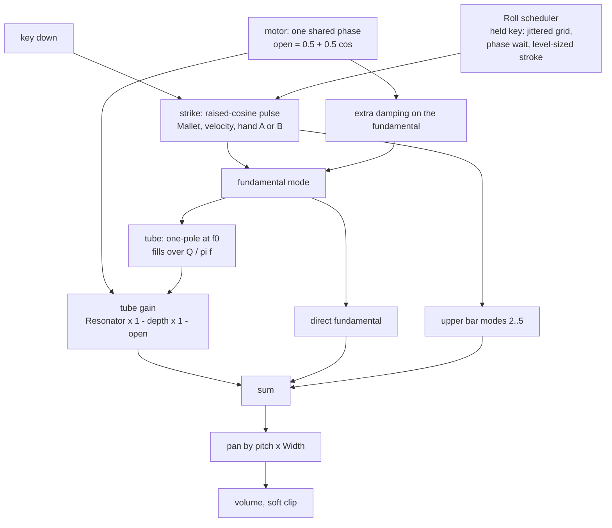
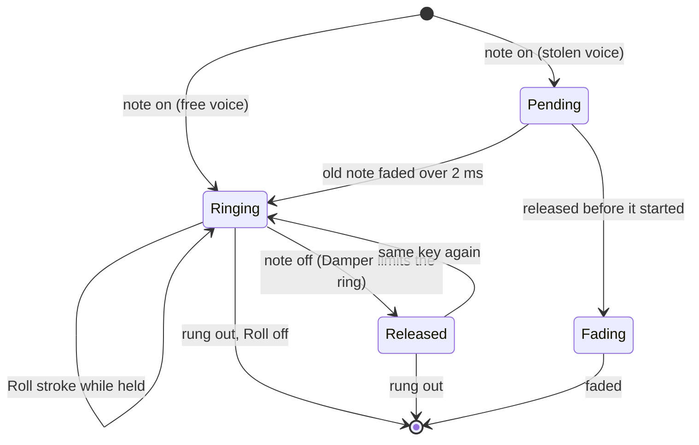

# Mallets Device - Plan

## Goal Capsule

- **Objective:** A musician loads one instrument, "Mallets", and gets a marimba, vibraphone, xylophone, glockenspiel or celesta that behaves like the real bar over its tube: a warm hum under a short woody strike, a motor that throbs only the low tone, and a roll that turns a held chord into a soft sustained shimmer.
- **Means:** A modal spec device on `cpp/kit`, sibling of `cpp/devices/modal-bells`, with three additions Bells lacks (KTD2, KTD3, KTD4).
- **Authority:** `docs/recipes/adding-a-spec-device.md` for the rules every device keeps. The research brief (section 4 of the acoustic research file, see Sources) for what the instrument is. The integrator's task file for direction; where this plan departs from it, the departure is listed under Assumptions.
- **Execution profile:** one builder, one clone, branch `device/mallets`, no remote. Local commits only.
- **Stop conditions:** the native harness cannot be made to pass without editing `cpp/kit`, `cpp/test/support` or `scripts`; or the wasm smoke stays over 5 % of real time with eight notes held.
- **Who finishes:** an integrator collects this branch with fourteen others, regenerates the shared lists and plays every instrument in a browser.

---

## Product Contract

### Summary

Add the spec device `mallets` to live-mix: five tuned-bar instruments on one modal engine, each bar over a resonator tube, with a motor and a roll. It ships with a native harness that measures the traits a listener knows these instruments by, its `.wasm`, eight device presets, a description on every parameter and five factory presets.

### Problem Frame

Ambient Town has no mallet instrument. The Bells device (`modal-bells`) has the tuned-bar and free-bar mode tables, a mallet, a strike point and a damper, so a user can get most of a marimba strike from it. Three things cannot be had from Bells or from any effect after it: the tube under the bar (a louder fundamental that blooms and dies sooner), a motor that pulses the fundamental and leaves the upper partials alone (the Tremolo effect pulses everything), and a roll (a held key that keeps being struck softly). Those three are what kankyo ongaku and minimalist mallet writing rest on, and they are the case for a separate device.

Nobody can listen in the build environment. Every claim about the sound in this plan is verified by measurement in the harness, and the names and descriptions remain claims to check by ear.

### Requirements

**The bars**

- R1. Five instruments selected by one choice parameter: Marimba, Vibraphone, Xylophone, Glockenspiel, Celesta. Each sounds partials at its own ratios: marimba 1 : 4 : 9.9, vibraphone 1 : 4 : 10, xylophone 1 : 3 : 6, glockenspiel and celesta the free bar 1 : 2.757 : 5.404.
- R2. The fundamental is within ±3 cents of the played key from C2 to C6 at 44.1, 48 and 96 kHz.
- R3. Decay follows the material. On wood the fundamental's ring time halves per octave (a factor between 1.7 and 2.3) and the upper partials die far sooner than the fundamental. On metal the bar rings for seconds at every pitch and the 4× partial rings at least a third as long as the fundamental.
- R4. Mallet moves from soft yarn to hard rubber: the spectral centroid of the first 20 ms rises with it and with velocity, while the fundamental's level stays about the same.
- R5. Damper sets how quickly a released note is stopped. At zero the release changes nothing; at full a vibraphone note falls 60 dB within 0.4 s.
- R6. Width spreads the keyboard from left to right by pitch. At zero the output is mono; at any setting left plus right does not cancel.

**The three additions**

- R7. Resonator adds the tube under the bar: against none, the fundamental peaks at least 6 dB louder, rings shorter by a factor between 1.3 and 3, and reaches its peak 5 to 80 ms after the strike. The 4× partial is not lifted.
- R8. Motor pulses the tube at Motor rate: the fundamental's level swings at that rate within ±2 %, by at least 4 dB at full depth, and the upper partials swing by under 1 dB. One motor phase serves all notes.
- R9. Roll keeps striking a held key. Strokes arrive at the knob's rate within ±5 % at C3, faster on higher bars, with timing spread between 5 and 20 %. After one second a held roll's level stays within ±2 dB. Hands alternate between two strike points. At zero a key press is exactly one stroke. Releasing the key stops the roll.

**The device as a library citizen**

- R10. At most ten parameters including `volume`, each with a one- or two-sentence description. No brand or model name in `id`, `name`, parameter names or preset names.
- R11. Every rule in `docs/recipes/adding-a-spec-device.md` holds: no allocation, `init` resets bit-identically, smoothing, block-size independence, sleep to exact zero, bounded under 96 stacked notes, survivable bad input, soft clip at the output.
- R12. One note at gain 0.7 peaks between -24 and -10 dBFS at the default volume, and between about -22 and -16 dBFS at gain 0.8. Ten held notes, struck or rolled, stay under the clip knee region.
- R13. No clicks: stealing a voice, re-striking a ringing key, releasing with full Damper and moving Resonator, Motor, Motor rate, Decay, Roll or Width under a ringing chord leave no step larger than the chord's own waveform makes.
- R14. Energy that does not belong (a partial folded back from above Nyquist on a high note) is at least 50 dB under the fundamental.
- R15. The wasm smoke costs under 5 % of real time with eight notes held, with a target of under 3 %.
- R16. At least five device presets, the first being the default patch, each named in plain words.
- R17. Exactly five factory presets in `src/dsp/factory/presets/mallets.ts`, category `bell`, inside the bank's level limits, with ids and names unique across the bank.

### Scope Boundaries

- No strike-position knob. Two fixed strike points (one per hand) take its place; Bells keeps the knob.
- No bowed bar. Bells has it (Sustain).
- No pitch wobble from the motor. The research mentions a slight one; it is left out so tuning stays inside R2.
- No beating pairs (gendèr "ombak"). Bells' Detune covers that sound.
- Not a sample or circuit emulation, and no claim that any figure marked "unsure" in the research is a measurement.

Considered and not built:

- A contact-damping model for a mallet landing on a moving bar. KTD4 times each stroke instead, which gives the steady level R9 asks for with one rule. Evidence that would change the call: a listener hearing rolls as too even.
- A cap on Roll's stroke rate tied to tempo. Nothing in the request asks for sync.

### Sources

- Research brief: `acoustic.md`, sections "How to read this file", "What I found in the existing code" and section 4 (Marimba, vibraphone with motor, glockenspiel, celesta). It lives outside this repository in the build's research directory; the manifest's `origin.note` carries what the device took from it.
- Build bar shared by all fifteen instruments: `BUILD-BRIEF.md` and `tasks/mallets.md` in the same research directory.
- Recipe: `docs/recipes/adding-a-spec-device.md`. Bank rules and bench: `docs/factory.md`.
- Sibling device and harness: `cpp/devices/modal-bells/modal_bells.h`, `cpp/test/modal_bells_test.cpp`.
- Reference instrument and harness: `cpp/devices/string-machine/`, `cpp/test/string_machine_test.cpp`.

---

## Planning Contract

### Key Technical Decisions

- KTD1. **Each mode is a rotating complex one-pole, as in Bells.** The amplitude is there to read (the roll needs it), decay can change under a ringing note without a click (the motor needs it), and tuning holds to a fraction of a cent at 20 Hz in single precision. A note is at most five bar modes and one tube: about a third of what a Bells note costs.
- KTD2. **The tube is a sixth complex one-pole per note, tuned to the fundamental and driven by the fundamental mode's state.** Its pole radius comes from the tube's Q, so it fills over Q/(π·f) seconds: that lag is the bloom. The bar's fundamental stays in the output at its own level and the tube adds to it, so a strike is immediate and the hum arrives behind it. While the tube is heard, the fundamental's decay rate rises by `1 + coupling · Resonator · open`, with coupling 1 for the marimba (the decay halves) and less for weaker tubes. Only the fundamental feeds the tube, so the 4× partial is not helped (R7).
- KTD3. **The motor is a gain on the tube's output and on the extra damping, never on the bar modes.** `open = 0.5·(1 + cos(2π·rate·t))` from one phase shared by all notes; the tube gain runs between `1 - depth` and 1 and is computed per sample so it cannot zipper. A closed tube is quieter and rings longer, as the disc does it. The upper partials are untouched by construction (R8).
- KTD4. **Each roll stroke is timed to the bar's swing and sized to hold a level.** Strokes are due on a jittered grid (±12 % of the interval, set from the due time so the mean rate is exact). A due stroke then waits less than one period of the note so the centre of its force pulse lands where it adds to the fundamental already ringing. Its strength is what brings the fundamental up to the roll's level (the first strike's level less about 4.5 dB, ±2 dB per stroke), with a floor so every stroke is a stroke. Without the timing rule a linear bar adds strokes at random phase and the level wanders by more than 6 dB; a real mallet avoids that by damping the bar as it lands, which this model leaves out. The same timing applies to a key struck again by hand while its bar still rings, at a cost of under one period of latency. As built after review: the push goes with the swing either way (upward at the top, downward at the bottom), so the wait is at most half a period, and the floor tapers to nothing once a mode holds one and a half fresh strokes' worth, so a long-ringing bar under a fast roll does not pile up.
- KTD5. **Mallet contact time is absolute, scaled by the square root of the period, and capped at 0.9 of the note's period.** About 2.5 ms (soft) to 0.25 ms (hard) at C4, shortened by velocity. The pulse is a raised cosine with a little noise on it; its gain is divided by its own spectrum at the fundamental, so the fundamental's level does not depend on the mallet (R4) and the roll can size a stroke exactly (KTD4).
- KTD6. **Decay law per instrument: bar-alone ring time = base × Decay × (reference / f)^exponent**, exponent 1 for wood and 0.5 for metal, and mode k decays faster by `1 + d·(ratio - 1)`. Bases, d, tube strength and tube Q are voicing choices where the research marks them "unsure"; each is named as a choice in `origin.note`.
- KTD7. **Roll is one knob in strokes per second, 0 to 16, where under half a stroke per second is off.** The research proposes "off, 6..16 Hz"; a continuous range makes the whole travel useful (slow pulses at the bottom, rolls at the top) and needs no second control.
- KTD8. **Every instrument answers the Resonator knob, including the glockenspiel.** The orchestral glockenspiel has no tubes, and its preset sets Resonator to 0. Giving it a weak tube when the knob is raised keeps the rule that no knob is dead in some mode. `origin.note` says so.
- KTD9. **Sixteen voices.** A key struck again reuses its own voice (the Bells rule), so a rolled five-note chord uses five. Sixteen leaves room for long vibraphone rings behind it; sixteen notes of six one-poles are half the one-poles of a full Bells pool.
- KTD10. **Modes above 16 kHz are dropped at every sample rate**, so the instrument sounds the same at 44.1, 48 and 96 kHz and nothing folds back (R14).

### High-Level Technical Design

Signal path of one note, and what each knob reaches:



Life of a voice:



### Assumptions

- The integrator's direction ("the roll is the ambient idiom", "at most ten knobs", "enough voices", category `bell`) is followed as written. Two points go beyond it and are choices of this plan: stroke timing to the bar's phase (KTD4) and the continuous Roll range (KTD7).
- The research's acceptance check "peak arrives 5 to 80 ms after the strike" is measured at C4, where the chosen tube Q gives about 40 ms. At C3 the same tube gives about 80 ms, on the edge.
- Wood's mode damping `d` is set near 3, not the research's 1.5. With 1.5 the marimba's 4× partial would still be within 20 dB of the fundamental 150 ms after the strike, which the research itself names as the trait that makes a marimba sound fake.
- Metal's `d` is set near 0.4, not 0.05, so that with the tube shortening the fundamental the 4× partial does not outlast it.
- Motor and Roll work on every instrument. A motor on a marimba is not a real instrument; the knob's description says it needs Resonator up.
- `ce-test-browser` has nothing to test: the change adds a device and data, and no page.
- Category `bell` and audition phrases `bells` (struck) and `chord` (rolled) are the integrator's choice and are used as given.

### Sequencing

U1 first (the manifest generates `params.gen.h`, which the class includes). U2 then U3 then U4 build the class in one header; each adds its harness checks. U5 closes levels, clicks, cost and the wasm. U6 needs the built `.wasm`.

---

## Implementation Units

### U1. Manifest, parameters and presets

- **Goal:** `device.json` describes the instrument: ten parameters with descriptions, eight presets, origin.
- **Requirements:** R1, R10, R16.
- **Dependencies:** none.
- **Files:** `cpp/devices/mallets/device.json`; generated by the dev loop: `cpp/devices/mallets/params.gen.h`, `cpp/devices/mallets/device_api.gen.cpp`, `src/dsp/devices/mallets.gen.ts`.
- **Approach:** Parameters in this order: `instrument` (5 choices, default Marimba), `mallet` 0..1, `decay` 0.25..4 log, `resonator` 0..1, `motor` 0..1, `motorRate` 1..12 Hz, `roll` 0..16 Hz (KTD7), `damper` 0..1, `width` 0..1, `volume` -48..6 dB. Presets: Soft marimba (the defaults), Rolled marimba, Motor vibes, Still vibes, Rolled vibes, Glockenspiel, Celesta, Dry xylophone. `origin.kind` is `new`; the note names the real instruments, the research, what is simplified and each voicing choice (KTD6, KTD8), and says it is not a sample or circuit emulation.
- **Patterns to follow:** `cpp/devices/modal-bells/device.json`, `cpp/devices/string-machine/device.json`.
- **Test scenarios:**
  - `src/react/__tests__/param-descriptions.test.ts` passes: every parameter has a description of at most 170 characters ending in a full stop, with no dash or line break.
  - The generated enum has exactly ten ids and `volume` is last.
- **Verification:** the dev loop generates the three files without error and the description test is green.

### U2. Bars: modes, strike, decay, damper, stage and voices

- **Goal:** The class `Mallets` plays the five instruments as struck bars with no tube, motor or roll yet.
- **Requirements:** R1, R2, R3, R4, R5, R6, R11, R14.
- **Dependencies:** U1.
- **Files:** `cpp/devices/mallets/mallets.h`, `cpp/test/mallets_test.cpp`.
- **Approach:**
  1. One table row per instrument: mode ratios and levels, reference pitch, base ring time, law exponent, mode damping, tube strength, coupling and Q, level trim (KTD6).
  2. Voice pool, same-key restrike, 2 ms steal fade, chunked control every 32 samples and sleep: the Bells shape (KTD1, KTD9).
  3. Strike: KTD5. Two hands, two fixed strike points weighted by the free-bar shapes Bells uses.
  4. Decay and Damper: recomputed on the control clock when Decay, Damper or the released state changes.
  5. Stage: equal-power pan from the key's pitch about F#4, scaled by Width, ramped over one control period when Width moves.
  6. Notes are clamped to 20..8000 Hz; NaN frequency is ignored and NaN gain becomes 0.5.
- **Patterns to follow:** `cpp/devices/modal-bells/modal_bells.h` (`tune`, `strike`, `render_voice`, `control`, `retire`); `fine_pitch`, `bin_level` and `ring_time` in `cpp/test/modal_bells_test.cpp`.
- **Test scenarios:**
  - Conformance: `check_instrument` passes at 48 kHz with `max_peak` 1.01.
  - Ratios (R1): for each instrument, hard mallet, 220 Hz: every listed partial is within 2 cents of its ratio and stands 20 dB above its neighbourhood.
  - Tuning (R2): C2, C3, C4, C5, C6 and C7 at 44.1, 48 and 96 kHz: the fundamental is within 1 cent.
  - Wood law (R3): marimba at C3, C4, C5, C6: each octave up shortens the fundamental's ring by 1.7 to 2.3 times; C4 at the defaults rings between 0.8 and 2 s.
  - Tok then hum (R3): marimba C3: the 4× partial is within 12 dB of the fundamental in the first 20 ms and at least 20 dB under it 150 ms after the strike.
  - Metal rings (R3): vibraphone C4, Damper 0: the fundamental rings at least 4 s and the 4× partial at least a third as long.
  - Mallet (R4): centroid of the first 20 ms rises across Mallet 0, 0.25, 0.5, 0.75, 1 and from velocity 0.3 to 1; the fundamental's level changes by under 3 dB across Mallet.
  - Damper (R5): vibraphone, Damper 1: 60 dB down within 0.4 s of release. Damper 0: the ring time after release equals the held ring time within 5 %.
  - Stage (R6): Width 1: C2 leans left and C7 right by at least 6 dB each; Width 0: left equals right sample for sample; at Width 1 a chord's side level is under its mid level.
  - Aliasing (R14): glockenspiel at C8 (4186 Hz), hard mallet, 48 kHz: the level at 10607 Hz and 7862 Hz (where the fourth and fifth modes would fold) is at least 50 dB under the fundamental.
  - Edge: a note at 30 kHz, at 0 Hz, with gain 2 and with NaN leaves finite, bounded output.
- **Verification:** the native harness passes with these checks; no allocation or kit edit was needed.

### U3. Resonator tube and motor

- **Goal:** The tube under the bar and the motor on it.
- **Requirements:** R7, R8, R13.
- **Dependencies:** U2.
- **Files:** `cpp/devices/mallets/mallets.h`, `cpp/test/mallets_test.cpp`.
- **Approach:** KTD2 and KTD3. Resonator and Motor depth are smoothed per sample; Motor rate changes the phase increment, so the phase is continuous. The fundamental's pole radius is recomputed on the control clock from the motor's position.
- **Test scenarios:**
  - Resonator lift (R7): marimba C4, hard mallet, Resonator 1 against 0: the fundamental's peak is at least 6 dB higher.
  - Resonator shortening (R7): the fundamental's ring time is 1.3 to 3 times shorter with Resonator 1.
  - Bloom (R7): the fundamental's envelope peaks 5 to 80 ms after the strike with Resonator 1 and within 3 ms with Resonator 0.
  - The tube ignores the 4× partial (R7): its level in the first 30 ms changes by under 1 dB between Resonator 0 and 1.
  - Motor rate (R8): vibraphone C4, Motor 1, rates 3 and 7 Hz: the fundamental's envelope has its strongest modulation within 2 % of the knob.
  - Motor depth (R8): at Motor 1 the fundamental swings by at least 4 dB; the 4× partial by under 1 dB; at Motor 0 the fundamental by under 0.5 dB.
  - One shaft (R8): two notes struck 130 ms apart peak in their motor swing at the same moments.
  - Motor with Resonator 0 changes nothing: output equals the Motor 0 render.
- **Verification:** the harness prints the measured lift, shortening, bloom time, motor rate and depth, and all pass.

### U4. Roll

- **Goal:** A held key is struck again and again, softly, at a humanised rate, hands alternating.
- **Requirements:** R9, R11.
- **Dependencies:** U2 (strike, amplitude read); independent of U3.
- **Files:** `cpp/devices/mallets/mallets.h`, `cpp/test/mallets_test.cpp`.
- **Approach:** KTD4 and KTD7. The stroke rate is the knob times `1 + 0.12` per octave above C3, clamped. Scheduling lives in the control tick and hands the strike a sample-accurate delay, so output does not depend on block size. Each voice draws jitter and level from its own seeded generator. A held voice with Roll on is never retired; note off or Roll at zero ends the roll.
- **Technical design (directional):**

  ```text
  on control tick, for each held voice with roll on:
    due -= chunk
    if due < chunk:
      angle  = phase of the fundamental now, advanced to the due sample
      wait   = samples until (angle + half a pulse) is a whole turn      // under one period
      need   = roll level × (±2 dB) − fundamental amplitude at that moment
      stroke = clamp(need, floor, roll level), other hand than last time
      start the pulse after (due + wait) samples
      due   += interval × (1 ± 12 %)
  ```
- **Test scenarios:**
  - Rate (R9): marimba C3, Mallet 0.7, Roll 8 and 12, 6 s held: mean onset rate within 5 % of the knob.
  - Evenness (R9): the coefficient of variation of the intervals is between 5 and 20 %.
  - Level (R9): from 1 s to 6 s, the RMS of every 250 ms window stays within ±2 dB of their mean.
  - Pitch scaling (R9): C5 rolls 1.24 times faster than C3 within 5 %.
  - Off (R9): Roll 0, 3 s held: exactly one onset.
  - A pad from a chord (R9): a held four-note marimba chord with Roll 11 is within 6 dB of its level at 0.5 s after 4 s; with Roll 0 it has fallen more than 30 dB.
  - Hands alternate (R9): the 9.9× partial's stroke peaks alternate between two levels at least 2 dB apart.
  - Release stops it (R9): no onset later than one interval after note off, and the voice then rings out to exact silence.
  - Long-ringing bars stay bounded: vibraphone, Decay 4, Roll 16, ten notes for 10 s stay under the clip knee region.
  - Block size (R11): a rolled chord with the motor on renders the same at 128 frames and at 1 then 2048 frames, within 1e-5.
- **Verification:** the harness prints rate, spread and level range, and all pass.

### U5. Levels, clicks, cost and the wasm

- **Goal:** The device meets the shared bar on level, clicks and cost, and its `.wasm` is built.
- **Requirements:** R11, R12, R13, R15.
- **Dependencies:** U2, U3, U4.
- **Files:** `cpp/devices/mallets/mallets.h`, `cpp/test/mallets_test.cpp`, `src/dsp/wasm/mallets.wasm`.
- **Approach:** Trim the strike level, the per-instrument trims and the default `volume` against the measurements. Run the full dev loop.
- **Execution note:** Other builders compile on the same machine, so re-run the smoke a few times when the cost reads high and report the best.
- **Test scenarios:**
  - Level (R12): each instrument, one note at 220 Hz, gain 0.7, default volume: peak between -24 and -10 dBFS. The default patch at gain 0.8: between -22 and -16 dBFS.
  - Chord (R12): ten held notes, struck and with Roll 11: peak under 0.9.
  - Velocity: gain 0.2 against 1.0 differs by 12 to 36 dB.
  - Steal (R13): seventeen notes over sixteen voices: the largest step when the quietest is taken is under 1.1 times the largest step while it rang.
  - Re-strike (R13): the same key struck eight times across one period: no step larger than a first strike makes.
  - Release (R13): vibraphone, Damper 1: the choke is a decay, not a cut.
  - Sweeps (R13): Resonator, Motor, Motor rate, Decay and Width swept under a ringing chord: largest step under twice the held chord's.
  - Roll sweep (R13): Roll swept between 4 and 16 under a rolling chord: largest step under twice that of the same chord rolling at a fixed rate (a stroke is itself steeper than a ringing bar, so the baseline has to roll too).
  - Sleep (R11): a held note that rang out with Roll off leaves exact zero; all sixteen voices free after a pile is released.
  - Everything at maximum at 44.1 kHz, top and bottom of the keyboard, each instrument: finite and under 1.01.
  - Cost (R15): `report_cost` with sixteen notes rolling; the wasm smoke under 5 %.
- **Verification:** `scripts/dev-device.sh mallets` ends with the smoke's "ok" line and a cost line under 5 %.

### U6. Factory presets and shared lists

- **Goal:** Five factory presets and the registrations that let the bank tests see the device.
- **Requirements:** R17.
- **Dependencies:** U5.
- **Files:** `src/dsp/factory/presets/mallets.ts`, `src/dsp/factory/presets/index.ts`; refreshed by `scripts/gen-devices.mjs`: `src/dsp/devices/index.gen.ts`, `scripts/devices.gen.sh`, `docs/devices-generated.md`.
- **Approach:** Export `MALLETS_PRESETS`: three struck (`preview: 'bells'`) and two rolled (`preview: 'chord'`), each the instrument plus one to three existing WASM effects. Tune levels with the bench in `docs/factory.md` using the instrument's volume or an effect's mix. Check ids and names against the bank before choosing them ("Motor vibraphone" is taken by Bells).
- **Patterns to follow:** `src/dsp/factory/presets/string-machine.ts`, `src/dsp/factory/presets/modal-bells.ts`.
- **Test scenarios:**
  - `src/dsp/factory/__tests__/factory.test.ts` passes: each preset validates, peaks at or under -3 dBFS, has its loudest 400 ms between -36 and -12 dBFS, no DC, and unique id and name.
  - The bench line for each preset shows width under 0 dB (mono-compatible).
- **Verification:** the two vitest files named in the Verification Contract are green; `pnpm typecheck`, prettier and eslint are clean on the files written.

---

## Verification Contract

| Gate | Command | Applies to |
|---|---|---|
| Native harness, wasm build, smoke with cost | `source /home/claude/emsdk/emsdk_env.sh >/dev/null 2>&1; CXX=g++ bash scripts/dev-device.sh mallets` | U1 to U5 |
| Native only, inner loop | `CXX=g++ bash scripts/dev-device.sh mallets --native-only` | U2 to U4 |
| Shared lists | `node scripts/gen-devices.mjs` | U6 |
| Descriptions and bank limits | `pnpm vitest run src/react/__tests__/param-descriptions.test.ts src/dsp/factory/__tests__/factory.test.ts` | U1, U6 |
| Bench for level tuning | `FACTORY_REPORT=presets FACTORY_DEVICE=mallets pnpm vitest run src/dsp/factory/__tests__/report.test.ts` | U6 |
| Types | `pnpm typecheck` | U6 |
| Format and lint | `npx prettier --check` and `npx eslint` on the files written | all |

Not run: `scripts/test-native.sh` and the whole `pnpm test` (the shared brief forbids them; the integrator runs them).

## Definition of Done

- Every requirement R1 to R17 is asserted by a measurement in `cpp/test/mallets_test.cpp` or by one of the vitest gates, and all gates above pass in the clone.
- The harness holds at least eight behaviour checks beyond conformance, each with a tolerance that fails if the trait is removed.
- The wasm smoke's cost line is under 5 % (best of the runs, with the line quoted in the report).
- No file under `cpp/kit`, `cpp/test/support`, `scripts`, another device, `docs/devices.md`, `docs/factory.md`, `CHANGELOG.md`, `.changeset` or `package.json` is edited.
- No abandoned experiment is left in the diff.
- The work is committed on `device/mallets`; nothing is pushed.
