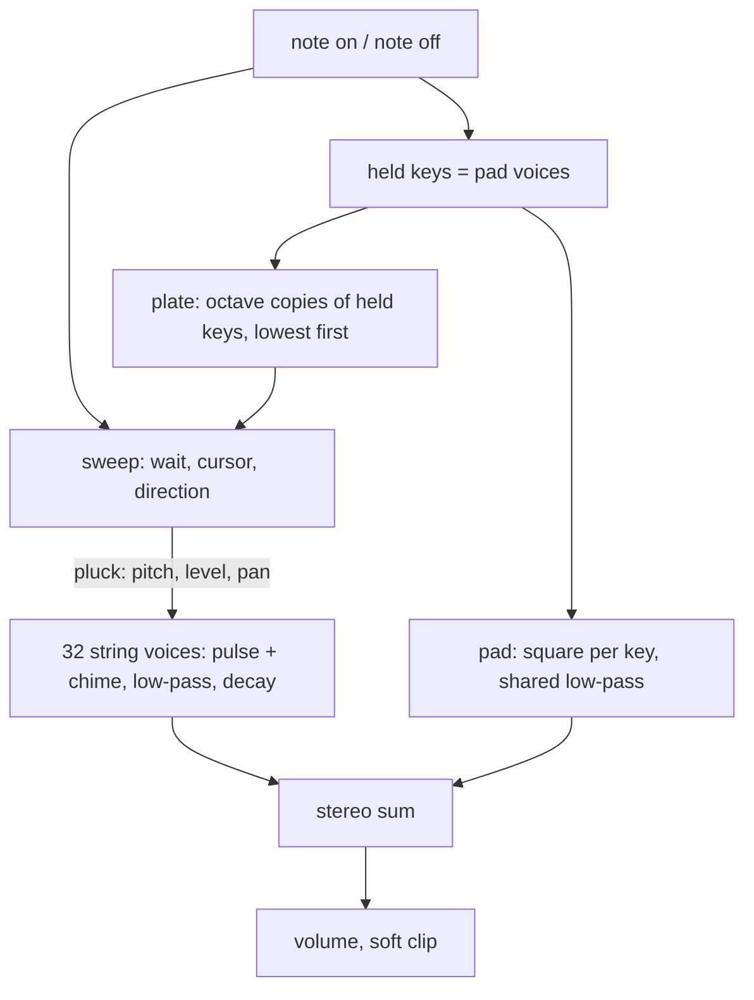
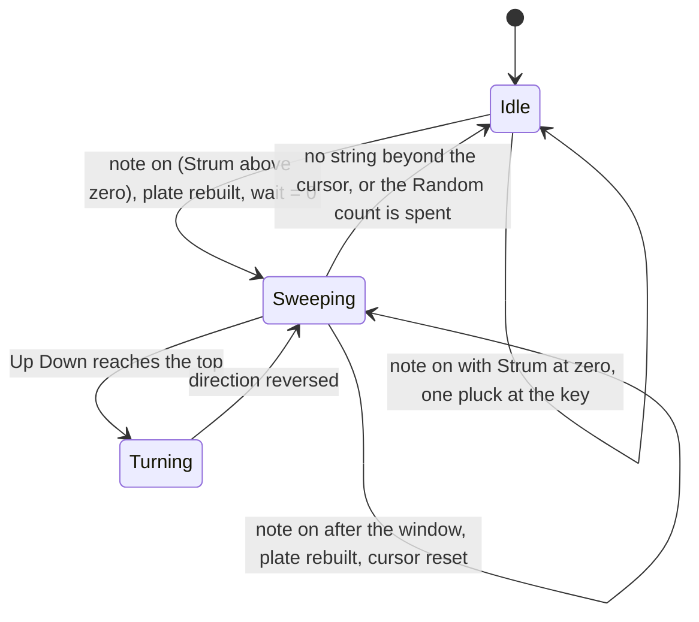

# Chord Harp Device - Plan

## Goal Capsule

- **Objective:** A musician loads "Chord Harp" in Ambient Town, holds a chord and hears it swept across a plate of soft electronic plucks over several octaves, in the chord and never mechanical, with a quiet held chord underneath.
- **Means:** One spec device on `cpp/kit`, built by `docs/recipes/adding-a-spec-device.md`, whose strum runs as a sample-counter state machine on the audio thread (KTD2).
- **Authority:** the build brief and task file (owner and integrator direction, carried as session-settled entries below) → this Product Contract → Planning Contract → unit text → implementer judgment → repo conventions.
- **Execution profile:** one branch, `device/chord-harp`, in a clone with no remote. Commits are local. No push, no pull request, no CI watch.
- **Stop conditions:** stop and report when a session-settled decision cannot work, when the wasm smoke stays over 5 % of real time after the cheaper options in KTD6 are spent, or when a fix would need a hand edit to `cpp/kit/**`, `cpp/test/support/**` or `scripts/**`.
- **Tail ownership:** the integrator collects the branch, regenerates the shared lists, adds the `plucked` category, re-measures cost on a quiet machine and plays the instrument in headless Chromium.
- **Honesty line:** nobody can listen in this environment. Every claim about the sound in this plan is a measurement or a design choice, and the harness is the only ear.

---

## Product Contract

### Summary

Add the spec device `chord-harp` ("Chord Harp") to live-mix with eight parameters, five device presets, a native harness that measures the traits the instrument is known by, its `.wasm`, and five factory presets.

### Problem Frame

The owner asked for fifteen instruments ambient music uses that the app lacks, each grounded in research, "super simple" and at "the highest quality".
The research (`synths.md` section 7, the Suzuki Omnichord family) finds one thing nothing in the app does: turning a held chord into a glissando.
It also names what makes an imitation sound fake: a strum that is perfectly even, or one that plays a note outside the held chord.
The app sends notes, not chord buttons, so the keys held have to be the chord.

### Key Decisions

- **Eight knobs from research section 7.5** (session-settled: user-directed — chosen over a larger panel with waveform and filter-envelope knobs: "super simple", at most ten parameters). Governs R9, R10.
- **Plucked strings ring out; the pad follows the keys; one key with Strum at zero is a plain pluck** (session-settled: user-directed — chosen over gating plucks on key release: a strum plate rings after the finger leaves). Governs R3, R5.
- **The strum plays only notes of the held chord, unevenly like a finger, and never clicks on a chord change** (session-settled: user-directed — chosen over an even, block-quantised arpeggio: the research names an even strum or a wrong note as what makes it sound fake). Governs R1, R2, R6.
- **Factory presets sit under `keys` with the `chord` audition phrase** (session-settled: user-directed — chosen over `bell` or `string`: the integrator adds `plucked` later and wants it there). Governs R19.

### Requirements

**The strum**

- R1. The keys held are the chord. Each key press sweeps the chord across a plate of strings that starts at the lowest held key, covers Span octaves upward, and holds only octave copies of held keys.
- R2. The sweep is uneven like a finger: the gap and the level differ from pluck to pluck, drawn from a generator seeded in `init`, so two inits render identically.
- R3. Strum sets the mean time between strings. At zero a key press is one pluck at that key's pitch.
- R4. Direction chooses Up, Down, Up Down (there and back in one press) or Random (as many plucks as the plate has strings, in random order).
- R5. A plucked string rings for Sustain whether or not its key is still down. The pad sounds only while keys are down.
- R6. A key pressed during a sweep starts the sweep again on the chord now held, with no click. Keys pressed within the gather window of KTD3 form one chord and one sweep.

**The sound**

- R7. Each string is a narrow pulse with a quieter octave partner through a low-pass that tracks the key a little, with an attack near 2 ms and an exponential decay.
- R8. Spread places low strings left and high strings right. Left plus right never cancels.
- R9. Tone sets the brightness of the plucks, Pad the level of the held chord underneath, Volume the output level.

**The bar every device clears**

- R10. Eight parameters including `volume`, each with a one or two sentence description. Five device presets with plain names. No brand or model name outside `origin.note`, which names the real instrument, what is modelled, what is simplified and which figures are choices.
- R11. The recipe rules of `docs/recipes/adding-a-spec-device.md` hold: no allocation, `init` resets everything, smoothing, block-size independence at 1, 128 and 2048 frames, sleep to exact zero, denormals flushed, bounded under 96 stacked notes, bad input survivable, `kit::soft_clip` at the output, storage sized for 96 kHz.
- R12. One key at gain 0.7 peaks between -24 and -10 dBFS at the default volume, at gain 0.8 between -22 and -16 dBFS, and ten held keys stay under the clip knee.
- R13. Every string is within ±3 cents of its pitch from C2 to C6 at 44.1, 48 and 96 kHz.
- R14. At the highest string, energy between the harmonics is at least 50 dB under the note.
- R15. With eight notes held the wasm smoke costs under 5 % of real time. The aim is under 3 %.
- R16. Voice stealing, re-striking a held key, note off and moving Tone while sounding do not step.
- R17. The native harness measures at least eight traits beyond conformance, each with a tolerance that fails when the trait is missing.

**What ships**

- R18. The generated files and `src/dsp/wasm/chord-harp.wasm` are committed.
- R19. `src/dsp/factory/presets/chord-harp.ts` exports `CHORD_HARP_PRESETS`: five presets, each the instrument plus one to four existing effects, category `keys`, preview `chord`, inside the bank's level limits, with ids and names unique across the bank.

### Acceptance Examples

- AE1. Covers R1, R3. Given C3, E3 and G3 pressed together with Span at 3 octaves and Direction Up, when the sweep runs, then ten plucks sound, C3 E3 G3 C4 E4 G4 C5 E5 G5 C6 in that order.
- AE2. Covers R3. Given Strum at zero, when C3, E3 and G3 are pressed, then exactly three plucks sound, at C3, E3 and G3.
- AE3. Covers R5. Given a chord swept and every key released after 100 ms with a slow Strum, when the sweep continues, then the remaining strings are still plucked and each rings for Sustain, while the pad is gone within its release.
- AE4. Covers R6. Given a slow sweep of C major half done, when F3, A3 and C4 are pressed together, then the next pluck is F3 and every later pluck is F, A or C, and the C major strings already sounding keep ringing.
- AE5. Covers R6. Given C3, E3 and G3 pressed 10 ms apart, when the sweep runs, then C3 is plucked once, not three times.
- AE6. Covers R9. Given Pad at zero and a key held, when the strings have decayed, then the output is exact zero and the device sleeps.

### Scope Boundaries

Not built, with the reason:

- Chord buttons, auto bass and the drum machine of the original. The app sends notes and holds clips; the score does that work.
- A knob for the finger's unevenness. It is fixed (KTD7); a ninth knob for a few percent of timing is not an obvious musical difference.
- Random plucks that continue for as long as keys are held. That is an arpeggiator, a different instrument; one press gives one sweep's worth of plucks.
- Decay that shortens with pitch. The electronic original has one envelope for every plate segment, and R5's measurement is simpler without it.
- A sustain pedal or latch. No host event exists for it.
- Hand edits to `cpp/kit/**`, `cpp/test/support/**`, `scripts/**`, other devices, `docs/devices.md`, `docs/factory.md`, `CHANGELOG.md`, `.changeset/**`, `package.json`. The generator's own outputs (U3) are not hand edits; the build brief allows committing them.

#### Deferred to Follow-Up Work

- The `plucked` factory category. The integrator adds it; these presets move there.
- Listening. The integrator plays every instrument in the app after all fifteen land.

---

## Planning Contract

### Key Technical Decisions

- KTD1. **The plate is octave copies of the held keys' own frequencies.** For each held key the pitch class is the fractional part of `log2(f / f_low)`; classes closer than 5 cents merge; the plate is every class in each of Span octaves above the lowest key, plus the lowest key's class once more on top. No equal-temperament grid is assumed, so a retuned host keeps its tuning. Strings above 4.3 kHz are left off the top (the plate has an edge), a key above that ceiling is folded down by octaves, and the plate holds at most 32 strings, lowest first. Serves R1, R13, R14.
- KTD2. **One sweep at a time, counted in samples inside `process`** (session-settled: user-directed — chosen over scheduling plucks per host block: 1, 128 and 2048 frames must give the same audio). The sweep keeps a wait in samples with its fractional remainder, a pitch cursor (the last plucked pitch) and a direction. Each pluck picks the next string beyond the cursor in the plate as it then stands, so a plate rebuilt mid-sweep needs no index bookkeeping. Random has no cursor: it draws a string at random, never the one just plucked, until it has made as many plucks as the plate has strings. The first pluck lands on the first sample after the key press. Serves R1, R4, R6, R11.
- KTD3. **A 30 ms gather window.** A key pressed within 30 ms of the sweep's start joins the sweep in progress: the plate is rebuilt and the sweep continues from its cursor. A key pressed later starts a new sweep. Without it a hand-rolled chord re-plucks the lowest string once per key. The figure is a choice: human chord spread is under about 30 ms, the fastest repeated notes are further apart. Serves R6.
- KTD4. **The plate is rebuilt on note on only.** Note off removes the key from the chord for the next press and releases its pad voice; it never changes the plate or a ringing string, so a sweep completes on the chord it was given. Serves R5.
- KTD5. **One voice per string pitch, 32 voices.** Plucking a string that still rings retriggers its voice (the phase runs on, the level and pan ramp over the attack), so re-strumming a chord never stacks voices. A new pitch with no free voice takes the quietest one, which fades over 2 ms and then starts the new pluck, as `cpp/devices/modal-bells/modal_bells.h` does. Serves R11, R16.
- KTD6. **The string voice.** `kit::BlepOsc` pulse at 30 % width, plus a triangle an octave up at about a third of the level whose envelope falls three times as fast, into one `kit::Svf` low-pass per voice at `corner(Tone) × (f / 261.6 Hz)^0.3`. The envelope is a linear 2 ms attack and then a decay coefficient shared by every voice, recomputed from Sustain on the control clock, so Sustain acts on strings already ringing. Tone is smoothed, and each ringing voice's filter is retuned on the control clock while it moves, so the knob is heard on strings already sounding and never steps. The triangle is the chime on the attack and leaves the pulse's weak tenth harmonic visible in the tail; it fades out for strings above about 2 kHz, where its own harmonics would fold. Every figure here is a choice; the research marks the original's waveform, filter and decay as unsure. If cost is over budget, drop the triangle once its envelope is under -60 dB, then replace the per-voice `Svf` with two one-pole stages. Serves R7, R14, R15.
- KTD7. **The finger.** Each gap is the Strum time × (1 + 0.15 u) and each level is ±1.5 dB, u uniform in ±1 from one `kit::Rng` seeded in `init` and advanced once per pluck. Strum is read at each pluck, so turning it changes a sweep in progress. Serves R2.
- KTD8. **The pad is paraphonic and its voice table is the chord.** Twelve pad voices in a `kit::VoicePool`, one per held key: a square through one shared low-pass, with an 80 ms attack and a 300 ms release so it follows the keys without clicking. A voice that is active and not releasing is a held key, which is what KTD1 reads. A thirteenth key takes a voice as the pool chooses, and the key that lost it leaves the chord. With Pad at zero and settled, the pad neither renders nor keeps the device awake. Serves R5, R9, AE6.
- KTD9. **The parameter table.** `strum` 0 to 150 ms linear, default 40, under 0.5 ms meaning single plucks; `direction` choices Up, Down, Up Down, Random; `span` choices 1 to 4 octaves, default 3; `sustain` 0.2 to 8 s log, default 3; `tone` 0 to 1, default 0.5; `pad` 0 to 1, default 0.2; `spread` 0 to 1, default 0.6; `volume` in dB. The research's "Alternate" is named "Up Down" and means there and back within one press, because its own preset note reads "one chord becomes a long falling and rising line". The descriptions of Direction, Span and Spread say what they do while Strum is at zero. Serves R3, R4, R9, R10.
- KTD10. **A chord is denser, not louder.** Pluck level scales with one over the square root of the number of pitch classes on the plate, and with the gain of the key that started the sweep, or of a louder key that joined it inside the gather window. Serves R12.
- KTD11. **Spread pans by place on the plate.** Equal-power pan from the plate's lowest string to its highest, read at the pluck and capped short of hard left and right; a single pluck with Strum at zero pans by its key about middle C. Equal-power gains of one signal never cancel in mono. Serves R8.
- KTD12. **The harness hears onsets in the audio, not in the device.** With Sustain at its minimum each pluck is at least 12 dB above the decay of the last one at a 40 ms Strum, so a short-window level trace gives onset times, and the dominant frequency after each onset gives its pitch. Pitches are read at a slow Strum, where the window after each onset is long enough to tell neighbouring chord tones apart; the 40 ms Strum is used for timing only. No test-only accessor is added to the class. Serves R17.

### High-Level Technical Design

Signal flow:

The sweep:

### Assumptions

- The gather window, the "Up Down" reading of Alternate, the plate's 4.3 kHz top edge and the sweep completing after key release are this plan's bets; no one confirmed them.
- A chord's notes from the score reach `note_on` before the next `process` call, so they form one sweep even without the gather window.
- `kit::BlepOsc` meets R14 at 4.2 kHz once the low-pass follows it. If the measurement says otherwise, the top edge of the plate comes down or the top strings lose harmonics, and the report says so.
- The default Volume is whatever makes R12 true; it is tuned on the harness and the factory bench, not chosen here.

### Sequencing

U1 before U2: the strum needs voices to pluck, and the harness helpers for pitch and decay. U3 after U2: the wasm and the cost figure need the finished DSP. U4 after U3: the factory tests render the committed `.wasm`.

---

## Implementation Units

### U1. Manifest, string and pad voices, single plucks

- **Goal:** `chord-harp` exists as a spec device that plays one clean pluck per key with Strum at zero, with the pad underneath, and passes conformance.
- **Requirements:** R3, R5, R7, R8, R9, R10, R11, R12, R13, R14, R16.
- **Dependencies:** none.
- **Files:** `cpp/devices/chord-harp/device.json`, `cpp/devices/chord-harp/chord_harp.h`, `cpp/test/chord_harp_test.cpp`, generated `cpp/devices/chord-harp/params.gen.h`, `cpp/devices/chord-harp/device_api.gen.cpp`, `src/dsp/devices/chord-harp.gen.ts`.
- **Approach:** the manifest per KTD9 with all five presets and the `origin.note`; the string voice per KTD5 and KTD6; the pad per KTD8; pan per KTD11; levels per KTD10. `init` resets every voice, smoother, clock, gate and the generator. The idle gate is excited by a ringing string, a pending sweep, or a pad voice while Pad is above zero.
- **Patterns to follow:** `cpp/devices/string-machine/string_machine.h` for the class shape, `cpp/devices/tine-piano/tine_piano.h` for a decaying voice with its own level and for note clamping, `cpp/devices/modal-bells/modal_bells.h` for the 2 ms steal, `cpp/test/tine_piano_test.cpp` for the spectrum and aliasing measurements.
- **Test scenarios:**
  - Conformance: `check_instrument` at 48 kHz with `max_peak` 1.01 and a tail that covers the longest default sweep plus the decay from full level to the idle gate's floor.
  - Pitch: with Strum at zero, C2, C3, C4, C5 and C6 at 44.1, 48 and 96 kHz are each within 3 cents.
  - Covers AE2. Three keys with Strum at zero give exactly three onsets at the three key pitches.
  - Decay: the time to -60 dB is within 20 % of Sustain at 0.5, 3 and 8 s, and is the same when the key is released at once.
  - Attack: the pluck reaches its peak within 5 ms.
  - Spectrum: in the tail the tenth harmonic is at least 12 dB under the mean of the ninth and eleventh; early in the note the octave partner raises the second harmonic above its tail level; above the Tone corner the spectrum falls at least 12 dB per octave; Tone at 1 has several times the energy above 3 kHz of Tone at 0.
  - Aliasing: at the highest string, at 44.1 and 48 kHz, energy more than a few bins from any harmonic is under -50 dB of the total.
  - Pad: with Pad at 1 and a key held, a steady level remains after the string has decayed, and it is about five times the level at Pad 0.2; after note off it is gone within a second while a string plucked late still rings. Covers AE6. With Pad at zero the output reaches exact zero with the key still held.
  - Stereo: with Spread at 1 a low key is louder left and a high key louder right; with Spread at zero left equals right; the mid level exceeds the side level.
  - Levels: with Strum at zero, one key at gain 0.7 and at 0.8 inside the R12 windows.
  - Clicks: a re-struck held key, note off with Pad at 1, a Tone sweep across its range while a chord rings, and 40 different pitches plucked 10 ms apart (stealing) each keep `max_step` within a small factor of the same passage without the event.
  - Bad input: note off for an unknown id, a NaN frequency and a 30 kHz key leave the output finite.
- **Verification:** `dev-device.sh chord-harp --native-only` prints "all passed".

### U2. The strum

- **Goal:** a key press sweeps the held chord across the plate, uneven like a finger, in four directions, and survives chord changes mid-sweep.
- **Requirements:** R1, R2, R4, R5, R6, R11, R12, R16, R17.
- **Dependencies:** U1.
- **Files:** `cpp/devices/chord-harp/chord_harp.h`, `cpp/test/chord_harp_test.cpp`.
- **Approach:** the plate per KTD1, rebuilt per KTD4; the sweep per KTD2 and KTD3; the finger per KTD7. The harness gains an onset helper per KTD12.
- **Test scenarios:**
  - Covers AE1. C3 E3 G3 at Span 3, Up: ten onsets, pitches rising, each a C, E or G within 30 cents.
  - Only chord tones in every direction: the same chord in Down, Up Down and Random gives onsets whose pitch classes are all C, E or G.
  - Direction: Down falls monotonically from C6; Up Down gives nineteen onsets that rise then fall with the top plucked once; Random gives ten onsets that are not monotonic.
  - Timing: at Strum 40 ms and at 150 ms the mean gap is within 15 % of the knob, and the gaps' standard deviation is above zero and under 30 % of the mean. Pluck peaks differ from one another and stay within 4 dB.
  - Span: for each of 1, 2, 3 and 4 octaves the highest onset is that many octaves above the lowest key, within 2 semitones.
  - Covers AE3. Keys released 100 ms into a 150 ms sweep: every string is still plucked.
  - Covers AE4. A second chord pressed mid-sweep: the next onset is its lowest key, every later onset is in the new chord, and `max_step` across the change stays within a small factor of the undisturbed sweep.
  - Covers AE5. Three keys 10 ms apart: the lowest string has one onset. Three keys 100 ms apart at a slow Strum: the sweep restarts.
  - Determinism: the same chord after a second `init` renders bit for bit the same.
  - Block size: one script of key presses rendered in blocks of 1, 128 and 2048 frames gives the same audio to within 1e-6.
  - Levels and density: at the defaults one key at gain 0.7 and at 0.8 sits inside the R12 windows; ten held keys, and sixteen overlapping strings, stay under 0.5.
  - A key above the plate's top edge still plucks its pitch class.
  - Cost: `report_cost` with a full plate ringing and the pad up.
- **Verification:** the native harness passes with at least eight labelled behaviour sections, and its printed onset tables match AE1.

### U3. The module and the shared lists

- **Goal:** the `.wasm` is built by Emscripten 4.0.15, the smoke passes inside the budget, and the shared generated lists include the device.
- **Requirements:** R15, R18.
- **Dependencies:** U2.
- **Files:** `src/dsp/wasm/chord-harp.wasm`, `src/dsp/devices/index.gen.ts`, `scripts/devices.gen.sh`, `docs/devices-generated.md` (the last three written by `node scripts/gen-devices.mjs`, never by hand).
- **Approach:** run the full `dev-device.sh chord-harp`, read the cost line, apply the cheaper options of KTD6 if it is over 3 %, then refresh the shared lists.
- **Execution note:** other builders compile on this machine at the same time, so time the smoke a few times and keep the best.
- **Test expectation:** none beyond the smoke itself; this unit packages what U1 and U2 tested.
- **Verification:** the smoke prints "ok" and a cost under 5 %; `node scripts/gen-devices.mjs --check` is clean.

### U4. Factory presets

- **Goal:** five patches an ambient musician would reach for, each the harp with one to four stock effects, inside the bank's limits.
- **Requirements:** R19.
- **Dependencies:** U3.
- **Files:** `src/dsp/factory/presets/chord-harp.ts`, `src/dsp/factory/presets/index.ts`.
- **Approach:** start from the five device presets, give each a space or echo that suits it, name effects' presets exactly as their manifests do, and tune levels with the instrument's `volume` or an effect's `mix` on the bench of `docs/factory.md`. Check ids and names against the whole bank with `git grep`.
- **Patterns to follow:** `src/dsp/factory/presets/string-machine.ts`, `src/dsp/factory/presets/tine-piano.ts`.
- **Test scenarios:**
  - Every preset validates, renders the `chord` phrase finite, peaks at or under -3 dBFS, has its loudest 400 ms between -36 and -12 dBFS and no DC offset (`factory.test.ts`).
  - Every parameter has a description that ends in a full stop, is at most 170 characters and has no dash (`param-descriptions.test.ts`).
  - On the bench each preset's width is under 0 dB and its loudest 400 ms sits with the rest of the bank, about -31 to -23 dBFS.
- **Verification:** both vitest files pass, `pnpm typecheck` is clean, prettier and eslint are clean on the files written.

---

## Verification Contract

| Gate | Command | Proves |
|---|---|---|
| Native harness, wasm build, smoke | `CXX=g++ bash scripts/dev-device.sh chord-harp`, with the Emscripten 4.0.15 environment sourced in the same shell command | R1 to R8, R11 to R18 |
| Native only, while iterating | `CXX=g++ bash scripts/dev-device.sh chord-harp --native-only` | the same, without the module |
| Generated lists current | `node scripts/gen-devices.mjs --check` | R18 |
| Descriptions and bank limits | `pnpm vitest run src/react/__tests__/param-descriptions.test.ts src/dsp/factory/__tests__/factory.test.ts` | R10, R19 |
| Bench for tuning | `FACTORY_REPORT=presets FACTORY_DEVICE=chord-harp pnpm vitest run src/dsp/factory/__tests__/report.test.ts` | R19 levels and width |
| Types | `pnpm typecheck` | R19 |
| Format and lint | `npx prettier --check` and `npx eslint` on the files written | repo conventions |

Never run `scripts/test-native.sh` or the whole `pnpm test`. A browser test has nothing to load: the device has no page of its own.

---

## Definition of Done

- Every gate in the Verification Contract passes in the clone.
- The harness has at least eight behaviour checks beyond conformance, and each fails when its trait is removed.
- The wasm smoke's cost line is recorded verbatim in the final report.
- `device.json` has eight parameters with descriptions, five presets, no brand name outside `origin.note`, and no `experimental` flag.
- No file outside this plan's lists is edited, and none of the forbidden paths in Scope Boundaries is touched.
- No abandoned experiment, debug print or WAV dump is left in the diff.
- The work is committed on `device/chord-harp`. Nothing is pushed.
- The final report names every deviation from the research brief and every review finding not applied.

---

## Sources

- `docs/recipes/adding-a-spec-device.md`: the rules R11 binds.
- Research: `synths.md` section 7 (outside this repo, in the builders' research folder), with its confidence marks. The strum plate, the chord-only sweep and the sustain control are marked solid or likely; waveform, filter and decay figures are marked unsure.
- `cpp/kit/osc.h`: `BlepOsc` states aliasing under -60 dB for fundamentals under a tenth of the sample rate, which is why the plate stops at 4.3 kHz.
- `cpp/test/support/test_kit.h`: `check_instrument` does not test block-size independence, so U2 does.
- `scripts/smoke-wasm-device.mjs`: the cost load is eight notes at once, a diminished seventh over two octaves, held for eleven seconds.
- `src/dsp/factory/phrases.ts`: the `chord` phrase is five keys pressed together and held 4.5 s.
