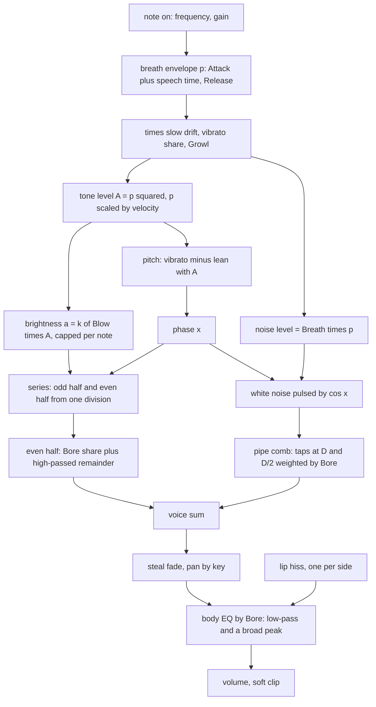

# Clarinet Device - Plan

## Goal Capsule

- **Objective:** A musician can load an instrument called Clarinet in live-mix and play a soft reed line or chord that is recognisably a clarinet, a bass clarinet, a subtone saxophone or a duduk, from C2 to C6, with five factory presets to start from.
- **Means:** An open-loop driven pipe, one phase per voice (KTD1), in a kernel header of its own (KTD2), voiced by eight knobs (KTD3).
- **Authority:** `/home/claude/research/BUILD-BRIEF.md` (the bar), then `/home/claude/research/tasks/clarinet.md` (the integrator's decisions), then `docs/recipes/adding-a-spec-device.md` (the recipe), then `/home/claude/research/acoustic.md` section 2 and the shared kernel (the acoustics). Where they disagree the earlier one wins.
- **Execution profile:** One builder, no human present, no ears. Every claim about the sound is a measurement in the native harness.
- **Stop conditions:** A settled decision (KTD1, KTD2, the Key Decisions) turns out not to work. The wasm cost with eight notes cannot be brought under 5 % of real time. A file on the do-not-edit list would have to change.
- **Who finishes:** The builder commits on `device/clarinet`. There is no remote, so nothing is pushed and no pull request is opened. The integrator collects the branch, regenerates the shared lists and adds the `wind` category.

---

## Product Contract

### Summary

Add the spec device `clarinet` ("Clarinet") to live-mix: a polyphonic soft reed with eight voices.
Its tone is a closed-form harmonic series whose brightness follows the breath sample by sample, its air is noise shaped by a passive pipe, and one Bore knob moves it from a cylinder (clarinet) to a cone (saxophone).
It ships with a native harness that measures the traits, its `.wasm`, six device presets, a description on every parameter and five factory presets.

### Problem Frame

Ambient Town has pads, keys, bells, strings, voices and organs, and no wind instrument.
Ambient jazz and modern ambient lean on a soft reed that can start from nothing: bass clarinet drones, subtone tenor, duduk.
The existing devices cannot stand in for it. Ember's filtered square and Wavetable's "Hollow" have no breath shaped by a bore, no subtone, no brightness tied to pressure inside the note and no pitch that leans with level (research section 2.8).

### Key Decisions

- **At most nine knobs, eight voices, a warm low clarinet line as the default.** (session-settled: user-directed — chosen over the twelve-parameter norm of the older devices: the owner asked for "super simple".) Governs R8, R9, R10.
- **The harness measures the traits.** (session-settled: user-directed — chosen over conformance-only tests: nobody can listen here, so a trait that is not measured is not known to be there.) Governs R1 to R7, R16.
- **Factory presets go under `wind` once it exists, auditioned with the `line` phrase.** (session-settled: user-directed — chosen over `voice` or `pad` as the permanent home: the integrator is adding `wind` for flutes, reeds and brass.) Governs R19.

### Requirements

**The traits a listener knows it by**

- R1. Tuning: a held note at the app's playing gain (0.8) is within ±3 cents of the played frequency from C2 to C6 at 44.1, 48 and 96 kHz.
- R2. Hollow low register: with Bore at the cylinder end, harmonics 2 and 4 of C3 are at least 20 dB below the mean of harmonics 1, 3 and 5. Above the tone-hole cutoff (1.5 kHz) even and odd harmonics come within 8 dB of each other.
- R3. Cone: with Bore at the saxophone end, harmonic 2 of C3 is within 10 dB of harmonic 1.
- R4. Brightness follows breath inside one note: harmonic 3 rises about three times as fast as harmonic 1 (in dB) through a slow attack, falls with it through the release, and is at least 25 dB under harmonic 1 at gain 0.2.
- R5. Subtone: the share of breath noise against the tone rises as the level falls, across velocities and through the release. The subtone preset has a harmonic-to-noise ratio between 5 and 20 dB.
- R6. The breath noise carries the pipe: at the cylinder end its spectrum peaks at odd multiples of the note and dips at even ones by at least 6 dB; at the cone end it peaks at every multiple.
- R7. It speaks like a pipe. Low notes take longer to speak than high ones at the shortest Attack. No harmonic is stronger against the fundamental during the onset than it is in the held note (no chiff). Pitch leans flat as the note gets louder, by 2 to 8 cents between gain 0.2 and gain 1.0. Vibrato arrives late, at about 5 Hz.

**Controls**

- R8. Eight parameters: Bore, Blow, Breath, Attack, Release, Vibrato, Growl, Volume. Each changes the sound audibly across its whole range, and each has a description of one or two plain sentences.
- R9. Eight voices. A ninth note steals the quietest voice with a fade of about 2 ms; a key struck again while held lets the old voice go in about 25 ms.
- R10. The default patch is a warm clarinet meant for a single low line. It is the first of at least five device presets with plain names.
- R11. Names are neutral: no brand or model in the id, name, parameters or presets. `origin.note` names the real instruments and the research, says what is simplified, which figures are choices, and that it is not a circuit or sample emulation.

**The house rules (recipe and brief)**

- R12. No allocation; `init` resets everything so two inits render bit-identically; output does not depend on block size; the device sleeps to exact zero; denormals are flushed; storage is sized for 96 kHz.
- R13. Bounded and survivable: 96 stacked notes, every parameter extreme, NaN and absurd notes stay finite and under the soft clip.
- R14. Levels: one note at gain 0.7 peaks between -24 and -10 dBFS at the default volume, one at gain 0.8 between -22 and -16 dBFS, and ten held notes stay under the clip knee (0.5).
- R15. No audible aliasing: on a high note at full Blow, energy at fold-back frequencies is at least 50 dB under the fundamental.
- R16. No clicks: stealing, re-striking, note off and sweeping Blow or Bore while a note sounds add no step beyond the waveform's own slope.
- R17. Mono-compatible stereo: the side signal sits at least 10 dB under the mid.
- R18. Cost: eight held notes cost under 5 % of real time in the wasm smoke, with 3 % as the aim. `experimental` is not set.

**What ships**

- R19. Five factory presets in `src/dsp/factory/presets/clarinet.ts` (`CLARINET_PRESETS`), each the instrument plus one to four existing effects, inside the bank's level limits, with ids and names unique across the bank.
- R20. The generated files for the device are committed: `params.gen.h`, `device_api.gen.cpp`, `src/dsp/devices/clarinet.gen.ts`, `src/dsp/wasm/clarinet.wasm`, and the refreshed shared lists.

### Scope Boundaries

- Not built: the self-oscillating reed waveguide (research 2.4 B). It stays the upgrade path the research describes.
- Not built: a Vibrato rate knob. The rate is fixed at 5 Hz, inside the 4 to 6 Hz the research gives for jaw vibrato. Evidence that would change the call: a listener finding the duduk preset needs a slower rate.
- Not built: legato or glide between notes. Each note is its own breath.
- Not edited: `cpp/kit/**`, `cpp/test/support/**`, `scripts/**`, other devices, `docs/devices.md`, `docs/factory.md`, `CHANGELOG.md`, `.changeset/**`, `package.json`.

#### Deferred to Follow-Up Work

- The `wind` factory category, and moving these presets into it (the integrator).
- Lifting the driven-pipe kernel into `cpp/kit` once Flute and Horns land (the integrator).
- The device's entry in `docs/devices.md` (the integrator).

### Sources

- `/home/claude/research/acoustic.md`: "Shared kernel for the three wind devices" and section 2. Its web sources were found by title only; the technical content is the researcher's own knowledge, with confidence marks.
- `cpp/devices/organ/organ.h`: the closed-form rank `sin x / (1 - 2a·cos x + a²)` and its band-limit by capping `a`.
- `cpp/devices/bowed-string/bowed_string.h`: why a memoryless self-oscillating junction was dropped; `damp_delay`, the phase delay of a one-pole taken off a delay line.
- `cpp/devices/string-machine/` and `cpp/test/string_machine_test.cpp`: the reference instrument and harness.
- `cpp/test/choir_test.cpp`: `pitch_track`, a pitch-over-time measurement to adapt for vibrato and pitch against level.

---

## Planning Contract

### Key Technical Decisions

- KTD1. **Open-loop driven pipe.** (session-settled: user-directed — chosen over the single-reed waveguide of research 2.4 B: Bow's header records that a memoryless self-oscillating junction fell into wrong regimes, and a driven pipe cannot squeal, jump register or fail to speak.) One phase accumulator per voice drives a closed-form series; nothing nonlinear closes a loop.
- KTD2. **The kernel is `cpp/devices/clarinet/driven_pipe.h`, namespace `livemix::clarinet`, with no clarinet voicing in it.** (session-settled: user-directed — chosen over putting it in `clarinet.h` or in `cpp/kit`: Flute and Horns are being built on the same idea and the integrator may lift the common part; the kit is off limits.) It holds the tone series, the brightness cap, the speech time and the pipe comb. Every constant that makes it a clarinet lives in `clarinet.h`.
- KTD3. **Eight knobs: Bore, Blow, Breath, Attack, Release, Vibrato, Growl, Volume.** The research proposes nine; Vibrato rate is dropped (see Scope Boundaries). Growl stays because it is one multiplication and a colour no other knob reaches.
- KTD4. **One division gives both halves of the series.** With `s = sin x`, `c = cos x`, `D1 = 1 - 2a·c + a²`, `D2 = 1 + 2a·c + a²`: odd harmonics are `(1 - a²)·c / (D1·D2)` (cosine phase), even ones `2a·s·c / (D1·D2)` (sine phase), and harmonic h has amplitude `a^(h-1)` in both. This follows from `1 - 2a²·cos 2x + a⁴ = D1·D2` and replaces the research's two closed forms and a crossfade. The harness checks it against the explicit sums. (Found while building: with the odd half in sine phase, as first written here, a clarinet tone is nearly flat-topped, and eight such notes pass the clip knee before one note reaches the level R14 asks for. In cosine phase the odd half is a pulse, which leaves room for both. The even half stays a quarter turn away so the two do not peak together at the cone end.)
- KTD5. **Brightness is proportional to the tone's own level: `a = k·A`.** Harmonic h is then `A·(k·A)^(h-1)`, the h-th power of the fundamental, which is Worman's law stated on what is heard. Blow sets `k`. The series is band-limited by capping `a` per note so the first harmonic above Nyquist is at -60 dB.
- KTD6. **Breath pressure `p` is the envelope; the tone level is `A = p²` and the noise follows `p`.** A reed has a threshold: near it the tone grows faster than the pressure. So the air is heard first at the onset, outlasts the tone in the release, and its share rises as the level falls (R5). This departs from the shared kernel's `noise ∝ p^ν` with ν of 1.5 to 2, which the research marks "likely" for jet noise; section 2.4 and the integrator both ask for the opposite trend in a reed. It is a voicing choice and `origin.note` says so. The kernel takes no exponent: the voicing hands it the tone level and the noise level.
- KTD7. **Even harmonics return above the cutoff through a two-pole high-pass.** The even half of the series is scaled by Bore, and at the cylinder end what is left of it passes a fixed 1.5 kHz high-pass (two one-poles), so the low register stays hollow and the upper one fills in (R2). The cutoff belongs to the instrument, so it does not track the key.
- KTD8. **One delay line, two taps, morphs the pipe.** `y[n] = in + LP(g·e·y[n - D] - g·(1 - e)·y[n - D/2])`. At odd multiples of the note the loop gain is `g` for any `e`; at even multiples it is `g·(2e - 1)`: a dip for the cylinder, flat halfway, a peak for the cone. `|g·e| + |g·(1 - e)| = g < 1`, so it is stable for every Bore. Both taps are Hermite reads shortened by the low-pass's phase delay at the fundamental, as Bow does.
- KTD9. **The comb stays at the fingered pitch.** Vibrato and the pitch lean move the reed's phase, not the bore's length.
- KTD10. **Pitch leans around the playing level.** Cents are `-6·(A - A_ref)` with `A_ref` the level at gain 0.8, so the note the app plays is in tune (R1), a louder one is flat and a fading one drifts sharp (R7). Six cents per unit is a choice inside the research's direction.
- KTD11. **Speech time is added to Attack.** The breath rises over `Attack + 8 / f` seconds. Eight periods is a choice near the research's `Q / (π·f)` with Q of a few tens.
- KTD12. **A stolen voice fades, then starts.** It ramps to zero over 2 ms, clears its comb and begins the new note from silence, so no pitch jump is heard on a sounding voice (R16).
- KTD13. **Stereo is small and safe.** Voices lean a little left or right by key; an unpitched lip hiss runs on two independent noise sources, one per side, scaled by the root of the summed breath. Tone and pipe noise stay in the middle (R17).
- KTD14. **Slow modulators are interpolated, not stepped.** Vibrato, the breath's slow drift and the envelope times are computed every 32 samples on `kit::ControlClock` and ramped linearly to the next tick; Growl is read per sample. Output does not depend on block size (R12).

### High-Level Technical Design

The kernel (`driven_pipe.h`) owns the series, the brightness cap, the speech time and the pipe comb. Everything else in the diagram is voicing in `clarinet.h`.

### Assumptions

- No human is present. Every product fork below was decided by the builder and can be reversed by changing a constant or a manifest value.
- Parameter ranges and defaults (starting points; the harness and the bench settle the exact numbers): Bore 0..1 default 0; Blow 0..1 default about 0.55; Breath 0..1 default about 0.3; Attack 0.015..4 s log, default about 0.12; Release 0.03..5 s log, default about 0.3; Vibrato 0..1 default 0 (a clarinet is usually played straight; the slow drift of the breath keeps a held note from standing still); Growl 0..1 default 0; Volume -48..6 dB, default set by R14.
- Velocity is breath pressure: `p` peaks at `0.3 + 0.7·gain`, so a note at gain 0 still speaks, as air and a hum.
- Device presets: Warm clarinet (the default), Bass clarinet, Subtone tenor, From nothing, Hollow section, Duduk.
- Until `wind` exists the factory presets sit under `voice`, the closest category (a single sung or blown line), with `preview: 'line'` unless a preset is made for chords or low drones.
- The research's figures marked "unsure" or "voicing" are treated as starting points: the 1.5 kHz cutoff, the body EQ, the growl rate (about 30 Hz), the comb gain (about 0.9) and its low-pass.
- The research's acceptance check 10 ("-40 dB within the first 100 ms of a 2 s attack") is replaced by a monotonic-rise check: with `A = p²` the tone is deliberately lower than that early on, which is the fade-in from nothing the same section asks for.

### Risks

- **Nobody can listen.** The measurements say the traits are present, not that the result is beautiful. Mitigation: the effort goes where the research names the fake (brightness that does not follow level, a hard attack), and the report says plainly what was not heard.
- **Noise measurements need the tone out of the way.** The harness subtracts a Breath 0 render from a Breath 1 render of the same note. This holds only while the tone path does not depend on Breath and the sum stays under the clip knee; U3 keeps both true and checks the residual.
- **Machine load skews the cost line.** Fourteen other builders compile at the same time. Mitigation: re-run the smoke and report the best of several.

---

## Implementation Units

### U1. Driven-pipe kernel

- **Goal:** The voicing-free blocks Flute and Horns could share.
- **Requirements:** R2, R3, R4, R6, R15; KTD2, KTD4, KTD5, KTD8.
- **Dependencies:** none.
- **Files:** `cpp/devices/clarinet/driven_pipe.h` (new), `cpp/test/clarinet_test.cpp` (new, kernel checks).
- **Approach:**
  1. The tone: both halves of the series from the sine and cosine of the phase and `a` (KTD4).
  2. The brightness cap for a frequency and a sample rate (KTD5), with a small margin for vibrato.
  3. The speech time for a frequency and a number of periods (KTD11 uses it).
  4. The pipe comb as a template on the line size: clear, tune (frequency, sample rate, loop low-pass cutoff), and a per-sample process taking the input and the two tap gains (KTD8). Denormals flushed on the write. Delay clamped so a Hermite read is always valid.
  5. A header comment that states the model, the closed forms and what the voicing must supply.
- **Patterns to follow:** `cpp/devices/organ/organ.h` (`rank`), `cpp/devices/bowed-string/bowed_string.h` (`damp_delay`), `cpp/kit/delay.h` (`read_hermite`).
- **Test scenarios:**
  - For several phases and `a` of 0.1, 0.5 and 0.8, the odd half equals the explicit sum `Σ a^(h-1)·cos(h·x)` over odd h and the even half `Σ a^(h-1)·sin(h·x)` over even h, to within 1e-4.
  - The cap: for 262 Hz, 1047 Hz and 2093 Hz at 44.1 and 96 kHz, `a_cap^(H-1)` is at or under 0.001 where H is the first harmonic above Nyquist.
  - The comb as a cylinder (`e = 0`) on white noise at 130.81 Hz: the strongest response between 100 and 170 Hz is within 1 % of 130.81 Hz, and the level at 2·f is at least 6 dB under the levels at f and 3·f.
  - The comb as a cone (`e = 1`): the level at 2·f is within 4 dB of the level at f.
  - The comb at `e = 0.5` and at both ends stays bounded on 2 s of full-scale noise.
- **Verification:** the kernel checks pass in the native harness; the header compiles alone with `-Wall -Wextra`.

### U2. Manifest and voicing

- **Goal:** The device: its parameters, presets and origin, and the class that turns the kernel into a clarinet.
- **Requirements:** R1 to R18; KTD1, KTD3, KTD6, KTD7, KTD9 to KTD14; the Key Decisions on knobs and voices.
- **Dependencies:** U1.
- **Files:** `cpp/devices/clarinet/device.json` (new), `cpp/devices/clarinet/clarinet.h` (new), `cpp/devices/clarinet/params.gen.h` and `cpp/devices/clarinet/device_api.gen.cpp` (generated).
- **Approach:**
  1. `device.json`: id, name, `category: instrument`, class `Clarinet`, header `clarinet.h`, the eight params with descriptions (R8), six presets (R10), `origin` (R11).
  2. `Clarinet : kit::DeviceBase`, a `kit::VoicePool` of eight voices, `kit::Adsr` as the breath `p` with its release doubled so the tone (`p²`) is 60 dB down after Release.
  3. `note_on`: clamp frequency (25 Hz up to the lower of 4.2 kHz and a fifth of the sample rate) and gain, re-strike rule, steal rule (KTD12), per-note constants (increment, cap, comb tuning, speech time, pan).
  4. `control()` every 32 samples: envelope times, vibrato with its late arrival, drift, the pitch lean (KTD10), ramps to the next tick (KTD14), body EQ when Bore has moved.
  5. `process`: idle gate, per-sample voice loop as in the diagram, lip hiss, body EQ, volume, `kit::soft_clip`.
  6. Set the voice gain and the default volume from R14.
- **Execution note:** Bring up the tone path and its checks first, then the noise path, then the modulators; level and default values last, against the harness and the bench.
- **Patterns to follow:** `cpp/devices/string-machine/string_machine.h` (shape of an instrument), `cpp/devices/organ/organ.h` (one phase, pressure coupling), `cpp/devices/choir/choir.h` (late vibrato, shared breath).
- **Test scenarios:** the device's behaviour is asserted in U3; this unit is done when U3's scenarios pass.
- **Verification:** `scripts/dev-device.sh clarinet --native-only` generates, compiles without warnings and passes.

### U3. Native harness

- **Goal:** Conformance, then a measurement for every trait in R1 to R18.
- **Requirements:** R1 to R18; the Key Decision on measuring.
- **Dependencies:** U1, U2.
- **Files:** `cpp/test/clarinet_test.cpp`.
- **Approach:** `check_instrument` first (tail from the longest default release, `max_peak` 1.01). A `plain()` fixture: Vibrato 0, Growl 0, Breath 0, short envelope, Volume 0 dB. Helpers: harmonic level in dB, the noise part of a render (Breath 1 minus Breath 0), averaged noise level at a frequency, a pitch track.
- **Patterns to follow:** `cpp/test/string_machine_test.cpp`, `cpp/test/choir_test.cpp` (`pitch_track`, `mid`, `noise_band`).
- **Test scenarios:**
  - Tuning (R1): C2, C3, C4, C5, C6 and B♭1 at 44.1, 48 and 96 kHz, gain 0.8, held 2 s: within ±3 cents.
  - Hollow register (R2): Bore 0, C3: harmonics 2 and 4 at least 20 dB under the mean of 1, 3 and 5.
  - Cutoff (R2): Bore 0, high Blow: an even harmonic above 2 kHz is within 8 dB of its odd neighbours.
  - Cone (R3): Bore 1, C3: harmonic 2 within 10 dB of harmonic 1.
  - Power law (R4): Attack 2 s: the slope of harmonic 3 against harmonic 1 in dB, fitted over the rise, is between 2.5 and 3.5.
  - Release darkens (R4): once the fundamental has fallen about 10 dB in the release, the ratio of harmonic 3 to harmonic 1 is at least 6 dB under its held value.
  - Velocity (R4): harmonic 3 against harmonic 1 at gain 1.0 is at least 15 dB above the same at gain 0.2, and at gain 0.2 it is under -25 dB.
  - No chiff (R7): in each 10 ms window of the first 40 ms, harmonics 2 and 3 against the fundamental do not exceed the held ratio by more than 2 dB.
  - Subtone by velocity (R5): noise against tone at gain 0.2 is at least 5 dB above the same at gain 1.0.
  - Subtone in the release (R5): noise against tone late in the release is above the held ratio.
  - Subtone preset (R5): harmonic-to-noise ratio between 5 and 20 dB, harmonics above the third at least 30 dB under the fundamental.
  - Pipe on the noise (R6): Bore 0, C3: noise at 1, 3 and 5 times the note at least 6 dB above noise at 2 and 4 times. Bore 1: noise at 2 times the note at least 6 dB above noise at 1.5 and 2.5 times.
  - Speech time (R7): at the shortest Attack, the time for C2's fundamental to reach half its held level is at least three times C5's, and under 250 ms.
  - Pitch against level (R7): the pitch at gain 1.0 is 2 to 8 cents under the pitch at gain 0.2.
  - Vibrato (R7): Vibrato 1: the pitch track swings at 5 Hz ± 0.4 Hz by at least ±15 cents once arrived, by under a quarter of that in the first 200 ms, and its mean stays within 3 cents. Vibrato 0: the track's spread is under 1 cent.
  - Growl (R8): Growl 1: the level swings by at least 3 dB at 20 to 45 Hz; Growl 0: under 0.5 dB.
  - Attack and Release (R8): Attack 2 s rises without a falling window and is under -20 dB at 0.2 s; Release 1 s is 60 dB down after its time and exactly silent soon after.
  - Levels (R14): gain 0.7 and gain 0.8 peaks at the default patch in their windows; ten notes at gain 0.8 peak under 0.5.
  - Aliasing (R15): C7 (2093 Hz) at 44.1 kHz, Blow 1, gain 1, both ends of Bore: every fold-back frequency of the harmonics above Nyquist is at least 50 dB under the fundamental.
  - Clicks (R16): a ninth note on eight held; the same key struck again; note off; Blow swept 0 to 1 and Bore swept 0 to 1 in one step while sounding: `max_step` stays within a small margin of the steady note's own.
  - Stereo (R17): the default patch with Breath 1: side at least 10 dB under mid; left and right are not identical.
  - Block size (R12): one held note rendered in blocks of 1, 128 and 2048 frames differs by under 1e-4.
  - Cost (R18): `report_cost` with eight notes held.
- **Verification:** the harness ends in `clarinet device tests: all passed`.

### U4. WebAssembly module and cost

- **Goal:** The `.wasm` and its TypeScript descriptor, inside the budget.
- **Requirements:** R18, R20.
- **Dependencies:** U2, U3.
- **Files:** `src/dsp/devices/clarinet.gen.ts`, `src/dsp/wasm/clarinet.wasm` (both generated).
- **Approach:** the full `scripts/dev-device.sh clarinet` with the Emscripten environment sourced in the same command. If the cost is near 3 %, look first at the voice loop's divisions and Hermite reads.
- **Test expectation:** none beyond the wasm smoke the script runs; the unit builds nothing of its own.
- **Verification:** the smoke passes and prints a cost under 5 % (best of several runs recorded).

### U5. Factory presets and shared lists

- **Goal:** Five presets someone would reach for, and a tree that typechecks.
- **Requirements:** R19, R20; the Key Decision on the category.
- **Dependencies:** U4.
- **Files:** `src/dsp/factory/presets/clarinet.ts` (new), `src/dsp/factory/presets/index.ts` (register), shared lists refreshed by `scripts/gen-devices.mjs` (`src/dsp/devices/index.gen.ts`, `scripts/devices.gen.sh`, `docs/devices-generated.md`).
- **Approach:** five presets from the device presets plus one to four effects each (a room or hall, tape, a tape echo, a shimmer or a large space), category `voice` for now, `preview` chosen per preset. Tune each with the bench at the instrument's volume or an effect's mix.
- **Patterns to follow:** `src/dsp/factory/presets/string-machine.ts`, `docs/factory.md` ("Adding to the bank").
- **Test scenarios:**
  - `src/dsp/factory/__tests__/factory.test.ts` passes: each preset is listed properly, peaks at or under -3 dBFS, its loudest 400 ms is between -36 and -12 dBFS, and it has no DC.
  - `src/react/__tests__/param-descriptions.test.ts` passes: every Clarinet parameter has a description that fits the info view.
  - No preset id or name collides with one already in `src/dsp/factory`.
- **Verification:** both vitest files pass, `pnpm typecheck` passes, and prettier and eslint are clean on the files written by hand.

---

## Verification Contract

| What | Command | Proves |
|---|---|---|
| Native harness | `CXX=g++ bash scripts/dev-device.sh clarinet --native-only` | R1 to R17 |
| Wasm build and smoke | `source /home/claude/emsdk/emsdk_env.sh >/dev/null 2>&1; CXX=g++ bash scripts/dev-device.sh clarinet` | R18, R20 |
| Shared lists | `node scripts/gen-devices.mjs` | R20 |
| Bank and descriptions | `pnpm vitest run src/react/__tests__/param-descriptions.test.ts src/dsp/factory/__tests__/factory.test.ts` | R8, R19 |
| Preset levels (bench) | `FACTORY_REPORT=presets FACTORY_DEVICE=clarinet pnpm vitest run src/dsp/factory/__tests__/report.test.ts` | R19 tuning |
| Types | `pnpm typecheck` | R20 |
| Format and lint | `npx prettier --check` and `npx eslint` on the hand-written files | house style |

Not run, by the brief: `scripts/test-native.sh` and the whole `pnpm test`. No browser test applies: the device has no page of its own.

---

## Definition of Done

- Every requirement R1 to R20 is met and its measurement is in `cpp/test/clarinet_test.cpp` or in the vitest files named above.
- The native harness, the wasm smoke, both vitest files, typecheck, prettier and eslint pass in the clone.
- The wasm cost line is under 5 % with eight notes.
- No file on the do-not-edit list has changed.
- Experiments that did not pan out are removed from the diff.
- The work is committed on `device/clarinet`; nothing is pushed.
- The final report names every departure from the research and every review finding not applied.
