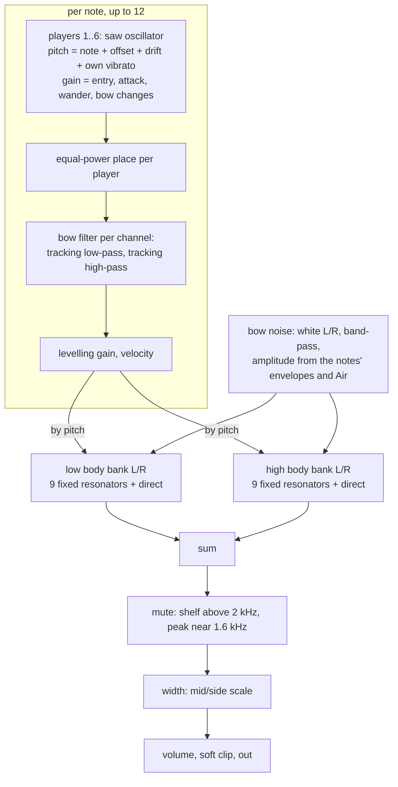
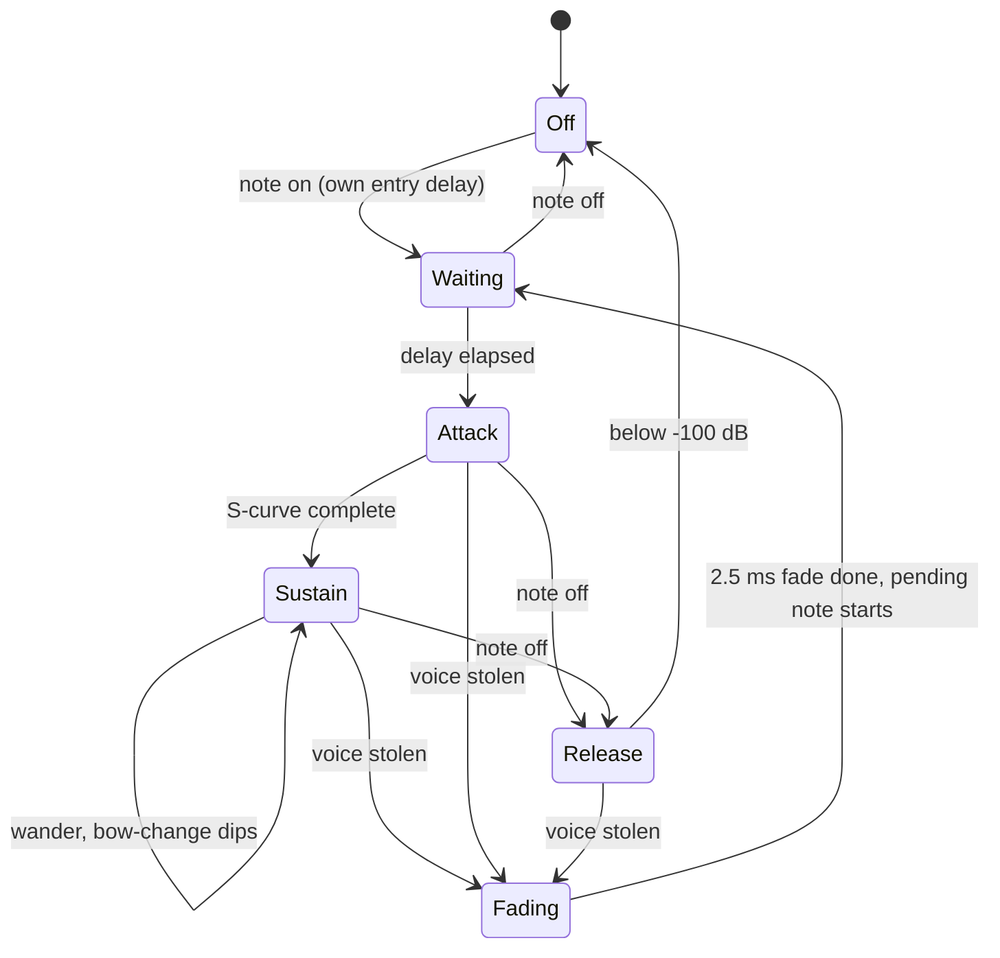

# Chamber Strings Device - Plan

One new spec instrument for `live-mix`, id `chamber-strings`, built by `docs/recipes/adding-a-spec-device.md`. The research it models is section 9 of the integrator's string research file (`strings.md`, outside this repo); every figure this plan takes from it is restated here so the plan stands alone.

---

## Goal Capsule

- **Objective:** A musician loads "Chamber Strings", holds a chord and hears a small bowed section that keeps moving without ever cycling: each note is a few players who disagree slightly, heard through wooden bodies, with bow noise, mutes and a bow that can move from the fingerboard to the bridge. It plays from C2 to C6 and costs little enough to sit in a session with thirty other devices.
- **Means:** Per-player band-limited sawtooths through fixed body resonators (KTD1).
- **Authority:** The integrator's settled decisions (Key Decisions, KTD1, KTD10) → the Requirements → the Planning Contract → unit text → implementer judgment → repo conventions.
- **Execution profile:** One implementer, one branch (`device/chamber-strings`), local commits only. The clone has no remote: nothing is pushed and no pull request is opened.
- **Stop conditions:** Stop and report when the eight-note wasm cost cannot be brought under 5 % of real time by the reductions in KTD11, or when evidence shows a settled decision cannot work (`settled-decision-invalidated`).
- **Who finishes:** The integrator collects the branch, regenerates the shared lists, adds the device to `docs/devices.md` and plays it in the app. Nobody can listen in the build environment: every claim about the sound in this plan is a measurement.

---

## Product Contract

### Summary

Add the instrument `chamber-strings` ("Chamber Strings"). Each held note is one to six players, every one with their own pitch, drift, vibrato, entry and bow changes. Their sum passes through body resonances that stay at fixed frequencies whatever note is played, with bow noise on top. Ten knobs. It ships with a native harness that measures the traits a listener knows a real section by, a `.wasm`, device presets and five factory presets.

### Problem Frame

Modern-classical ambient is largely the sound of a small string section playing long quiet notes: muted or over the fingerboard, little vibrato, slow bow starts. The library has two string sounds and neither is that. String Machine is one sawtooth per key through a shared three-phase chorus, so its movement is periodic and identical for every note. Bow is a waveguide of one player per note and is the heaviest instrument in the catalogue. A section needs four to six players per note and none of the movement may be shared.

### Key Decisions

- **No more than ten parameters, and eight held notes under 5 % of real time in wasm** (session-settled: user-directed — chosen over more controls or the `experimental` flag: the owner asked for instruments that are "super simple" and the catalogue's cost budget is fixed). Governs R12, R20.
- **Five factory presets, category `string`, auditioned with the `chord` phrase** (session-settled: user-directed — chosen over the other preset categories: the integrator assigns categories across all fifteen instruments). Governs R23.

### Requirements

**The sound**

- R1. A note is played by one to six players; the count is a knob and the default is four.
- R2. No modulation is shared between players or between notes, and none repeats on a fixed period except each player's own vibrato.
- R3. Each player has a fixed pitch offset, a slow pitch drift and a slow level wander of their own. The section's centre stays in tune.
- R4. The summed players pass through body resonances fixed in frequency: a low body (cello-like) for notes below C3, a high body (violin-like) above C4, and a blend between.
- R5. Vibrato is per player: own rate between about 5.2 and 6.4 Hz, own depth and phase, starting after the note does. Its depth is a knob and zero is a valid, common setting.
- R6. A Bow knob moves the tone from over the fingerboard (upper harmonics fall away) through normal to near the bridge (bright top, weak fundamental).
- R7. Bow noise rides on the tone, takes the colour of the same body, arrives before the tone in a slow attack, and is set by an Air knob that thins the tone towards flautando at its top.
- R8. Bows start slowly and raggedly: the attack time is a knob, players enter up to tens of milliseconds apart and at their own speed.
- R9. On long notes each player now and then changes bow: a short dip in level at irregular intervals of several seconds.
- R10. A Mute knob veils the top the way a mute on the bridge does.
- R11. The image is wide without a chorus: players sit at different places, the two channels' bodies differ by a few percent, and left plus right does not cancel.

**The interface**

- R12. At most ten parameters including `volume`. Every parameter carries a description of one or two plain sentences and changes the sound across its whole range.
- R13. At least five device presets named in plain words, the first being the default patch.
- R14. No brand, model or artist name in the id, name, parameters or presets. `origin.note` names what is modelled, what is simplified, which figures are choices, and that this is not a circuit or sample emulation.

**The bar every device keeps**

- R15. Every rule of `docs/recipes/adding-a-spec-device.md` holds, checked by `check_instrument` and the harness.
- R16. Tuning is within ±3 cents from C2 to C6 at 44.1, 48 and 96 kHz with the players in unison, and the default section's centre is within ±3 cents.
- R17. Energy between the harmonics of a high note is at least 50 dB below the note.
- R18. Voice stealing, re-striking a held key, note off and moving a parameter while sounding do not click.
- R19. One note at gain 0.7 peaks between -24 and -10 dBFS at the default volume, one at gain 0.8 near -19 dBFS, and ten held notes stay under 0.5.
- R20. Eight held notes cost under 5 % of real time in the wasm smoke without the `experimental` flag. The aim is under 3 %.

**What ships**

- R21. A native harness with the conformance pass and at least eight behaviour measurements, among them the two written to fail on a shared chorus (KTD10).
- R22. The generated files and the `.wasm` for the device.
- R23. Five factory presets in `src/dsp/factory/presets/chamber-strings.ts`, exported as `CHAMBER_STRINGS_PRESETS`, inside the bank's level limits.

### Scope Boundaries

- No reverb, delay or chorus inside the device: the effects after it supply space.
- No legato glide between notes and no pizzicato or tremolo articulations.
- No octave or transposition control. "Harmonics" and "low cellos" are a matter of where the hands are.
- Not built: bow noise pulsed once per period of the note. The research does not ask for it and with four players per note the pulses average out; a listening test showing solo notes sound like "tone plus hiss" would change the call.
- Not built: a measurement that players' bow changes never coincide. The mechanism is in (KTD7); in a mixed section the dips cannot be told from beating, so only the solo dip is measured.
- Not built: re-levelling held notes while Bow or Air moves. A note keeps the gain it was given at note-on (KTD4), so a held chord can drift a little out of balance during a sweep and is right again on the next note; a measured imbalance above 3 dB between held notes after a full Bow sweep would change the call.
- `cpp/kit/**`, `cpp/test/support/**`, `scripts/**`, other devices, `docs/devices.md`, `docs/factory.md`, `CHANGELOG.md`, `.changeset/**` and `package.json` are not edited.

### Sources

- The research (section 9 of `strings.md`) marks its figures: the sawtooth-like bridge force, fixed body resonances and the violin's signature modes near 280, 470 and 550 Hz with a bridge hill at 2 to 3 kHz are solid. Cello figures, every per-player range, the remaining mode lists and the mute's numbers are "likely" or "unsure" and are treated here as choices.
- `docs/recipes/adding-a-spec-device.md`: the device contract.
- `cpp/devices/string-machine/string_machine.h` and `cpp/test/string_machine_test.cpp`: the reference instrument and harness.
- `cpp/devices/choir/choir.h`: several singers per note, late vibrato, per-note levelling against a shared resonator bank, wake from sleep.
- `cpp/test/choir_test.cpp` (`pitch_track`): pitch of a fundamental over time by complex demodulation.
- `cpp/test/organ_test.cpp`, `cpp/test/tine_piano_test.cpp`: fold-back and click checks.
- `docs/factory.md` and `src/dsp/factory/presets/string-machine.ts`: the factory bank and its bench.

---

## Planning Contract

### Key Technical Decisions

- KTD1. **Oscillators and fixed filters, not waveguides and not a chorus.** One `kit::BlepOsc` sawtooth per player; fixed two-pole body resonators; filtered noise for the bow. (session-settled: user-directed — chosen over bowed waveguides and over a shared chorus across sawtooths: Bow is already the catalogue's heaviest device at one player per note, and a shared chorus is what String Machine is.)
- KTD2. **Every moving quantity belongs to one player and is aperiodic.** Pitch drift and level wander are smoothed random walks (a new random target at random intervals, through two one-pole stages), seeded per player in `init`. `kit::Drift` is not used: it is three fixed sines, which are spectral lines. The only periodic source is a player's own vibrato, whose rate also wanders by a few percent.
- KTD3. **The body is two banks of nine parallel band-pass resonators plus a direct path, in a helper header of the device.** High bank at 280, 470, 550, 800, 1200, 1700, 2300, 2700, 3200 Hz with a low-pass at 4.5 kHz; low bank at 100, 180, 250, 350, 500, 700, 1000, 1500, 2000 Hz with a low-pass at 3.5 kHz. Q is 12 to 22 for the lowest three of each bank and 6 to 12 above. All resonators add with the same sign, so the response has dips between its peaks as a driven bridge does. Left and right banks are tuned about 1.2 % either side of nominal. Resonators are trapezoidal state-variable band-passes (the form of `kit::Svf`), which stay accurate at 100 Hz and 96 kHz where a direct-form biquad loses precision. Each note feeds the low bank below C3, the high bank above C4 and a blend between, linear in log frequency.
- KTD4. **Each note is levelled against the body.** At note-on the device sums the power its harmonics would have through the banks (closed-form response, both channels, with the note's own bow filter) and scales the note by the inverse root, limited to a few decibels of lift. Without it a note whose fundamental lands on a narrow resonance is several decibels louder than its neighbour. The gain is fixed for the life of the note.
- KTD5. **The bow is a tracking filter pair per note and channel.** A two-pole low-pass at a multiple of the note: about 3.5 times at the fingerboard end, 16 at the centre, open at the bridge end. A one-pole high-pass at three times the note fades in over the upper half of the knob and takes the fundamental down by about 10 dB. The cutoff also rises with velocity and with the note's own level, so a swell brightens as it grows. A make-up gain keeps loudness roughly level across the knob. The research's 6 times for the fingerboard end cannot meet its own criterion (harmonic 10 against harmonic 1 moving by 18 dB) with a two-pole filter; 3.5 times does.
- KTD6. **Players is continuous from 1 to 6.** The fractional part is the level of the last player, so the knob has no dead zones and can be moved while notes sound. The section is scaled by the inverse root of the summed squared weights, so the count changes density and not loudness. Static pitch offsets are stratified across the active players, shuffled against position, and have their weighted mean removed so the section's centre is the note. A solo player has no offset and no entry delay.
- KTD7. **Envelopes are per player and run on the control clock.** States: off, waiting (entry delay), attack, sustain, release. The attack is an S-curve whose 10 to 90 % rise equals the Attack value scaled by the player's own factor (0.7 to 1.3). Release is exponential, 60 dB in the Release time, scaled per player by ±15 %. Level wander is within ±1 dB. A bow change is a dip of about 6 dB over about 80 ms at random intervals of 3 to 8 s; a player waits when another player of the same note is in a dip. The control clock sets each player's gain target and the audio loop ramps to it linearly, so there are no steps.
- KTD8. **A stolen voice fades over about 2.5 ms, then starts the new note from silence.** The new note waits in the voice as pending. A key struck again while held releases the old voice over about 30 ms and takes a new one. Twelve voices.
- KTD9. **Bow noise is two white sources (left, right) through one band-pass each, about 1 to 6 kHz, into the body banks.** Its amplitude is the root of the summed squared contributions of the notes, each following the root of that note's envelope, so the noise arrives before the tone in a slow attack. Air scales it by the square of the knob and it is exactly zero at Air 0, which gives the harness a noise-free tone to measure. Above the middle of the knob Air also lowers the bow filter and the tone's level.
- KTD10. **The harness proves the two anti-chorus checks against a positive control.** (session-settled: user-directed — chosen over a conformance-only harness: the brief requires measured traits and names these two checks.) The test file carries a small reference ensemble: one sawtooth per note through one shared three-phase modulated delay at 0.6 and 6 Hz. Each check must pass on the device and fail on the reference. "Independent notes": the pitch-deviation tracks of two held notes correlate below 0.3. "No periodic chorus": in the averaged modulation spectrum of a harmonic's amplitude from 0.2 to 10 Hz, no bin stands more than 10 dB above the median of its neighbourhood. The median is local because independent players beating give a broad hump whose top is far above a whole-band median without containing any line.
- KTD11. **Cost is held by construction, then by ordered reductions.** Expected load at eight notes of four players: 32 oscillators, 16 bow filters, 36 body resonators. If the smoke is over 3 %, reduce in this order and record which were used: resonators on a leaner local struct, fewer filler modes per bank (seven), at most three players for any note started while eight are already held.
- KTD12. **Scatter is an amount from 0 to 1, not cents.** It sets pitch spread (about ±1 to ±20 cents), drift depth (under 1 to about 5 cents) and entry stagger (0 to 80 ms) together, so a unit would describe only one of the three. At zero the players still drift a little; with one player it sets only how far the pitch wanders, and the description says so.
- KTD13. **Width is applied after the body as a mid/side scale.** Players are panned at equal power across the full image at note-on; the Width knob scales the side signal, to zero at the bottom. One stage controls both the seating and the difference between the two bodies, and the mid signal never depends on it.

### High-Level Technical Design

Parameters, in id order:

| Key | Name | Range | Default | Sets |
|---|---|---|---|---|
| `players` | Players | 1 to 6 | 4 | How many instruments play each note (KTD6) |
| `attack` | Attack | 0.05 to 6 s, log | 0.6 | How slowly the bows start (KTD7) |
| `release` | Release | 0.1 to 8 s, log | 1.2 | How long notes take to end |
| `bow` | Bow | 0 to 1 | 0.4 | Fingerboard to bridge (KTD5) |
| `air` | Air | 0 to 1 | 0.3 | Bow noise, and flautando at the top (KTD9) |
| `vibrato` | Vibrato | 0 to 40 ct | 6 | Depth of each player's vibrato |
| `mute` | Mute | 0 to 1 | 0.2 | Con sordino |
| `scatter` | Scatter | 0 to 1 | 0.35 | How loosely the players agree (KTD12) |
| `width` | Width | 0 to 1 | 0.7 | Stereo spread (KTD13) |
| `volume` | Volume | -48 to 6 dB | tuned in U4 | Output level |

Defaults are starting values; U4 settles them by measurement.

### Assumptions

- No human answers questions in this run. Each item below is a choice made without confirmation.
- The default patch is a lightly muted four-player section with a little vibrato, a 0.6 s attack and the bow slightly towards the fingerboard: the style the research describes, playable at once.
- Device presets: the default, a muted slow swell, a flautando whisper, a larger warm section with vibrato, slow dark bows, a still high halo, and a close solo player. Names are settled in U4.
- The research's check "the 280 Hz peak stays put over an octave" cannot be read from harmonics spaced 260 Hz or more apart, so fixed formants are measured two other ways (U3): on the bow noise, and by comparing two notes an octave apart harmonic for harmonic.
- The research's "solo is steady within ±1.5 dB" is measured before the first bow change, since a solo player's bow change is meant to be heard.
- Twelve voices of six players is the worst case the cost report covers; the smoke's own load is eight notes at the default four.
- Vibrato rate, onset delay and depth ranges, the bow-change timing, the mute's 11 dB shelf and 3 dB peak, and both mode lists beyond the violin's signature modes are choices. `origin.note` says so.

### Sequencing

U1 before U2 (the device includes the body). U2 before U3 (the harness needs the device). U4 tunes what U3 measures. U5 needs the `.wasm` from U4.

---

## Implementation Units

### U1. Body bank helper and manifest

- **Goal:** The fixed body resonances exist as a tested block, and the manifest generates the parameter table.
- **Requirements:** R4, R12, R14 (KTD3).
- **Dependencies:** none.
- **Files:** `cpp/devices/chamber-strings/body.h` (new), `cpp/devices/chamber-strings/device.json` (new), `cpp/devices/chamber-strings/params.gen.h` (generated), `cpp/test/chamber_strings_test.cpp` (new, body section).
- **Approach:**
  1. `body.h` holds a bank of fixed band-pass resonators with a direct path and a closing low-pass, processed per channel, with reset, and a closed-form magnitude at any frequency for the levelling in KTD4.
  2. Two instances per channel (low, high) with the mode tables of KTD3 and the left/right detune.
  3. `device.json` declares the ten parameters of the table above with descriptions, an `origin` of kind `new`, and placeholder presets that U4 finalises.
- **Patterns to follow:** `cpp/devices/choir/formants.h` for a resonator bank with an analytic response; `kit::Svf` for the filter form; `cpp/devices/string-machine/device.json` for the manifest.
- **Test scenarios:**
  - A sine at each mode frequency of the high bank comes out stronger than sines a third of an octave either side.
  - The measured gain of a sine through the bank matches the closed-form magnitude within 0.5 dB at a dozen frequencies from 80 Hz to 6 kHz, at 48 and 96 kHz.
  - The left and right banks peak about 2.4 % apart, and their sum at any mode frequency is within 3 dB of either alone.
  - After an impulse the bank's output falls below -140 dBFS within two seconds and reaches exact zero within five: no tail left running at denormal speed.
- **Verification:** The body section of the harness passes natively; `params.gen.h` lists ten parameters.

### U2. The instrument: players, bow, noise, mute, stereo

- **Goal:** `ChamberStrings` plays notes as a section and passes the conformance pass.
- **Requirements:** R1, R2, R3, R5, R6, R7, R8, R9, R10, R11, R15, R18, R19 (KTD1, KTD2, KTD4 to KTD9, KTD12, KTD13).
- **Dependencies:** U1.
- **Files:** `cpp/devices/chamber-strings/chamber_strings.h` (new), `cpp/devices/chamber-strings/device_api.gen.cpp` (generated), `cpp/test/chamber_strings_test.cpp`.
- **Approach:**
  1. One class on `kit::DeviceBase` with a `kit::VoicePool` of twelve voices, each holding six players, two bow filter pairs and its levelling gain.
  2. `note_on` draws every per-player constant from one seeded generator: offset, phase, place, vibrato rate and delay, entry delay, attack and release factors, first bow change.
  3. The control clock (32 samples) advances each player's drift, wander, vibrato and envelope state, sets the pitch ratio and the gain target, retunes the bow filters, updates the mute filters while Mute moves and sets the noise amplitude.
  4. The audio loop runs oscillators and gain ramps per player, the bow filters per note, then the shared banks, mute, width, volume and `kit::soft_clip`.
  5. `kit::IdleGate` sleeps the device; waking resets the banks and filters and snaps the smoothers, as Choir does.
  6. NaN and absurd notes and gains are ignored or clamped as in String Machine.
- **Technical design:** (directional) gain target per player = envelope × wander × bow-change dip × player weight ÷ root of summed squared weights; voice gain = velocity curve × levelling; noise amplitude per bank = Air² × root of Σ over notes of (root of envelope × velocity)² × that note's share of the bank.
- **Patterns to follow:** `cpp/devices/choir/choir.h` (singers per voice, `wake`, fresh-voice levelling), `cpp/devices/string-machine/string_machine.h` (note handling, smoothing).
- **Test scenarios:**
  - `check_instrument` passes at 48 kHz: silent before a note, exact silence after the tail, bit-identical after a second `init`, bounded under 96 stacked notes, every parameter extreme, absurd notes, 44.1 and 96 kHz.
  - The same note sequence rendered in blocks of 1, 128 and 2048 frames differs by less than 1e-4.
  - A thirteenth note steals a voice: the largest sample step around the steal is no more than 1.5 times that of the same chord held.
  - A key struck again while held, and a note off, add no step above the same bound.
  - Bow, Mute, Players, Width and Volume swept or jumped while a chord sounds add no step above the same bound.
  - A note released during a steal fade leaves no stuck voice: the device returns to exact silence.
- **Verification:** The conformance and click sections pass natively.

### U3. The harness: what makes it a section

- **Goal:** Each trait in R1 to R11 and R16 to R17 is a measurement that would fail if the trait were missing.
- **Requirements:** R1 to R11, R16, R17, R21 (KTD10).
- **Dependencies:** U2.
- **Files:** `cpp/test/chamber_strings_test.cpp`.
- **Approach:** Local helpers in the test file: a pitch track by complex demodulation, a harmonic amplitude track, an averaged modulation spectrum, a noise-floor spectrum that skips the harmonics, and the reference ensemble of KTD10. Each printed measurement shows its value so a tuning change can be read from the log.
- **Execution note:** Write each check together with the value it should fail at, and run the two anti-chorus checks on the reference ensemble first: a check that passes on the reference is not measuring the trait.
- **Test scenarios:**
  - Tuning: one player, Scatter 0, Vibrato 0, notes C2, C3, C4, C5, C6 at 44.1, 48 and 96 kHz are within ±3 cents. The default section's power-weighted mean pitch over four seconds is within ±3 cents.
  - Per-player scatter: with four players the spectrum around harmonic 16 of A3 holds four separate lines; their spread in cents grows with Scatter and is under 2 cents for one player.
  - Width grows with harmonic number: the spread in hertz around harmonic 8 is 6 to 10 times that around harmonic 1.
  - Independent notes: two notes held with four players, with Vibrato at 20 cents and again at 0, give pitch tracks correlating below 0.3; the reference ensemble gives above 0.6.
  - No periodic chorus: Vibrato 0, four players, the amplitude of harmonic 8 has no modulation line more than 10 dB above its local median between 0.2 and 10 Hz; the reference ensemble has one.
  - Fixed formants on noise: with Air up, the noise floor between the harmonics of G4 and of G5 peaks near 280 Hz and inside 2.2 to 3.3 kHz, at frequencies within ±8 % of each other.
  - Fixed formants on tone: for C4 and C5 at the bridge end of Bow, harmonic 2n of the lower note against harmonic n of the upper, corrected for the source, is flat within ±1.5 dB over n = 1 to 6, while the upper note's own harmonics span more than 10 dB.
  - Vibrato rate and onset: one player at 20 cents has its pitch modulation between 5 and 6.5 Hz, under a fifth of full depth in the first 150 ms and at full depth after 1.2 s. With six players no line holds more than 60 % of the 4.5 to 7.5 Hz pitch-modulation energy.
  - Vibrato becomes timbre: one player with vibrato has amplitude-modulation depths at the vibrato rate that differ by at least 3 dB between two of the first eight harmonics.
  - Attack: the 10 to 90 % rise of one player equals Attack within ±20 % at 0.3 s and at 2 s; six players take at least 15 ms longer than one at the same setting. Release reaches -60 dB at the Release time within ±25 %.
  - Bow: harmonic 10 against harmonic 1 moves by at least 18 dB from one end to the other, and the note's level stays within ±3 dB.
  - Mute: the 2 to 5 kHz band falls by at least 6 dB against 300 Hz to 1 kHz.
  - Air: the noise between harmonics in 2 to 6 kHz is absent at 0 and rises by at least 12 dB from a quarter to full; the tone's upper harmonics fall in the top half.
  - Solo: one player without vibrato holds its fundamental within ±1.5 dB before its first bow change; over 30 s it shows between three and ten dips of 3 to 9 dB.
  - Stereo: at defaults the channels correlate between 0.3 and 0.85 and the mid signal is within 3 dB of the mean channel level; at Width 0 they correlate above 0.999.
  - Fold-back: C6 and C7 at 44.1 kHz with Air 0 have every component between their harmonics at least 50 dB below the fundamental.
- **Verification:** `scripts/dev-device.sh chamber-strings --native-only` ends with "all passed".

### U4. Voicing, levels, presets, wasm and cost

- **Goal:** The defaults and presets are settled by measurement, the `.wasm` is built and the smoke is inside the budget.
- **Requirements:** R12, R13, R14, R19, R20, R22 (KTD11).
- **Dependencies:** U3.
- **Files:** `cpp/devices/chamber-strings/device.json`, `cpp/devices/chamber-strings/chamber_strings.h`, `cpp/devices/chamber-strings/body.h`, `cpp/test/chamber_strings_test.cpp`, `src/dsp/devices/chamber-strings.gen.ts` (generated), `src/dsp/wasm/chamber-strings.wasm` (built).
- **Approach:**
  1. Set the default volume and the voice gain so R19 holds from C2 to C6.
  2. Write the device presets and `origin.note`.
  3. Build the `.wasm`, read the smoke's cost, and apply KTD11's reductions if it is over 3 %.
- **Test scenarios:**
  - One note (A3) at gain 0.7 peaks between -24 and -10 dBFS, and at gain 0.8 between -22 and -16 dBFS.
  - Every semitone from C2 to C6 at gain 0.8 peaks between -24 and -14 dBFS, and its level over two seconds is within ±3 dB of the median of all of them: no key falls into a dip of the body or jumps out on a peak.
  - Ten held notes at gain 0.8 over twelve seconds peak under 0.5 on both channels.
  - A soft note is quieter and has less energy above 2 kHz than a loud one.
  - Every preset in `device.json` renders a held chord that is finite, audible and under the clip knee.
  - The cost report prints eight notes at defaults and twelve notes of six players.
- **Verification:** `scripts/dev-device.sh chamber-strings` completes: harness passed, `.wasm` built, smoke ok with the cost line under 5 %. Other builders compile on the same machine, so the cost is the best of several smoke runs.

### U5. Factory presets and the shared lists

- **Goal:** Five patches of the instrument with effects sit in the factory bank inside its limits.
- **Requirements:** R23.
- **Dependencies:** U4.
- **Files:** `src/dsp/factory/presets/chamber-strings.ts` (new), `src/dsp/factory/presets/index.ts`, and the lists `node scripts/gen-devices.mjs` regenerates (`src/dsp/devices/index.gen.ts`, `scripts/devices.gen.sh`, `docs/devices-generated.md`).
- **Approach:** Five presets of category `string`, each the instrument plus one to four existing WASM effects, with ids and names unique across the bank. Levels are brought inside the limits with the instrument's volume or an effect's mix, using the bench in `docs/factory.md`.
- **Patterns to follow:** `src/dsp/factory/presets/string-machine.ts`.
- **Test scenarios:**
  - `factory.test.ts` passes: unique ids and names, names of at most 24 characters, every device, preset and value valid, peak at or below -3 dBFS, loudest 400 ms between -36 and -12 dBFS, no DC.
  - `param-descriptions.test.ts` passes: every parameter of the device has a description.
  - The bench line for each of the five shows the loudest 400 ms between about -31 and -23 dBFS and width below 0 dB.
- **Verification:** Both vitest files, `pnpm typecheck`, and prettier and eslint on the files written all pass.

---

## Verification Contract

| What | Command | Proves |
|---|---|---|
| Native harness, wasm build, wasm smoke | `CXX=g++ bash scripts/dev-device.sh chamber-strings`, with the Emscripten 4.0.15 environment loaded in the same shell | U1 to U4, and the cost line (R20) |
| Native only, while iterating | `CXX=g++ bash scripts/dev-device.sh chamber-strings --native-only` | U1 to U3 |
| Shared lists | `node scripts/gen-devices.mjs` | The device is registered for the vitest runs |
| Descriptions and factory limits | `pnpm vitest run src/react/__tests__/param-descriptions.test.ts src/dsp/factory/__tests__/factory.test.ts` | R12, R23 |
| Factory bench | `FACTORY_REPORT=presets FACTORY_DEVICE=chamber-strings pnpm vitest run src/dsp/factory/__tests__/report.test.ts` | Levels and width of the five presets |
| Types | `pnpm typecheck` | U5 |
| Format and lint | `npx prettier --check` and `npx eslint` on the files written | U5 |

Not run: `scripts/test-native.sh` and the whole `pnpm test` (fifteen minutes each, and other builders share the machine). Browser tests do not apply: the change adds no page.

---

## Definition of Done

- Every command in the Verification Contract passes in the clone, and the smoke's cost line is under 5 %.
- The harness holds the conformance pass and every scenario of U1 to U4; both anti-chorus checks fail on the reference ensemble.
- `device.json` has at most ten parameters, each with a description, and at least five presets with the default first.
- The work is committed on `device/chamber-strings`. Nothing is pushed.
- No file outside the lists in the units is changed, and no experiment or abandoned attempt is left in the diff.
- The final report states every deviation from the research and every figure that is a choice.
