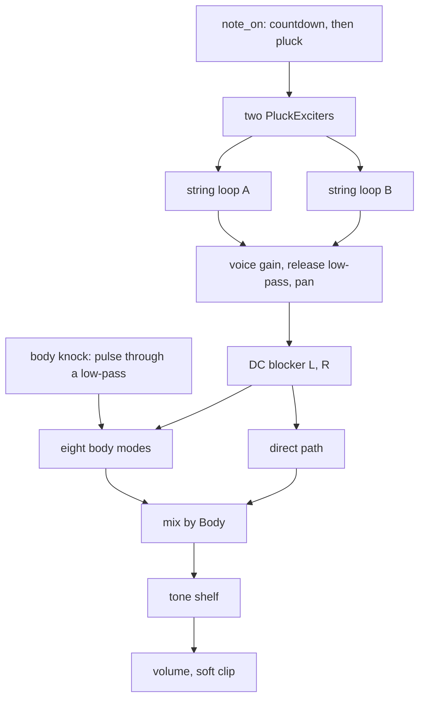
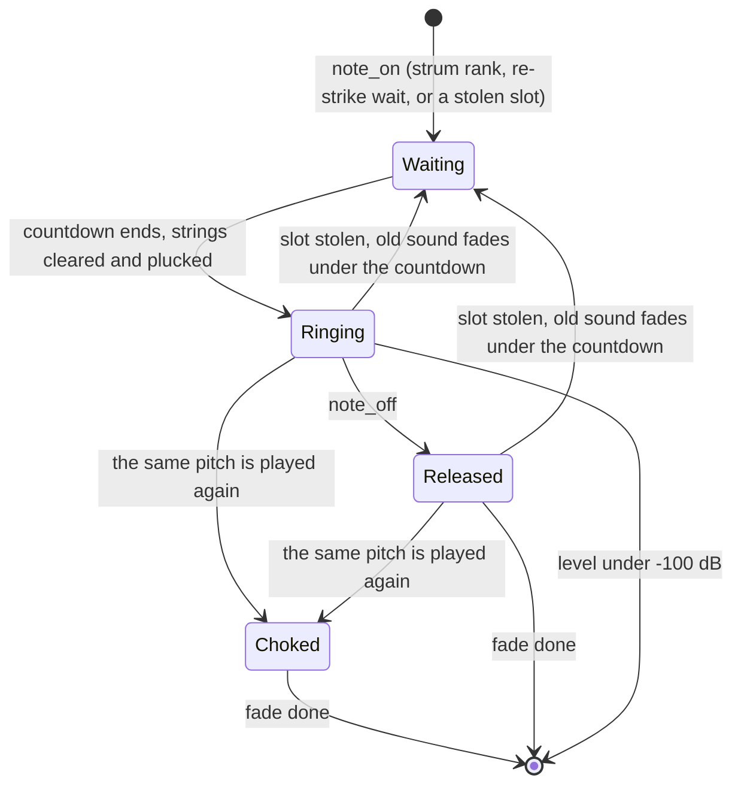

# Acoustic Guitar Device - Plan

## Goal Capsule

- **Objective:** A musician can load "Acoustic Guitar" in live-mix and play a steel-string, nylon-string or twelve-string guitar that sounds like a plucked string in a wooden box from C2 to C6, with five ambient factory presets to start from.
- **Means:** One spec device on the kit's plucked-string core, two string loops per note into one shared body of fixed resonances (KTD1, KTD4).
- **Authority:** The build brief and the task file named in Sources outrank this plan; this plan outranks the research file where they differ (the differences are listed under Assumptions).
- **Execution profile:** One device, one branch (`device/acoustic-guitar`), no remote. Commits are local; there is no push, pull request or CI.
- **Stop conditions:** Stop and report if a settled decision (KTD1 to KTD3, KTD9, KTD10) cannot be kept, if the device cannot hold the 5 % wasm budget with eight notes without `experimental: true`, or if a file outside the allowed set would have to change.
- **Who finishes:** The LFG run that owns this plan carries it through review and the local commit. An integrator later merges the branch with fourteen others, regenerates the shared lists and listens.

---

## Product Contract

### Summary

Add the spec device `acoustic-guitar` ("Acoustic Guitar"): plucked strings heard through a wooden body. A `type` choice gives a steel-string, a nylon-string and a twelve-string guitar. It ships with a native harness that measures the traits a listener knows a guitar by, its `.wasm`, six device presets, a description on every parameter and five factory presets.

### Problem Frame

live-mix has no plucked guitar. The nearest sound is the Bow device's Pluck mode, a felted pluck with generic body modes: no nylon and steel distinction, no body knock, no strum, no damping on key-up. "A few soft nylon notes into a long reverb" and fingerpicked steel patterns are ambient idioms the library cannot make today. Nobody can listen in the environment this is built in, so every claim about the sound has to be a measurement in the harness.

### Key Decisions

- **Acoustic only, three types.** Steel, Nylon and Twelve string on one device; the clean electric is another builder's device. Governs R1, R2.
- **Ten knobs at most.** The research's Swell is left out to stay inside the limit. Governs R12.
- **Neutral names.** No brand, model or artist names in ids, names, parameters or presets. Governs R13.

### Requirements

**The instrument**

- R1. A `type` parameter chooses Steel, Nylon or Twelve string, applied from the next note played.
- R2. No pickup, amplifier or speaker stage exists in the signal path.
- R3. Each note is two string loops. On Steel and Nylon they are the string's two polarisations: the second is quieter, rings longer and is detuned by the Shimmer rate, which gives slow beating and a two-stage decay. On Twelve string the second loop is the course's partner string: an octave above for notes below B3, a unison from B3 up.
- R4. The body is a fixed set of resonances that do not move with the note: an air mode near 100 Hz, a top-plate mode near 200 Hz and a spread of higher modes. The Body parameter runs from the bare string to the full box.
- R5. Every pluck also knocks the body: a short low thump, scaled by velocity, that is there whatever note is played and absent with Body at zero.
- R6. Steel keeps its upper partials for seconds and has stretched partials; Nylon loses its upper partials several times faster, has harmonic partials and a softer pluck.
- R7. A note whose fundamental sits on the air or top mode is louder and its strongly coupled polarisation dies up to 40 % sooner.
- R8. Position moves the pluck point: partials with a node there are missing. Nail moves the pluck from a soft fingertip to a hard pick: brighter, with a click at the start. Soft velocities are darker as well as quieter.
- R9. Sustain sets how long a held note rings; bass notes ring longer than treble notes. Key-up damps the note over the Release time, high partials first; at its longest setting Release lets the note ring out.
- R10. Strum spreads notes that arrive together in pitch order. A note played on a pitch that is still ringing stops the old string first, then plucks. A stolen voice fades over a few milliseconds before the new note starts.
- R11. Tone is a high shelf from dark to bright. Volume sets the output level, followed by the kit's soft clip.

**Simplicity and words**

- R12. At most ten parameters including `volume`. Each makes an audible, measurable difference across its range; a parameter that is read when a note is plucked says so in its description.
- R13. Names are neutral; the manifest's `origin.note` names what is modelled, what is simplified and which figures are choices rather than measurements.
- R14. Every parameter has a one or two sentence description of what it does to the sound. The device description is one sentence.
- R15. At least five device presets named in plain words; the first is the default patch.

**Quality bar**

- R16. Pitch is within ±3 cents from C2 to C6 at 44.1, 48 and 96 kHz with Shimmer at zero; with Shimmer up, the two loops straddle the played pitch and their level-weighted centre is within ±3 cents.
- R17. One note at gain 0.7 peaks between -24 and -10 dBFS at the default volume; at gain 0.8 between -22 and -16 dBFS; ten held notes stay under the clip knee.
- R18. No audible steps: voice stealing, re-striking, key-up and moving Tone or Body while sounding.
- R19. Left plus right does not cancel: the side level stays at least 6 dB under the mid level.
- R20. Energy that is not on a partial of a high note is at least 50 dB under the fundamental once the pluck's own noise has passed.
- R21. With eight notes held the wasm smoke stays under 5 % of real time (target under 3 %), without `experimental: true`.
- R22. The recipe's conformance rules hold: no allocation, `init` resets bit-identically, block-size independence, sleep to exact zero, denormals flushed, bounded under 96 stacked notes, bad input survivable, storage sized for 96 kHz.

**Shipping**

- R23. Five factory presets in `src/dsp/factory/presets/acoustic-guitar.ts`, each the instrument plus one to four existing effects, inside the bank's level limits, with ids and names unique across the bank.

### Scope Boundaries

**In scope:** the three source files of the device, its generated files and `.wasm`, the factory preset file, and the registration lines the factory test needs (`src/dsp/factory/presets/index.ts` and the shared lists `node scripts/gen-devices.mjs` regenerates).

**Not built, considered:**

- Per-note Swell (research 2.5). It would be the eleventh knob; the `swell` effect covers the mix, and the electric `guitar` device is the natural home for a per-note volume pedal. Evidence that would change this: the integrator dropping another knob.
- String and fret assignment (which of six strings a note is on). Without a pickup its only effect is small per-string constants the research marks unsure. Smooth laws over pitch are used instead.
- Finger squeaks and fret noise. The research recommends leaving them out.
- Tension modulation (pitch starting sharp on a hard pluck). The kit's held-pitch tuning steps when retuned; a pitch glide would need the interpolated tuning on every note at a cost in brightness.
- A different body per type. The research gives the same two low modes for classical and steel-string bodies; inventing differences would not be grounded.

**Deferred to Follow-Up Work**

- The `plucked` preset category: presets use `string` until the integrator adds it.
- Listening. Every figure here is a measurement; the integrator plays the device in the app afterwards.

### Sources

- `docs/recipes/adding-a-spec-device.md` (the recipe, all rules).
- The build brief (`BUILD-BRIEF.md`), the task file (`tasks/acoustic-guitar.md`) and the research (`strings.md`, sections 0, 1.3, 1.4 and 2) live in the research directory outside this repository; their requirements are restated above so this plan stands alone.
- `cpp/kit/string.h` and `test_plucked_string` in `cpp/test/kit_test.cpp` (the string core and how it is measured).
- `cpp/devices/string-machine/`, `cpp/devices/tine-piano/`, `cpp/devices/bowed-string/bowed_string.h` (body modes) and their harnesses for idiom.
- `docs/factory.md` and `src/dsp/factory/presets/string-machine.ts` for the factory presets.

---

## Planning Contract

### Key Technical Decisions

- KTD1. **The string is `kit::PluckedString<2048>` with `kit::PluckExciter`, unedited.** (session-settled: user-directed — chosen over a device-local string loop: the core is the research's section 0, already written and measured in the kit test.) 2048 samples hold 47 Hz at 96 kHz, below C2. Anything the core lacks is written in the device directory.
- KTD2. **A `kit::DcBlocker` follows the string sum on each channel.** (session-settled: user-directed — chosen over relying on the pluck comb to remove DC: with the comb off the string carries DC that dies with the note.)
- KTD3. **Acoustic only, with a `type` choice.** (session-settled: user-directed — chosen over the research's single Guitar device with an Electric type: the electric is a separate device built at the same time.) The third choice, Twelve string, is this plan's addition: it retunes the second loop that every note already has, so it costs no knob and no CPU, and an octave course is a different sound, not a variation of Steel.
- KTD4. **One shared body after the voices, not one per voice.** Eight `kit::Svf` band-passes in parallel beside a direct path: 100 Hz (Q 14) and 200 Hz (Q 18) carry the identity, six more between 280 Hz and 1.2 kHz at irregular spacing make the box. The same table serves all three types. The Qs and the upper modes are choices.
- KTD5. **The two-stage decay comes from the two loops, and the bridge coupling from the first loop's decay time.** Loop A (towards the top plate) carries about three quarters of the level and rings 0.75 of the note's time; loop B a quarter of the level and 1.5 times. Loop A's time is cut by up to 40 % by a bell-shaped proximity (about a semitone wide) of the fundamental to the 100 and 200 Hz modes. True string-to-body coupling is not modelled.
- KTD6. **Ring time is a law over pitch.** Sustain is the ring time at the low E string; a note rings Sustain × (110 Hz / f)^0.5, clamped, which gives several seconds in the bass and one to two at C6. Nylon rings 0.7 as long. The high-partial decay time at 3 kHz is a fixed share of the note's time: about 0.2 on Steel and 0.045 on Nylon. All of these are choices inside the ranges the research gives.
- KTD7. **Key-up, re-strike and steal act on the voice's output, never on the ringing loop.** Changing the kit loop's decay or pitch on a sounding string steps its gain or its tuning allpass. Key-up instead runs an output gain fade with a one-pole low-pass that closes as it fades (a finger landing on the string). A re-struck pitch and a stolen voice fade in 8 ms and 3 ms, and the new pluck waits that long before it starts.
- KTD8. **Notes start from a per-voice sample countdown.** Strum, the re-strike wait and the steal fade are the same mechanism: a voice is allocated at `note_on` and plucked when its countdown ends. Notes that arrive within 10 ms of the first of a group are ranked by pitch among those not yet started, one sixth-string step (Strum / 5) apart. Counting in samples inside `process` keeps the output independent of block size.
- KTD9. **Ten parameters:** `type`, `body`, `position`, `nail`, `sustain`, `release`, `tone`, `shimmer`, `strum`, `volume`. (session-settled: user-directed — chosen over the research's knob table plus Type, eleven: the build brief caps a device at ten.) Release replaces the research's Swell because key-up behaviour decides whether the instrument can be played as a let-ring wash or a damped pattern.
- KTD10. **Shared files are touched only by registration.** (session-settled: user-directed — chosen over editing the kit, scripts or docs to fit the device: fourteen builders work in parallel and an integrator merges.) Factory presets use category `string` and preview `keys`. (session-settled: user-directed — chosen over adding the `plucked` category here: the integrator adds it.)
- KTD11. **Small fixed human variation, deterministic.** Each pluck varies level by under 1 dB, pick brightness by a few percent and pluck position by ±2 % from a generator seeded in `init`. ±2 % keeps the pluck-position null at least 15 dB deep, which the harness asserts.
- KTD12. **Stereo from placement, with positive gains only.** Each voice's direct sound is panned a little by pitch and the upper body modes lean alternately left and right; the two low modes and the knock stay centred. No inverted or delayed copies, so the mono sum cannot cancel.
- KTD13. **Stiffness on steel only.** Steel and Twelve string use the kit's stiffness allpasses with B = 8e-5 (a choice inside the research's 1e-5 to 1e-4); Nylon uses none.

### High-Level Technical Design

Signal path:

Voice lifecycle:

A voice released while it is still waiting is plucked and then released at once.

### Assumptions

- The host may give every note event its own `note_id`, so "the same string" is found by pitch (within a quarter tone), not by id.
- Chord notes from the host arrive in one batch before a block, so ranking the waiting notes of a group by pitch gives a low-to-high strum.
- The default Strum is small (about 15 ms across six strings): chords sound played by a hand and single notes are not delayed. This is a choice.
- A let-ring Release of several seconds is a fade over the natural decay; it shortens the note slightly rather than not at all.
- Twelve string drops the polarisation pair in favour of the course partner. A real twelve-string has both.
- The research's check "T60 within ±15 % of the Decay knob" assumes one decay rate. With two stages the harness instead asserts the absolute range the research gives for the low E, proportionality to Sustain and the two slopes.
- Differences from the research: no Swell, no string or fret assignment, the loss filter is the kit's one-pole (not the three-tap FIR the research recommends), Tone is a shelf on the output, and the knock is a low-passed pulse rather than a noise burst so that two renders are identical.

### Risks

- **Coherent onsets.** Ten plucks landing on one sample add in amplitude. Mitigation: the default strum separates them; voice gain and default volume are tuned on the ten-note check.
- **Two stiffness stages may not follow the law to ±3 cents up to the eighth partial.** Mitigation: the harness measures it; use more stages or assert the range it does hold and say so.
- **Timing printed by the smoke reads high** while other builders compile. Mitigation: re-run and report the best; the integrator re-measures.

---

## Implementation Units

### U1. Manifest and the plucked string voice

- **Goal:** A playable device: two string loops per note, in tune, with type, position, nail, sustain and shimmer.
- **Requirements:** R1, R3, R6, R8, R9 (ring time), R12, R16, R22; KTD1, KTD3, KTD5, KTD6, KTD9, KTD11, KTD13.
- **Dependencies:** none.
- **Files:** `cpp/devices/acoustic-guitar/device.json`, `cpp/devices/acoustic-guitar/acoustic_guitar.h`, `cpp/test/acoustic_guitar_test.cpp`; generated by the dev script: `cpp/devices/acoustic-guitar/params.gen.h`, `cpp/devices/acoustic-guitar/device_api.gen.cpp`, `src/dsp/devices/acoustic-guitar.gen.ts`.
- **Approach:**
  1. Manifest with the ten parameters of KTD9 in final order, class `AcousticGuitar`, header `acoustic_guitar.h`.
  2. A voice of two strings and two exciters in a `kit::VoicePool` of twelve; the voice reports `active`, `releasing` and a peak-follower `level`.
  3. Per type: decay law, high-partial share, stiffness, exciter brightness range and loop B's role (KTD5, KTD6, KTD13).
  4. Loop frequencies centred so the level-weighted mean is the played pitch.
- **Patterns to follow:** `cpp/devices/tine-piano/tine_piano.h` (voice struct, note-on reads), `cpp/devices/string-machine/string_machine.h` (init order, `apply`, idle gate), `pluck_note` and `partial_near` in `cpp/test/kit_test.cpp`.
- **Test scenarios:**
  - Conformance (`check_instrument`) at 48 kHz with `max_peak` 1.01.
  - Steel and Nylon, Shimmer 0: C2, E2, A3, E5 and C6 at 44.1, 48 and 96 kHz are within ±3 cents.
  - Twelve string at E2: a partial at twice the pitch from loop B is within ±3 cents of the octave and far stronger than Steel's second partial; at E4 loop B is a unison.
  - Shimmer 1 Hz at A3: the fundamental's envelope beats at 1 Hz ±20 %, and the two loop frequencies' weighted centre is within ±3 cents.
  - Position 0.2 at A2 on Steel: partial 5 is at least 15 dB under partials 4 and 6 in the first 100 ms; partials 2, 3, 4, 6 and 7 show no other null.
  - Nylon against Steel at A2: decay time in the 2 to 4 kHz band at least three times shorter on Nylon; Nylon's centroid at 300 ms under half its value at 10 ms.
  - Steel at E2: partials up to the eighth follow the stiffness law within ±3 cents and the eighth is measurably sharp; Nylon's are harmonic within 1.5 cents.
  - Steel low E at default Sustain rings 3 to 8 s; Nylon under 5 s; doubling Sustain doubles the time ±20 %; C6 rings shorter than E2.
  - Shimmer 0: the fundamental's early decay rate is at least 1.3 times its late rate.
  - Nail 1 against Nail 0: the first 20 ms carry at least 10 dB more energy above 3 kHz; a soft velocity has a lower centroid than a hard one once levels are matched.
  - Two identical notes in a row differ in level by a measurable amount under 2 dB, and a second `init` reproduces both.
- **Verification:** the native harness passes with the string checks; the pitch table prints its worst error.

### U2. The body, the knock, tone and levels

- **Goal:** The string is heard through a box whose resonances stay put, with a knock at every pluck, a tone shelf, stereo placement and calibrated level.
- **Requirements:** R4, R5, R7, R11, R17, R19, R20; KTD2, KTD4, KTD5, KTD12.
- **Dependencies:** U1.
- **Files:** `cpp/devices/acoustic-guitar/acoustic_guitar.h`, `cpp/test/acoustic_guitar_test.cpp`.
- **Approach:** DC blockers after the panned string sum; the mode bank fed by the mono sum and the knock; Body crossfades direct against modes with smoothed gains; the shelf is two `kit::Biquad`s retuned on the control clock from a smoothed value; voice gain and default volume tuned on the level checks.
- **Patterns to follow:** the body bank in `cpp/devices/bowed-string/bowed_string.h`.
- **Test scenarios:**
  - A5 and C6 at full Body: the spectrum of the first 250 ms below 400 Hz peaks within 10 % of 100 Hz and of 200 Hz, at the same frequencies (within 3 %) for both notes, each at least 4 dB above the level midway between them.
  - The same notes at Body 0: the 100 and 200 Hz levels are at least 20 dB lower.
  - The knock: energy below 400 Hz in the first 60 ms of C6 rises with velocity and is at least 12 dB above the same band 400 ms later.
  - Bridge coupling: at Body 1 the fundamental of G#2 is louder against Body 0 than the fundamentals of E2 and C3 are, and with Shimmer at 0 the early decay rate at G#2 is at least 20 % faster than the pitch law gives between its neighbours.
  - Tone at its ends: the level at 6 kHz differs by at least 12 dB while the fundamental moves under 1 dB.
  - Levels: gain 0.7 peaks between -24 and -10 dBFS, gain 0.8 between -22 and -16 dBFS at defaults; ten notes at gain 0.8 stay under the knee.
  - Stereo: a chord has left-right correlation under 0.999 and a mid level at least 6 dB over the side level.
  - Aliasing: C6 and C7 at 44.1 kHz, 100 to 400 ms: every level probed midway between partials is at least 50 dB under the fundamental.
  - Sweeping Tone and Body end to end over 100 ms on a ringing chord makes no step larger than 1.5 times the chord's own largest step.
- **Verification:** the harness passes; the printed level line sits inside R17.

### U3. Note lifecycle: strum, re-strike, steal, release

- **Goal:** Notes start and stop the way a hand does it, without steps.
- **Requirements:** R9 (release), R10, R18, R22; KTD7, KTD8.
- **Dependencies:** U1, U2.
- **Files:** `cpp/devices/acoustic-guitar/acoustic_guitar.h`, `cpp/test/acoustic_guitar_test.cpp`.
- **Approach:** the countdown start of KTD8; the three output fades of KTD7; a note is freed when its fade ends or its level passes -100 dB; the idle gate stays awake while any voice waits.
- **Test scenarios:**
  - Strum 100 ms, six notes sent high to low in one batch: onsets are 20 ms apart ±2 ms in rising pitch order; Strum 0: all within 1 ms.
  - A single note is never delayed by Strum.
  - Re-striking A3 200 ms after the first raises the peak by under 3 dB and the largest step is no more than 1.5 times a single note's.
  - 24 notes into 12 voices, 20 ms apart: the largest step is no more than 1.5 times that of the same notes with room to spare, and the output stays finite.
  - Key-up at Release 0.2 s: the level is 40 dB down within 0.25 s, the band above 2 kHz falls at least 10 dB further than the fundamental in the first half of it, and no step exceeds the note's own.
  - Release at maximum: one second after key-up the note is within 3 dB of a held one.
  - A note released before its strum countdown ends still sounds, then damps.
  - A chord with Strum up renders the same in blocks of 1, 128, 2048 and ragged sizes (difference under 1e-6).
  - After the last release the output reaches exact zero and stays there.
- **Verification:** the harness passes with all click checks; conformance still passes.

### U4. Presets, words, the module and its cost

- **Goal:** The manifest is finished and the `.wasm` is built and inside budget.
- **Requirements:** R13, R14, R15, R21.
- **Dependencies:** U3.
- **Files:** `cpp/devices/acoustic-guitar/device.json`, `src/dsp/wasm/acoustic-guitar.wasm`, the generated files of U1.
- **Approach:** six presets (steel fingerstyle as the default, nylon at dusk, twelve string, let ring, muted pattern, soft thumb), each differing audibly; `origin.note` per R13; `report_cost` with twelve voices in the harness.
- **Test scenarios:**
  - Each preset renders a chord that is finite, peaks under the knee and differs from the default (centroid or decay) by a stated margin.
  - The wasm smoke passes and prints a cost line under 5 % with eight notes held.
- **Verification:** the full dev script passes; `param-descriptions.test.ts` passes.

### U5. Factory presets

- **Goal:** Five patches an ambient musician would reach for, inside the bank's limits.
- **Requirements:** R23; KTD10.
- **Dependencies:** U4.
- **Files:** `src/dsp/factory/presets/acoustic-guitar.ts`, `src/dsp/factory/presets/index.ts`, the shared lists `node scripts/gen-devices.mjs` writes (`src/dsp/devices/index.gen.ts`, `scripts/devices.gen.sh`, `docs/devices-generated.md`).
- **Approach:** export `ACOUSTIC_GUITAR_PRESETS`; each preset names a device preset and one to four WASM effects with their own presets; levels brought inside the limits on the bench with the instrument's volume or an effect's mix.
- **Patterns to follow:** `src/dsp/factory/presets/string-machine.ts`, `docs/factory.md` ("Adding to the bank").
- **Test scenarios:**
  - `factory.test.ts` passes: ids and names unique, every device, preset and value valid, raw preview peak at or under -3 dBFS, loudest 400 ms between -36 and -12 dBFS, no DC.
  - The bench line for each of the five is recorded.
- **Verification:** the two vitest files, typecheck, prettier and eslint pass on the written files.

---

## Verification Contract

| Gate | Command | Applies to |
| --- | --- | --- |
| Native harness | `CXX=g++ bash scripts/dev-device.sh acoustic-guitar --native-only` | U1 to U3 |
| Harness, wasm build, smoke with cost | `CXX=g++ bash scripts/dev-device.sh acoustic-guitar`, with the Emscripten 4.0.15 environment sourced in the same shell | U4 |
| Shared lists | `node scripts/gen-devices.mjs` | U5 |
| Descriptions and bank limits | `pnpm vitest run src/react/__tests__/param-descriptions.test.ts src/dsp/factory/__tests__/factory.test.ts` | U4, U5 |
| Bench | `FACTORY_REPORT=presets FACTORY_DEVICE=acoustic-guitar pnpm vitest run src/dsp/factory/__tests__/report.test.ts` | U5 |
| Types | `pnpm typecheck` | U5 |
| Format and lint | `npx prettier --check` and `npx eslint` on the written files | U4, U5 |

Never run `scripts/test-native.sh` or the whole `pnpm test`.

## Definition of Done

- Every requirement R1 to R23 is met or its shortfall is written in the final report.
- The harness holds at least eight behaviour checks beyond conformance, each a measurement that would fail without the trait.
- All gates in the Verification Contract pass in the clone.
- Nothing outside the allowed files changed; no experiment or abandoned attempt is left in the diff.
- The work is committed on `device/acoustic-guitar`; nothing is pushed.
