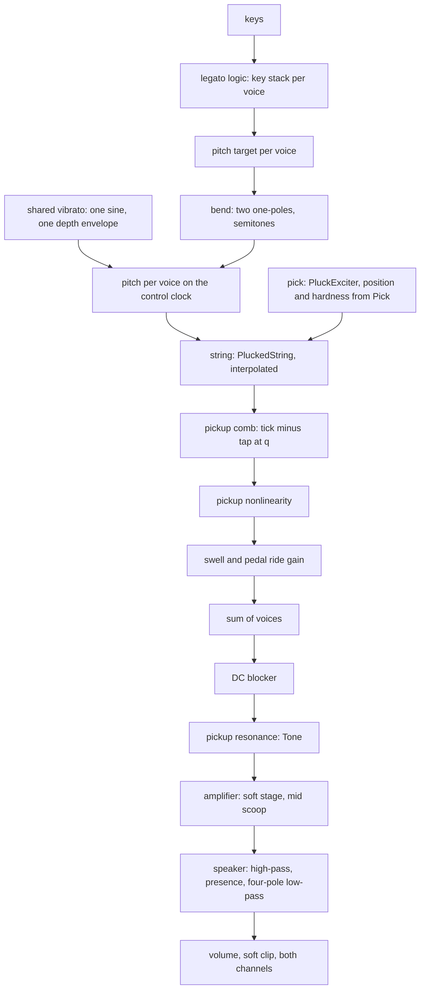
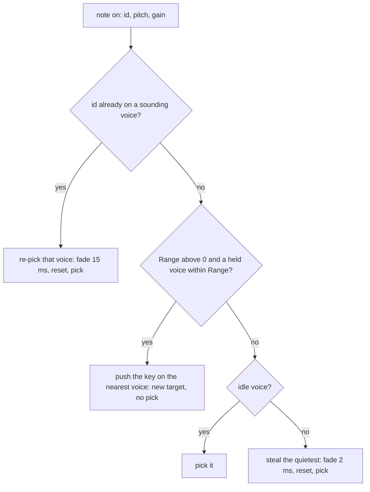
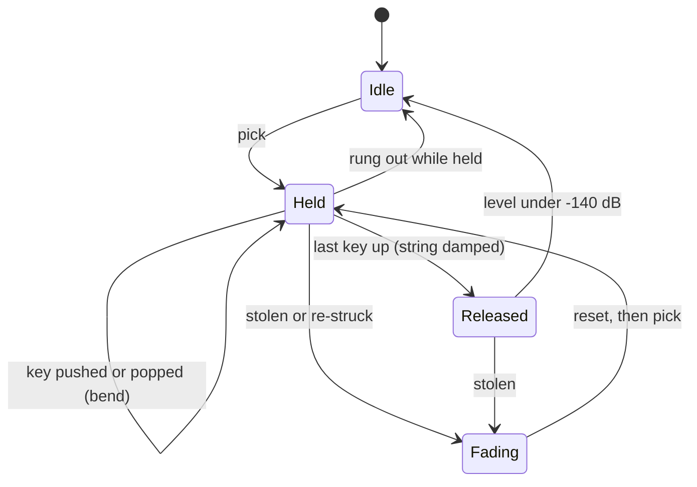

# Pedal Steel Device - Plan

## Goal Capsule

- **Objective:** A musician can load "Pedal Steel" in live-mix, hold a chord, play a neighbouring key against it and hear one string bend to the new note while the others stand still, with every note swelling in and all of them sharing one bar vibrato.
- **Means:** One spec device on the kit's plucked-string core with a keyboard gesture layer in front of it (KTD1, KTD5).
- **Authority:** The build brief and the task file handed to this run, then `docs/recipes/adding-a-spec-device.md`, then the research file `strings.md` (sections 0, 1.3, 1.4 and 3). All three briefs live outside this repository. Where they disagree the earlier one wins.
- **Execution profile:** A pipeline run with no human present. Nobody can listen: every claim about the sound is a measurement in the native harness.
- **Stop conditions:** A settled decision below proves infeasible; the device cannot hold 5 % of real time with eight notes without `experimental: true`; a file under "do not edit" would have to change.
- **Who ships:** The run commits on `device/pedal-steel`. There is no remote, so nothing is pushed and no pull request is opened. An integrator collects the branch afterwards.

---

## Product Contract

### Summary

Add the spec device `pedal-steel` ("Pedal Steel", class `PedalSteel`): a pedal and lap steel guitar for ambient country and slow washes.
It ships with nine parameters, six device presets, a native harness that measures the traits a listener knows the instrument by, its `.wasm`, and five factory presets.

### Problem Frame

live-mix has no instrument whose identity is how notes move.
The pedal steel is defined by three gestures: a pedal bends one or two voices of a held chord while the rest stand still, one bar shakes every string in phase, and a volume pedal swells each note in from nothing.
`bowed-string` has a fixed pitch per note, `ember` glides one mono voice, and the `swell` effect acts on the whole mix, so none of them can leave a bending voice un-retriggered inside a chord.

### Key Decisions

- **The gesture layer follows the research's legato rule exactly** (session-settled: user-directed — chosen over per-voice vibrato or portamento on every note: the gesture is the instrument). Governs R1, R2, R3, R4, R5.
- **At most nine parameters including `volume`** (session-settled: user-directed — chosen over the brief's general limit of ten: simplicity). Governs R11.
- **Factory presets sit under `string` until `plucked` exists** (session-settled: user-directed — chosen over `pad`: `plucked` is being added by the integrator). Governs R13.

### Requirements

**Gesture**

- R1. A note that starts while another note is held, at least half a semitone and at most Range (plus a quarter-tone tolerance) from that voice's current target, does not pick a string: the nearest such voice glides to the new pitch with no new attack and no restart of its swell.
- R2. A bent voice keeps the keys that claimed it. Releasing the newest key while an older one is held glides back to the older key's pitch; releasing an older key changes nothing; the voice is released when its last key goes.
- R3. A note further than Range from every held voice, a note that arrives after the release, and any note while Range is 0 pick a new string. The same key struck again while it sounds re-picks its own string instead of stacking a second one.
- R4. One vibrato for the whole device: the same phase and depth on every sounding voice, at the Rate knob's speed, to the Vibrato knob's depth in cents, fading in after the most recent pick.
- R5. Each picked note fades in over Swell (10 % to 90 % of its plateau), which hides the pick when Swell is long. Swell 0 leaves the pick as it is.
- R6. Sustain sets how long a note holds its level: the string's own ring plus a slow rise in the voice's gain that offsets part of the decay, limited to +12 dB.
- R7. The time a bend takes (10 % to 90 % of the interval) is the Glide knob's, at any interval, and the pitch arrives in tune.

**Sound**

- R8. Tuning is within 3 cents from C2 to C6 at 44.1, 48 and 96 kHz with vibrato off, at both ends of Tone and Sustain. Partials 1 to 10 are harmonic within 3 cents.
- R9. High partials die sooner than the fundamental, so a note darkens as it rings.
- R10. The string is heard through a pickup a fixed distance from the bridge: the partial with a node over the pickup is missing, and which partial that is follows the note.
- R11. Nine parameters: Swell, Sustain, Glide, Range, Vibrato, Rate, Pick, Tone, Volume. Each has a description of one or two plain sentences, and a knob that does nothing in some setting says so.
- R12. Pick moves from a mellow pick near the middle of the string to a hard pick near the bridge. Tone moves the pickup's resonant peak. A speaker stage removes what a guitar speaker does not reproduce.

**Presets**

- R13. Five factory presets in `src/dsp/factory/presets/pedal-steel.ts` (`PEDAL_STEEL_PRESETS`), each the instrument plus one to four stock effects, inside the bank's level limits, with ids and names unique in the bank.
- R14. At least five device presets in plain words with no brand, artist or record names. The first is the default patch.

**House rules**

- R15. Every rule of `docs/recipes/adding-a-spec-device.md` and the conformance pass holds.
- R16. One note at gain 0.7 peaks between -24 and -10 dBFS at the default volume, one at gain 0.8 between -22 and -16 dBFS, and ten held notes stay under the clip knee region.
- R17. No clicks: a stolen voice, a re-struck key, a note off, a glide at any speed and a moving Tone knob make no step larger than the sound's own.
- R18. Energy that does not belong (between the partials of a high note, or outside the harmonic series of a gliding note) is at least 50 dB below the fundamental.
- R19. Eight held notes cost under 5 % of real time in the WASM smoke, aiming for under 3 %, without `experimental: true`.
- R20. The output is mono-compatible: left plus right never cancels.
- R21. `origin.note` names the real instrument and the research, says what is modelled and what is simplified, marks every figure the research calls unsure as a choice, and says this is not a circuit or sample emulation.

### Scope Boundaries

Considered and not built:

- **Pitch wheel as the bar.** The device ABI (`cpp/common/device_api.h`) carries notes and parameters only, so there is no bend message to map. A lap-steel slide is Range 12 with overlapping keys. A bend entry point in the ABI would change the call.
- **Two polarisations per string.** The beating it adds would swing a held note's level by several dB against R6 and double the cost. A listener-led request for shimmer would change the call.
- **String stiffness.** A long plain steel string is a few cents sharp at its tenth partial, and the stiffness allpass coefficients would change in the middle of every bend. Evidence that the missing stretch is audible would change the call.
- **Bar noise.** The research calls it a detail, not an identity.
- **A Release knob.** Nine knobs are spoken for (R11). Key-up damps the string at one fixed rate (KTD8).
- **Stereo width.** One pickup into one amplifier is mono; the factory presets add space with stock effects.
- **Changing the shared `line` phrase** so its notes overlap. It belongs to the bank and other presets audition with it.

### Sources

- `docs/recipes/adding-a-spec-device.md`: the three files, the eleven rules, the harness shape.
- `cpp/kit/string.h` and `test_plucked_string` in `cpp/test/kit_test.cpp`: what the string core already guarantees (tuning to 1.5 cents in both tunings, decay times as set, a slide that makes no step and lands in tune).
- `cpp/devices/string-machine/` and `cpp/test/string_machine_test.cpp`: the reference instrument.
- `cpp/devices/tine-piano/tine_piano.h`: a voice with a damper release and a shared amplifier stage.
- `cpp/test/bowed_string_test.cpp`: fine pitch by a Goertzel scan, vibrato measured as the turning of the fundamental's phase, click sweeps.
- `docs/factory.md` and `src/dsp/factory/presets/string-machine.ts`: the bank's limits and the bench.
- The research file `strings.md` sections 0, 1.3, 1.4 and 3: physics, the DSP outline, the knob table and the acceptance checks in 0.3 and 3.7.

---

## Planning Contract

### Key Technical Decisions

- KTD1. **Each voice is one `kit::PluckedString<4096>` in `Tuning::Interpolated`, plucked by `kit::PluckExciter`** (session-settled: user-directed — chosen over a device-local string core or Allpass tuning: the pitch moves under the bar and the kit core is already measured). 4096 samples hold 23.5 Hz at 96 kHz, an octave below C2 with room for vibrato. Ten voices, one per string of the instrument.
- KTD2. **A `kit::DcBlocker` follows the voice sum** (session-settled: user-directed — chosen over relying on the pluck comb: with the comb off the string carries DC that dies with the note). It also removes the DC the pickup's squared term makes.
- KTD3. **The device carries its own pickup, amplifier and speaker stage in its own directory** (session-settled: user-directed — chosen over sharing code with the electric guitar built in parallel: the two clones cannot share code). It lives in a second header, `cpp/devices/pedal-steel/steel_amp.h`.
- KTD4. **Pitch is worked out in semitones on the control clock and handed to the string with `set_frequency`.** The clock fires every 16 samples at 44.1 and 48 kHz and every 32 at 96 kHz. The string's own one-millisecond glide joins the ticks, and the pickup tap follows per sample with the same time constant, so nothing in the audio path steps. Per-sample `set_frequency` was rejected: its retune costs several transcendental calls and would not fit R19.
- KTD5. **A bend is two cascaded one-pole filters on the pitch target, in semitones.** It starts and lands without a corner, keeps its velocity when retargeted in mid-bend, and its 10 % to 90 % time is 3.36 time constants, so the time constant is Glide / 3.36. A raised-cosine ramp was rejected because a retarget in mid-ramp puts a corner in the pitch.
- KTD6. **Legato bookkeeping is a key stack per voice** (up to four keys; the newest is the target). The kit's `VoicePool` still chooses and steals voices; key lookup for note-off and re-strike searches the stacks, because a bent voice answers to more than one note id. Implements R1 to R3.
- KTD7. **The shared vibrato is one free-running sine and one depth envelope, both on the control clock.** A pick pulls the depth to zero over about 40 ms, it waits about 0.35 s, then returns over about half a second. The phase is never reset by a note. Implements R4.
- KTD8. **Swell and pedal ride are one gain per voice, applied after the pickup and before the amplifier**, as a volume pedal sits. The swell is a raised cosine whose 10 % to 90 % time is the knob's. The ride rises at 0.7 of the string's decay rate up to +12 dB. Key-up does not fade the gain: it damps the string (fundamental 0.6 s, highs 0.12 s to -60 dB), a hand laid on it.
- KTD9. **The pickup is a tap on the string's own delay line**: `tick - tap(q · period)`, with `q` the pickup's distance over the sounding length. The pickup sits 1/15 of the open string from the bridge. A note is played on the highest string of the E9 tuning that leaves the bar at fret 3 or above, so `q = 2^(fret/12) / 15`. During a bend `q` stays put, because a pedal changes tension and not length.
- KTD10. **A stolen or re-struck voice fades its gain to zero (2 ms stolen, 15 ms re-struck), is reset, and only then starts the new note.** The old ring is gone before the pick, so a re-strike never doubles the level.
- KTD11. **Rendering is voice by voice in runs that end on the control clock**, not sample by sample across voices. The run length comes from `kit::ControlClock`'s own counter, so the output does not depend on the host's block size.
- KTD12. **The amplifier is clean with a soft ceiling, and the nonlinearities are kept small instead of oversampled.** The pickup's squared term is 3 % at full swing and sits before the pickup low-pass. The amplifier is `kit::soft_clip` scaled so that a note or a small chord is exactly linear and ten strings picked hard are rounded. R18 is the check that this is enough. (As built: the first draft's `fast_tanh` stage and 6 % squared term were measured and dropped, see Implementation Notes.)

### High-Level Technical Design

Signal flow:

What a note-on does:

A voice's life:

### Assumptions

- The pickup distance (1/15 of the open string, about 41 mm on a 610 mm scale), the fret-3 hand position, the vibrato onset times, the ride's 0.7 share and the release damping are choices, not measurements of an instrument. `origin.note` says so.
- The research's knob ranges are kept: Swell 0 to 2 s, Sustain 2 to 40 s, Glide 20 to 800 ms, Range 0 to 12 st, Vibrato 0 to 40 ct, Rate 3 to 7 Hz, Tone 1.5 to 6 kHz.
- Sustain is the string's fundamental decay time; the high-partial decay time (at 3 kHz) is 0.22 of it, never under 0.3 s.
- Velocity sets pick level and pick brightness together; successive picks vary by about 1 dB and 3 % of pick position from a seeded generator, so repeats do not sound stamped.
- The speaker low-pass sits at 6 kHz, a little above the research's 5 kHz for the guitar, as the research asks for the steel.
- Device presets avoid the research's record-derived names.
- The `line` phrase releases each note on the frame the next begins, release first, so its notes do not overlap and the factory preview shows no bend. This goes in the final report for the integrator.
- `src/dsp/factory/presets/index.ts` and the shared generated lists are edited so the tests can run here; the integrator regenerates them.

### Risks

| Risk | Mitigation |
|---|---|
| Control-rate pitch steps leak into the sound as sidebands on a fast, wide bend | KTD4's two smoothing stages; R18's gap-probe measurement during a bend; halve the control period if it fails |
| The loss filter is redesigned every third of a semitone during a bend and the level pumps | The kit keeps the decay time constant across a redesign; R1's test bounds the level dip at 3 dB |
| A bend upward folds high partials over Nyquist in the interpolated read | Measured by R18 on a bend at a high note; the pick low-pass and the loss filter leave little up there |
| Cost: ten interpolated strings plus a retune per voice per tick | KTD11; measure early in U2; raise the control period before touching the algorithm |

---

## Implementation Units

### U1. Manifest

- **Goal:** `device.json` says what the instrument is, in words a musician reads.
- **Requirements:** R11, R14, R21.
- **Dependencies:** none.
- **Files:** `cpp/devices/pedal-steel/device.json`.
- **Approach:** Category `instrument`, class `PedalSteel`, header `pedal_steel.h`, no extra sources. Parameter order: swell, sustain, glide, range, vibrato, rate, pick, tone, volume. Log tapers on sustain, glide and tone. Six presets, the first equal to the defaults. Descriptions end in a full stop, stay under 170 characters and carry no dash, as `src/react/__tests__/param-descriptions.test.ts` requires.
- **Patterns to follow:** `cpp/devices/string-machine/device.json`, `cpp/devices/tine-piano/device.json` ("Applies from the next note played").
- **Test scenarios:** Test expectation: none -- the manifest is validated by `scripts/gen-devices.mjs` and by the description test in U5.
- **Verification:** `node scripts/gen-devices.mjs --only pedal-steel` writes `params.gen.h` without complaint.

### U2. Voice, string and output stage

- **Goal:** One picked note sounds like a steel string through a bridge pickup, an amplifier and a speaker, at the right level and pitch, and the device keeps every house rule.
- **Requirements:** R5, R6, R8, R9, R10, R12, R15, R16, R17, R18, R19, R20.
- **Dependencies:** U1.
- **Files:** `cpp/devices/pedal-steel/pedal_steel.h`, `cpp/devices/pedal-steel/steel_amp.h`, `cpp/test/pedal_steel_test.cpp`.
- **Approach:**
  1. `steel_amp.h` holds the shared stage of KTD3: pickup resonance (`kit::Svf`, Q near 1.6), soft stage, mid scoop near 500 Hz, speaker (second-order high-pass near 90 Hz, presence peak near 2.5 kHz, four-pole low-pass at 6 kHz).
  2. The voice holds the string, the exciter, the gain of KTD8, a level follower for stealing and for freeing a rung-out voice, and the fade of KTD10.
  3. `init` resets every voice and reseeds the generator; parameters are smoothed or read on the control clock; the idle gate sleeps the device (KTD1, KTD2, KTD11).
  4. A public static helper gives the pickup fraction for a note (KTD9), so the harness can say where the null must be.
- **Execution note:** Measure cost with ten voices as soon as one note sounds; the algorithm choices in KTD4 and KTD11 depend on it.
- **Patterns to follow:** `cpp/devices/tine-piano/tine_piano.h` (voice struct, note-on guards, shared tone stage), `cpp/devices/string-machine/string_machine.h` (`apply`, smoothers, idle gate).
- **Test scenarios:**
  - Conformance: `check_instrument` with `max_peak` 1.01 and a tail of a few seconds.
  - Tuning: C2, C3, C4, C5, C6 at 44.1, 48 and 96 kHz, vibrato off, within 3 cents; again at both ends of Tone and Sustain.
  - Partials: on a low note, partials 1 to 10 within 3 cents of whole multiples.
  - Darkening: the eighth partial's decay time is between 5 % and 60 % of the fundamental's.
  - Pickup comb: on D sharp 5 (fret 7) the 10th partial is at least 12 dB under the 9th and 11th; on D sharp 6 (fret 19) the null is on the 5th. The null follows the note. Pick is set so the pick's own comb does not sit on the partial being measured.
  - Swell: at 1 s the 10 % to 90 % rise is 1 s within 20 %, and the first 20 ms stay 30 dB under the plateau; at 0 the note speaks within 20 ms.
  - Sustain: at 40 s the level 4 s after the swell's peak is within 6 dB of it; at 2 s it has fallen by more than 30 dB; once the ride is spent the fundamental decays at the rate Sustain sets, within 15 %.
  - Pick: hard and near the bridge carries at least 10 dB more above 2 kHz at onset than mellow.
  - Tone: a partial near 2 kHz is lifted between 2 and 6 dB with Tone at 2 kHz against Tone at 6 kHz, and a partial near 5.5 kHz falls by more than 12 dB.
  - Speaker: partials above 10 kHz are at least 40 dB under the 1 to 2 kHz band.
  - Aliasing: on C6 and C7 at 44.1 and 48 kHz, the level halfway between partials is 50 dB under the fundamental after the pick.
  - Levels: one note at gain 0.7 and 0.8, ten held notes, a soft note quieter but present.
  - Clicks: an eleventh note steals a voice; a held key is struck again; a note is released; Tone is swept under a held chord. The largest step stays near the sound's own.
  - Re-strike: striking a held key again 200 ms later raises the peak by less than 3 dB.
  - Mono: left equals right.
  - Release: a released note is 60 dB down within a second and the device then gives exact silence; a held note that rings out frees its voice.
- **Verification:** The native harness passes; the cost line with ten voices is printed.

### U3. Gesture layer

- **Goal:** Overlapping neighbour notes bend the sounding voice, the bar vibrato is shared, and nothing in a bend steps.
- **Requirements:** R1, R2, R3, R4, R7, R17, R18.
- **Dependencies:** U2.
- **Files:** `cpp/devices/pedal-steel/pedal_steel.h`, `cpp/test/pedal_steel_test.cpp`.
- **Approach:** The note-on and note-off logic of KTD6 in front of the voice pool; the bend of KTD5 and the vibrato of KTD7 inside the control tick of KTD4. A bent voice keeps its swell and ride where they are.
- **Technical design:** the decision flow and the voice life in High-Level Technical Design.
- **Test scenarios:**
  - Legato bend: hold C4, add D4. The pitch track moves monotonically from C4 to D4 and lands within 3 cents. No attack: the energy above 2 kHz in the 30 ms after the second note-on stays within 3 dB of the 30 ms before it, where a picked D4 raises it by more than 10 dB. The level never dips by more than 3 dB.
  - Bend time: at Glide 100 ms and 400 ms the 10 % to 90 % time is the knob's within 20 %.
  - Return bend: release D4 with C4 held and the pitch returns to C4 within 3 cents. Release C4 instead with D4 held and the note stays on D4 and keeps sounding.
  - Others stand still: in a held triad where one voice bends, the other two stay within 2 cents.
  - Outside the range: hold C4, add G4. Both fundamentals sound and the new one has an attack.
  - After a release: release C4, then play D4. C4 is damped and D4 has an attack.
  - Range 0: an overlapping whole tone picks a new string.
  - Shared vibrato: three held notes at Vibrato 20 ct and Rate 5 Hz. Each track turns at 5 Hz within 0.2 Hz and 20 ct deep within 15 %; the tracks correlate above 0.95 and their phases agree within 20 degrees; the first 0.3 s stay under 2 cents.
  - A bend makes no step: at Glide 20 ms over an octave and at 400 ms over a whole tone, the largest sample-to-sample step during the bend is under 1.5 times the note's own.
  - A bend makes no zipper: during a whole-tone bend, the level in the gaps between the swept partials stays 50 dB under the fundamental.
  - Block size: a bend with vibrato renders the same in blocks of 1, 128 and 2048 frames.
  - Voice bookkeeping: releasing every key of a bent voice frees it; a note-off for a key that was pushed out of a full stack is ignored.
- **Verification:** The native harness passes with all of the above.

### U4. Generated files and the WASM build

- **Goal:** The device builds to `.wasm` and stays inside the cost budget.
- **Requirements:** R15, R19.
- **Dependencies:** U3.
- **Files:** `cpp/devices/pedal-steel/params.gen.h`, `cpp/devices/pedal-steel/device_api.gen.cpp`, `src/dsp/devices/pedal-steel.gen.ts`, `src/dsp/wasm/pedal-steel.wasm`, and the shared lists `node scripts/gen-devices.mjs` refreshes.
- **Approach:** Run the device loop with Emscripten on the path. If the cost is near the limit, re-run the smoke a few times and keep the best figure, since other builds share the machine.
- **Test scenarios:** Test expectation: none -- generated files; the WASM smoke is the check.
- **Verification:** The smoke prints its cost line under 5 % and ends in `ok`.

### U5. Factory presets

- **Goal:** Five presets someone would reach for, inside the bank's limits.
- **Requirements:** R13.
- **Dependencies:** U4.
- **Files:** `src/dsp/factory/presets/pedal-steel.ts`, `src/dsp/factory/presets/index.ts`.
- **Approach:** One file exporting `PEDAL_STEEL_PRESETS`, category `string`, preview `chord` or `line`. Tune levels on the bench with the instrument's volume or an effect's mix. Check ids and names against the bank.
- **Patterns to follow:** `src/dsp/factory/presets/string-machine.ts`, `src/dsp/factory/presets/bowed-string.ts`.
- **Test scenarios:**
  - Each preset validates, renders finite, peaks at or under -3 dBFS, has its loudest 400 ms between -36 and -12 dBFS and carries no DC.
  - Every parameter of the device has a description the info view accepts.
- **Verification:** The two vitest files pass, typecheck passes, prettier and eslint are clean on the files written.

---

## Verification Contract

| Gate | Command | Applies to |
|---|---|---|
| Native harness, WASM build, smoke | `CXX=g++ bash scripts/dev-device.sh pedal-steel` with the Emscripten environment sourced in the same shell | U1 to U4 |
| Native only, while iterating | `CXX=g++ bash scripts/dev-device.sh pedal-steel --native-only` | U2, U3 |
| Shared lists | `node scripts/gen-devices.mjs` | U4, U5 |
| Descriptions and the bank | `pnpm vitest run src/react/__tests__/param-descriptions.test.ts src/dsp/factory/__tests__/factory.test.ts` | U5 |
| Bench | `FACTORY_REPORT=presets FACTORY_DEVICE=pedal-steel pnpm vitest run src/dsp/factory/__tests__/report.test.ts` | U5 |
| Types | `pnpm typecheck` | U4, U5 |
| Format and lint | `npx prettier --check` and `npx eslint` on the files written | U1, U5 |

Not run: `scripts/test-native.sh` and the whole `pnpm test`, which the build brief rules out.

## Definition of Done

- Every requirement R1 to R21 is met. Each of R1 to R10, R12, R16 to R18 and R20 has a measurement in `cpp/test/pedal_steel_test.cpp` that would fail if the trait were missing; R19 is measured by the WASM smoke.
- Every gate in the Verification Contract passes in this clone.
- Nothing under `cpp/kit`, `cpp/test/support`, `scripts`, another device, `docs/devices.md`, `docs/factory.md`, `CHANGELOG.md`, `.changeset` or `package.json` is changed.
- No abandoned experiment is left in the diff.
- The work is committed on `device/pedal-steel`; nothing is pushed.

## Implementation Notes

What the build changed against the text above, each from a measurement in the harness.

- **Struck together is a chord (narrows R1; flagged against the settled legato rule).** A key that lands within 50 ms of a voice's pick does not bend that voice: it is picked on its own string. Read to the letter, the rule turned a second struck with one hand into a single sliding string and, at Range 12, any chord into one voice. The 50 ms is a choice and `origin.note` says so. A note that comes in over a ringing one bends it exactly as the rule says. The window also restarts when a key bends a voice (review finding): two keys struck together over a held note used to claim the same string one after the other, and the first of them was never heard; now the first bends it and the second is picked.
- **A struck note always sounds (R3; review finding).** A key that goes up while its string is still fading for the pick (15 ms after a second strike, 2 ms on a stolen string) is picked all the same and then damped. Before, that pick was dropped, so a very short note sounded only when a string happened to be free.
- **A tie goes upward.** Between two held voices equally near the new note, the lower one is raised, as most pedals pull a string up.
- **Amplifier (KTD12).** With `fast_tanh` driven at 1.5 a three-note chord smeared into difference tones: the pitch track of a held string wobbled by 10 cents while its neighbours rang. The stage is now linear up to about three notes with a soft ceiling above (`kit::soft_clip`, ceiling 1.25 before Volume). Ten held notes at gain 0.8 peak at -7 dBFS against the knee at -6.
- **Pickup squared term (KTD12).** 6 % filled the pickup comb's null with its own second-order products; 3 % leaves the null 15 dB deep on a soft pick.
- **Pick (R12).** Position runs from 0.30 to 0.07 of the sounding length. The pick's corner runs from the note's second partial (never under 300 Hz) to 9 kHz and falls with a soft touch; a soft pick is given up to 4.5 dB back so Pick is not a volume knob. Hard against soft measures 9.8 dB more energy above 2 kHz; the harness asserts 8 dB.
- **Pickup comb checks (R10).** The exact nulls fall on partial 12 at a fourth fret (D#3, A#4) and partial 10 at the seventh (D#5). The fifth partial of D#6 named in the first draft sits above the speaker and is not checked. A string bent up a tone keeps its null on partial 12, where the same note picked has it elsewhere.
- **Sleep.** The control clock and the vibrato phase are reset while the device sleeps, so a note after a sleep does not depend on when the sleep began. It matches across block sizes to about -100 dB, not to the bit: the speaker filters wake from a different residue under the idle floor.
- **Shared lists.** `node scripts/gen-devices.mjs` rewrites `docs/devices-generated.md`, `scripts/devices.gen.sh` and `src/dsp/devices/index.gen.ts`. They are generated files and are committed as the build brief allows; nothing else under `scripts` changed.
- **Factory previews.** The three presets with a wide Range audition with the `keys` phrase, whose notes overlap, so the preview shows the bend. The `line` phrase is not used.
