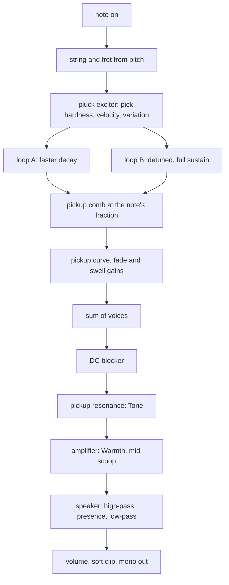
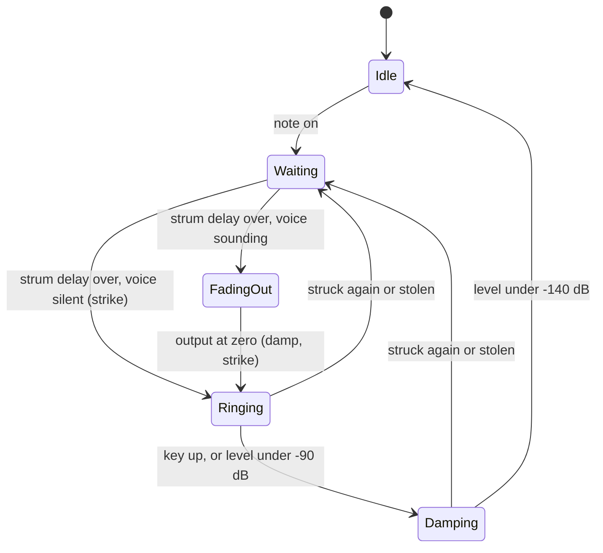

# Guitar Device - Plan

## Goal Capsule

- **Objective:** An ambient musician can load an instrument called Guitar and hear a clean electric guitar: plucked steel strings whose colour changes with every note, long sustain that darkens and slowly beats, strummed chords and swells, at a level and cost that sit with the rest of the library.
- **Means:** One new spec device, `guitar`, on the kit's plucked-string core, with a per-note pickup comb and a shared clean amplifier and speaker (KTD1, KTD3, KTD8).
- **Authority:** `docs/recipes/adding-a-spec-device.md` for how a device is built; the research brief (`strings.md`, sections 0, 1 and the baritone paragraph of 4) for what a guitar is; the build brief for the quality bar. Where they disagree, the recipe wins on mechanics and the build brief wins on limits.
- **Execution profile:** Pipeline run, no human present, no ears. Every claim about sound is a measurement in the native harness.
- **Stop conditions:** Stop if the kit's `PluckedString` cannot do what a settled decision needs without editing `cpp/kit`, or if the wasm smoke cannot be brought under 5 % of real time with eight notes held.
- **Who finishes:** This run commits on the local branch `device/guitar`. There is no remote: an integrator collects the branch, regenerates the shared lists and opens the pull request.

---

## Product Contract

### Summary

Add the instrument `guitar` ("Guitar") to live-mix: a clean electric guitar with ten knobs, six device presets and five factory presets. It ships with its native harness, its generated files and its `.wasm`.

### Problem Frame

The library has a bowed and plucked string (`bowed-string`) that goes through body modes, and no instrument that is heard through a magnetic pickup, a clean amplifier and a speaker. The owner asked for a guitar by name. The research names what separates a guitar from a generic plucked synth: the pickup hears a different mix of harmonics on every note, the top of the note dies slowly instead of in a quarter of a second, the note decays in two stages with slow beating, and a speaker removes everything above about 5 kHz.

### Key Decisions

- **Electric only.** (session-settled: user-directed — chosen over Electric, Steel and Nylon types on one device: `acoustic-guitar` is a separate device built by another builder.) Governs R1.
- **The three traits are built and measured.** (session-settled: user-directed — chosen over a plucked string with a fixed EQ: these are what separate it from a generic plucked synth.) Governs R2, R3, R4, R5, R6, R7.
- **At most ten knobs, six-string behaviour.** (session-settled: user-directed — chosen over a new voice for every strike: allocating a new voice doubles the level and sounds like two instruments.) Governs R6, R10.
- **Factory category `string` for now, preview `keys`.** (session-settled: user-directed — chosen over the `keys` category: the integrator is adding `plucked`, which is the category wanted.) Governs R14.
- **Mono output.** A guitar amplifier has one speaker, and the factory presets add width with effects. Governs R9.

### Requirements

**The instrument**

- R1. The device is `guitar`, name `Guitar`, category `instrument`, class `Guitar` in `guitar.h`. No brand or model name appears in its id, name, parameter names or preset names.
- R2. The pickup is fixed to the body: on each note the harmonics that have a node over the pickup are missing, and that set changes with the fret. On the open low E with the pickup at the neck, harmonic 4 is at least 12 dB under harmonics 3 and 5; an octave up on the same string the missing harmonic is 2.
- R3. Plucking at a fraction of the string removes the harmonics with a node there: plucked at a fifth of the open low E, harmonic 5 is at least 15 dB under harmonics 4 and 6 in the first 100 ms.
- R4. A held note rings for the time Sustain sets (within 15 % at three pitches, by the documented pitch law), reaches at least 15 s on the open low E, and its high partials die faster: harmonic 8 of the open low E decays in 15 % to 60 % of the fundamental's time.
- R5. Each note is two polarisations of one string: it decays in two stages (the first second falls faster than the tail) and its fundamental beats at the rate Shimmer sets, within 20 %.
- R6. A key struck again, or a new key at a pitch that is still ringing, re-plucks its string: the peak rises by less than 3 dB over a single strike, and nothing steps.
- R7. Key up damps the string: the level falls 40 dB within 200 ms and the band above 2 kHz falls first.
- R8. The pickup's resonance, the amplifier and the speaker shape every note: a peak of 2 to 6 dB that moves with Tone, total harmonic distortion under 3 % at the default Warmth with the second harmonic above the third, a spectrum that falls at 18 dB per octave or more above 6 kHz, and energy above 10 kHz at least 40 dB under the 1 to 2 kHz band.
- R9. Swell fades each note in over the set time (10 % to 90 % within 20 %) and hides the pick; Strum spreads the notes of a chord in pitch order, one fifth of the Strum time apart within 2 ms. The output is mono.

**The library's bar**

- R10. At most ten parameters including `volume`, each with a one or two sentence description, each making a measurable difference across its range. At least five device presets named in plain words; the first is the default patch.
- R11. Tuning within 3 cents from C2 to C6 at 44.1, 48 and 96 kHz. Inharmonic fold-back at a high note is at least 50 dB under the note.
- R12. Every recipe rule holds: no allocation, `init` bit-identical, smoothing, block-size independence, sleep to exact zero, bounded under 96 stacked notes, bad input survivable, `kit::soft_clip` at the end, storage for 96 kHz. One note at gain 0.7 peaks between -24 and -10 dBFS at the default volume, a note at gain 0.8 between -22 and -16 dBFS, and ten held notes stay under 0.9.
- R13. Eight held notes cost under 5 % of real time in the wasm smoke, aiming for under 3 %. `experimental` is not set.
- R14. Five factory presets in `src/dsp/factory/presets/guitar.ts`, exported as `GUITAR_PRESETS`, each the instrument and one to four existing effects, with ids and names unique across the bank and levels inside the bank's limits.
- R15. The manifest's `origin.note` names the real instrument and the research, says what is modelled and what is simplified, marks every figure the research calls unsure as a choice, and says it is not a circuit or sample emulation.

### Scope Boundaries

Not built, considered and left out:

- **Both-pickups and humbucker settings.** One pickup that slides from bridge to neck keeps Pickup a single continuous knob. A second tap per voice would change this if a "both" position is wanted.
- **Natural harmonics.** They need a playing mode, and all ten knobs are spent. A choice parameter replacing one knob would change this.
- **Tension modulation, dead spots, vibrato arm.** The research marks their size unsure or instrument-specific; held pitch stays on the kit's allpass tuning, which steps if moved.
- **Stereo.** See the Key Decision above.
- **Acoustic types.** See the Key Decision above.

Not touched: `cpp/kit/**`, `cpp/test/support/**`, `scripts/**`, other devices, `docs/devices.md`, `docs/factory.md`, `CHANGELOG.md`, `.changeset/**`, `package.json`.

---

## Planning Contract

### Key Technical Decisions

- KTD1. **Each voice is two `kit::PluckedString` loops driven by one `kit::PluckExciter`.** (session-settled: user-directed — chosen over a device-private string loop: the core is section 0 of the research and is already measured in `cpp/test/kit_test.cpp`.) Loop A is the polarisation the pickup hears most and decays faster; loop B is quieter and rings for the full Sustain time. The two are tuned half the Shimmer rate below and above the note, so the centre stays in tune. The lines are 4096 samples so a baritone E1 fits at 96 kHz.
- KTD2. **A `kit::DcBlocker` follows the voice sum.** (session-settled: user-directed — chosen over relying on the pluck comb to remove DC: with the comb off the string carries DC that dies with the note.) The pickup's even-order curve also makes DC, so the blocker sits after it.
- KTD3. **The pickup is a per-note comb read from the string.** Each note maps to one of six strings by the lowest fret that fits (notes below E2 extend the low string downward, as a baritone does). The pickup's fraction of the sounding string is its open-string fraction times `2^(fret/12)`, and the voice output is the string minus its own tap that far back. Past half the string the fraction folds, with a floor so the top frets do not vanish. The fraction is smoothed, so Pickup can be moved while notes ring.
- KTD4. **The pick stays over the body too.** Position is a fraction of the open string, scaled by the fret like the pickup and capped at half the string. This is more faithful than a fixed fraction of the sounding length and costs nothing.
- KTD5. **Key up damps inside the loop, ramped.** The string's decay times are walked down to a short damped setting over about 10 ms of control ticks, so the highs die first as they do under a finger. One `set_decay` call would step the loop gain and the delay; a filter after the voice would be a fade, which the research rules out. This came close to a bake-off and did not qualify: both mechanisms were fully specified by research, and the ramp only needs measuring.
- KTD6. **Re-plucks and steals go through one strike sequence.** A sounding voice fades its output over a few milliseconds, the string is damped (a re-pluck keeps a quarter of its motion, a steal none), then the new pluck goes in and the output returns. This is what keeps R6 free of both level doubling and steps.
- KTD7. **The device keeps its own voice table instead of `kit::VoicePool`.** The pool cannot hand a ringing voice to a different note id, which R6 needs for a new key at a ringing pitch. The table follows the pool's stealing order: idle, then quietest releasing, then quietest held. Twelve voices.
- KTD8. **One shared mono chain after the voices.** Pickup resonance (`kit::Svf` low-pass, Tone sets its frequency), amplifier (`kit::fast_tanh` driven by Warmth, then a mid scoop), speaker (high-pass, presence peak, fourth-order low-pass), volume, `kit::soft_clip`. The pickup's even-order curve is per voice, ahead of the resonance.
- KTD9. **No oversampling.** The even-order curve is shallow and the speaker low-pass follows the amplifier, so fold-back is expected well under -50 dB. If the measurement in U3 says otherwise, the first remedy is a lower maximum drive, not `Halfband2x`, which would add latency to an instrument.
- KTD10. **Human variation is on by default and can be switched off from C++.** Each strike varies pluck position, level and pick brightness a little from a seeded generator. A public `set_variation` on the class, not a parameter, lets the harness measure comb nulls on an exact pluck, as the research's test notes ask.
- KTD11. **Strum gathers before it spreads.** With Strum above zero, notes that arrive within a few milliseconds form a chord; when the gather window closes they are sorted by pitch and struck one fifth of the Strum time apart. With Strum at zero a note sounds at once. All timing is counted in samples inside the render loop, so it does not depend on block size.

### High-Level Technical Design

Signal path:

Voice lifecycle:

A key released while its voice is still Waiting is struck and damped at once: a muted pluck.

### Assumptions

- A host sends the notes of a chord within a few milliseconds of each other, so a short gather window sees the whole chord.
- Pitch order stands in for string order in a strum. Two notes that map to the same string are both played, because the string index sets colour, not polyphony.
- Sustain names the time of the tail (loop B) at 110 Hz; higher notes ring shorter by a fixed law the harness checks.
- The figures the research marks likely or unsure (pickup distances, inharmonicity per string, speaker corner frequencies, resonance height, the split between polarisations) are chosen, tuned by measurement, and named as choices in `origin.note`.
- Nobody can listen here. Names and descriptions are claims to check by ear later.

### Risks

| Risk | Mitigation |
|---|---|
| Ramped `set_decay` at key up still steps | `max_step` check on note off in U2; fall back to more ramp ticks, then to a damped setting with a smaller pole |
| Per-note pickup level varies too much across the range | Partial normalisation by the fundamental's comb gain, tuned so C2 to C6 stays within a few dB |
| Deep beat nulls where the two polarisations cross | The polarisation split is a tunable constant; the harness bounds the beat depth |
| Cost reads high while other builders compile | Re-run the smoke and report the best; two loops and two taps per voice are far below `bowed-string` |

---

## Implementation Units

### U1. Manifest

- **Goal:** `cpp/devices/guitar/device.json` describes the device, its ten parameters, six presets and its origin.
- **Requirements:** R1, R10, R15.
- **Dependencies:** none.
- **Files:** `cpp/devices/guitar/device.json`.
- **Approach:** Parameters in this order: `pickup`, `position`, `hardness`, `sustain`, `tone`, `swell`, `strum`, `shimmer`, `warmth`, `volume`. Presets: Glass neck (the default patch), Volume swell, Slow strum, Dark baritone, Muted pattern, Twelve string shimmer. A preset lists only what it changes.
- **Patterns to follow:** `cpp/devices/string-machine/device.json`.
- **Test scenarios:** `src/react/__tests__/param-descriptions.test.ts` passes: every parameter has a description with no range, unit or gesture in it.
- **Verification:** `scripts/dev-device.sh guitar --native-only` generates `params.gen.h` without error.

### U2. Voices, strings and the pickup

- **Goal:** Notes sound as two-polarisation strings heard through a per-note pickup, with the full voice lifecycle.
- **Requirements:** R2, R3, R4, R5, R6, R7, R11, R12; KTD1, KTD2, KTD3, KTD4, KTD5, KTD6, KTD7, KTD10.
- **Dependencies:** U1.
- **Files:** `cpp/devices/guitar/guitar.h`, `cpp/test/guitar_test.cpp`.
- **Approach:**
  1. String table: six open pitches with per-string inharmonicity, stiffness stages and high-partial decay (wound strings darker).
  2. Strike: set frequency, decay, stiffness and pluck position on both loops, then fire the exciter with velocity and hardness.
  3. Render: exciter into both loops, pickup taps, even-order curve, fade and swell gains, level tracking.
  4. Lifecycle as the state diagram; live Sustain and Shimmer changes are applied on the control clock only when the value changed.
  5. A provisional output stage (DC blocker, volume, soft clip) so the harness runs before U3.
- **Execution note:** Write each measurement beside the behaviour it proves and tune constants against it; the constants are choices, the tolerances are the contract.
- **Patterns to follow:** `cpp/devices/tine-piano/tine_piano.h` for voice structure and note sanitising; `test_plucked_string` in `cpp/test/kit_test.cpp` for `partial_near` and the decay measurements.
- **Test scenarios:**
  - Conformance: `check_instrument` at 48 kHz with a short tail.
  - Pitch: C2, E2, A3, E4, C5, C6 at 44.1, 48 and 96 kHz, at minimum and maximum Hardness, with Shimmer at zero, each within 3 cents. At the default Shimmer the two polarisations of A2 sit either side of the note and their midpoint is within 3 cents.
  - Pickup comb: open low E, pickup at neck, harmonic 4 at least 12 dB under 3 and 5; E3 on the same string, harmonic 2 at least 12 dB under 1 and 3; pickup at bridge on the open low E, harmonic 4 is back.
  - Pick null: Position 0.2 on the open low E, variation off, harmonic 5 at least 15 dB under 4 and 6 in the first 100 ms.
  - Variation: with variation on, two strikes of one note differ, by less than 3 dB in level.
  - Decay: fundamental T60 within 15 % of the documented law at E2, A3 and E5; at least 15 s on the open low E at maximum Sustain; harmonic 8 of the open low E between 15 % and 60 % of the fundamental's time.
  - Brightness decay: the spectral centroid of a held note falls from the first 250 ms to each of the next three.
  - Two-stage decay: with Shimmer at zero, the first second falls at a steeper rate than the fourth.
  - Beating: Shimmer at 1 Hz, the fundamental's envelope has a period of 1 s within 20 %; at zero there is no beat.
  - Inharmonicity: partial 8 of the open low E follows the stiff-string law within 3 cents and is more than 3 cents sharp of a harmonic.
  - Re-pluck: the same key 200 ms later raises the peak by under 3 dB; a different note id at the same pitch does the same; `max_step` across the re-pluck is no larger than a first strike's.
  - Key up: 40 dB down within 200 ms; the band above 2 kHz loses 20 dB before the band below it does; `max_step` at key up is no larger than the note's own; exact zero afterwards.
  - Stealing: thirteen notes into twelve voices, `max_step` no larger than a plain strike's.
  - Block size: a chord rendered in blocks of 1, 128 and ragged sizes gives the same audio.
- **Verification:** The harness passes natively and each scenario prints the number it measured.

### U3. Amplifier, speaker and levels

- **Goal:** The shared chain gives the pickup resonance, a clean amplifier and a speaker, at the library's levels.
- **Requirements:** R8, R11, R12; KTD8, KTD9.
- **Dependencies:** U2.
- **Files:** `cpp/devices/guitar/guitar.h`, `cpp/test/guitar_test.cpp`.
- **Approach:** Replace the provisional output stage with the chain of KTD8. Tone, Warmth and Volume are smoothed; filter coefficients are set on the control clock. The amplifier's ceiling bounds a dense chord before the volume, so ten notes struck together compress there instead of reaching the soft clip. Tune the voice gain last.
- **Test scenarios:**
  - Resonance: the same note at Tone low and Tone high; the ratio of the two spectra peaks near the low Tone setting, 2 to 6 dB above the bass, and falls above it.
  - Speaker: long-term spectrum of a bright strummed chord falls at 18 dB per octave or more from 6 to 12 kHz; the band above 10 kHz is at least 40 dB under 1 to 2 kHz; the fundamental of C2 is not more than 12 dB under that of C3.
  - Clean: a note placed so the pickup sits at half its string and the pick at a third, variation off. The string then carries no harmonic 2 or 3, so what is measured there is distortion: at the default Warmth harmonic 2 is above harmonic 3 and the two together are under 3 % of the fundamental; a soft strike measures less than a hard one; at maximum Warmth harmonic 3 is at least three times higher.
  - Fold-back: C6 at 44.1 kHz, maximum Hardness and Warmth; the strongest component between harmonics, below 8 kHz, is at least 50 dB under the fundamental.
  - Levels: one note at gain 0.7 peaks between -24 and -10 dBFS; at gain 0.8 between -22 and -16 dBFS at C3, C4 and C5; ten held notes peak under 0.9; soft notes are quieter and darker than hard ones.
  - Clicks: sweeping Pickup, Tone and Volume across their range under a held chord gives no `max_step` above 1.5 times the steady chord's.
  - Mono: left equals right.
- **Verification:** The harness passes natively; `report_cost` prints the cost of twelve voices.

### U4. Swell and strum

- **Goal:** Notes can fade in without their pick, and chords can be spread.
- **Requirements:** R9; KTD11.
- **Dependencies:** U2.
- **Files:** `cpp/devices/guitar/guitar.h`, `cpp/test/guitar_test.cpp`.
- **Approach:** Swell is a per-voice smooth ramp read at the strike, restarted by a re-pluck. Strum is the gather-and-sort of KTD11; the idle gate treats a waiting voice as sounding.
- **Test scenarios:**
  - Swell at 1 s: 10 % to 90 % rise between 0.8 and 1.2 s; the first 20 ms stay 30 dB under the later peak.
  - Swell at zero: the peak falls inside the first 20 ms.
  - Strum at 60 ms, six notes sent high to low in one block: onsets 12 ms apart within 2 ms, lowest first.
  - Strum at zero: all six onsets within 1 ms.
  - A key released before its strum slot: it sounds as a short muted pluck and the device returns to exact zero.
  - Strum timing is identical for 1-frame and 128-frame blocks.
- **Verification:** The harness passes natively.

### U5. Generated files, WebAssembly and cost

- **Goal:** The device builds to `.wasm` and stays inside the budget.
- **Requirements:** R13.
- **Dependencies:** U3, U4.
- **Files:** `cpp/devices/guitar/params.gen.h`, `cpp/devices/guitar/device_api.gen.cpp`, `src/dsp/devices/guitar.gen.ts`, `src/dsp/wasm/guitar.wasm`.
- **Approach:** Run the full device loop with Emscripten sourced in the same command. If the cost is near the limit, re-run and take the best; if it is over, cut stiffness stages before anything audible.
- **Test expectation:** none beyond the smoke: these files are generated.
- **Verification:** The smoke prints `guitar wasm smoke: ok` and a cost under 5 %.

### U6. Factory presets and the shared lists

- **Goal:** Five patches an ambient musician would reach for, registered in the bank.
- **Requirements:** R14.
- **Dependencies:** U5.
- **Files:** `src/dsp/factory/presets/guitar.ts`, `src/dsp/factory/presets/index.ts`, and the lists `node scripts/gen-devices.mjs` regenerates.
- **Approach:** Each preset is a device preset plus one to four effects: chorus and tape echo for the glass tone, a hall for swells, a bloom reverb for the slow strum, spring reverb and tremolo for the baritone, a tape echo pattern for the muted pluck. Category `string`, preview `keys` (or `chord` and `low` where the patch is a swell or a baritone). Bring levels inside the limits with the instrument's volume or an effect's mix, using the bench in `docs/factory.md`.
- **Patterns to follow:** `src/dsp/factory/presets/string-machine.ts`.
- **Test scenarios:** `src/dsp/factory/__tests__/factory.test.ts` passes with the five presets: unique ids and names, valid devices and values, preview peak at or under -3 dBFS, loudest 400 ms between -36 and -12 dBFS, no DC.
- **Verification:** The factory test, the description test, `pnpm typecheck`, prettier and eslint pass on the files written.

---

## Verification Contract

| Gate | Command | Applies to |
|---|---|---|
| Native harness, wasm build, smoke | `source /home/claude/emsdk/emsdk_env.sh >/dev/null 2>&1; CXX=g++ bash scripts/dev-device.sh guitar` | U2 to U5 |
| Native only, inner loop | `CXX=g++ bash scripts/dev-device.sh guitar --native-only` | U1 to U4 |
| Descriptions and bank limits | `pnpm vitest run src/react/__tests__/param-descriptions.test.ts src/dsp/factory/__tests__/factory.test.ts` | U1, U6 |
| Preset bench | `FACTORY_REPORT=presets FACTORY_DEVICE=guitar pnpm vitest run src/dsp/factory/__tests__/report.test.ts` | U6 |
| Types | `pnpm typecheck` | U6 |
| Format and lint | `npx prettier --check` and `npx eslint` on the files written | U1, U6 |

Not run: `scripts/test-native.sh` and the whole `pnpm test` (the build brief forbids both here). Browser testing does not apply: the library change has no page of its own.

## Definition of Done

- Every requirement R1 to R15 is met, and each of R2 to R9 and R11 has a harness check that would fail if the trait were removed.
- The harness holds at least eight behaviour checks beyond conformance, each printing its measurement.
- All gates in the Verification Contract pass in the clone.
- The wasm smoke cost line is recorded verbatim for the report.
- No file outside the lists in the units is changed, apart from what `scripts/gen-devices.mjs` regenerates.
- No abandoned experiment remains in the diff.
- The work is committed on `device/guitar`; nothing is pushed.

## What Changed in the Build

Found while the units were built and measured; the requirements stand, the checks below replace the ones written above where they differ.

- **The fret test for the pickup comb runs on the high E string.** A note is played at its lowest fret (KTD3), so E3 is the second fret of the D string and never the twelfth fret of the low E. The harness shows the missing harmonic moving from 4 to 3 to 2 on the high E (open, fret 5, fret 12), and the open low E and open A each losing their own fourth harmonic under the same pickup.
- **The clean test uses a note whose period is 72 samples** (666.7 Hz, just past the twelfth fret of the high E), because the kit's pick comb works in whole samples and leaves a little of the third harmonic at other pitches. The method is otherwise as planned: the string gives the pickup no second or third harmonic, so what is measured is distortion.
- **Ten held notes stay under 0.5**, the soft clip's knee, and not only under 0.9: 0.31 as shipped and 0.48 with Strum at zero.
- **The pick law is wider** (300 Hz at a thumb to 9.6 kHz at a stiff plectrum, and a soft stroke is darker by more) and the default Hardness is 0.55.
- **Each strike has its own noise generator**, seeded from the note, so with variation off a note is the same sound whichever string plays it.
- **A chord that still rings is strummed 8 ms late** (KTD6 with KTD11): the fade of each old note ends as its string is reached, so the spacing of the strum is kept.
- **A held note that has rung out is let go** once it is 100 dB down, so its string is free; the plan left this to the idle gate.
- **The peak of a note is not held across the Pickup knob, the body of the note is.** Where the pick and the pickup sit decides how tall the pick's spike is (6 dB between settings); the level trim keeps the 0.1 to 0.5 s body within 3 dB from bridge to neck. An amplifier that squashed the spike was tried and dropped: it cost the cleanliness of chords before it changed the crest.
- **Two device presets carry their own Volume and Warmth** (Volume swell, Muted pattern) so that they sit in the bank's level range once the pick is hidden or the note is short.
- **A two-note cleanliness check was added** beside the single-note one: what the amplifier adds between two notes is 49 dB under them at the default Warmth.
- **High notes are given a longer top** (found in review). Above about 900 Hz the decay asked for near 3 kHz was more than the string core's one low-pass can give without taking the fundamental with it, and notes died up to three times sooner than Sustain says. The high decay now never asks the filter for more than 0.6 of the fundamental's own loss, and the tail is measured at 110, 1319 and 2093 Hz as well (R4).
- **A knob moved in silence has arrived by the next note** (found in review). The smoothers do not run while the instrument sleeps, so the first note after a silent Pickup move kept the old setting's level trim (5 dB at the extremes) and began with the old Tone, Warmth and Volume. On waking the smoothed knobs go straight to their targets, and a note picked while Pickup is still moving takes its trim to the new setting. Both are measured, as are Sustain and Shimmer reaching a ringing note, a held note that has rung out, and which string a thirteenth note takes.

## Sources

- `docs/recipes/adding-a-spec-device.md`: the rules and the loop.
- `cpp/kit/string.h` and `test_plucked_string` in `cpp/test/kit_test.cpp`: the string core, its `tap` for a pickup, its `damp`, and how its traits are measured.
- `cpp/devices/string-machine/`, `cpp/devices/tine-piano/tine_piano.h`, `cpp/test/tine_piano_test.cpp`: device and harness idiom.
- `cpp/test/support/test_kit.h`: `check_instrument`, `tone_level`, `max_step`, `rt60`, `report_cost`.
- `docs/factory.md`, `src/dsp/factory/presets/string-machine.ts`, `src/dsp/factory/phrases.ts`: the bank, its limits and its audition phrases.
- The research brief `strings.md` (outside the repository), sections 0 and 1 and the baritone paragraph of section 4: the physics, the DSP outline, the knob list, the presets and the acceptance checks this plan adopts. Its sources were found by search and not read; its figures marked likely or unsure are treated as choices.
