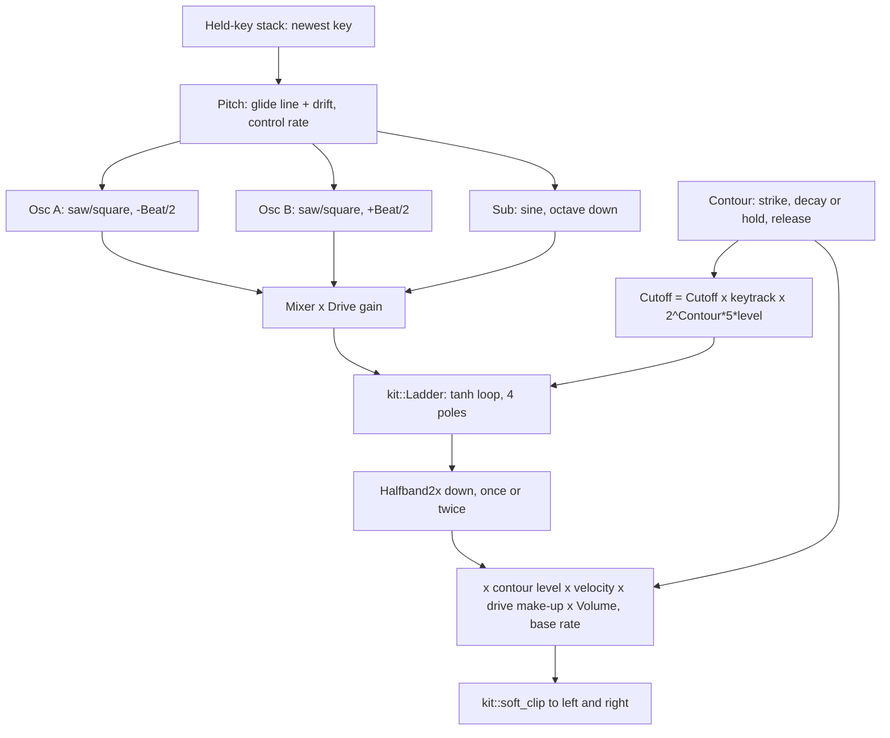

# Ladder Bass Device - Plan

## Goal Capsule

- **Objective:** A musician can load `ladder-bass` and play a monophonic bass that sounds and behaves like a ladder-filter mono synth: two beating oscillators and a sub through an overdriven four-pole filter whose resonance thins the low end, usable for Berlin-school sequences, pedal drones and sub tones from C0 upward.
- **Means:** One spec device on `cpp/kit`, oscillators generated at an oversampled rate into `kit::Ladder`, with a native harness that measures each trait (KTD1 to KTD11).
- **Authority:** The build brief (`BUILD-BRIEF.md`, kept outside this repository with the task file and the research `synths.md`) is the contract; the task file and research section 9 give direction; `docs/recipes/adding-a-spec-device.md` gives the device rules. Where they disagree the build brief wins.
- **Execution profile:** Pipeline run, no human present. Nobody can listen: every claim about the sound is a measurement in the harness, and names and descriptions are claims to check by ear later.
- **Stop conditions:** A settled decision (KD1 to KD3, KTD1, KTD2, the hold in KTD6) proves infeasible; the wasm smoke stays over 5 % of real time after one algorithm change; or a file outside the allowed set would have to change.
- **Who ships:** The run commits on `device/ladder-bass`. There is no remote, so nothing is pushed and no pull request is opened; an integrator collects the branch.

---

## Product Contract

### Summary

Add the instrument `ladder-bass` ("Ladder Bass", class `LadderBass`): a monophonic voice with ten knobs, at least five device presets, a description on every parameter, a native harness, the built `.wasm`, and five factory presets.

### Problem Frame

The library has no bass voice with a saturating ladder filter. Ember in Mono mode makes a usable bass, but its filter is a clean state-variable type with no drive and no passband loss, and Drone makes held low tones from sine partials. The research names a clean, compensated filter as the one thing that makes this kind of bass sound fake, and a single oscillator with no beating as the second.

### Key Decisions

- KD1. **Ten knobs from research 9.5** (wave, beat, sub, cutoff, emphasis, contour, decay, drive, glide, volume). (session-settled: user-directed — chosen over separate filter and loudness envelopes: the brief caps a device at ten knobs and asks for "super simple".) Governs R1, R2.
- KD2. **Factory categories are `drone` and `keys`.** (session-settled: user-directed — chosen over a new `bass` category: the integrator owns the category list.) Governs R17.
- KD3. **The kit, the test support, the scripts, other devices and the shared docs stay untouched; a missing block is written in the device's own directory.** (session-settled: user-directed — chosen over extending the kit: fourteen other builders work in parallel and an integrator merges.) Governs R15.

### Requirements

**Voice and playing**

- R1. The device exposes at most ten parameters including `volume`, with neutral names and no brand or model names anywhere but `origin.note`.
- R2. Every parameter changes the sound audibly across its whole range, and its `description` says so in one or two plain sentences of at most 170 characters ending in a full stop, with no dash.
- R3. It plays one pitch at a time with last-note priority: a second key takes over, and releasing it returns to the key still held.
- R4. Glide slides pitch between overlapping keys in the set time; a key struck from silence starts on pitch.
- R5. With Decay at the top a note holds for as long as the key is down; below it each note fades to silence at the set rate.
- R6. It plays from C0 to C6: the fundamental and the sub are present at C0 and the output stays under the soft-clip knee.

**The character**

- R7. Two oscillators beat at the rate the detune implies, centred on the played pitch.
- R8. The filter falls at 24 dB per octave above its cutoff.
- R9. Raising Emphasis lowers the level of the bass, uncompensated.
- R10. Drive saturates: it compresses and reshapes the tone without making it much louder.
- R11. Contour makes each note start bright and close as it fades.

**Quality**

- R12. Tuning is within ±3 cents from C1 to C6 at 44.1, 48 and 96 kHz.
- R13. Energy that does not belong to the note is at least 50 dB down at a high note with full drive, and the output carries no DC.
- R14. No clicks: a second key, a re-struck key, a release, and a cutoff sweep while sounding do not step.
- R15. It keeps every recipe rule: no allocation, deterministic `init`, block-size independence, exact zero when idle, bounded under 96 stacked notes, bad input survived, `kit::soft_clip` at the output.
- R16. One note at gain 0.7 peaks between -24 and -10 dBFS at the default volume, and at gain 0.8 between about -22 and -16 dBFS; eight notes sent in the wasm smoke cost under 5 % of real time.

**Shipping**

- R17. Five factory presets in `src/dsp/factory/presets/ladder-bass.ts` (the instrument plus one to four stock effects) pass the bank's limits, with `preview` set to `low` or `line`.
- R18. At least five device presets with plain names, the first being the default patch.

### Scope Boundaries

- No sequencer and no echo inside the device: the score plays the pattern and `tape-echo` supplies the echo.
- No stereo processing: a bass voice is mono, and both outputs carry the same signal.
- Considered and not built: a DC blocker or rumble filter. Every source is symmetric about zero, a high-pass would remove the sub at C0 (R6), and the harness measures DC instead. A measured DC offset above 0.001 would change this.
- Considered and not built: a ladder of its own with per-stage saturation or resonance above the kit's limit. `kit::Ladder` already saturates in the loop and loses passband level. Failing R8 or R9 with the kit block would change this.
- Not touched (KD3): `cpp/kit/**`, `cpp/test/support/**`, `scripts/**`, other devices, `docs/devices.md`, `docs/factory.md`, `CHANGELOG.md`, `.changeset/**`, `package.json`.

### Sources

- Research: `synths.md` section 9 (9.3 how the instrument works, 9.4 the model, 9.5 knobs, 9.6 presets, 9.7 checks). Every technical figure there is from general knowledge; none was verified against a schematic or a recording.
- Reference device and harness: `cpp/devices/string-machine/`, `cpp/test/string_machine_test.cpp`.
- Kit blocks used: `kit::Ladder` and `kit::tan_prewarp` (`cpp/kit/filters.h`), `kit::Halfband2x` (`cpp/kit/oversample.h`), `kit::Drift` (`cpp/kit/lfo.h`), `kit::Smoother` and `kit::ControlClock` (`cpp/kit/smooth.h`), `kit::IdleGate` (`cpp/kit/idle.h`), `kit::SineTable` and `kit::soft_clip` (`cpp/kit/math.h`).
- Conformance and measurements: `cpp/test/support/test_kit.h` (`check_instrument`, `tone_level`, `dominant_frequency`, `rt60`, `max_step`).
- Wasm smoke: `scripts/smoke-wasm-device.mjs` sends eight notes at the default patch and times ten seconds after a one-second warm-up.
- Factory rules: `docs/factory.md`, `src/dsp/factory/__tests__/factory.test.ts`, `src/dsp/factory/phrases.ts`.
- Description rules: `src/react/__tests__/param-descriptions.test.ts`.

---

## Planning Contract

### Key Technical Decisions

- KTD1. **One voice and a stack of held keys.** The device keeps up to 16 held keys in press order and plays the newest; a full stack drops its oldest key. (session-settled: user-directed — chosen over a polyphonic voice pool: one voice is cheap enough to oversample and is how the modelled instruments play.) Implements R3.
- KTD2. **`kit::Ladder`, driven and uncompensated.** Drive is gain into the ladder's own saturating loop, and nothing restores the passband level that Emphasis removes. (session-settled: user-directed — chosen over a clean compensated filter: the research names that as the one thing that makes this bass sound fake.) Implements R8, R9, R10.
- KTD3. **Oscillators run at the oversampled rate; only the way down is filtered.** The voice is computed at four times the sample rate below 60 kHz and twice above it, then decimated with `kit::Halfband2x` stages. Generating at the high rate needs no upsampler and puts the PolyBLEP residue further out of band. Two times alone is expected to miss R13 with full drive at C5, because a clipped sawtooth edge folds back at about -43 dB per component.
- KTD4. **A two-shape oscillator of its own in the device header.** Wave blends a sawtooth and a square read from one phase, which `kit::BlepOsc` cannot give because each of its shapes advances the phase. The helper uses the same PolyBLEP residual and stays in `cpp/devices/ladder-bass/`.
- KTD5. **The sub is a sine one octave under the played pitch.** It adds weight without adding harmonics for Drive to fold, and it passes through the filter like the oscillators, so Emphasis thins it too. The research allows a sine or a square; the sine is a choice.
- KTD6. **One contour for loudness and filter.** It rises in about 2 ms from wherever it is, then decays exponentially so that it is 60 dB down after Decay. At 9.9 s and above it holds at full while a key is down (session-settled: user-directed — chosen over a decay that always reaches silence: pedal drones are a primary use). After the last key is released it falls at the Decay rate, capped at 0.8 s. Loudness follows it linearly; the cutoff rises by Contour times five octaves times its level. Implements R5, R11.
- KTD7. **Every new key strikes the contour again; glide happens only between overlapping keys.** A strike starts from the contour's current level, so with Decay at hold an overlapping key changes nothing but pitch, and returning to an older key never strikes. This departs from the research's "legato overlap gives no new attack" for decaying patches: sequence steps that overlap in a score would otherwise be silent after the first. Implements R3, R4, R14.
- KTD8. **The cutoff follows the keyboard by half.** It moves half an octave per octave played, pivoting on C2, so C5 and C6 keep their tone at the default cutoff. The research gives no figure; half tracking is a choice. Implements the playable range in R6.
- KTD9. **Mono out, no high-pass, level under the knee.** Both outputs carry the same signal and the gain staging keeps a full patch under 0.5 at the default volume, so `kit::soft_clip` is a safety and never shapes a normal note. Implements R6, R13.
- KTD10. **Small slow drift.** Both oscillators wander together by under one cent, and against each other by under half a cent, on `kit::Drift`. That keeps a held note alive at Beat 0 while leaving tuning inside R12 and the beat rate inside its tolerance.
- KTD11. **Glide is a straight line in pitch that arrives in the set time**, whatever the interval. A fixed arrival time is what the knob says and what the harness can measure.

### High-Level Technical Design

Signal path, per sample at the oversampled rate unless marked:

What each note event does:

| Event | Stack | Pitch | Contour |
| --- | --- | --- | --- |
| Key down, no key held | push | jumps to the key | strikes from its current level |
| Key down, another held | push | glides to the new key | strikes from its current level |
| Newest key up, another held | remove | glides back to the held key | unchanged |
| An older key up | remove | unchanged | unchanged |
| Last key up | empty | stays | releases |
| Key up for a key not held | unchanged | unchanged | unchanged |
| Same key down twice | moved to the top | unchanged | strikes from its current level |

### Assumptions

- Nobody listens during this run. Defaults, preset names and descriptions are chosen from how these sounds are usually made and held to measurements.
- The default patch is the research's "Sequence bass" (short decay). The wasm smoke therefore times a voice that has already faded and gone to sleep; the harness also reports cost on a held drone, which is the honest figure.
- Decay shows "10 s" at the top of its range where it means hold; the description says so. The manifest has no way to label one value.
- The hold release time (0.8 s), the contour depth (five octaves), the attack (2 ms), the drive range (24 dB) and half key tracking are choices, not measurements of an original. `origin.note` says so.
- Velocity scales loudness only, as String Machine does.
- Factory preset names are checked for uniqueness against this clone only; the integrator re-checks across all fifteen.

### Risks

| Risk | Mitigation |
| --- | --- |
| Aliasing at C5 with full drive misses 50 dB even at four times | Cap the drive gain, then soften the mixer with a gentler pre-clip; measure after each change |
| `kit::Ladder` at full Emphasis rings at the cutoff but does not start oscillating by itself | The harness asserts the resonant peak sits at the cutoff under excitation; the description does not promise a free-running tone |
| Cost printed by the smoke reads high while other builders compile | Re-run the smoke and report the best figure |
| The 24 dB slope check is disturbed by the saturation | Measure at Drive 0 on harmonics well above the cutoff, as a difference between two renders |

---

## Implementation Units

### U1. Manifest: parameters, presets, origin

- **Goal:** `device.json` describes the instrument so the generator can write its tables.
- **Requirements:** R1, R2, R18.
- **Dependencies:** none.
- **Files:** `cpp/devices/ladder-bass/device.json`; generated `cpp/devices/ladder-bass/params.gen.h`, `cpp/devices/ladder-bass/device_api.gen.cpp`, `src/dsp/devices/ladder-bass.gen.ts`.
- **Approach:**
  1. Ten params in the order of KD1: `wave` 0..1, `beat` 0..25 ct, `sub` 0..1, `cutoff` 30..12000 Hz log, `emphasis` 0..1, `contour` 0..1, `decay` 0.03..10 s log, `drive` 0..1, `glide` 0..1 s, `volume` -48..6 dB.
  2. Defaults are the first preset. Five presets from research 9.6 with plain names: a sequence bass, a pedal drone, a soft sub, a singing lead, a slow opener.
  3. `origin.kind` is `new`. The note names the instruments and the research, says which figures are choices (Assumptions), and says it is not a circuit or sample emulation.
- **Patterns to follow:** `cpp/devices/string-machine/device.json`.
- **Test scenarios:** Test expectation: none -- data only; U2's conformance and the description test in U5 read it.
- **Verification:** The generator accepts the manifest and writes the three generated files.

### U2. The voice

- **Goal:** `LadderBass` renders the signal path of the High-Level Technical Design and passes conformance.
- **Requirements:** R3 to R6, R15; KTD1 to KTD11; KD3 for the oscillator helper.
- **Dependencies:** U1.
- **Files:** `cpp/devices/ladder-bass/ladder_bass.h`, `cpp/test/ladder_bass_test.cpp` (conformance block).
- **Approach:**
  1. `init` resets every member, both decimators, the ladder, the stack, the phases and the drift seeds, then applies every parameter.
  2. `note_on` ignores a NaN frequency, clamps frequency and gain, and updates the stack as the event table says. `note_off` removes the key and follows the same table.
  3. `process` wakes on a held key or a live contour, clears the input, and per base-rate sample advances the smoothers, the glide line, the contour and the cutoff, then runs the oversampled inner loop and decimates.
  4. Drift and other slow work run on `kit::ControlClock`.
  5. The device sleeps once the contour has reached zero and the decimators have emptied.
- **Technical design:** directional, not a specification. The contour is one number in 0..1 with three motions: towards 1 with a 2 ms pole while striking, multiplied by the decay coefficient otherwise (or held at 1), multiplied by the release coefficient with no key held, and snapped to 0 under 1e-5.
- **Patterns to follow:** `cpp/devices/string-machine/string_machine.h` for `init`, `apply`, smoothing and the idle gate; `cpp/devices/auto-filter/auto_filter.h` for `kit::Halfband2x`.
- **Test scenarios:**
  - `check_instrument` at 48 kHz with `max_peak` 1.01 and a tail of a few seconds: silent before a note, sounding while held, exact zero after release, identical after a second `init`, bounded under 96 stacked notes, every parameter extreme, absurd notes, 44.1 and 96 kHz.
  - Block sizes 1, 128 and 2048 render the same held note to within 1e-4.
- **Verification:** The native harness reports no failure with only the conformance block present.

### U3. The harness measures the instrument

- **Goal:** Each trait in R3 to R14 has a measurement that would fail if the trait were missing.
- **Requirements:** R3 to R14, R16.
- **Dependencies:** U2.
- **Files:** `cpp/test/ladder_bass_test.cpp`.
- **Approach:** Start each check from a steady patch (Beat 0, Sub 0, Contour 0, Decay at hold, Drive 0, Cutoff open) and change only what the check is about. Tune DSP constants in `ladder_bass.h` until every check passes, never the tolerance past what the requirement states.
- **Execution note:** Write each measurement before tuning the constant it constrains, and print the measured value so the tolerance is chosen against a number.
- **Test scenarios:**
  - Pitch: C1, C2, C4 and C6 at 44.1, 48 and 96 kHz are within ±3 cents (R12).
  - Detune is centred: at Beat 12 on C6 the two components sit about 6 cents either side of the pitch (R7).
  - Beat rate: Beat 6 on A1 swings the 55 Hz level at 0.19 Hz within 15 % (R7).
  - Sub: Sub 1 adds a component one octave below the note; Sub 0 leaves none (R2).
  - Wave: at 1 the even harmonics are at least 20 dB under their sawtooth level (R2).
  - Slope: attenuation one octave apart, both well above the cutoff, differs by 24 ± 3 dB (R8).
  - Bass thins: Cutoff 1 kHz, Emphasis 0 to 0.8 lowers a 55 Hz fundamental by 6 dB or more (R9).
  - Resonance: at Emphasis 1 the strongest harmonic in the band around the cutoff is the one at the cutoff (R9).
  - Drive compresses: the loudness swing of two beating sawtooths shrinks from Drive 0 to Drive 1, and the second harmonic falls against the third (R10).
  - Drive is not a volume knob: the level at Drive 1 is within 6 dB of the level at Drive 0 (R10).
  - Pluck: Contour 0.6 and Decay 0.18 s drop the spectral centroid by an octave within 200 ms, and the decay time follows Decay within 20 % at two settings (R11, R5).
  - Hold: Decay at the top keeps a note at the same level after 20 s; released, it reaches exact zero (R5).
  - Glide: with Glide 0.4 s between overlapping keys an octave apart, the pitch is at the midpoint near 0.2 s and on target after 0.4 s; from silence there is no slide (R4).
  - Mono and last note: with two keys held only the newer pitch is present; releasing it returns to the older one (R3).
  - No clicks: a second key while one is held, the same key struck again, a release, and a cutoff sweep keep `max_step` near the step of the steady tone (R14).
  - Held overlap gives no new attack: at hold the level around a second key does not dip or bump (R3, KTD7).
  - C0: 16.35 Hz and the 8.2 Hz sub are both present, the peak stays under 0.5, and the level is steady over time (R6).
  - Aliasing: C5 at Drive 1, the strongest component that is not a harmonic is 50 dB under the fundamental (R13).
  - DC: the mean of a held note is under 0.001 for sawtooth and square (R13).
  - Level: one note at gain 0.7 and at 0.8 inside R16's windows at the default patch.
  - Ten keys held at once peak under 0.5, the same as one key (R16, KTD1).
  - Stereo: left equals right (KTD9).
  - Cost: `report_cost` on a held drone.
- **Verification:** The harness prints "all passed" with at least eight behaviour checks beyond conformance.

### U4. The module and its cost

- **Goal:** The `.wasm` is built by the pinned toolchain and the smoke passes inside the budget.
- **Requirements:** R15, R16.
- **Dependencies:** U3.
- **Files:** `src/dsp/wasm/ladder-bass.wasm` and the generated files of U1.
- **Approach:** Run the device loop with the Emscripten environment sourced in the same command. If the cost is over 3 %, cut inner-loop work first (coefficients at base rate, a cheaper exponent) before touching the oversampling factor.
- **Test scenarios:** Test expectation: none -- the smoke script is the check: exports, memory, silence when idle, sound when played, parameter extremes, cost under 5 %.
- **Verification:** The smoke prints its cost line and "ok".

### U5. Factory presets and shared lists

- **Goal:** Five patches make the instrument usable from the bank.
- **Requirements:** R17, R2.
- **Dependencies:** U4.
- **Files:** `src/dsp/factory/presets/ladder-bass.ts`, `src/dsp/factory/presets/index.ts`, and the shared generated lists (`src/dsp/devices/index.gen.ts`, `scripts/devices.gen.sh`, `docs/devices-generated.md`) as the generator rewrites them.
- **Approach:** Sequence patches in `keys` with `preview: 'line'` and an echo; held patches in `drone` with `preview: 'low'` and a room. Bring each inside the limits with the instrument's volume or an effect's mix, using the bench.
- **Patterns to follow:** `src/dsp/factory/presets/string-machine.ts`.
- **Test scenarios:**
  - `factory.test.ts` passes: ids and names unique, each patch valid, peak at or below -3 dBFS, loudest 400 ms between -36 and -12 dBFS, no DC.
  - `param-descriptions.test.ts` passes for the new device.
- **Verification:** Both test files pass, and typecheck, prettier and eslint are clean on the files this plan writes.

---

## Verification Contract

| Gate | Command | Proves |
| --- | --- | --- |
| Native harness, module, smoke | `CXX=g++ bash scripts/dev-device.sh ladder-bass`, with the Emscripten environment sourced in the same shell command | U1 to U4 |
| Shared lists | `node scripts/gen-devices.mjs` | U5 registration is current |
| Bank and descriptions | `pnpm vitest run src/react/__tests__/param-descriptions.test.ts src/dsp/factory/__tests__/factory.test.ts` | U5 |
| Preset levels (tuning aid) | `FACTORY_REPORT=presets FACTORY_DEVICE=ladder-bass pnpm vitest run src/dsp/factory/__tests__/report.test.ts` | U5 levels |
| Types | `pnpm typecheck` | TypeScript is sound |
| Format and lint | `npx prettier --check` and `npx eslint` on the files written | Style |

Never run `scripts/test-native.sh` or the whole `pnpm test`. There is no page to test in a browser: the integrator plays every instrument in the app afterwards.

## Definition of Done

- Every gate in the Verification Contract passes in this clone.
- The harness holds at least eight behaviour measurements beyond conformance, covering R3 to R14.
- The manifest has at most ten parameters, five or more plain-named presets, and a description on every parameter.
- The smoke's cost line is under 5 % of real time, and the harness prints the cost of a held drone.
- No file outside the allowed set changed, and no experiment code or debug output is left in the diff.
- The work is committed on `device/ladder-bass`; nothing is pushed.
- Every departure from the research (KTD5 to KTD8, the Assumptions) is named in `origin.note` or the final report.
