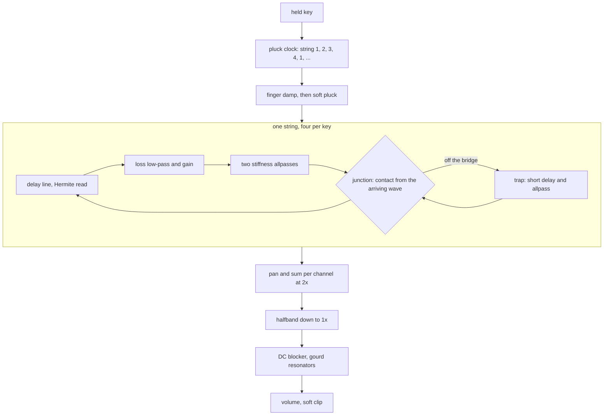

# Tanpura Device - Plan

## Goal Capsule

- **Objective:** A musician can load "Tanpura" in live-mix, hold one key and hear a four-string drone that plucks round and round, each pluck opening into a moving buzz of overtones, in tune, at a sane level and cheap enough to sit in a session.
- **Means:** A stiff string loop whose bridge end is a lossless junction that closes when the string swings onto the bridge (KTD1, KTD2), four of them per key behind a pluck clock (KTD6).
- **Authority:** The integrator's build brief `BUILD-BRIEF.md` (the quality bar), then the task file `tasks/tanpura.md` (the integrator's decisions), then the research `strings.md` sections 0 and 8 (the grounding), then this plan. The three live in the integrator's research folder, outside this repository.
- **Stop condition:** If the device cannot be made to show the delayed bloom and pass Raman's test (R6, R7), stop, commit what exists and report what was tried and measured (KD1). No other condition stops the run.
- **Execution profile:** One pipeline run with no human present. Nobody can listen: every claim about the sound is a measurement. The clone has no remote, so the work ends as commits on `device/tanpura`.
- **Tail ownership:** The integrator regenerates the shared lists, adds the `plucked` and `wind` categories, re-measures cost on a quiet machine and plays the device in the app.

---

## Product Contract

### Summary

Add the spec device `tanpura` ("Tanpura") to live-mix.
Holding a key runs a cycle of four plucks on four strings tuned to that key, and each string buzzes against a jawari bridge so its overtones bloom after the pluck and sweep as it dies.
It ships with a native harness that measures those traits, its `.wasm`, device presets, a description on every knob and five factory presets.

### Problem Frame

The owner asked for fifteen researched ambient instruments the library does not have.
The tanpura is the root of drone music, and the only tanpura in the library is a Drone preset made of sine partials: it has the pitches and none of the things a listener knows the instrument by, which are the buzzing bridge and the slow sweep of overtones inside every pluck.
The research derived a reduced bridge model and marked it reasoned but untested, so the bridge was prototyped before this plan was written (see Sources and Research).

### Key Decisions

- KD1. **No fake.** If the bridge model cannot be made to work, the run stops rather than shipping filter sweeps over a plain string. (session-settled: user-directed — chosen over a filter-sweep imitation: the Drone device already has an honest sine-partial preset and the integrator will fill the slot with another instrument.) Governs R6, R7, R9.
- KD2. **The key is the Sa of the two middle strings.** The first string sits a fourth below it (Pa), a fifth below it (Ma) or a semitone below it (Ni), and the fourth string an octave below. Read from the task's "the first string a fifth or a fourth below, then two at the octave, then the low octave". Governs R1, R10.
- KD3. **One cyclic instrument, no lead mode and no latch.** The research's Play mode and Hold switch are left out to stay under ten knobs. Governs R18.

### Requirements

**Playing**

- R1. Holding a key plucks four strings one after another, without end, in the frequency ratios 3 : 4 : 4 : 2 (Pa), 8/3 : 4 : 4 : 2 (Ma) or 15/4 : 4 : 4 : 2 (Ni), where 4 is the key.
- R2. One cycle of four plucks lasts the time the Speed knob says within 5 %, and pluck times vary by 1 to 5 % from an even grid, the same way after every `init`.
- R3. A pluck lands on its own string while that string still rings: re-plucking raises the peak by less than 3 dB and makes no step.
- R4. Several held keys run several tanpuras. More keys than the pool holds steal the quietest, with a fade of about 2 ms.
- R5. With the key released the plucking stops and the strings ring out in a few seconds, after which the output is exact zero and the device sleeps.

**The jawari**

- R6. Delayed bloom: with Jawari on, the energy of harmonics 10 to 30 of a string is largest between 50 ms and 1.5 s after its pluck. With Jawari at zero it is largest at the pluck.
- R7. Raman's test: plucked in the middle with Jawari at zero, harmonic 2 is at least 25 dB below harmonic 1 at 300 ms. At the default Jawari it is within 15 dB.
- R8. Level dependence: a pluck 12 dB softer lowers the ratio of harmonics 10 to 30 over harmonics 1 to 3 by at least 6 dB with Jawari on and by under 1 dB with it off.
- R9. Moving formant: the centroid of the harmonics above the fifth falls by at least an octave between its highest point after the pluck and 4 s.
- R10. Pitch: each string's fundamental is within 3 cents of its ratio from the key over the last half of a note, from C2 to C6 at 44.1, 48 and 96 kHz, and within 10 cents all through the note.
- R11. The bridge adds no energy: 60 s of held drone at the largest Jawari and Decay does not grow, and its DC stays under -60 dBFS.

**Quality**

- R12. Fold-back: at the highest key, what lies between the partials is at least 50 dB below the strongest partial.
- R13. Level: one note at gain 0.7 peaks between -24 and -10 dBFS at the default volume, at gain 0.8 between about -22 and -16 dBFS, and ten held notes stay under the clip knee.
- R14. A continuous drone: at the defaults the short-term level never falls more than 10 dB below its mean over a cycle.
- R15. No clicks: a stolen voice, a key struck again, a released key and the Jawari knob swept while sounding make no step larger than the note's own.
- R16. Stereo: Spread places the four strings across the field, the sum of left and right never cancels, and Spread at zero is mono.
- R17. Cost: eight held notes cost under 5 % of real time in the wasm smoke (aim 3 %), without `experimental`.

**Surface**

- R18. At most ten parameters including `volume`, each with a one or two sentence description, each making an obvious difference over its whole range.
- R19. At least five device presets named in plain words, the first being the defaults, and no brand or artist name anywhere but `origin.note`.
- R20. Five factory presets in `src/dsp/factory/presets/tanpura.ts`, category `drone`, preview `low`, inside the bank's limits.
- R21. Every rule of `docs/recipes/adding-a-spec-device.md` holds, checked by `check_instrument` and the harness.

### Scope Boundaries

Considered and not built:

- **Coupling between strings through the bridge.** The research suggests feeding the string sum back into all four at about -35 dB. Four lossless loops on shared pitches leave no margin for an unmodelled feedback path, and Detune already gives the slow phasing of the two Sa strings. A measured bridge admittance would change the call.
- **A second polarisation per string.** It doubles the cost of the most expensive block for a beat the Detune knob already supplies.
- **Tension modulation.** The bridge already makes the pitch start sharp and settle, which is the audible part.
- **A Play mode and a Hold switch** (KD3).

### Deferred to Follow-Up Work

- The `plucked` factory category does not exist yet; this instrument stays in `drone`, which fits it.

---

## Planning Contract

### Key Technical Decisions

- KTD1. **The jawari is a lossless junction, not the moving read of research 8.4 (b).** The string is cut a short way from its bridge end. Off the bridge the wave passes through the short piece (the trap), so the loop is one period long. On the bridge the wave turns round at the contact point, sooner by the trap's length, and what is in the trap stays there until the string lifts. The junction is a rotation of the pair (trap output, arriving wave), so it makes and loses no energy at any contact value. The moving read as the research wrote it was prototyped first: it passes Raman's test but shows no bloom and drains the note into DC, because skipping and repeating samples at each transition shortens the contacting half-wave. Governs R6 to R9, R11.
- KTD2. **The string is stiff.** Two first-order allpasses in the loop stretch the partials with an inharmonicity near 2e-5. In the prototype the downward sweep of the formant exists only with stiffness: with none the bloom halves, the centroid does not fall and the pitch sits 14 cents sharp. One to four stages gave the same bloom at C3, so two are used for cost. The value of B is a choice, not a measurement of a tanpura string. Governs R9, R17.
- KTD3. **The loop is the device's own block, `cpp/devices/tanpura/jawari_string.h`.** `kit::PluckedString` is linear, tunes with an allpass and has no place for the junction. The new block is built the same way: a Hermite-read delay line shortened by the phase delay at the fundamental of everything else in the loop (loss low-pass, stiffness allpasses, trap), a one-pole loss solved from two decay times, a pluck comb at the pluck point. `kit::PluckExciter`, `kit::Halfband2x` and `kit::DcBlocker` are used as they are. The kit is not edited.
- KTD4. **Strings run at twice the sample rate and the contact is soft.** All strings are summed per channel at 2x and decimated by one `kit::Halfband2x` per channel. The contact value follows the arriving wave through a low-pass of a few kilohertz and a smooth step, so the junction's products stay under the 2x Nyquist. With a hard contact the prototype measured fold-back at -42 dB; soft and smoothed it measured -79 dB or better. Governs R12.
- KTD5. **Jawari is how firmly the bridge holds the string, zero to one.** It scales the contact value, so it moves without a click and zero is exactly a plain string. The trap length is a fixed share of the period (about 0.5 %), stored as whole samples plus an allpass so it can be shorter than one sample at high notes. In the prototype the bloom rose evenly with it: 0, +4, +9, +10, +11 dB at 0, 0.15, 0.3, 0.5, 1. Governs R6, R15.
- KTD6. **A voice is one tanpura: four strings and a pluck clock.** `kit::VoicePool` holds the voices. The pool size is set by the measured wasm cost, four keys at least. A pluck first lays a finger on its string (a short loss ramp) and then excites it, so the string is reused and never doubled. The pluck is soft and scaled to the string: the pick low-pass sits a fixed number of harmonics above the string's own pitch. Governs R1 to R4.
- KTD7. **Human variation comes from one seeded generator per voice:** pluck time within 3 %, level within 1.5 dB, pluck point within 2 % of the middle. Two per cent, not the research's five, keeps harmonic 2 of a plain string 30 dB down so R7 can be measured with the variation on.
- KTD8. **A released key damps its strings to ring for at most four seconds.** Without it a 30 s Decay would hold a voice for over a minute after the key is up. The value is a choice.
- KTD9. **Each string is rendered a chunk at a time** (a fixed chunk shorter than the shortest loop the highest key can have), with its state in locals, and control-rate work runs on the chunk boundary. This is the cost lever: the prototype's sample-at-a-time loop cost 4 to 10 % natively for 32 strings. Governs R17, R21.
- KTD10. **After the decimator:** a DC blocker per channel, a gourd of five broad resonators per channel a little apart left and right (the Bow device's body pattern), volume, `kit::soft_clip`.

### Parameters

| Key | Range | Default | What it does |
| --- | --- | --- | --- |
| `tuning` | Pa, Ma, Ni | Pa | The first string |
| `jawari` | 0 to 1 | about 0.6 | How firmly the bridge holds the string (KTD5) |
| `speed` | 2 to 12 s, log | 5 | Time for one cycle of four plucks |
| `decay` | 3 to 30 s, log | 12 | How long each string rings |
| `detune` | 0 to 8 ct | 2 | Mistuning of the two middle strings against each other |
| `body` | 0 to 1 | 0.4 | Bare strings to full gourd |
| `spread` | 0 to 1 | 0.5 | Places the four strings across the stereo field |
| `volume` | -48 to 6 dB | by measurement | Output level |

### Open Questions (deferred to implementation)

- Whether a ninth knob shapes the bloom (the research's Thread). U1 adds one only on finding a control whose measured effect is obvious and monotonic over its whole range. In the prototype the contact gap overlapped with Jawari and was not such a control. Not launch-blocking: eight knobs are a complete instrument.

### Assumptions

- The integrator's `low` audition phrase (D2 and A2 together) is acceptable for an instrument whose key is the middle Sa: it plays two low tanpuras a fifth apart.
- The research's check 6 (centroid moves an octave between 200 ms and 4 s) is restated in R9 from the centroid's highest point, because at 200 ms the bloom is still opening and the centroid is still rising.
- The valley check of research 8.8 item 9 (R14) is measured on one held key at the default Speed and Decay.
- No `latencySamples` is declared: the decimator delays the instrument by 16 frames, a third of a millisecond, and no instrument manifest in the library declares latency.

### High-Level Technical Design



The junction, as a directional sketch:

```text
a   = wave arriving at the contact point (after loss and stiffness)
s   = wave coming back out of the trap
c   = jawari * smoothstep((lowpass(a) - gap) / reach)        0 off the bridge, 1 on it
out = sqrt(1 - c*c) * s + c * a                              back up the string
in  = sqrt(1 - c*c) * a - c * s                              into the trap
```

---

## Implementation Units

### U1. The jawari string

- **Goal:** One string loop with the junction bridge, in tune, passive and measured.
- **Requirements:** R6, R7, R8, R9, R10, R11, R12; KTD1 to KTD5, KTD9.
- **Dependencies:** none.
- **Files:** `cpp/devices/tanpura/jawari_string.h`, `cpp/test/tanpura_test.cpp`.
- **Approach:** Move the prototype's loop (`tmp/proto/jawari2.cpp`, scratch, not committed) into a class with `reset`, `set_frequency`, `set_decay`, `set_jawari`, `pluck` support and a chunk render that adds into two channel buffers. Settle the constants by measurement: trap share, gap, reach, contact smoothing, B, pick ratio. Decide the ninth knob question here.
- **Execution note:** Measure first. Each constant is chosen against the R6 to R12 numbers and the choice is written where the constant is defined.
- **Patterns to follow:** `cpp/kit/string.h` for the loss design and the delay bookkeeping; `cpp/test/kit_test.cpp` `test_plucked_string` for partial tracking.
- **Test scenarios:**
  - A string at C3 with Jawari at the default: harmonics 10 to 30 peak between 50 ms and 1.5 s; with Jawari 0 they peak in the first window.
  - Middle pluck, Jawari 0: harmonic 2 at least 25 dB under harmonic 1 at 300 ms; default Jawari: within 15 dB.
  - Pluck 12 dB softer: the high over low ratio falls by at least 6 dB with Jawari on, under 1 dB off.
  - Centroid above the fifth harmonic falls an octave from its peak to 4 s.
  - Fundamental within 3 cents in the last half of the note at C2, C3, C4, C5, C6 and at 44.1, 48, 96 kHz; within 10 cents throughout.
  - Sixty seconds at Jawari 1 and the longest decay: level never rises from one second to the next after the last pluck, DC under -60 dBFS.
  - Highest key: between-partial energy at least 50 dB under the strongest partial.
- **Verification:** The string-level measurements print their numbers and pass in the native harness.

### U2. The instrument

- **Goal:** The device class and manifest: voices, the pluck cycle, body, stereo, level, sleep.
- **Requirements:** R1 to R5, R13 to R19, R21; KTD6 to KTD10.
- **Dependencies:** U1.
- **Files:** `cpp/devices/tanpura/device.json`, `cpp/devices/tanpura/tanpura.h`, generated `cpp/devices/tanpura/params.gen.h`, `cpp/devices/tanpura/device_api.gen.cpp`, `src/dsp/devices/tanpura.gen.ts`.
- **Approach:**
  1. Manifest with the parameter table above, descriptions, at least five presets (the research's Morning raga, Dream house, Ma tuning, Closed jawari and Monochord, in plain names) and an `origin.note` naming what is modelled, what is simplified and which figures are choices.
  2. `Tanpura` class on `kit::DeviceBase`: `VoicePool` of tanpura voices, each with four strings, a clock and a seeded generator; chunked render at 2x; decimate; body; volume; `soft_clip`; `IdleGate`.
  3. Note handling: a key struck again keeps its voice and restarts the cycle; a stolen voice fades over 2 ms before it restarts; release damps the strings (KTD8).
  4. Knob changes: Jawari, Body, Spread and Volume are smoothed; Tuning, Decay and Detune reach each string at its next pluck.
- **Patterns to follow:** `cpp/devices/bowed-string/bowed_string.h` (chunked render, pending stolen start, body modes), `cpp/devices/string-machine/string_machine.h` (shape of a small instrument).
- **Test scenarios:**
  - Four onsets per cycle whose fundamentals sit at 3 : 4 : 4 : 2 within 3 cents with Detune 0, and at 8/3 and 15/4 for the first string on Ma and Ni.
  - Cycle length equals Speed within 5 % at 2, 5 and 12 s; onset times differ from an even grid by 1 to 5 %.
  - A second pluck of a ringing string raises the peak by under 3 dB.
  - One note at gain 0.7 peaks between -24 and -10 dBFS; at 0.8 between -22 and -16; ten keys stay under 0.9.
  - Short-term level over a cycle at defaults, taken after the first cycle, stays within 10 dB of its mean.
  - `max_step` during a stolen voice, a re-struck key, a note off and a Jawari sweep is no larger than the steady note's.
  - Spread 0 gives identical channels; Spread 1 gives a mid level above the side level and a correlation below 1.
  - Detune 8 cents makes the two middle strings beat at the rate the cents imply.
  - Output is the same for 1, 128 and 2048 frame blocks.
- **Verification:** `check_instrument` passes with `max_peak` 1.01 and the scenarios above pass.

### U3. The wasm and its cost

- **Goal:** `src/dsp/wasm/tanpura.wasm` built by the device loop, under budget.
- **Requirements:** R17.
- **Dependencies:** U2.
- **Files:** `src/dsp/wasm/tanpura.wasm`, `cpp/devices/tanpura/device.json` (pool size, `memoryMb` if the linker asks).
- **Approach:** Run the full device loop, read the smoke's cost line, and set the pool size so eight held notes stay under 5 % with margin. If four keys do not fit, cut per-string work before cutting quality checks.
- **Test expectation:** none beyond the smoke: this unit is a build and a measurement.
- **Verification:** The smoke prints `ok` and a cost under 5 %, repeated three times.

### U4. Factory presets

- **Goal:** Five patches an ambient musician would reach for.
- **Requirements:** R20.
- **Dependencies:** U3.
- **Files:** `src/dsp/factory/presets/tanpura.ts`, `src/dsp/factory/presets/index.ts`, the shared lists `node scripts/gen-devices.mjs` rewrites.
- **Approach:** Follow `src/dsp/factory/presets/string-machine.ts`: the instrument with one to four existing effects each, ids and names unique in the bank, levels tuned on the bench of `docs/factory.md`.
- **Test scenarios:**
  - `factory.test.ts` passes with the five presets registered: peak at or below -3 dBFS, loudest 400 ms between -36 and -12 dBFS, no DC.
  - `param-descriptions.test.ts` passes: every knob has a sentence under 171 characters ending in a full stop.
- **Verification:** Both vitest files, `pnpm typecheck`, prettier and eslint on the written files pass.

---

## Verification Contract

| Gate | Command | Proves |
| --- | --- | --- |
| Native harness, wasm, smoke | `CXX=g++ bash scripts/dev-device.sh tanpura`, with the Emscripten environment sourced in the same shell | U1 to U3 |
| Shared lists | `node scripts/gen-devices.mjs` | U4 registration |
| Bank and descriptions | `pnpm vitest run src/react/__tests__/param-descriptions.test.ts src/dsp/factory/__tests__/factory.test.ts` | U4, R18, R20 |
| Preset levels | `FACTORY_REPORT=presets FACTORY_DEVICE=tanpura pnpm vitest run src/dsp/factory/__tests__/report.test.ts` | R20 tuning |
| Types and style | `pnpm typecheck`, `npx prettier --check` and `npx eslint` on the written files | U4 |

Never run `scripts/test-native.sh` or the whole `pnpm test`.

## Definition of Done

- The harness holds at least eight behaviour checks beyond conformance, each a measurement with a tolerance, covering R1, R2, R6 to R12 and R15.
- All gates in the Verification Contract pass in the clone.
- The manifest's `origin.note` says what is modelled, what is simplified, which figures are choices, and that this is not a sample or circuit emulation.
- Nothing outside the device's own files, its factory preset file, `src/dsp/factory/presets/index.ts` and the generated shared lists is edited.
- No scratch code is committed: `tmp/` stays ignored.
- Every deviation from the research brief is listed for the final report.

---

## Sources and Research

- Research brief: `strings.md` in the integrator's research folder, section 0 (the string loop) and section 8 (the tanpura, the reduced bridge model 8.4 b, the acceptance checks 8.8).
- Bridge prototype, one string at C3 (130.81 Hz), 48 kHz, loop at 2x, middle pluck, 12 s decay, measured by Goertzel over 100 ms windows:

| Model | Bloom of harmonics 10 to 30 over the onset | H2 under H1 at 300 ms | Centroid fall to 4 s | Pitch |
| --- | --- | --- | --- | --- |
| Plain string | 0 dB, largest at onset | 63 dB | 0.2 oct | 0 ct |
| Moving read (research 8.4 b), no stiffness | none, largest at onset | 9 dB | under 0.5 oct | 0 ct, note drains into DC |
| Moving read, stiff string (B 2e-5) | +7 dB at 0.3 s | 10 dB | plateau whose edge falls | within 2 ct |
| Junction, no stiffness | +6.5 dB at 0.55 s | 3 dB | rises 0.15 oct | 14 ct sharp |
| Junction, stiff string (B 2e-5) | +11 dB at 0.5 to 0.8 s | 3 dB | 0.7 to 1.0 oct from 200 ms, over an octave from its peak | under 5 ct sharp early, 0.00 at the end |

- With the junction and a stiff string a formant peak forms near harmonic 20 at 0.3 s and moves down to harmonic 8 by 1.25 s.
- Level dependence with the junction: a 12 dB softer pluck lowers high over low by 8 dB at 0.6 s and 16 dB at 1 s; 0 dB with the bridge off.
- Across pitch the bloom holds from 98 Hz to 523 Hz with a pick fixed at 600 Hz and fades below and above because the fixed pick is then too bright or too dull for the string, which is why KTD6 scales the pick to the string.
- The two-point picture of the bridge (a thread end and a contact point a little further along) and the need for string stiffness follow what is recalled of Valette's and of van Walstijn and Chatziioannou's tanpura work; no page could be read here, so both are checked only by the prototype's measurements.
- Repo patterns: `docs/recipes/adding-a-spec-device.md`, `cpp/kit/string.h`, `cpp/devices/bowed-string/bowed_string.h`, `cpp/devices/string-machine/`, `cpp/test/support/test_kit.h`, `docs/factory.md`.
